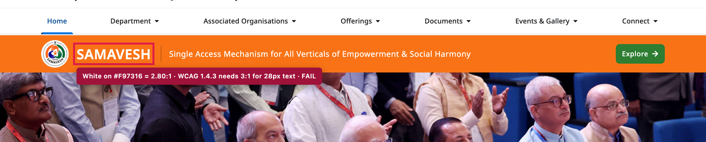
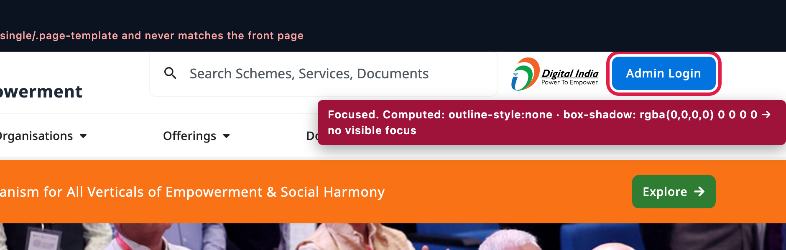
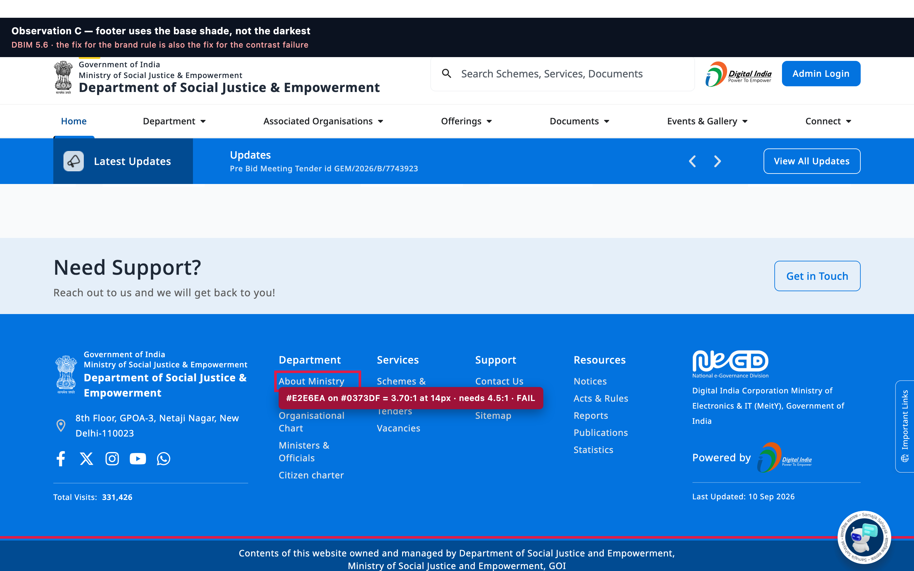
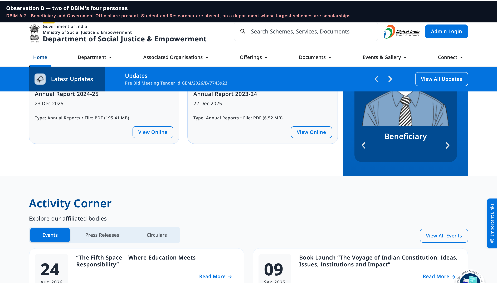
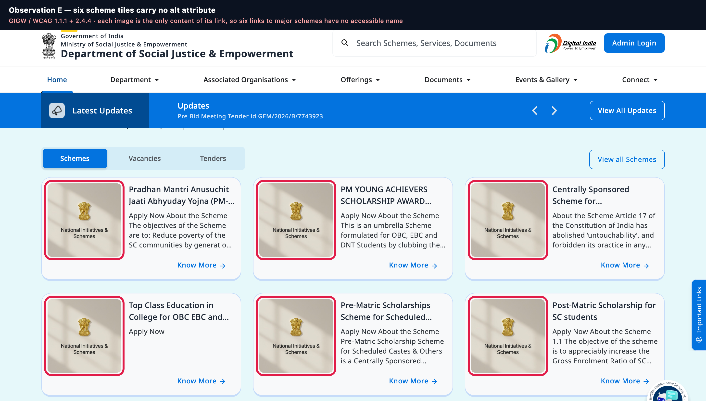
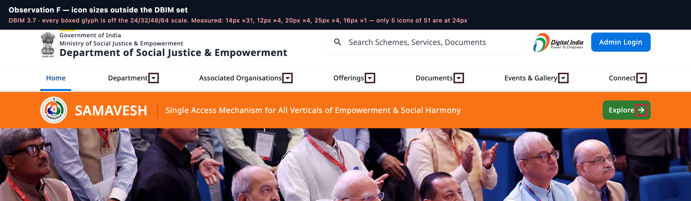
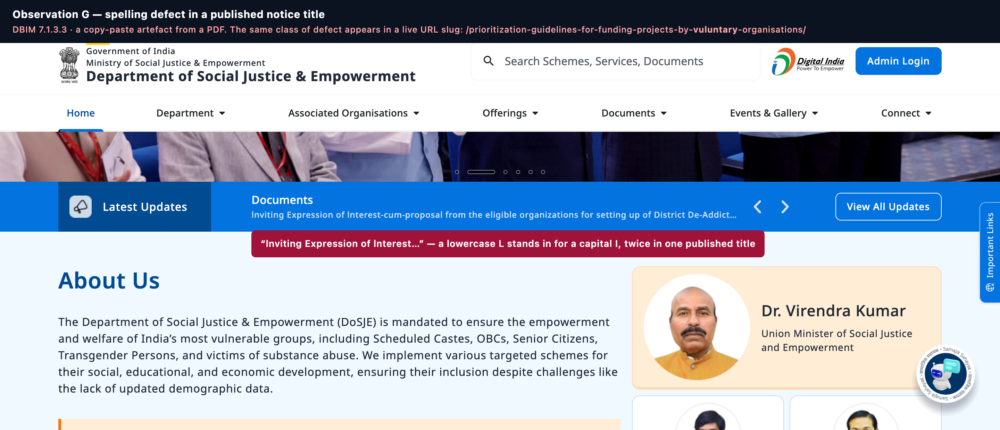
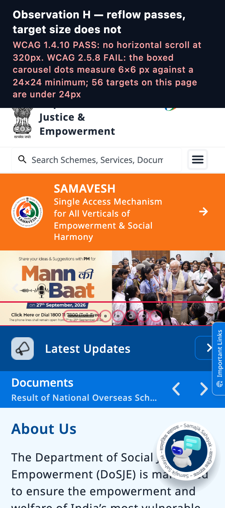
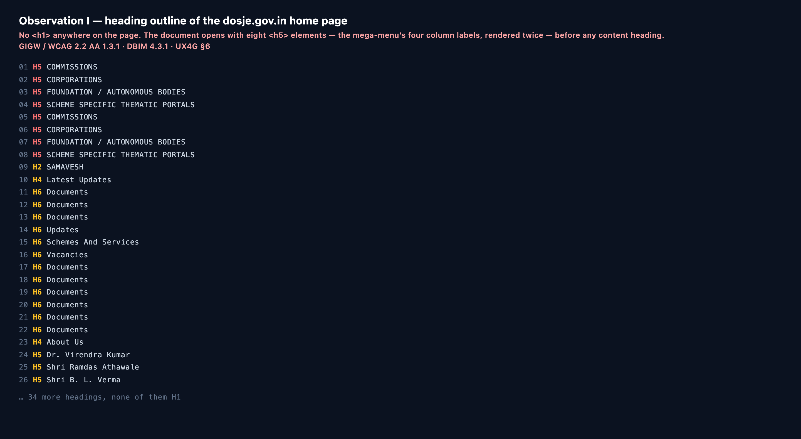

# DBIM · GIGW · UX4G Compliance Audit Report
## Department of Social Justice & Empowerment — www.dosje.gov.in

**September 2026** · Follow-up to the NIC DBIM Compliance Audit of May 2026

---

## Contents

1. [Purpose and scope](#1-purpose-and-scope)
2. [Audit summary — three separate scorecards](#2-audit-summary--three-separate-scorecards)
3. [Progress since May 2026](#3-progress-since-may-2026)
4. [DBIM 3.0 — Generic Checklist (46 checkpoints)](#4-dbim-30--generic-checklist-46-checkpoints)
5. [DBIM 3.0 — Ministry/Department Checklist (34 checkpoints)](#5-dbim-30--ministrydepartment-checklist-34-checkpoints)
6. [GIGW 3.0 — Quality, Accessibility, Security (38 checkpoints)](#6-gigw-30--quality-accessibility-security-38-checkpoints)
7. [UX4G 3.0 — Design System Conformance (24 checkpoints)](#7-ux4g-30--design-system-conformance-24-checkpoints)
8. [Non-compliance observations, with evidence](#8-non-compliance-observations-with-evidence)
9. [Remediation plan](#9-remediation-plan)
10. [Method, instrumentation and limits](#10-method-instrumentation-and-limits)

---

## 1. Purpose and scope

### 1.1 What was audited

`https://www.dosje.gov.in/` — the live public website of the Department of Social Justice
& Empowerment — on **10 September 2026, 10:00–11:30 IST**.

Thirteen pages were inspected: the home page, Contact Us, Help, Sitemap, RTI, Privacy
Policy, Terms & Conditions, Copyright Policy, Hyperlinking Policy, Grievances, Who's Who,
About Us, the Tenders and Video Gallery listings, the PM-AJAY scheme page and the search
results page. All 129 internal links on the home page were crawled.

### 1.2 Against what

| Standard | Publisher | Binding | Checkpoints |
|---|---|---|---|
| **DBIM 3.0** — Digital Brand Identity Manual | MeitY, v3 Jan 2025 | Mandatory (brand) | 46 Generic + 34 Ministry = **80** |
| **GIGW 3.0** — Guidelines for Indian Government Websites & Apps | NIC / MeitY | Mandatory | **38** scored + 3 governance |
| **UX4G 3.0** — Design System | NIC / MeitY (Digital India) | Recommended | **24** scored |

The 80 DBIM checkpoints are **the same 80 the NIC audit used in May 2026**, in the same
order and with the same numbering, so every row can be read as a before-and-after.

### 1.3 Why three scores and not one

A single blended figure is the wrong instrument. The three standards govern different
things, and this website is in a very different condition against each of them:

- **DBIM** governs brand — colour, type, icons, footer, imagery, content presentation.
- **GIGW** governs quality, accessibility, security and the mandatory-page set.
- **UX4G** governs design-system conformance — tokens, scales, components, patterns.

Averaging them hides both the strongest and the weakest result. They are reported separately.

### 1.4 Legend

| Mark | Meaning |
|---|---|
| **Yes / PASS** | Conforms |
| **Partial** | Conforms in part; the gap is stated (GIGW and UX4G tables only — DBIM stays Yes/No/NA to remain comparable with May) |
| **No / FAIL** | Does not conform |
| **NA** | Not applicable, or not verifiable from outside the organisation |
| 🔴 in a screenshot | The element the finding refers to |
| ▲ / ▼ | Changed since May 2026 |

---

## 2. Audit summary — three separate scorecards

### 2.1 DBIM 3.0

|  | Generic Checklist | Ministry/Dept Checklist | **DBIM overall** |
|---|---|---|---|
| Total checkpoints | 46 | 34 | **80** |
| Passed | 26 | 18 | **44** |
| Failed | 19 | 9 | **28** |
| Not available | 1 | 7 | **8** |
| **Pass percentage** | **56.5 %** | **52.9 %** | **55.0 %** |
| *Like-for-like with May's reading* | *63.0 %* | *58.8 %* | ***61.3 %*** |
| May 2026 | 56.52 % | 55.88 % | 56.25 % |

**Two figures are given, and the second is the fairer one.** Ten checkpoints are scored
"No" here that NIC scored "Yes" in May — six in the Generic checklist, four in the Ministry one.

- **Five are measured regressions or defects NIC's method would not have surfaced:** stretched
  icons (G9), phantom keyboard focus stops (G24), missing metadata keywords (G45), untagged
  PDFs (M26) and the removal of the archival section (M29). These stand.
- **Five are a stricter reading of the same criteria:** icon toolkit provenance (G6), icon file
  format (G7), icon contrast on a banner (G10), persona-versus-topic content tagging (M4) and
  the tender-portal link (M17) — where this audit tested the underlying assets and markup
  rather than the visual impression. The like-for-like column holds these five at May's reading.

Two further checkpoints (Ministry 31 and 34, on forms) are scored "No" here and were "NA"
in May **because the site had no forms in May**. Being marked down for shipping a feature
is not a fair reading of progress, so the like-for-like column holds them at NA.

### 2.2 GIGW 3.0

|  | Result |
|---|---|
| Total scored checkpoints | **38** (plus 3 governance items that cannot be verified externally) |
| PASS | **15** |
| Partial | **2** |
| FAIL | **21** |
| **Compliance (Partial = ½)** | **42.1 %** |

Broken down:

| Area | Checkpoints | PASS | Partial | FAIL | Score |
|---|---|---|---|---|---|
| Accessibility — WCAG 2.2 AA | 23 | 5 | 2 | 16 | **26.1 %** |
| Mandatory pages & policies | 6 | 4 | 0 | 2 | **66.7 %** |
| Technology, security, performance | 9 | 6 | 0 | 3 | **66.7 %** |

**Accessibility is where this website is weakest, by a wide margin, and it is the one area
where the standard is also law** — GIGW 3.0 and the Rights of Persons with Disabilities Act
2016 both bind it. Everything in §9's P0 list comes from here.

### 2.3 UX4G 3.0

|  | Result |
|---|---|
| Total scored checkpoints | **24** (2 further items not assessed) |
| PASS | **5** |
| Partial | **8** |
| FAIL | **11** |
| **Conformance (Partial = ½)** | **37.5 %** |

The checkpoint score understates one thing badly, so the **measured** adherence is
reported alongside it. These are counts taken off the live page, not judgements:

| What was measured | Adherence | Detail |
|---|---|---|
| Font sizes on the UX4G type scale | **91.6 %** | 597 of 652 text elements. Off-scale: 15px ×22, 13px ×17, 22px ×5, 23px ×4, 10px ×3, 8px ×4, 11px ×1 |
| Spacing on the base-4 scale | **80.9 %** | 2,105 of 2,602 declarations. Off-scale is dominated by two values: 5px ×193 and 10px ×191 |
| Corner radii on the UX4G scale | **63.9 %** | 4 / 8 / 12 / full ✓; off-scale: 20px ×68, 16px ×43, 10px ×15, 5px ×13 |
| Font weights within UX4G's four | **100 %** | 400 / 500 / 600 / 700 only |
| Elevation levels matching UX4G L1–L4 | **0 %** | six ad-hoc shadows, none matching Y1/B2, Y4/B8, Y8/B16 or Y16/B32 |
| Z-index values on the UX4G scale | **~15 %** | 1000 ✓; off-scale: 2147483620 ×12, 9999999, 999999, 99999, 10000, 9999 ×8, 2000 ×4 |

**The pattern is clear and it is a good-news finding:** the site has genuinely adopted
UX4G's *type and spacing* systems — nine tenths and four fifths respectively, which is real
engineering discipline — and has adopted almost none of its *depth* system (elevation,
z-index) or its *iconography*. The remedial work is narrow and specific, not a rebuild.

### 2.4 The three side by side

```
DBIM 3.0    ████████████░░░░░░░░  55.0 %   (61.3 % like-for-like)   ← brand
GIGW 3.0    ████████░░░░░░░░░░░░  42.1 %                            ← quality, access, security
UX4G 3.0    ███████░░░░░░░░░░░░░  37.5 %   (91.6 % type-scale adherence)
```

---

## 3. Progress since May 2026

**Eleven checkpoints that failed the NIC audit now pass.** This is real, verified work and
it should be recorded before anything else in this report is read.

| # | Checkpoint | DBIM § | May | Sep | What changed |
|---|---|---|---|---|---|
| G12 | Body text left-aligned; table alignment | 4.1.1 | No | **Yes ▲** | No centred body copy remains on any page sampled |
| G13 | No capital case for long sentences; no Hinglish | 4.1.1 | No | **Yes ▲** | Only short menu and statistic labels are capitalised; no Hinglish detected |
| G18 | Mouse hover prompts a noticeable change | 4.5 | No | **Yes ▲** | Colour and underline transitions throughout |
| G25 | Footer displays key information and lineage | 5.6 | No | **Yes ▲** | Full GoI → Ministry → Department lineage, postal address, five policy links, NeGD / Digital India Corporation / MeitY attribution, "Last Updated" stamp |
| G32 | Thumbnail images under 100 KB | 6.1.1 | No | **Yes ▲** | Measured 12–60 KB |
| G40 | Central Content Publishing System integrated | 7.4 | No | **Yes ▲** | CCPS is live — `ccps.digifootprint.gov.in` serves the campaign banner into the home carousel |
| M6 | Social media integration | A4 | No | **Yes ▲** | Facebook, X, Instagram, YouTube and WhatsApp handles, plus Facebook page and X timeline embeds |
| M18 | Periodic documents versioned with release date | A.5.3 | No | **Yes ▲** | Annual Reports 2025-26 (English and Hindi), 2024-25, 2023-24 |
| M25 | Titles Dr./Shri/Smt. used uniformly | A.5.6 | No | **Yes ▲** | "Dr. Virendra Kumar", "Shri Ramdas Athawale", "Shri B. L. Verma" |
| M32 | Forms are keyboard-friendly | B | NA | **Yes ▲** | Search and feedback are fully keyboard operable |
| M20 | Videos captioned and dated | A.5.4.2 | No | **NA ▲** | No video is published on-site; the Video Gallery embeds the department's YouTube channel |

### 3.1 Improvements outside the DBIM checklist

Not scored above, but worth recording:

- **The UX4G Accessibility Widget is now integrated**, with **19 features** — bigger and smaller text, text spacing, line height, dyslexia-friendly type, ADHD mode, three saturation modes, desaturate, light/dark, invert colours, highlight links, text-to-speech, cursor, pause animation, hide images and reset — on `Ctrl+F2`. This exceeds what GIGW asks for and is better than most Government of India properties.
- **Bhashini translation is integrated**, with an in-page language switcher and a translation-quality feedback panel.
- **Faceted search works well** — "scholarship" returns *Found 119 results*, grouped by content type ("Scheme and Service (33)").
- **A full security-header set is in place** — HSTS with `includeSubDomains`, `X-Frame-Options`, `X-Content-Type-Options`, `Referrer-Policy`, `Permissions-Policy` and `frame-ancestors 'self'`.
- **Zero broken links.** All 129 internal links on the home page resolve; the only non-200 responses are trailing-slash 301s.
- **The 320px reflow is clean** — no horizontal page scroll, nothing clipped.
- **A real focus-visible system exists** in the stylesheets: a 4px ring, `outline-offset: 5px` on links, a white ring on the blue footer. The defect (§8, Observation B) is that it is scoped to the wrong templates, not that nobody built it.

### 3.2 What has not moved

Fifteen checkpoints failed in May and fail again now, unchanged:

| # | Checkpoint | DBIM § |
|---|---|---|
| G1 | One colour group from the primary palette | 2.1 |
| G2 | Other colours from the functional palette | 2.2 |
| G3 | Icons in the key colour (darkest shade) or white | 3.7 |
| G4 | Footer background is the key colour, darkest shade | 5.6 |
| G8 | Icon sizes 24 / 32 / 48 / 64 px | 3.7 |
| G14 | Type scale as defined in DBIM | 4.3.1 |
| G15 | Text colour and optimal contrast | 4.4 |
| G17 | Distinct button states including focus | 4.5 |
| G29 | Logos under 100 KB | 5.5 |
| G37 | Headshot images as defined in DBIM | 6.1.4 |
| G39 | Language free from spelling or grammatical error | 7.1.3.3 |
| G41 / G42 | Consent for personalisation · cookie consent banner | 7.6.1 |
| M11 | Objectives and functions displayed as a list | A.5.1.1 |
| M21 | CIO / WIM / Appellate Authority / PIO contact details | A.5.5 |

**Three of these are one change each.** G4 (footer to the darkest shade) also fixes part of
G15. G29 is an SVG compression run. G39 is a two-word text correction plus a redirect.

---

## 4. DBIM 3.0 — Generic Checklist (46 checkpoints)

**26 Yes · 19 No · 1 NA · 56.5 %**

### A. Colours

| # | Checklist item | § | May | Sep | Evidence |
|---|---|---|---|---|---|
| 1 | One colour group from the primary palette — 1 key colour with its variants | 2.1 | No | **No** | Two primaries coexist. `ux4g-min.css` declares `--bs-primary: #613AF5`, `--bs-blue: #613AF5` and `--bs-link-color: #613AF5` with a full violet ramp (`#FAEFFF` → `#392095`) as `.bg-primary-50…900` utilities. `#0373DF` is applied by later overrides in `common.css`. Where no override was written the violet renders — the skip link and every accessibility-widget control. |
| 2 | Other colours from the functional palette | 2.2 | No | **No** | `#FFEDD5` — the exact colour NIC cited in May — is still in use, alongside nine further one-off tints: `#E6F8FA`, `#F4F3F9`, `#FDF0F5`, `#ECD0FF`, `#ECEEF5`, `#E7F0FD`, `#F8F9FA`, `#F9FAFB`, `#F5F5F5`. |
| 3 | Icons in the key colour (darkest shade) or inclusive white | 3.7 | No | **No** | `#F97316` — again the colour NIC cited — is still the SAMAVESH band ground with white marks on it. Brand-coloured social glyphs (`#1877F2`, `#C13584`) and violet widget icons also appear. |
| 4 | Footer background is the key colour, darkest shade | 5.6 | No | **No** | The footer body is `#0373DF`, the **base** shade. `#014B92`, the darker shade, is used only on a narrow bottom strip. See Observation C. |

### B. Iconography

| # | Checklist item | § | May | Sep | Evidence |
|---|---|---|---|---|---|
| 5 | Icons follow a consistent icon style | 3.3 | Yes | **Yes** | Line-weight icons throughout, visually consistent. |
| 6 | Icons selected from the DBIM Toolkit unless unavailable | 3.5 | Yes | **No** ▼ | The icon set is **Font Awesome 5 Free and Brands** (44 glyphs) plus Elementor `eicons` (8). Neither is the DBIM toolkit. *Assessed differently from May: this audit read the loaded font families rather than the rendered appearance.* |
| 7 | Icons in PNG, SVG or WEBP format only | 3.7 | Yes | **No** ▼ | **51 icons are webfont glyphs**, which is none of the three permitted formats. A webfont icon also inherits `color`, so it behaves differently from an SVG under the accessibility widget's high-contrast and hide-images modes. |
| 8 | Icon sizes 24×24 / 32×32 / 48×48 / 64×64 px | 3.7 | No | **No** | **43 of 51 icons are off-scale.** Measured: 14px ×31, 12px ×4, 20px ×4, 25px ×4, 16px ×1. Only 5 sit at 24px. See Observation F. |
| 9 | Correct proportion retained; icon not compressed or stretched | 3.7 | Yes | **No** ▼ | `open_in_new_icon.svg` is 12×12 natural and renders at **12×24** — stretched 2× on one axis. `Indian-Flag.svg` is 33×22 natural and renders at **33×24**. |
| 10 | Sufficient contrast when an icon sits on an image or banner | 3.7 | Yes | **No** ▼ | The SAMAVESH band's emblem and arrow sit on `#F97316` at the same 2.80:1 as its text. See Observation A. |

### C. Typography

| # | Checklist item | § | May | Sep | Evidence |
|---|---|---|---|---|---|
| 11 | Typeface is Noto Sans | 4.1 | Yes | **Yes** | 2,923 of 2,976 elements resolve to `"Noto Sans", sans-serif`. One stray `Roboto` declaration inside a third-party embed. |
| 12 | Body text left-aligned; table alignment correct | 4.1.1 | No | **Yes ▲** | No centred body copy on any page sampled. |
| 13 | No capital case for long sentences or paragraphs; no Hinglish | 4.1.1 | No | **Yes ▲** | Only short labels are capitalised — `COMMISSIONS`, `CORPORATIONS`, `FOUNDATION / AUTONOMOUS BODIES`, `SCHEME SPECIFIC THEMATIC PORTALS`, `CUMULATIVE DISBURSEMENT`. No Hinglish detected. |
| 14 | Type scale as defined in DBIM | 4.3.1 | No | **No** | DBIM specifies desktop H1 36 / H2 24 / H3 20. Measured: **no `<h1>` at all** on the home, search or Video Gallery pages; H2 28/32 w600; H3 28/40 — the same size as H2; H4 16/20; **H5 14/24 — smaller than H6's 16/20**, so the ramp inverts. H2's 32px leading on 28px type is **1.14**, below DBIM §4 iii's 1.2–1.5 band. 86 elements render at 12px, 3 at 10px, 4 at 8px. |
| 15 | Text colour per DBIM with optimal contrast | 4.4 | No | **No** | Seven measured failures — see Observations A and C, and §6 G9. |
| 16 | Button sizes consistent with uniform padding | 4.5 | Yes | **Yes** | Consistent Bootstrap `.btn` sizing. |
| 17 | Distinct button states — enabled, hover, focus, disabled | 4.5 | No | **No** | Enabled, hover and disabled are distinct. **Focus is absent on the home page's own buttons** — see Observation B. |
| 18 | Mouse hover prompts a noticeable change | 4.5 | No | **Yes ▲** | Colour and underline transitions on all clickable items. |

### D. Header and Footer

| # | Checklist item | § | May | Sep | Evidence |
|---|---|---|---|---|---|
| 19 | Emblem obtained from the authorized source | 5.1 | NA | **NA** | Provenance not verifiable externally. |
| 20 | Emblem in proper ratio, not scaled disproportionately | 5.1 | Yes | **Yes** | `National-Emblem-logo.svg` 32×52 natural, rendered 32×52. |
| 21 | Website naming per organisation type | 5.2 | Yes | **Yes** | "Government of India / Ministry of Social Justice & Empowerment / **Department of Social Justice & Empowerment**". |
| 22 | Logo lockup black-on-white or white-on-dark | 5.3 | Yes | **Yes** | Both variants shipped. |
| 23 | Generic header components chosen from DBIM | 5.4 | Yes | **Yes** | Header structure conforms. |
| 24 | All subcomponents of the generic header enabled and accessible | 5.4 | Yes | **No** ▼ | Three defects: the six top-level mega-menu items are `<a href="#">` rather than buttons carrying `aria-expanded`; a **Search submit button is focusable at `top: -159941px`**; four zero-height `<output>` elements sit in the tab order. See Observation B. |
| 25 | Footer displays key information and lineage | 5.6 | No | **Yes ▲** | Complete — see §3. |

### E. Logo

| # | Checklist item | § | May | Sep | Evidence |
|---|---|---|---|---|---|
| 26 | Correct / accurate logos used | 5.5 | Yes | **Yes** | — |
| 27 | Logos not scaled disproportionately | 5.5 | Yes | **Yes** | — |
| 28 | Logos in JPEG/JPG, PNG, SVG or WEBP only | 5.5 | Yes | **Yes** | — |
| 29 | Logos under 100 KB | 5.5 | No | **No** | `National-Emblem-logo.svg` = **196 KB**; `National_Emblem_logo_white.svg` = **195 KB** — roughly 2× the ceiling. `Indian-Flag.svg` = 33 KB (passes). Gzip brings the emblems to 71 / 67 KB on the wire, but DBIM measures the published asset. A two-colour emblem should compress to 10–20 KB. |

### F. Imagery

| # | Checklist item | § | May | Sep | Evidence |
|---|---|---|---|---|---|
| 30 | Background images under 500 KB | 6.1.1 | Yes | **Yes** | — |
| 31 | Banner and header images under 500 KB | 6.1.1 | Yes | **Yes** | Hero banners 245–291 KB (1800×600). |
| 32 | Thumbnail images under 100 KB | 6.1.1 | No | **Yes ▲** | 12–60 KB. *Advisory:* `schemes-768x768.jpg` is a 768×768 file drawn at 150×150, fetched six times. |
| 33 | High-resolution images under 5 MB | 6.1.1 | Yes | **Yes** | — |
| 34 | Images in JPEG/JPG, PNG or WEBP only | 6.1.1 | Yes | **Yes** | *Advisory:* no WEBP is served anywhere — a free ~30% saving on a 3.0 MB page. |
| 35 | Thumbnail provided for high-resolution images, with view/download | 6.1.1 | Yes | **Yes** | — |
| 36 | Images licensed; no third-party watermark | 6.1.3 | Yes | **Yes** | None observed. |
| 37 | Headshot images as defined in DBIM | 6.1.4 | No | **No** | Source sizes are inconsistent: the Minister at 160×160 (rendered 153), the two Ministers of State at 96×96. The Minister's portrait is upscaled by its container. |

### G. Content

| # | Checklist item | § | May | Sep | Evidence |
|---|---|---|---|---|---|
| 38 | All content complete and up to date | A.5.6 | Yes | **Yes** | "Last Updated: 10 Sep 2026" on every page. |
| 39 | Language free from spelling or grammatical error | 7.1.3.3 | No | **No** | Two defects verified at character level. **(a)** A published notice reads "**l**nviting Expression of **l**nterest-cum-proposal" — U+006C, a lowercase L, in place of a capital I, twice. It is invisible in Noto Sans, and **it is baked into the permalink**: `/documents/lnviting-expression-of-lnterest-cum-pr…`. **(b)** A live page is published at `/prioritization-guidelines-for-funding-projects-by-**vuluntary**-organisations/` — the correct spelling returns 404, so the misspelling is canonical. See Observation G. |
| 40 | Central Content Publishing System integrated | 7.4 | No | **Yes ▲** | CCPS live at `ccps.digifootprint.gov.in`. |
| 41 | Clear consent for personalisation in the user's preferred language | 7.6.1 | No | **No** | No consent mechanism exists. |
| 42 | Cookie consent banner at the bottom of the page | 7.6.1 | No | **No** | No element matching `cookie` or `consent` in class or id; the word "cookie" does not appear in the rendered page. Google Analytics (`G-097K5TMNKB`), a Facebook page plugin, X widgets and a MyScheme AI assistant all load **before consent could be given**. |

### H. Search functionality

| # | Checklist item | § | May | Sep | Evidence |
|---|---|---|---|---|---|
| 43 | Search is working | 9 | Yes | **Yes** | `?s=scholarship` → *Found 119 results*. |
| 44 | Relevant results across HTML, PDF and image metadata | 9 | Yes | **Yes** | Faceted by content type; documents indexed. Image metadata not verified. |
| 45 | Metadata, persona tags and keywords provided | A.5.6 | Yes | **No** ▼ | Title ✓, description ✓, viewport ✓, UTF-8 ✓, `sitemap_index.xml` with 17 document sitemaps ✓, `robots.txt` ✓. But **no `<meta name="keywords">` on any page**, **no persona tags**, no `hreflang` despite Bhashini translation, and `<html lang="en-US">` on a Government of India property. |

### I. Performance enhancement

| # | Checklist item | § | May | Sep | Evidence |
|---|---|---|---|---|---|
| 46 | Website responsive across multiple screen sizes | 10.2 | Yes | **Yes** | At a 320px viewport `documentElement.scrollWidth` = 320. No horizontal scroll, nothing clipped. See Observation H. |

---

## 5. DBIM 3.0 — Ministry/Department Checklist (34 checkpoints)

**18 Yes · 9 No · 7 NA · 52.9 %**

| # | Checklist item | § | May | Sep | Evidence |
|---|---|---|---|---|---|
| **A** | **Information Architecture** | | | | |
| 1 | Content presented per the Ministry-specific information architecture | A1 | Yes | **Yes** | Department / Associated Organisations / Offerings / Documents / Events & Gallery / Connect. |
| **B** | **Identify the Ministry Personas** | | | | |
| 2 | Personas shortlisted and displayed on the Home Page | A2 | Yes | **Yes** | "Explore User Personas" is present. *Observation:* only **two** of DBIM's four — Beneficiary and Government Official. See Observation D. |
| 3 | Persona-based navigation displays relevant content | A2 | Yes | **Yes** | Both route to `/for-beneficiary/` and `/for-government-official/`. |
| 4 | Relevant content tagging done for the personas | A3 | Yes | **No** ▼ | Scheme pages carry **topic** chips ("adarsh gram", "Educational Infrastructure", "SC Community Development"), not **persona** tags. Search offers no persona facet. |
| **C** | **Homepage** | | | | |
| 5 | Homepage components as per DBIM | A4 | No | **No** | Substantially improved — hero carousel, latest-updates ticker, About Us, Our Offerings, Our Organisations, Recent Documents, personas, Activity Corner, social, support, footer. The **PM Quote component is absent**, which is a DBIM homepage component. |
| 6 | Integration with social media handles | A4 | No | **Yes ▲** | Five handles plus Facebook page and X timeline embeds. |
| **D** | **PM Quote** | | | | |
| 7 | PM image has a transparent background | A4 | NA | **NA** | No PM Quote component exists. |
| 8 | PM image and quote from authorized sources | A4 | NA | **NA** | As above. |
| 9 | PM Quote relevant to the Department displayed on Home | A4 | NA | **NA** | As above. The home carousel carries a *Mann ki Baat* campaign banner, which is a campaign creative rather than the DBIM PM Quote component. |
| 10 | PM Quote displayed in the prescribed format | A4 | NA | **NA** | As above. |
| **E** | **Content Sections** | | | | |
| 11 | Objectives and functions of the Department displayed as a List | A.5.1.1 | No | **No** | On `/about-us/` the Department's objective is a **paragraph**: "Basic objective of the policies, programmes, law and institution of the Indian welfare system is to bring the target groups into the mainstream of development…". *Partial progress:* scheme pages **do** use lists — PM-AJAY renders "The objectives of the Scheme are to:" followed by a real `<ol>`. |
| 12 | Correct names of Ministers and their portfolios | A.5.1.2 | Yes | **Yes** | — |
| 13 | Correct organisation hierarchy depicted | A.5.1.2 | Yes | **Yes** | — |
| 14 | Names of departments, organisations, attached offices correct | A.5.1.3 | Yes | **Yes** | 18 organisations listed across Commissions, Corporations, Foundations and thematic portals. |
| 15 | Name/Title of the offering maximum 150 characters | A.5.2 | Yes | **Yes** | Scheme titles are within limit. *Observation:* three home-page **update/event** titles run to 158, 208 and 245 characters — these fall under checkpoint 19's 250-character limit and pass it, but they overflow their cards. |
| 16 | All images in the Offerings section below 100 KB | A.5.2.1 | Yes | **Yes** | 29 KB. |
| 17 | Tenders page: valid tender-portal link; Tender ID ≤ 50 chars, error free | A.5.2.3 | Yes | **No** ▼ | Tender ID `GEM/2025/B/6519656` — 18 characters, error free ✓. **No link to GeM, eProcure or any tender portal was found** on the Tenders listing or on the tender detail page examined. |
| 18 | Periodic documents versioned with date of release | A.5.3 | No | **Yes ▲** | Annual Reports 2025-26 (English and Hindi), 2024-25, 2023-24. |
| 19 | Documents and Resources titles suitable, maximum 250 characters | A.5.3 / A.5.4 | Yes | **Yes** | Longest measured 245. |
| 20 | Videos have appropriate captioning and date | A.5.4.2 | No | **NA ▲** | The Video Gallery publishes **no video** — the page body is 1,378 characters of chrome around an embedded YouTube *channel*. Nothing to caption. *Observation:* an empty gallery page sits in the primary navigation. |
| 21 | CIO / Web Information Manager / Appellate Authority / PIO contacts accurate | A.5.5 | No | **No** | **"Web Information Manager", "WIM" and "Chief Information Officer" return zero occurrences across the entire site.** PIO, CVO and Appellate Authority are named for the subordinate corporations, and a CPIO Directory exists — so the RTI half is served and the GIGW half is not. |
| 22 | Geotagging on Contact Us is correct | A.5.5 | Yes | **Yes** | 14 Google Map embeds. |
| **F** | **Mandatory Directives for Content** | | | | |
| 23 | All uploaded content complete and up to date | A.5.6 | Yes | **Yes** | — |
| 24 | Content accuracy ensured through a multi-level CMS workflow (≥2 level) | A.5.6 | Yes | **NA** | Not verifiable from outside the organisation. |
| 25 | Appropriate titles (Dr., Shri, Smt., Mr., Ms.) used uniformly | A.5.6 | No | **Yes ▲** | — |
| 26 | Documents, presentations and brochures uploaded as accessible PDF; no editable formats | A.5.6 | Yes | **No** ▼ | No editable formats are published ✓. But of four PDFs sampled, **three carry no `/StructTreeRoot`, no `/MarkInfo /Marked true` and no `/Lang`** — they are untagged, so assistive technology receives an unstructured character stream at best. The worst is `Application_for_the_post_of_DD_TRG.pdf` (2.7 MB), produced by **"Adobe Scan for iOS"** — a photograph of a form with no text layer, published as a job application. The fourth, `advertisement-E-5-10.12.2025_1.pdf`, **is** properly tagged with `/Lang(en-IN)`, which proves the capability exists and is applied inconsistently. |
| 27 | Date format follows day before month | A.5.6 | Yes | **Yes** | `22 Apr 2026`, `23 Dec 2025`, `12 Aug 2026`, `10 Sep 2026`. |
| 28 | External and website links secure (HTTPS), identifiable, periodically validated | A.5.6 | Yes | **Yes** | Zero `http://` links. **All 129 internal links resolve** — no 404s. |
| 29 | Archival section included; archival date mentioned | A.5.6 | Yes | **No** ▼ | No archival section exists. `/archive/` returns 404, no page in `page-sitemap.xml` matches "archiv", and the word does not appear in the rendered site. |
| 30 | Ministerial images and officer listings arranged by seniority | A.5.6 | Yes | **Yes** | Minister, then the two Ministers of State. |
| **G** | **Forms** | | | | |
| 31 | Instructions for filling the form given at the start | B | NA | **No** | Forms now exist. Search and the feedback panel rely on placeholder text alone. |
| 32 | Forms keyboard-friendly | B | NA | **Yes ▲** | Both are fully keyboard operable. |
| 33 | Mandatory fields marked with an asterisk or "Required" | B | NA | **NA** | No public form on the site has mandatory fields. |
| 34 | Labels clickable to enable easy selection of the form field | B | NA | **No** | Search inputs and both checkboxes are correctly labelled ✓. The **two feedback textareas** — "Describe your issues here…" and "Suggested Feedback" — have **no `<label>`, no `aria-label` and no `aria-labelledby`**. A placeholder is not a label and disappears on input. |

---

## 6. GIGW 3.0 — Quality, Accessibility, Security (38 checkpoints)

**15 PASS · 2 Partial · 21 FAIL · 42.1 %**

### 6.1 Accessibility — WCAG 2.2 Level AA (23 checkpoints · 26.1 %)

| # | Checkpoint | WCAG | Verdict | Evidence |
|---|---|---|---|---|
| G1 | `<html lang>` present and correct | 3.1.1 | **Partial** | Present on every page, but `en-US` on a Government of India property. Should be `en-IN`. |
| G2 | Exactly one `<h1>` per page | 1.3.1 | **FAIL** | **Zero `<h1>` on the home page, the search results page and the Video Gallery.** Interior pages have one ✓. See Observation I. |
| G3 | Headings nest without skipping levels | 1.3.1 | **FAIL** | **Every page opens with eight `<h5>` elements** — the mega-menu's `COMMISSIONS` / `CORPORATIONS` / `FOUNDATION / AUTONOMOUS BODIES` / `SCHEME SPECIFIC THEMATIC PORTALS`, rendered twice — before any `<h1>`. The home outline runs `H5 ×8 → H2 → H4 → H6 …`. |
| G4 | Landmark regions present | 1.3.1 | **PASS** | `header`, `nav`, `main`, `footer`, `role="contentinfo"`. |
| G5 | Skip to main content link | 2.4.1 | **PASS** | Works and reveals on focus. *Advisory:* there are two, both targeting `#content`. |
| G6 | Keyboard operable, no trap | 2.1.1 / 2.1.2 | **PASS** | No trap found in a 28-stop tab walk. |
| G7 | Visible focus on every control | 2.4.7 | **FAIL** | `a.btn.btn-primary` ("Admin Login") and `a.btn` ("Explore") match `:focus-visible` yet compute to `outline-style: none` with `box-shadow: rgba(0,0,0,0) 0 0 0 0` — a fully transparent ring. See Observation B. |
| G8 | Focus indicator contrast ≥ 3:1 | 1.4.11 | **FAIL** | `rgba(3,115,223,0.48)` composites over white to `rgb(133,188,240)` — **1.98:1** against the page and **2.27:1** against a `#0373DF` button. |
| G9 | Text contrast ≥ 4.5:1 (3:1 large) | 1.4.3 | **FAIL** | Seven measured pairs: `#E2E6EA` on `#0373DF` **3.70:1** (the whole footer link column, 14px) · white on `#F97316` **2.80:1** (SAMAVESH band, 28px and 16px) · `#0373DF` on `#E5EFF9` **3.99:1** ("Get in Touch") · on `#E6F8FA` **4.24:1** ("View all Schemes") · on `#F8F9FA` **4.41:1** ("Know More") · on `#F9FAFB` **4.44:1** ("View All Events") · `#1877F2` on `#E7F0FD` **3.69:1**. The middle four are one defect repeated: **`#0373DF` clears 4.5:1 on pure white (4.64:1) and fails on every pale tint it is paired with.** |
| G10 | Non-text and UI contrast ≥ 3:1 | 1.4.11 | **FAIL** | SAMAVESH band marks at 2.80:1. |
| G11 | Meaningful images carry alt text | 1.1.1 | **FAIL** | **Six `` carry no `alt` attribute at all** (the scheme tiles). A further 80 of 96 carry `alt=""`, including both persona tiles, the 1321×436 SAMAVESH banner and the Digital India mark — each the sole content of a link. See Observation E. |
| G12 | Form fields labelled; errors announced | 3.3.1 / 3.3.2 | **FAIL** | Two feedback textareas with no label of any kind. |
| G13 | Custom widgets carry correct ARIA | 4.1.2 | **Partial** | Carousel arrows are `<div role="button" tabindex="0" aria-label="Previous slide">` and slide dots carry labels ✓. The **six mega-menu triggers are `<a href="#">`**, announced as links that go nowhere. Escape and arrow-key behaviour not verified. |
| G14 | `prefers-reduced-motion` respected | 2.3.3 | **FAIL** | **Zero `prefers-reduced-motion` rules** across `style.css`, `common.css` and `ux4gCustom.css`. Four Swiper carousels auto-advance, plus Elementor `fadeIn` entrance animations. *Mitigation:* the accessibility widget offers "Pause Animation", but that is opt-in and the OS preference is what the standard names. |
| G15 | Reflow at 320px; text resize to 200% | 1.4.10 / 1.4.4 | **PASS** | `scrollWidth` = 320 at a 320px viewport. See Observation H. |
| G16 | Target size ≥ 24×24 px | 2.5.8 | **FAIL** | **56 targets on the home page measure under 24px.** Carousel pagination dots are **6×6 px** with 6px gaps. UX4G asks for 44×44. |
| G17 | Link purpose determinable from the accessible name | 2.4.4 | **FAIL** | **60 links have no accessible name** — the six scheme tiles, both persona tiles, the SAMAVESH banner, the Digital India mark and a row of partner-organisation logos. |
| G18 | New-window links warn the user | 3.2.5 | **FAIL** | 26 `target="_blank"` links on one scheme page carry no textual warning; the `open_in_new` icon has `alt=""`, so the signal is purely visual. |
| G19 | Data tables use `scope` and `caption` | 1.3.1 | **FAIL** | **Zero of 63 `<th>` elements across four pages carry a `scope` attribute, and no table carries a `<caption>`.** Contact Us alone has 13 tables and 44 unscoped headers. |
| G20 | Documents published as accessible PDF | 1.3.1 / 4.1.2 | **FAIL** | Three of four sampled PDFs untagged; one is an image-only scan. See §5 M26. |
| G21 | Accessibility widget integrated | GIGW / UX4G | **PASS** | 19 features, on `Ctrl+F2`. The strongest single item in this audit. |
| G22 | Accessibility Statement published | GIGW | **FAIL** | `/accessibility/`, `/accessibility-statement/` and `/website-policies/` all return **404**, and no such link appears in the footer or anywhere on the home page. |
| G23 | Screen Reader Access page published | GIGW | **FAIL** | `/screen-reader-access/` returns **404**. |

### 6.2 Mandatory pages and policies (6 checkpoints · 66.7 %)

| # | Checkpoint | Verdict | Evidence |
|---|---|---|---|
| G24 | Home · Contact Us · Help · Sitemap · Search | **PASS** | All 200. Search at `?s=`. |
| G25 | Feedback page | **FAIL** | `/feedback/` returns **404**. Feedback exists only as a floating widget whose textareas are unlabelled. |
| G26 | Grievance redressal | **PASS** | `/grievance/` 200; CPGRAMS linked. |
| G27 | Terms & Conditions · Privacy · Copyright · Hyperlinking | **PASS** | All four 200 and linked from the footer. |
| G28 | Website Policies hub | **FAIL** | No hub page exists; policies are linked individually from the footer only. |
| G29 | RTI disclosure and "Last Updated" stamp | **PASS** | `/rti/` 200 with a CPIO directory; "Last Updated: 10 Sep 2026" sitewide. |

### 6.3 Technology, security and performance (9 checkpoints · 66.7 %)

| # | Checkpoint | Verdict | Evidence |
|---|---|---|---|
| G30 | HTTPS with valid TLS | **PASS** | HTTP/2; certificate `CN=dosje.gov.in` (Amazon RSA 2048 M04) valid to 24 Dec 2026. |
| G31 | Security headers | **PASS** | `Strict-Transport-Security: max-age=31536000; includeSubDomains` · `X-Frame-Options: SAMEORIGIN` · `X-Content-Type-Options: nosniff` · `X-XSS-Protection` · `Referrer-Policy: strict-origin-when-cross-origin` · `Permissions-Policy: geolocation=(self)` · `frame-ancestors 'self'`. |
| G32 | Content Security Policy effective | **FAIL** | `script-src 'self' 'unsafe-inline' 'unsafe-eval' https:` permits inline script, `eval`, and any script from any HTTPS origin on the internet. As written the policy prevents almost no XSS. |
| G33 | No broken links | **PASS** | 129 internal links crawled; **zero 404s**. |
| G34 | Responsive, mobile-first | **PASS** | — |
| G35 | Hosted on gov.in / nic.in | **PASS** | `dosje.gov.in`, served via CloudFront (`x-amz-cf-pop: DEL54-P2`). |
| G36 | Multilingual support via Unicode | **PASS** | Noto Sans plus the Bhashini translation plugin; Hindi documents published alongside English. |
| G37 | Page weight and performance | **FAIL** | **160 requests, 3.0 MB, of which 1.28 MB is JavaScript.** The bundle includes jQuery, jQuery Migrate, Elementor Pro, Swiper ×2, DataTables with Buttons, **JSZip, pdfmake and its embedded `vfs_fonts`**, Fancybox, Bhashini, UX4G, Google Analytics, X and Facebook widgets. `pdfmake`, `jszip` and DataTables are export helpers for a data table, and they load on **the home page, which has no data table**. |
| G40 | Web Information Manager designated and published | **FAIL** | Zero occurrences sitewide. |

### 6.4 Governance — not verifiable externally

| # | Checkpoint | Status |
|---|---|---|
| G38 | STQC CQW (Certified Quality Website) certification | **NA** — not claimed anywhere on the site |
| G39 | VAPT / "Safe to Host" from a CERT-In or STQC empanelled auditor | **NA** |
| G41 | Content Review, Content Management, Security and Backup policies | **NA** |

---

## 7. UX4G 3.0 — Design System Conformance (24 checkpoints)

**5 PASS · 8 Partial · 11 FAIL · 37.5 %**

The website loads `ux4g-min.css` and `ux4g.min.js`, so UX4G has been adopted **at package
level**. This section measures conformance to its **specification**.

### 7.1 Typography (§2)

| # | Checkpoint | Verdict | Evidence |
|---|---|---|---|
| U1 | Noto Sans as the base UI typeface | **PASS** | 2,923 of 2,976 elements. |
| U2 | Noto Sans Display for 36px and above | **FAIL** | The 40px and 48px statistics are set in Noto Sans, not Noto Sans Display. |
| U3 | Font sizes drawn from the UX4G type scale | **Partial** | **91.6 % on scale** (597/652). Off-scale: 15px ×22, 13px ×17, 22px ×5, 23px ×4, 8px ×4, 10px ×3, 11px ×1. |
| U4 | Minimum text size 12px (Body/XS, "minimum usable size") | **FAIL** | Eight elements render below it — 8px ×4, 10px ×3, plus one at 11px. |
| U5 | Four font weights only (400/500/600/700) | **PASS** | Exactly those four. |
| U6 | Heading element ↔ style mapping (h1 XXL … h6 XXS) | **FAIL** | No `<h1>`; h5 renders 14/24 against Heading/XXS's 14/16; h3 renders 28/40 against Heading/M's 24/28; h5 is smaller than h6. |

### 7.2 Spacing, layout and shape (§3)

| # | Checkpoint | Verdict | Evidence |
|---|---|---|---|
| U7 | Base-4 spacing scale | **Partial** | **80.9 % on scale** (2,105/2,602). Off-scale is dominated by two values: 5px ×193 and 10px ×191, then 9px ×38, 15px ×24, 70px ×18. |
| U8 | Corner radius None / 4 / 8 / 12 / Full | **Partial** | 8px ×113, 12px ×4, 4px ×8 and 50% ×42 are on scale; 20px ×68, 16px ×43, 10px ×15 and 5px ×13 are not. |
| U11 | 12-column grid; max content width 1200 / 1320 px | **Partial** | Layout is grid-based and responsive; the exact container cap was not conclusively measured. |
| U13 | Touch targets ≥ 44×44 px with 8px spacing | **FAIL** | 56 targets under 24px; carousel dots 6×6 with 6px gaps. |

### 7.3 Elevation and layering (§4)

| # | Checkpoint | Verdict | Evidence |
|---|---|---|---|
| U9 | Elevation levels L1–L4 as specified | **FAIL** | Six ad-hoc shadows in use — `0 2px 8px rgba(0,0,0,.12)`, `0 7px 44px -24px rgba(0,0,0,.5)`, `0 2px 3px 1px`, `0 2px 10px`, `0 2px 6px` — **none** matching UX4G's Y1/B2, Y4/B8, Y8/B16 or Y16/B32. |
| U10 | Z-index confined to the 1000–1090 scale | **FAIL** | UX4G: *"Don't use arbitrary z-index values outside the defined scale."* In use: **2147483620 ×12**, 9999999, 999999 ×5, 99999, 10000 ×2, 9999 ×8, 2000 ×4, 1002, 1001. Only `1000` is on scale. |

### 7.4 Iconography (§5)

| # | Checkpoint | Verdict | Evidence |
|---|---|---|---|
| U14 | Material Design Icons / Material Symbols | **FAIL** | Font Awesome 5 Free and Brands, plus Elementor `eicons`. |
| U15 | Icon sizes on the UX4G utility scale (11–60px) | **Partial** | 14 / 12 / 20 / 16 / 24px are all on UX4G's scale ✓ — **note this is a UX4G pass where DBIM fails**, because UX4G's icon scale is finer than DBIM's four sizes. 25px ×4 is off both. |

### 7.5 Accessibility (§6)

| # | Checkpoint | Verdict | Evidence |
|---|---|---|---|
| U16 | Contrast 4.5:1 normal, 3:1 large, 3:1 UI | **FAIL** | Seven pairs — see G9. |
| U17 | Focus ring: 4px, 2px offset, radius-matched, 3:1 | **Partial** | **The 4px ring width matches UX4G's specification exactly** and links carry `outline-offset: 5px`. But buttons render 0px offset, and at `rgba(3,115,223,0.48)` the ring measures 1.98:1 — failing UX4G's own 3:1 requirement. *Note:* UX4G's published spec value, `rgba(59,130,246,0.5)`, cannot reach 3:1 on white either — the site inherited a defect from the standard. |
| U18 | Keyboard: Tab / Enter / Space / Arrows / Esc | **Partial** | Tab and Enter verified; Space, Arrow and Escape handling in the mega-menu and carousels not verified. |
| U19 | Semantic HTML in preference to div-based alternatives | **FAIL** | `<div role="button">` carousel controls; `<a href="#">` disclosure triggers. |
| U20 | Heading hierarchy h1 → h6 | **FAIL** | See G2 / G3. |
| U21 | Forms: labels, required markers, `aria-describedby`, `aria-invalid` | **FAIL** | Two unlabelled textareas; no required markers; no error wiring observed. |

### 7.6 Content design system (§7)

| # | Checkpoint | Verdict | Evidence |
|---|---|---|---|
| U22 | Plain language, Class 8–10 reading level | **PASS** | Copy is plain, formal and specific throughout. |
| U24 | Consent templates; pre-checked boxes prohibited | **Partial** | **No pre-checked boxes** — both checkboxes default to unchecked ✓. But no consent mechanism exists at all, so UX4G's consent-template requirement is unmet. |

### 7.7 Components and patterns (§9, §10)

| # | Checkpoint | Verdict | Evidence |
|---|---|---|---|
| U25 | UX4G component library adopted | **PASS** | The UX4G Bootstrap build is loaded and its components are in use. |
| U26 | Accessibility component integrated | **PASS** | 19 features. |

*Not assessed:* body-measure limit (~720px) and UX4G's error-message formula, the latter
because no validated form was reachable on the public site.

---

## 8. Non-compliance observations, with evidence

A 🔴 box marks the element the finding refers to.

---

### Observation A — SAMAVESH band contrast

**DBIM 4.4 · GIGW / WCAG 2.2 AA 1.4.3 and 1.4.11 · Generic checkpoints 3, 10, 15**



**Observation.** The SAMAVESH band renders white text on India-saffron `#F97316`. Measured
contrast is **2.80:1**. The wordmark at 28px semibold requires **3:1**; the strapline at
16px regular requires **4.5:1**. Both fail. The band's emblem and arrow sit on the same
ground, so checkpoint 10 (icon contrast on a banner) fails with it.

**Why it is hard.** A saturated mid-tone orange is the one ground on which no ink comfortably
passes WCAG 2. This is a known field problem, not a careless choice — but WCAG 2.1 / 2.2 AA
is the enforceable standard and the band does not meet it.

**Next step.** Two options, both cheap. Either **darken the ground** to a shade of the key
colour group that carries white at 4.5:1, or **invert the band to a pale saffron tint with
dark ink**, which clears the threshold with room to spare. No redesign is required — the
band's layout, emblem and CTA are unchanged in either case.

---

### Observation B — the primary CTA has no keyboard focus indicator

**DBIM 4.5 · GIGW / WCAG 2.2 AA 2.4.7 and 1.4.11 · Generic checkpoints 17, 24**



**Observation.** With the "Admin Login" button focused by keyboard, computed style is
`outline-style: none` and `box-shadow: rgba(0, 0, 0, 0) 0px 0px 0px 0px` — a **fully
transparent** ring. The same is true of the "Explore" button in the SAMAVESH band. A
keyboard user cannot see where they are on the two most prominent controls on the page.

**The cause is scope, not absence.** The stylesheets do define a proper ring:

```css
.btn-primary:focus-visible { box-shadow: 0 0 0 4px rgba(3,115,223,.48) !important; }
```

but every such rule is scoped to `.single`, `.page` or `html .page-template` — and the
front page template matches none of them. The system was built and then not connected.

**Two further defects found in the same 28-stop keyboard walk:**

- `button.e-search-submit` is `visibility: visible` with `tabindex 0` and positioned at **`top: -159941px`**. A keyboard user tabs to a control roughly 160,000 pixels above the viewport with no indication of where focus went. A second copy sits at 0×0.
- Four `<output class="e-search-results-container">` elements, each 0px tall, are in the tab order.

**Contrast of the ring that does render.** `rgba(3,115,223,0.48)` composites over white to
`rgb(133,188,240)` — **1.98:1** against the page and **2.27:1** against a `#0373DF` button,
against the 3:1 that WCAG 1.4.11 requires.

**Next step.** Widen the `:focus-visible` selectors to all templates; raise the ring to a
solid `#0373DF` at 2–3px, or `rgba(3,115,223,1)`; remove or mark `inert` the off-screen
submit buttons and the zero-height `<output>` elements.

---

### Observation C — the footer uses the base shade, not the darkest

**DBIM 5.6 · GIGW / WCAG 1.4.3 · Generic checkpoints 4, 15**



**Observation.** The footer body is `#0373DF` — the **base** shade of the key colour group.
DBIM 5.6 requires the **darkest** shade. `#014B92` is available and already in use on the
narrow bottom strip.

**The brand rule and the accessibility rule have the same fix.** On `#0373DF` the footer's
link column renders `#E2E6EA` at 14px, which measures **3.70:1** — below the 4.5:1 minimum,
and it is the largest single population of failing text on the site. On `#014B92`, white
measures **8.67:1**. Changing the footer ground to the darkest shade satisfies DBIM 5.6 and
resolves the contrast failure in one edit.

**Next step.** Set the footer background to `#014B92` (or darker) and the link colour to
white.

---

### Observation D — two of DBIM's four personas

**DBIM A.2 · Ministry checkpoints 2, 4**



**Observation.** "Explore User Personas" offers **Beneficiary** and **Government Official**.
DBIM names four; **Student** and **Researcher** are absent — on a department whose largest
programmes are the Pre-Matric, Post-Matric, Top Class and National Overseas scholarships.

Both tiles are image-only links with `alt=""`, so neither has an accessible name (see
Observation E). Separately, content is tagged by **topic** ("adarsh gram", "Educational
Infrastructure", "SC Community Development") rather than by **persona**, and search offers
no persona facet — so checkpoint 4 is unmet even for the two personas that exist.

**Next step.** Add Student and Researcher tiles with their landing pages; add a persona
facet to the content taxonomy and expose it in search; give all four tiles alt text.

---

### Observation E — six scheme tiles carry no alt attribute

**GIGW / WCAG 1.1.1 and 2.4.4 · Generic checkpoint 45 · Ministry checkpoint 16**



**Observation.** Six `` elements on the home page carry **no `alt` attribute at all** —
every tile in "Our Offerings", each rendering `schemes-768x768.jpg`. Each image is the sole
content of a link to a major scheme, so six links to PM-AJAY, PM-YASASVI, the Protection of
Civil Rights scheme, Top Class Education, Pre-Matric and Post-Matric Scholarships have **no
accessible name**. A screen-reader user hears six links named only by their URL.

Across the page, **60 links have no accessible name**, and 80 of 96 images carry `alt=""` —
including both persona tiles, the 1321×436 SAMAVESH banner and the Digital India mark.

*Advisory:* the same file is a 768×768 asset displayed at 150×150 and fetched six times.

**Next step.** Give every image that is the sole content of a link a description of the
link's destination. Ship a 300px thumbnail variant.

---

### Observation F — icon sizes outside the DBIM set

**DBIM 3.7 · Generic checkpoints 7, 8**



**Observation.** Every boxed glyph is off DBIM's 24 / 32 / 48 / 64 px scale. Measured across
the home page: **14px ×31 · 12px ×4 · 20px ×4 · 25px ×4 · 16px ×1** — only **5 of 51 icons**
sit at 24px. 25px in particular reads as an accident rather than a decision.

Separately, all 51 are **webfont glyphs** (Font Awesome 5 Free and Brands, Elementor
`eicons`), and DBIM 3.7 permits **PNG, SVG or WEBP only**. A webfont icon also inherits
`color`, so it behaves differently from an SVG under the accessibility widget's high-contrast
and hide-images modes.

**Next step.** Move to inline SVG from the DBIM toolkit and snap every icon to 24 / 32 / 48 /
64. Note that UX4G's own icon-size scale is finer and accepts 14 and 16 — where the two
standards differ, DBIM governs brand.

---

### Observation G — spelling defects, one of them in a permalink

**DBIM 7.1.3.3 · Generic checkpoint 39**



**Observation.** A published notice title reads **"lnviting Expression of lnterest-cum-proposal"**
— character U+006C, a lowercase L, in place of a capital I, twice. It is invisible on screen
because Noto Sans draws `l` and `I` almost identically, which is exactly why it survived
review. **It is also baked into the permalink**:

```
https://www.dosje.gov.in/documents/lnviting-expression-of-lnterest-cum-pr…
```

A second, independent defect of the same class is live in a page URL:

```
/prioritization-guidelines-for-funding-projects-by-vuluntary-organisations/   → 200
/prioritization-guidelines-for-funding-projects-by-voluntary-organisations/   → 404
```

The misspelling is the canonical URL; the correct spelling does not resolve.

**Next step.** Correct both titles, publish the corrected slugs and 301 the old ones. Then
sweep the document import batch for the same `l`/`I` substitution — a defect that came from
copying out of a PDF rarely arrives alone.

---

### Observation H — reflow passes; target size does not

**GIGW / WCAG 1.4.10 PASS · WCAG 2.5.8 FAIL · Generic checkpoint 46**



**Observation.** At a 320px viewport `documentElement.scrollWidth` is **320** — no horizontal
page scroll, nothing clipped, nothing overlapping. This is a genuine pass and rarer than it
should be.

The failure is target size. The boxed carousel pagination dots measure **6×6 px** with 6px
gaps, against the 24×24 px minimum in WCAG 2.5.8 and the 44×44 px UX4G asks for. **56
interactive targets on the home page are under 24px.**

**Next step.** Keep the dots visually small and enlarge their hit area to 24×24 with
transparent padding — a change to padding only, with no visual consequence.

---

### Observation I — no `<h1>`, and eight `<h5>` before it

**GIGW / WCAG 1.3.1 · Generic checkpoint 14 · UX4G §6**



**Observation.** The home page has **no `<h1>` element**. Neither does the search results
page, nor the Video Gallery. Interior pages do have one — but on every page in the estate it
is preceded by **eight `<h5>` elements**, the mega-menu's four column labels rendered twice.

A screen-reader user who lists headings to orient themselves — one of the two most common
navigation strategies — is handed `COMMISSIONS`, `CORPORATIONS`, `FOUNDATION / AUTONOMOUS
BODIES`, `SCHEME SPECIFIC THEMATIC PORTALS`, twice, before any page content. On the home page
they never reach a page title at all, because there isn't one.

**This is the highest-value fix in this report.** It is one template change, it costs nothing
visually, and it corrects checkpoints across all three standards at once.

**Next step.** Render the mega-menu column labels as `<p>` or `<div>` with the same styling
— they are labels, not document structure — and give the home, search and gallery pages a
real `<h1>`.

---

## 9. Remediation plan

### P0 — accessibility and legal. Fix first.

| # | Action | Standard | Effort |
|---|---|---|---|
| 1 | Demote the eight mega-menu `<h5>` labels; add an `<h1>` to the home, search and gallery pages | WCAG 1.3.1 · DBIM 4.3.1 · UX4G §6 | **Small** — one template, sitewide effect |
| 2 | Widen the `:focus-visible` selectors beyond `.page`/`.single`/`.page-template`; raise the ring to solid `#0373DF` at 2–3px | WCAG 2.4.7, 1.4.11 · DBIM 4.5 | **Small** |
| 3 | Remove or `inert` the search submit button at `top:-159941px`, its 0×0 twin, and the four 0px `<output>` elements | WCAG 2.4.7 | **Small** |
| 4 | Fix the seven contrast pairs: footer to `#014B92` with white links; `#0373DF` → `#014B92` for text on tints; darken or invert the SAMAVESH band | WCAG 1.4.3 · DBIM 4.4, 5.6 | **Small–Medium** |
| 5 | Publish the **Accessibility Statement** and **Screen Reader Access** pages; link both from the footer | GIGW | **Small** |
| 6 | Alt text for the six attribute-less images and the ~15 image-only links | WCAG 1.1.1, 2.4.4 | **Small** |
| 7 | Label the two feedback textareas | WCAG 3.3.2 | **Trivial** |
| 8 | Add a `prefers-reduced-motion` block; stop Swiper autoplay under it | WCAG 2.3.3 | **Small** |
| 9 | Add `scope` to all 63 `<th>` and a `<caption>` to every data table | WCAG 1.3.1 | **Small** |
| 10 | Enlarge the 6×6 px carousel dots' hit area to 24×24 | WCAG 2.5.8 · UX4G §3 | **Trivial** |
| 11 | Re-publish the untagged PDFs as tagged PDF/UA; replace the scanned job-application form with an HTML form | GIGW · DBIM A.5.6 | **Large** — a content operation |

### P1 — DBIM brand conformance

| # | Action | DBIM § | Effort |
|---|---|---|---|
| 12 | Re-generate the UX4G Bootstrap build with `--bs-primary: #0373DF` and the ramp derived from it; remove the violet ramp | 2.1 | **Medium** |
| 13 | Footer background to the darkest shade of the key colour group | 5.6 | **Trivial** — and it resolves the largest contrast failure |
| 14 | Compress the two emblem SVGs from ~196 KB to under 100 KB | 5.5 | **Trivial** |
| 15 | Move icons to SVG from the DBIM toolkit; snap all 51 to 24 / 32 / 48 / 64 | 3.5, 3.7 | **Medium** |
| 16 | Fix the two stretched icons (`open_in_new_icon.svg`, `Indian-Flag.svg`) | 3.7 | **Trivial** |
| 17 | Rebuild the heading ramp so h5 is not larger than h6 and h3 differs from h2; raise 8–12px text | 4.3.1 | **Medium** |
| 18 | Retire the ten one-off surface tints in favour of a declared functional palette | 2.2 | **Medium** |
| 19 | Re-export the three ministerial headshots at one consistent size | 6.1.4 | **Trivial** |
| 20 | Add the **Student** and **Researcher** personas with landing pages and a persona tag facet | A.2, A.3 | **Medium** |
| 21 | Add the PM Quote component to the homepage | A.4 | **Small** — needs a departmental decision on the quote |
| 22 | Present the Department's objectives on About Us as a list | A.5.1.1 | **Trivial** |
| 23 | Add a tender-portal link (GeM / eProcure) to the Tenders page | A.5.2.3 | **Trivial** |
| 24 | Restore an archival section with archival dates | A.5.6 | **Medium** |

### P2 — content, privacy, performance

| # | Action | Standard | Effort |
|---|---|---|---|
| 25 | Add a bottom-anchored cookie consent banner; gate GA, Facebook and X behind it; serve the copy through Bhashini | DBIM 7.6.1 | **Medium** |
| 26 | Correct "lnviting … lnterest" and the `vuluntary` slug; 301 the old URLs; sweep the import batch | DBIM 7.1.3.3 | **Small** |
| 27 | Publish the Web Information Manager's name, designation, email and phone on Contact Us | GIGW · DBIM A.5.5 | **Trivial** — needs a departmental decision |
| 28 | Set `<html lang="en-IN">`; add `<meta name="keywords">` and `hreflang` | GIGW · DBIM A.5.6 | **Trivial** |
| 29 | Add "(opens in a new window)" to the accessible name of the 26 `target="_blank"` links | WCAG 3.2.5 | **Small** |
| 30 | Publish a `/feedback/` page and a Website Policies hub | GIGW | **Small** |
| 31 | Tighten the CSP: drop the `https:` wildcard and `unsafe-eval`; move inline blocks to nonces | GIGW · OWASP | **Medium** |
| 32 | Stop loading `pdfmake`, `vfs_fonts`, `jszip` and DataTables on pages with no data table; serve WEBP | GIGW performance | **Medium** — the largest single speed win |
| 33 | Bring the six ad-hoc shadows onto UX4G's L1–L4 scale; replace the ten off-scale z-index values | UX4G §4 | **Medium** |
| 34 | Close the remaining 19 % of spacing declarations onto the base-4 scale — the 5px and 10px values account for most of it | UX4G §3 | **Medium** |
| 35 | Publish or remove the empty Video Gallery page | GIGW quality | **Trivial** |

### Governance — needs a person, not a commit

- **STQC CQW certification** — not claimed anywhere on the site. Publish it, or obtain it.
- **VAPT / "Safe to Host"** from a CERT-In or STQC empanelled auditor — confirm the certificate is current.
- **Web Information Manager** — designate and publish.
- **Content Review (quarterly), Content Management, Security and Backup/Recovery policies** — confirm they exist and publish the review cadence.

---

## 10. Method, instrumentation and limits

### 10.1 How each figure was obtained

| Measurement | Instrument |
|---|---|
| Contrast ratios | WCAG 2.x relative luminance computed over the nearest opaque ancestor background, with alpha compositing, in the live DOM |
| Type and spacing scales | `getComputedStyle` across every element with a direct text node — 652 text elements, 2,602 spacing declarations |
| Keyboard behaviour | A 28-stop tab walk instrumented with a `focusin` listener recording computed outline, box-shadow and bounding rect at each stop |
| Asset weights | `Content-Length` on the published asset (DBIM measures the file, not the gzipped transfer; both are given where they differ) |
| PDF accessibility | Presence of `/StructTreeRoot`, `/MarkInfo /Marked true` and `/Lang` in the file |
| Link integrity | All 129 internal home-page links resolved individually |
| Security posture | HTTP response headers and TLS certificate inspection |
| Screenshots | Chromium at 1440×900 and 320×720, `deviceScaleFactor: 2`, annotations injected into the live page |

### 10.2 What was deliberately not claimed

- **Text over gradients and background images was excluded from the contrast analysis.** Four candidates were discarded rather than reported — among them the statistics band, which sits on a `#025FB8 → #0373DF` gradient and measures **4.64:1 white on the lighter stop**, a pass.
- **PDF sampling is indicative, not a census.** Four documents from the home page, against 17 document sitemaps.
- **Escape and arrow-key handling** inside the mega-menu and carousels was not verified.
- **Image metadata search** (Generic checkpoint 44) was not verified; the checkpoint is scored on HTML and document results.
- **The container width cap** (UX4G U11) was not conclusively measured.
- **Governance items** — STQC, VAPT, CMS workflow, internal policies — cannot be verified from outside the organisation and are scored NA rather than failed.

### 10.3 A note on the two DBIM figures

Where this audit differs from NIC's May reading, the row says so and gives the evidence. The
**like-for-like** column exists so the department can see movement on a stable baseline; the
**strict** column is this audit's own assessment. Both are shown because neither alone is
honest: the strict figure understates the work done, and the like-for-like figure understates
what is still wrong.

---

*Audited 10 September 2026. All measurements are reproducible against the live site as it
stood on that date.*
