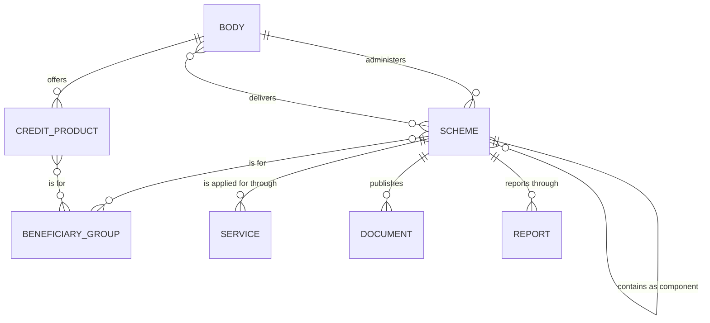
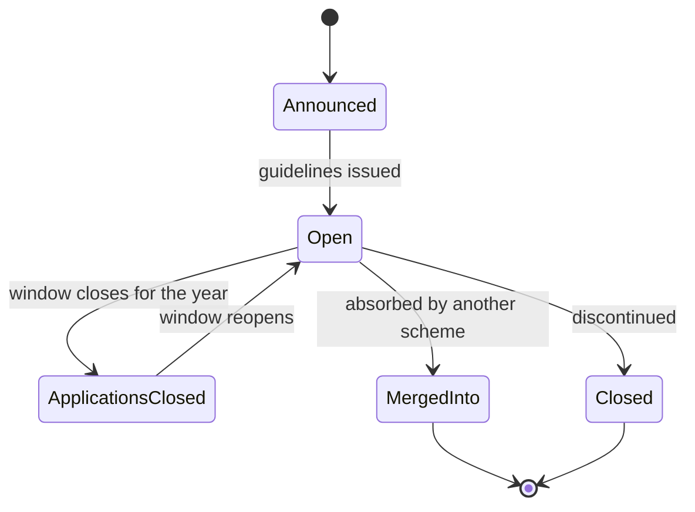

# The Schemes & Services section — the object model, and the IA that follows from it

> Companion to `docs/audit/website-schemes-placement-2026-09-09.md`, which read all 140
> listings and found 86 of them are not schemes of this Department.
> Worked at **Layer 5 (conceptual model)** before Layer 7, because the section's failure is
> an object-model failure, not a navigation failure.

## 1. The diagnosis: one object is doing seven jobs

The section recognises exactly **one** object today — `Scheme` — carrying two weak
attributes, `category` and `targetGroup`. Everything the Department publishes about what it
provides was flattened onto it.

So a Union scheme, a bank product, a Maharashtra scholarship, a PDF of guidelines, a status
table from 2018, a memorial building and a list of criminal offences are all the same kind
of thing to this website. They render in the same card, filter on the same pills and sort
into the same grid. **That is the whole defect.** No amount of re-sorting a list of 140
fixes it, because the list has no way to say what any entry is.

Two consequences worth naming, because they are what a citizen actually hits:

- **No entry says which government runs it.** 46 State schemes sit beside 20 Union schemes
  with nothing to tell them apart. A reader in Bankura cannot know whether to approach Delhi
  or their own State.
- **No entry says whether it is still open.** SRMS was subsumed into NAMASTE in 2023-24,
  PM-DAKSH is merging into PM-KVY from 2026-27, and two more have no budget line at all —
  and all four look exactly as live as Post-Matric Scholarship.

## 2. The objects the section should recognise

Seven, of which four already exist elsewhere on this site and are simply not connected.

| Object | One sentence | Already exists? |
|---|---|---|
| **Scheme** | A programme of assistance with its own budget line or its own published guidelines, which a person or organisation can benefit from. | yes, but over-broad |
| **Credit product** | A concessional loan or subvention offered by one of the Department's corporations, defined by a loan ceiling, an interest rate and a repayment period. | no — currently mis-modelled as Scheme |
| **Body** | An organisation that runs or delivers assistance — the Department, its Foundations, its corporations, a State Government, a channelising agency, a voluntary organisation. | yes, as Organisation |
| **Beneficiary group** | A community or category of person the Department's mandate names. | yes, as the For Beneficiary / For Student doors |
| **Service** | A place a person actually goes to act — a portal, a helpline number, a camp, a district office. | **no — and the section is called "Schemes & Services"** |
| **Document** | A guideline, circular, form, report or Act. | yes — 1,962 of them, in ten categories |
| **Report** | A published figure or table about how a scheme is performing. | yes, as the Dashboard |

### What was deliberately *not* made an object

- **"Scholarships and Fellowships", "Loans and Credit", "Care, Shelter and Health"** — these
  are of-a-kind. The object is the **offering type**; those are its values. Making each a
  page would be mistaking instances for objects.
- **"Umbrella scheme"** — not a second object. An umbrella is a Scheme that has children.
  One object, one self-relationship.
- **"Helpline"** — not a separate object from Service. 14567, the National Scholarship
  Portal, an ALIMCO camp and the district administration are all answers to "where do I go",
  differing only in channel.
- **"Awareness Camps", "Workshops/Job Fairs", "Skill Development Achievements"** — these are
  things a body *does*, not things a citizen returns to. They are prose on the body's page.

### The relationships that were never modelled



Two of these carry the weight.

**`administers` versus `delivers` are different roles and must be named separately.** NSFDC
*administers* its own Term Loan and *delivers* the Department's VISVAS interest subvention.
A State Government *delivers* Post-Matric Scholarship for SCs and *administers* the
Savitribai Phule Scholarship. Collapsing the two roles into "related organisation" is how
46 State schemes came to look like the Department's.

**`contains as component` is what shrinks the list honestly.** PM-YASASVI is one scheme with
five sub-schemes; the site lists the umbrella and three of its children as four siblings.

## 3. The state a scheme is in

There is no status field today. There must be, and it must be shown.



| State | What the page must say | Records in it today |
|---|---|---:|
| **Open** | how to apply, and by when | most |
| **Applications closed** | that the scheme exists but the window has shut, and when it reopens | not distinguished |
| **Merged into &lt;scheme&gt;** | which scheme took it over, with a link — **the page stays**, because citizens search the old name | SRMS; and PM-DAKSH from 2026-27 |
| **Closed** | the year it closed and where beneficiaries go now | Credit Enhancement Guarantee Scheme, Upgradation of Merit (both to be confirmed) |

**A merged or closed scheme is never deleted.** Babu Jagjivan Ram Chhatrawas Yojana and
Pradhan Mantri Adarsh Gram Yojana went into PM-AJAY in 2021-22 and people still search those
names. Deleting the page loses them; keeping it with a pointer answers them.

## 4. The vocabulary

One name per concept, one concept per name.

| Concept | Use | Reject | Why |
|---|---|---|---|
| Who a scheme serves | **Who It Is For** | "Target Group", "Beneficiaries" | The user's words, not the file's. The Department's own mandate names the groups. |
| What a scheme provides | **What You Get** | "Category", "Sector" | `category` currently mixes what you get ("Education", "Loan") with who it is for ("Sanitation Workers", "Small business"). Two questions need two fields. |
| Who runs it | **Administered By** | "Nodal Ministry", "Related Organisation" | The name has to distinguish administering from delivering. |
| Where you apply | **Where to Apply** | "Important Link", "Click Here" | Two records currently say "Click Here" and nothing else. |
| Budget classification | **Central Sector / Centrally Sponsored / State / Corporation Product** | invented labels | The Department's own Demand-for-Grants vocabulary already exists. Use it. |
| Scheme inside a scheme | **Component** | "Sub-scheme", "Sub-Component" | One word, used everywhere. |

The current `category` field holds **14 values, four of which classify a single record** —
"TERM LOAN", "MICRO FINANCE", "Social Remedies", "Non Loan" — and 20 records hold none. It
is replaced by two controlled facets, not repaired.

**The categories are ten, not eight** (decided 11 September 2026). Tagging all 140 records
against the model found twenty-one with no honest home in the original eight, so two were
added: **Housing and Settlement** — a house, a plot, or the roads, drainage and common works
of a village or basti — and **Awards and Recognition** — merit awards, prizes, national
awards and the academic chairs. PM-AJAY's Adarsh Gram had been filed under *Skill Training
and Livelihood*, and a cash prize for examination marks under *Scholarships and Fellowships*;
neither is a reading a citizen would make.

**Where Housing stops and Care begins.** A shelter home, a Garima Greh, an old-age home and a
de-addiction centre stay under *Care, Shelter and Health* — the citizen is housed there for a
time, by somebody else. *Housing and Settlement* is a permanent home the citizen holds, or
the works of the settlement they live in. Without this line the two blur within a month.

## 5. The route tree

```
/website/schemes-services                         the hub — three doors, one finder
│
├── /schemes                                      What the Department itself runs
│   ├── /schemes/<scheme>                         a scheme; its components nested inside it
│   └── /schemes/<scheme>/<component>             a component, e.g. …/pm-yasasvi/top-class-college
│
├── /credit                                       Loans and credit, across all three corporations
│   └── /credit/<product>                         a product, with its rate table
│
├── /state-schemes                                What the States run — the DWBDNC directory
│   └── /state-schemes/<state>                    one State's schemes, named as that State's
│
└── /services                                     Where to apply — portals, helplines, offices
    └── /services/<service>

Cross-cutting views, no new pages of their own:
/schemes/for/<beneficiary-group>                  feeds the existing For Beneficiary door
/schemes/what-you-get/<offering>
```

**One canonical home per record, views on top.** A credit product's canonical URL is under
`/credit`; the corporation's own organisation page renders the same set filtered to it,
linking out rather than re-hosting. The audit said "put them on the corporation page" — this
refines it: the corporation page is the *view*, `/credit` is the *home*, because a citizen
asking "can I get a loan for a sanitation vehicle" does not know which corporation to open.

**State schemes are one click off the hub, never mixed into `/schemes`.** They are on this
site at all because DWBDNC's remit is to track what the Centre and each State provide DNT
communities — which is what 43 of the 46 turn out to be. Every card names its State in the
card, not only on the page.

## 6. What the counts become

| | Now | After |
|---|---:|---:|
| Entries in the top-level scheme list | 140 | **20** |
| Components, shown inside their parent | 0 | 12 |
| Foundation schemes, on the Foundations' pages | 0 | 11 |
| Credit products, under Loans and Credit | mixed in | 21 |
| State schemes, under DWBDNC with their State named | mixed in | 46 |
| Documents, tables, MoUs and lists in the scheme list | 12 | **0** |
| Duplicate and empty pages | 8 + 22 | 0 |

The 20 top-level Department schemes are: AVYAY · Top Class Education for SC Students ·
the PCR and PoA implementation scheme · Interest Subsidy on Educational Loans for OBCs and
EBCs · Free Coaching for SCs, OBCs and PM CARES Children · NAMASTE · NAPDDR · National
Fellowship for OBC Students · National Fellowship for SC Students · National Overseas
Scholarship · PM-DAKSH · PM-YASASVI · Post-Matric Scholarship for SCs · PM-AJAY ·
Pre-Matric Scholarship for SCs and Others · SHRESHTA · Assistance to SCDCs · National Awards
for prevention of alcoholism and substance abuse · SEED · SMILE.

## 7. What a scheme page owes the reader

In this order, because it is the order the questions arrive in.

1. **Name**, and the umbrella it sits in, if any
2. **Status chip** — Open · Applications closed · Merged into &lt;scheme&gt; · Closed
3. **Administered by**, and **delivered through**, each linked to its body
4. **Who it is for** — the groups, each linked to its door
5. **What you get** — the entitlement in figures
6. **Am I eligible** — the stated conditions, nothing inferred
7. **Where to apply** — the Service, as a link or a number, never "Click Here"
8. **Components**, if it is an umbrella — as cards, not a paragraph
9. **Documents** — the guidelines, forms and circulars, from the existing document store
10. **Performance**, where the Dashboard publishes it

Points 3, 4 and 7 are the ones absent today, and they are the three a citizen most needs.

## 8. The three doors on the hub

The hub is not a list. It is three plainly-named doors plus the finder:

- **Schemes of the Department** — 20, with their components
- **Loans and Credit** — 21 products from NSFDC, NSKFDC and NBCFDC, comparable side by side
- **Schemes of the State Governments** — 46, by State, through DWBDNC

with **Where to Apply** as a fourth entry for people who know their scheme and only need the
portal or the helpline — which is what the "& Services" in the section's name has always
promised and never delivered.

## 9. Open questions for the Department

- Whether the **Dr. Ambedkar Foundation** and **BJRNF** schemes should appear in the
  Department's own list as well as on the Foundations' pages, or only on the Foundations'.
  Eleven schemes turn on this.
- Whether the 46 **State schemes** are published at all, or withdrawn pending a proper
  State-by-State compilation. Three of the 46 name no State even implicitly.
- The status of **Credit Enhancement Guarantee Scheme**, **Upgradation of Merit of SC
  Students**, **SRMS** and **PM-DAKSH** — the state model needs an answer for each.
- Whether **National Awards for prevention of alcoholism** is a scheme in its own right or a
  component of NAPDDR.
- Whether **PM CARES scholarship** is this Department's to publish, given the scheme sits
  with the Ministry of Women and Child Development.

## 10. What this document does not settle

This is Layer 5. It fixes what objects exist, how they relate, what states they hold and
what they are called. It does **not** decide the finder's interaction, the card design, the
filter behaviour or the empty states — those are Layer 6 and 7, and they should be designed
against this model rather than before it. It also assumes the audit's classification is
correct; six records in it are marked unconfirmed and the counts move if the Department
answers differently.
