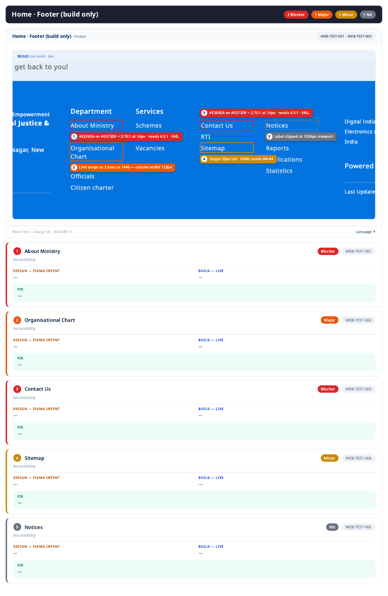

# MoSJE Portal — Visual Annotation System

> One fixed visual language for every annotated finding. Because all artifacts use the same
> system, the output reads like it came from a single senior designer — consistent, legible,
> and self-explanatory. **Do not freestyle annotations.** Use this spec and the HTML template.

---

## 1. Layout of an annotated finding

Each annotated PNG is a **single comparison board** for one screen (or one zoomed region),
with numbered callouts keyed to tracker rows.

```
┌───────────────────────────────────────────────────────────────────────┐
│  HEADER BAR                                                             │
│  [Portal · Screen · Viewport]              [QC ref range  e.g. 001–006] │
├──────────────────────────────────┬────────────────────────────────────┤
│  FIGMA (design intent)           │  LIVE (as built)                    │
│  ┌────────────────────────────┐  │  ┌───────────────────────────────┐ │
│  │                            │  │  │              ②                │ │
│  │            ①              │  │  │      ③                        │ │
│  │                            │  │  │                               │ │
│  └────────────────────────────┘  │  └───────────────────────────────┘ │
├───────────────────────────────────────────────────────────────────────┤
│  LEGEND / FINDINGS STRIP                                                │
│  ① 🟠 Spacing  ② 🔴 Color  ③ 🟡 Type  — short labels, keyed to tracker  │
└───────────────────────────────────────────────────────────────────────┘
```

A **third "overlay" panel** is added when useful: the Figma frame laid over the live capture at
50% opacity, so positional drift is undeniable.

---

## 2. Callout markers

- **Numbered pill** — a filled circle with the finding number, placed on the *live* panel at the
  point of the problem (and optionally mirrored on the Figma panel to show the intended state).
- **Color = severity** (see palette). The number is always white, bold, centered.
- **Connector** — a 2px leader line from the pill to the exact element when the pill can't sit on it.
- **Measurement marks** — for spacing: red dimension lines with the px delta ("design 24 / built 16 → +8").
  For color: a swatch chip pair (design vs built) with hex. For type: a one-line specimen ("16px/600 → built 14px/500").

Markers never cover the thing they describe — offset and lead with a line instead.

---

## 3. Color palette (severity)

| Token | Hex | Use |
|-------|-----|-----|
| Blocker | `#DC2626` | severity pill, measurement lines for blockers |
| Major | `#EA580C` | severity pill |
| Minor | `#CA8A04` | severity pill |
| Nit | `#6B7280` | severity pill |
| Marker text | `#FFFFFF` | numbers inside pills |
| Board bg | `#0B1220` | dark board background (screenshots pop) |
| Panel label | `#E5E7EB` | FIGMA / LIVE labels |
| Grid/guide | `#22D3EE` | overlay alignment guides (cyan, 1px) |

> These are **annotation-UI** colors, deliberately outside the MoSJE brand palette so callouts are
> never confused with the product UI being reviewed.

---

## 4. Typography (annotation chrome)

- Family: **Noto Sans** (matches the gov standard; falls back to system sans).
- Header bar: 16px / 700. Panel labels: 13px / 600 / letter-spacing 0.04em / uppercase.
- Legend: 13px / 500. Pill numbers: 14px / 700.
- Never smaller than 12px on the board.

---

## 5. Capture standards (so comparisons are fair)

- **Same viewport** both sides: desktop **1440×** and mobile **390×** (default). Note the viewport in the header.
- Figma frame exported at native size, then both panels scaled to equal display width.
- Live captures: real authenticated state, default data, **no devtools/overlays** in frame.
- One screen = one board. If a screen is long, produce stacked region boards (`-a`, `-b`) sharing the header.

---

## 6. File naming

```
docs/qc/portals/<portal>/annotated/<SCREEN>-<viewport>[-region].png
  e.g.  LOGIN-1440.png,  DASHBOARD-1440-a.png,  DASHBOARD-390.png
captures/figma/<SCREEN>-<nodeid>.png     (raw design frame export)
captures/live/<SCREEN>-<viewport>.png    (raw live screenshot)
```

Every callout number on a board maps to a tracker ID `<PORTAL>-<SCREEN>-<nnn>`; the board header
states the ID range so a dev can jump from sheet → image instantly.

---

## 7. Production method

Annotated boards are produced as **HTML (`templates/annotation-board.html`) → rendered to PNG**
via the headless browser. This guarantees pixel-consistent chrome, crisp text, and identical
styling on every board. Inputs are the two raw captures + a small JSON of callouts
(`{n, severity, category, x%, y%, label}`). No hand-drawing.

---

## Marks supersede pins (standing instruction, 2026-09-17)

**A finding is drawn as a MARK, not a bare numbered pin.** The reviewer found pins confusing: a
dot does not show how far an issue extends, and it sometimes sat on top of the very thing it
described.

A mark is two parts:

1. **Outline** — a 2px rounded rectangle in the severity colour, 3px outside the element's real
   bounding box, so the whole span of the issue is visible.
2. **Callout tag** — a severity-coloured tag with a white number badge and the *measured* evidence
   in one line: `#E2E6EA on #0373DF = 3.70:1 at 14px · needs 4.5:1 · FAIL`,
   `Built 14px/400 · design 16px/500`, `Target 20px tall · UX4G needs 44×44`. Values, not adjectives.

Placement is computed, never hand-set (`_layout_marks` in the design-qc `generate_pdf.py`): below,
above, right, then left of its own outline, and **never over any flagged element or another tag**.
A tag that cannot fit clean drops to a gutter under the screenshot with a dashed leader line.

`audit-master.json`: `liveMark: {box: [x1,y1,x2,y2], label}` and `figmaMark: {…}` in 1440-basis
image px. A section with marks and no `sectionBox` crops to the marks' union automatically. Old
masters with `livePin`/`figmaPin` still render unchanged.


