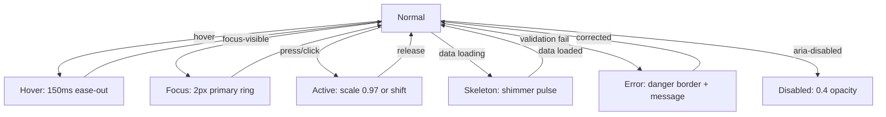

<!--
  SAMAVESH — AI Design System Specification (design.md)
  -----------------------------------------------------
  This file is the single, authoritative specification for the SAMAVESH Design
  System under the Ministry/Department of Social Justice & Empowerment (MoSJE),
  Government of India. It aligns with the UX4G Figma DS and GIGW 3.0 standards.
  
  This documentation is structured to match industry-benchmark design systems 
  (Google Material Design 3, IBM Carbon, Shopify Polaris, Atlassian), providing 
  clear guidelines for foundations, component catalogue, page patterns, modern 
  web APIs, and visual Dos & Don'ts.

  This file is rendered live at /design-system/resources/design-context.
  
  Last reviewed: 2026-08-22 · System version: v0.32.0 (NO HAND-ROLLED MASTHEAD OR
  ACCESSIBILITY BAR EXISTS ANYWHERE — `npm run check:chrome` fails the build on one.
  Twelve sites were converted, including a second accessibility bar INSIDE the design
  system and an invented abstract mark where the National Emblem belongs. Code Connect
  now covers the whole navbar family (10 templates, 12 recorded fixtures). Previously
  v0.31.0: (EVERY NAVBAR PART IS AN EXPORT —
  MenuToggle, SheetToggle, NavItemLink, NavDropdown, DropdownItem, MegaMenu, MegaMenuItem
  and the new NavSheet, which had no code counterpart at all. TWO TRIGGERS, DELIBERATELY:
  MenuToggle drives a persistent sidebar and mirrors its state; SheetToggle opens an
  overlay and has ONE glyph, because the sheet closes itself. Both are IconButton 48
  Outlined — a bare 40px glyph was the only control in the brand row with no container.
  The masthead search is the shared <Search>, not a button dressed as one.) Previously
  v0.30.0: (THE NAVBAR IS ONE COMPONENT FOR ALL
  THREE PLACEMENTS — website, portal and the new `compact` (hub index) variant; the hub's
  bespoke gate chrome is deleted. ALWAYS PASS `homeHref`: it defaulted to the hub root, so
  the emblem on every website page navigated out of the website. Every header glyph is now
  `<Icon>` (Material Symbols Rounded, wght 300) — the hand-rolled SVGs had drifted, and the
  sidebar toggle now swaps `menu_open`/`menu` off `navExpanded`.) Previously v0.29.0: THE ASSISTANT IS CALLED SAMAJIK
  SAHAYAK — सामाजिक सहायक — which is the name written on the seal it wears and the name
  of the live assistant on dosje.gov.in. The Figma mock's "Noddy" shipped briefly and was
  wrong three ways: it contradicted the badge, it contradicted the live service, and it is
  a British children's character. Previously v0.28.0: CHATBOT, the assistant
  surface, is in the system. Two rules travel with it and are easy to get wrong: its panel is
  NON-MODAL and must never trap focus, which is the opposite of `Modal`; and `placement="fixed"`
  marks itself `data-sa-wall-occupant` so the demo dock's rail measures around it. It carries
  two recorded divergences from its Figma mock — the mock's `#ff0004` fails AA at 4.00:1, and
  its `#EFE8FF` is not a SAMAVESH colour. Previously v0.27.0: THE RADIUS LADDER IS VALUE-NAMED TOO —
  `shape/md` is now `shape/8`, so both ladders read the same way and the rung IS the pixel value.
  `shape/full` deliberately keeps its name: it is a sentinel meaning fully rounded, not a
  measurement, and it is the only non-numeric rung the gate permits. NEVER type a `shape/*` rung
  on a component that has a role token — `cmp/card/radius`, `cmp/button/radius` and
  `control/radius` are the Tier-3 layer, and all three were found aliasing a HIDDEN Tier-1
  primitive. CARDS ARE 12px, not 8. Radius is 97.90% bound with every defect class at zero, and
  `check:radius-linkage` freezes it there — any new raw radius on any page fails the build. A new
  `stroke/*` ladder finally gives border width a semantic name; do not reach for
  `control/border/width` unless the border belongs to an interactive control. See §G.
  Previously v0.26.0: THE SPACING LADDER IS VALUE-NAMED — the
  rung IS the pixel value, `padding/16` is 16px and so is `inline/16`, `stack/16` and `section/16`.
  The t-shirt labels collided across families — `l` meant 16, 24, 20 and 56 — a defect inherited
  from UX4G 3.0. Every family now carries the same ladder, so no measurement is unexpressible, and
  a new step can be inserted without renaming anything. 38,799 spacing properties that were bound
  to a RADIUS variable are now zero; correct semantic spacing is 69.12%, up from 6.96%. See §G.
  NOTE — this narrative skips v0.21.0, v0.22.0, v0.24.0 and v0.25.0 (PortalLoginTemplate, the auth
  parts, the retirement of the invented `darpan` / `aadhaar` auth modes, the Tabs overflow menu and
  the font sizer). All are in the changelog at /design-system/resources/changelog, which is the
  complete record; this header carries only the releases whose rules an agent must hold in mind
  while writing UI.
  Previously v0.24.0: THE OVERFLOW ROW IS POLISHED, AND THE EDGE FADE IS SCOPED TO
  `track="none"` — an enclosed track paints its own border, fill and radius from the scrolling
  element, so a mask dissolved the container rather than the tabs.
  Previously v0.23.0: TABS MATCHES THE REBUILT FIGMA MASTERS.
  `<Tabs>` gains `indicator` (underline | rail | pill), `size` (s | m | l -> 36 / 44 / 48),
  `track` (none | enclosed) and `orientation`; `TabDef` gains `icon`, `badge` and `disabled`.
  INDICATOR AND TRACK PAIR — enclosed takes pill, none takes underline (horizontal) or rail
  (vertical); the other four combinations read as broken. A DISABLED TAB STAYS IN THE TABLIST,
  marked `aria-disabled` and skipped by the arrow keys — never the native `disabled` attribute,
  which would drop it out of the accessibility tree. Four tokens land with it —
  `text|icon/brand/primary/bolder` (the brand key colour fails AA on a tinted surface) and
  `layout/tab/{indicator,track}` — and `focus/ring` DROPS ITS 48% ALPHA in Blue and Navy, having
  composited to 1.16:1 on a selected pill.
  Previously v0.20.0 — ACCESSIBILITYBAR IS NOW A CODE COMPONENT AND
  SITEHEADER IS MIGRATED ONTO IT. `@mosje/design-system` exports `AccessibilityBar` — the UX4G/GIGW
  top utility bar with a working A−/A/A+ font-size stepper — mirroring the SAMAVESH Figma master,
  fully `--sa-*` tokenised, AA-clear. SiteHeader's own hand-rolled Tier-1 bar is DELETED and the
  shared component replaces it. SUPERSEDED BY v0.25.0 — the masthead now passes `fontSize`
  (ON). What follows described the v0.20.0 state: the masthead passed
  `fontSize={false}` — explicitly, because the prop DEFAULTS TO TRUE — so the UX4G widget remained
  the single mechanism for text size and contrast. `tone` is gone: colour is the brand MODE
  (`data-brand="navy"`), never a prop.
  Previously v0.19.0 — THE CONTENT CONTAINER IS UX4G'S TWO-STEP
  1200/1320 AND `.sa-container` IS THE ONLY WAY TO APPLY IT. Four widths shipped at once and the
  masthead sat 20px wider each side than the page beneath it; `SiteHeader.maxWidth` is now an
  override, not a default. New: `container/contentXl`, `ref/breakpoint/desktopXl`.
  Previously v0.18.2 — ICON IS NOW DECORATIVE BY DEFAULT — it
  sets aria-hidden itself unless given an aria-label, which then makes it role="img". The rule
  was documented but unenforced and was missed at 533 of 718 call sites; the component now
  decides instead of the caller. Do not add aria-hidden to decorative icons. Previously
  v0.18.0: FILLED PRIMARY MOVED TO THE bolder RUNG.
  A filled primary button now paints bg/brand/primary/bolder (#005EB9) instead of the ink of the
  same family (#0373DF), taking white-on-primary from 4.64:1 to 6.36:1 and Navy from 8.77:1 to
  12.61:1. 36 solid fills across the estate plus the DS Button, whose single --_color was split
  into --_fill and --_color so outlined and text appearances keep the ink. THE LADDER ALREADY
  SAID THIS: bg rungs sit one step deeper than the ink of the same family precisely because a
  fill carries white text and an ink sits on the page. The Button was reaching past its own
  system — and a slot migration the same day had briefly put a TEXT token in charge of its fill,
  which is what surfaced it. Success and danger were NOT moved: their bg bolder rungs are
  different values, so that is a separate decision. SS B and SS C were also rewritten onto
  canonical names — they still spelled tokens in the --ds-* vocabulary retired earlier that day.
  PREVIOUS ENTRY: COLOUR SECTIONS SS A/B/C/6 RECONCILED
  AGAINST THE BUILT STYLESHEET. Every colour value and every contrast ratio in this file was
  recomputed from packages/tokens/dist/tokens.css and corrected: the §C pairs table was wrong in
  eight of nine rows after the 2026-08-11 ramp rebuild, §B carried a Dark column for an axis
  removed on 2026-08-10, §A named DBIM Blue #162F6A as Navy's key colour when Navy is #003366
  at rung 600, and §6 listed --ds-danger-strong, which has never been an emitted token. The
  rung-shortfall ledger is SIXTEEN, not nineteen. The lesson is the one this file already states
  about itself and did not obey: a hand-maintained value table is a second source of truth, and
  it rots silently while every gate stays green — no test reads prose. PREVIOUS ENTRY:
  THE SHADOWS WERE TINTED TOWARD A COLOUR
  THE SYSTEM NO LONGER HAD. The ramp's own description claims it keeps "the SAMAVESH convention
  of tinting toward ink rather than UX4G's flat black", and it did not: five rungs plus the
  modal scrim carried `rgba(31, 36, 40)`, hand-written from a neutral/800 that the ramp rebuild
  moved to #1e2124. Derived from neutral/800 now — geometry stays authored, only the ink is
  generated, so it cannot drift again. Nobody could see it, which is precisely why deriving
  beat correcting: composited over white the two inks differ by dE 0.14-0.54, under the ~1.0
  just-noticeable threshold at every alpha this ramp uses. A wrong value you can see gets fixed
  the first time somebody looks; a wrong value you cannot see survives every review.
  A REAL BUG THIS SURFACED, shipped in v0.16.0: `text/disabled` fell back to the blue-grey in
  all six DBIM modes while `text/default` resolved to Deep Earthy Brown — enabled text brown,
  disabled text blue-grey, in modes whose entire claim is conformance. The DBIM preprocessor
  synthesises those modes by remapping token REFERENCES, so an rgba() literal was invisible to
  it and the hand-written override was deleted on the way past. `text/disabled` and the scrim
  now carry real brand ids and follow the ink everywhere.
  SHADOWS STAY BRAND-INVARIANT, structurally rather than by taste. Blue and Navy composite to
  dE 0.00 — identical — so the shipping brands gain nothing; DBIM differs by up to 1.63 at
  `xl`, marginally over threshold. Against that: a shadow is COMPOSITE and `elevation/*` inlines
  its resolved value rather than aliasing it, so a per-brand override repaints `--ds-shadow-*`
  and leaves `--sa-elevation-*` behind. Two names for one shadow disagreeing by brand is worse
  than a uniform sub-threshold difference. Revisit if `elevation/*` ever aliases.
  ONE ASSUMPTION CORRECTED IN TWO PLACES: the Figma exporter's `brandOwner` and the round-trip
  gate's axis check both read "has any colorModes" as "varies by brand". Figma's Palette models
  exactly one brand axis, [Blue, Navy], so a token whose only overrides are the code-only
  `dbim-*` modes has nothing brand-varying to say there — and giving the scrim DBIM inks
  promoted it out of single-mode Color into Palette as a new variable whose two modes were
  identical. Both now key on `navy` specifically.)

  System version: v0.16.1 (THE CHART PALETTE NOW SAYS WHICH OF ITS
  VALUES ARE COPIES AND WHICH ARE CHOICES, per group, because the difference was not guessable
  and the copies had rotted. `chart/div/*` — the diverging scale for signed data — was seven
  hardcoded hexes, two of them copies of `danger/100` and `neutral/200` taken before those ramps
  were rebuilt and a positive end still on retired Material green. It REFERENCES the danger,
  neutral and success ramps now, exactly as `chart/trend/*` always has: negative here means what
  error means everywhere else, so a scale keeping its own red is a chart claiming bad news is a
  different kind of bad news. In Figma the same seven stopped being unlinked literals and became
  aliases onto the Palette collection.
  RUNGS CHOSEN FOR SYMMETRY, measured: a diverging scale whose wings differ in lightness encodes
  one sign as louder than the other, and the old set was 15.8 L* asymmetric across its three
  matched pairs. The new set is 2.1. `div/neg` does not move — #ec5042 turned out to be exactly
  `danger/400`, the anchor the copy was taken from.
  `cat/*` AND `seq/*` STAY LITERAL ON PURPOSE and now carry that argument in their own
  descriptions, because the next reader will otherwise "fix" them. A categorical palette is
  tuned as a SET and a reference lets one member drift out of that tuning on a brand swap; a
  sequential ramp needs even perceptual steps, which is a different constraint from
  primaryScale's contrast rungs.
  TWO CATEGORICAL SERIES WERE RETIRED BRAND COLOURS and both were replaced by measurement, not
  tidiness. cat/3 was Material green sitting dE 3.2 from cat/9 — two "distinguishable" series a
  reader cannot separate — and is India Green, 9.0 apart. cat/2 was the retired saffron at
  2.80:1 against the page, under WCAG 1.4.11's 3:1 and the only one of the twelve below it; it
  is `secondaryScale/500` at 3.79:1, so the whole set clears 3:1 for the first time. Bright
  India Saffron was tried and rejected at 2.91:1, and rung 600 rejected at dE 3.3 from cat/6 —
  a contrast fix that would have bought a collision.)

  System version: v0.16.0 (DBIM CONFORMANCE IS NOW SOMETHING YOU
  CAN SEE. All six of DBIM's published primary groups — Blue, Burgundy, Purple, Green, Chrome
  Yellow, Cinnamon Red — are selectable in the DemoDock's Colour tab, under their own heading,
  tagged DEMO ONLY. They are CODE-ONLY and never reach the Figma library: the exporter's
  Palette modes are a hardcoded [Blue, Navy] pair, so a DBIM brand is unreachable from it by
  construction rather than by discipline.
  FULL CONFORMANCE, not a repainted primary ramp. Selecting a group also swaps all four status
  colours to DBIM's own (Liberty Green #198754, Mustard Yellow #FFC107, Coral Red #DC3545, DBIM
  Blue #0D6EFD), replaces the brand-tinted greys with DBIM's PURE ones, and moves body text to
  Deep Earthy Brown #150202 — which is not a neutral step at all. A mode changing only the
  primary ramp would be a much weaker claim, so the UI states which one is being made.
  WHAT THE PREVIEW FOUND, which is the point of building it: DBIM's own palette does not always
  meet DBIM's own rule 4 ("colour usage must ensure accessibility"). `dbim-green`'s shade 2
  (#2D8686) lands on the filled rung at 4.32:1, BELOW AA. On Cinnamon Red the brand primary is
  2 degrees and dE 0.9 from the error status — indistinguishable. On Chrome Yellow the primary
  is 10 degrees from the warning status. All three are recorded with their measurements in
  `test/hue-separation.test.mjs` and `docs/design-system/colour-system.md` rather than
  corrected: a conformance palette that has been quietly fixed demonstrates nothing.
  THE SHAPE RULE DOES NOT APPLY to these six, and that is a deliberate, recorded exemption.
  Reproducing DBIM's exact hexes and holding a 4-16 L* ladder are mutually exclusive — a search
  over every assignment of five published shades to eleven rungs found no configuration
  satisfying both for five of the six groups. A transcription is exempt; the accessibility
  gates still bind.)

  System version: v0.15.3 (CODE AND FIGMA NOW AGREE ON EVERY
  VALUE, in all eight collections. The last difference was `ref/font/weight/*`, and it was
  fixed in the EXPORTER, not the library: it projected CSS numbers (400/500/600/700) where
  Figma holds STRING font-STYLE names (Regular/Medium/SemiBold/Bold), because Figma has no
  numeric weight — a text style selects a cut by `fontName.style`. The library was already
  right; the payload was the wrong side, and it could not have been fixed by pushing because a
  variable’s resolvedType is fixed at creation. Nothing renders differently: CSS still emits
  400/500/600/700.)

  System version: v0.15.2 (DESIGN-CONTEXT COVERAGE IS 100% — the
  three components the new gate recorded as debt are documented, and the baseline is empty.
  `BrandLockup` (always the National Emblem; a plain `<a>`/`` on purpose, which is what
  makes it server-safe inside a `basePath`-ed zone — do not "upgrade" it to `next/image`),
  `AccountMenu` (`items` decides what it IS: empty renders the static Figma block, non-empty an
  accessible dropdown; initials stand in for a missing avatar), and `Legend` (`aria-hidden` BY
  DESIGN — `ChartFrame`'s screen-reader table carries the values, so a series explained only by
  its legend label is invisible to a screen reader). Documenting them made the ratchet fail on
  its own baseline, which is the half of it worth having: coverage that improves forces the
  backlog to shrink with it.)

  System version: v0.15.1 (CODE AND FIGMA NOW AGREE ON VALUES, not
  just names. The library was holding 80 wrong values under the correct names — 13 component
  tokens bound to the wrong palette rung (one set stale since v0.13.0), a reverted webfont, and
  54 fluid-type variables carrying the previous tablet curve. Every existing check compared
  NAMES, so none of it was visible. All pushed, and `figma-value-parity.test.mjs` now fails the
  build when a value moves without the library record being refreshed. Seven of eight collections
  are byte-identical to the payload; the eighth differs only in `ref/font/weight/*`, which is
  CORRECT — Figma binds text styles by font-STYLE name ("Bold"), CSS needs the number (700), and
  a variable's resolvedType cannot change after creation.)

  System version: v0.15.0 (EVERY RAMP NOW OBEYS ONE RULE, and the
  system has ZERO WCAG AA shortfalls in every brand. The 2026-08-11 rebuild reached only the
  brand ramps; `dangerScale`, `warningScale`, `infoScale` and `neutralScale` still carried the
  shape the audit had measured — `danger/400` and `danger/500` 1.8 L* apart, `warning/500`
  darker AND duller than 400, and a neutral whose hue wandered 22 degrees. All four are now
  generated from anchors in `build/brand-ramps.mjs` like the rest, so all eight ramps step
  4-16 L* apart, monotonic, hue held within ~6 degrees, chroma on a single arc.
  ON THE TWO AA GAPS: `status-error-bolder` (4.40:1) and `status-warning-bolder` (4.46:1) were
  the last two failures in the estate, and both closed the same way — by anchoring a ramp at
  the rung its LIGHTNESS says rather than at 500 by convention. #ec5042 is L* 64 and #e09c1d
  is L* 76; forced to 500 they push the `bolder` rung into the dead zone (roughly L* 59-66)
  where a fill is too dark for dark ink and too light for white and NEITHER reaches 4.5:1.
  At 400 and 300 the same rungs measure 6.68:1 and 5.68:1. `KNOWN_BELOW_AA` is now empty.
  ON THE GREYS: they were always tinted — the defect was that the tint was never CHOSEN. Hue
  is now locked to the brand's own primary for the whole ramp (255 in blue, 264 in navy) with
  chroma on one arc peaking ~0.016 in the mid-tones and reaching zero at both ends, so `0` and
  `1000` stay exactly white and black. The ladder was also re-cut: it used to put four steps
  inside its lightest 7.7 L* and then cross the middle in two jumps of 15+, which is why there
  was exactly ONE grey between a light surface and a mid grey. Expect visibly different
  borders and subtle surfaces — `--ds-border` moves from #f1f3f5 to #dcdee1.
  DESTRUCTIVE BUTTONS lost their step override and now use the same 600/700/800 progression as
  every other intent; the override existed only because danger/600 could not carry white text.)

  System version: v0.14.3 (UX4G WIDGET DOCS RESTORED — the
  accessibility widget's entry documented the v3.28 upgrade and was then lost when this
  file's version chain was rewritten, so the code shipped (#34, #35, #37) while its
  authoritative context did not. The component section now records what carries a
  decision: the pin to `accessibility-v3.28` and the two upstream defects that made the
  old workarounds necessary — reintroducing settings seeding is how every page ended up
  at 110% zoom; `analytics` defaulting to OFF, because the widget beacons the full URL of
  every page view and a portal URL can carry beneficiary identifiers; the macOS `⌘⌥A`
  shortcut, since v3.28's hardcoded `Ctrl+F2` is a reserved macOS system shortcut that
  never fires; and the brand skin being PINNED to v3.28, re-checked on any upgrade.)

  System version: v0.14.2 (The six `Focus States/*` effect styles
  had NO description; they now have one each, so effect-style coverage is 18/18 to match the
  variables' 909/909. Unlike the `Shadows/*` these needed no correction — every one already
  BINDS its colour to `color/transparent/<family>/48`, so they follow the brand and cannot rot
  into literals. One thing to know before "fixing" it: each is a single flush 4px spread while
  the build renders a 2px ring held 2px off the control (`--sa-focus-width` / `--sa-focus-offset`
  are both 2px). Same 4px footprint, no transparent gap — a drop shadow cannot leave one without
  painting the backdrop, so this is a limitation, not drift.)

  System version: v0.14.1 (ELEVATION IS IN FIGMA, as effect
  STYLES — a shadow is composite and Figma variables hold only COLOR/FLOAT/STRING/BOOLEAN, so
  it could never be a variable. `elevation/{flat,card,raised,dropdown,modal,toast}` are
  generated from `shadow.*` exactly. CORRECTION to v0.14.0, which said designers had no shadow
  tokens: six `Shadows/shadow-*` effect styles already existed, unknown to the code — and NOT
  ONE matches the token source (all use flat #212121 vs the tokens' tinted rgb(31,36,40), and
  `shadow-s`/`shadow-md` also differ in geometry). They are deliberately NOT corrected — a
  published library whose consumers cannot be enumerated — but each now names the `elevation/*`
  that supersedes it. Effect styles are invisible to the payload, the checksums and the
  round-trip test, so `elevation-parity.test.mjs` is what keeps them honest.)

  System version: v0.14.0 (THE LAYOUT GRID NOW EXISTS, and the
  tap-target floor is a LADDER rather than a number. `grid/columns` (12) + `grid/gutter` (24px)
  are UX4G 3.0/Bootstrap exactly, because we hold a parity contract with the Government of
  India's own system; `grid/margin/{mobile,tablet,desktop}` (16/24/32px) is responsive rather
  than Bootstrap's flat 12px, which is too thin for a government page (Carbon 32, GOV.UK 30).
  UX4G ships its grid as CSS classes — which is why none of it ever reached Figma; ours are
  tokens, on Carbon's model, so a designer can bind a Figma layout grid.
  ON TAP TARGETS: 44px is WCAG 2.5.5, which is **AAA** — NOT the AA floor it is usually quoted
  as. The AA floor is WCAG 2.2 SC 2.5.8 at 24x24 CSS px with a spacing exception, and GIGW 3.0
  binds this estate to WCAG 2.1 AA + IS 17802, which contains NO target-size criterion at all.
  So `target/min` 24 (AA), `target/comfortable` 44 (AAA + Apple 44pt), `target/spacious` 48
  (Material 48dp) and `target/spacing` 8 each name their authority — all deliberate choices
  ABOVE the mandate. Still absent by necessity: shadow/elevation cannot be a Figma variable
  (composite value) and needs effect STYLES.)

  System version: v0.13.2 (DEV MODE NOW TELLS THE TRUTH.
  A re-audit of the Figma library looked past variable NAMES — which were already correct —
  at the metadata Figma actually shows people, and found 61 variables publishing a codeSyntax
  naming a CSS custom property that does not exist (the prominence ladder was renamed and
  codeSyntax was never re-pushed), plus 487 carrying none at all. All 863 code-owned variables
  now carry the exporter's own emitted name. Also fixed: 18 accent variables scoped to
  ALL_SCOPES so they appeared in every picker, and 12 blank or stale descriptions — coverage
  is now 900/900 and gated. KNOWN GAPS, not yet built: there are no layout/grid tokens at all
  (columns, gutter, margin); shadow/elevation exists in CSS but CANNOT be a Figma variable and
  needs effect styles; there are only 3 breakpoints; and nothing names the 44px touch-target
  floor. See the audit section in the changelog.)

  System version: v0.13.1 (v0.13.0 IS NOW LIVE IN FIGMA —
  36 variables created, 899 total across 8 collections, and set equality with the build
  payload is PROVEN per collection by checksum rather than inferred from counts. The six
  accent foregrounds were chosen BY MEASUREMENT, not by rung name: accent flips to white
  ink at `bolder` and its `bold` rung sits at 4.60:1, so inheriting primary's flip point
  would have shipped an unreadable pairing. The `on/*` coverage gate no longer asserts a
  floor — it derives the expected set from the fills, which is what a count could never do.
  NOTHING WAS DELETED: the neutral endpoints were renumbered by a two-step RENAME CHAIN
  with ids preserved, so no binding moved. An earlier note here called that a hard delete;
  it was inferred from a missing NAME, which cannot distinguish a rename from a deletion —
  only an id lookup can. See $incidents in packages/tokens/reference/figma-live.json.)

  System version: v0.13.0 (THE COLOUR LAYER WAS REBUILT.
  Audit finding C-02 is closed: in the Navy brand, bg/brand/secondary/bold and
  bg/status/success/bold measured 1.00:1 apart — a secondary-action chip and a saved-state
  chip were the same object. Secondary and accent are now brand-INVARIANT and only PRIMARY
  changes with data-brand. The two SAMAVESH logo colours are first-class ramps (India Saffron
  #FF671F, India Green #046A38), success is unified onto that same green, and Navy's key
  colour is the DBIM #162F6A that the DBIM audit fails the estate on twice.
  [CORRECTION, 2026-08-12: Navy's key colour in the shipped build is #003366, at rung 600.
  #162F6A is DBIM Blue, which reaches the estate only as a code-only conformance preview and
  is never in the Figma library. Verified against dist/tokens.css.] Ramps are now
  GENERATED from anchors by one rule (build/ramp.mjs) rather than hand-picked — the Navy ramp
  used to fall 27.4 L* in one step and crush four rungs into fifteen points. Every chromatic
  ramp gained step 950 for UX4G parity (11 steps) and the neutral endpoints renumbered so pure
  white is 0 and pure black is 1000. `gov-` was dropped from every colour name across 330 call
  sites. A hue-separation gate now makes the C-02 class of defect unshippable.)

  System version: v1.11.8 (DEMODOCK PLACEMENT: the FAB moves from
  bottom-left to bottom-right, docked directly above the UX4G accessibility widget's own trigger —
  one coordinated utility rail instead of two FABs in unrelated corners at different sizes/offsets.
  The gap above the widget is measured live off its real geometry (never hardcoded), so an upstream
  resize can't silently reopen an overlap. The per-registry-entry boolean that used to raise the FAB
  above `PortalLoginShell`'s "Signing Into" strip on NMBA's login routes (making the FAB visibly
  relocate between routes) is removed outright rather than automated further — moving off
  bottom-left eliminates that collision at the source, so every route now gets the identical FAB
  position with nothing to opt into and nothing to forget.) v1.11.7 (COLOUR TAB MOTIF TILES: the Colour tab's
  swatch-plus-live-preview layout is replaced by a wrapping grid of fixed-size (~72×48px) motif
  tiles — a miniature header bar/surface/accent/button abstraction per mode, each rendered in that
  mode's own palette via a nested `data-brand` island on the tile itself (no hardcoded hex; see the
  "Brand islands" note). The live `Button`/`Badge`/`Alert` preview block is deleted — the tiles
  themselves are the preview, and give the tab a fixed height regardless of mode count instead of
  one that grows with a live-component block. Selected state keeps the tick plus a visible ring
  (still non-colour-only, WCAG 1.4.1); touch targets stay ≥44px (AAA). v1.11.6 (DEMODOCK REDESIGN: the footer disclaimer
  row ("Demo tooling — not part of the product") is gone — the dock is unambiguous demo chrome by
  context, and the row was pure noise. The Colour tab's body min-height no longer collapses when a
  short tab replaces a long one, so switching tabs doesn't visibly resize the panel. Colour is now a
  plain row of brand-palette swatches driven directly by `useColorMode()` — no label, no pill track
  — and `ColorModeSwitcher` is **removed from the design system entirely** (deleted from
  `foundations/`, the barrel, and Storybook); an app that still wants a standalone brand-mode
  control builds one from `useColorMode()` the same way DemoDock's Colour tab now does. Sign in only
  renders on an actual login route (`isLoginRoute`: path ends in `/login`, `/login-otp` or
  `/sign-in`) rather than anywhere under a portal with a demo account set, and when it renders it is
  the first tab and the one selected on open. Open/close and swatch selection are animated
  (CSS-only, token durations/easings, `prefers-reduced-motion` respected). v1.11.5 (DEMO TOOLING
  CONSOLIDATED: `AppSwitcher`
  removed — it hand-rolled a duplicate of `ColorModeSwitcher` and was mounted as mandatory
  per-portal navigation. Replaced by `DemoDock`, one floating console mounted exactly once by the
  hub root layout, tabbed Apps/Colour/Sign in, gated estate-wide by `NEXT_PUBLIC_DEMO_TOOLS`
  (default ON). `AppSwitcherPanel` and `DemoAccountsPanel` extracted as reusable panel content;
  `DemoFab` kept, now sharing `DemoAccountsPanel` with `DemoDock` instead of its own table. Demo
  credentials moved from per-page consts into a pathname-keyed registry, `DEMO_ACCOUNTS` in
  `packages/design-system/demo/demo-accounts.ts` — now the source of truth over
  `.claude/rules/portal-login-demos.md`'s table. `AppEntry.group` gained `"Reports"`. v1.11.4
  (APPEARANCE AXIS REMOVED: `data-theme`
  (light/dark/hc) no longer exists. Figma's Theme collection is single-mode and `tokens.css` emits
  no `[data-theme]` block. The UX4G accessibility widget is the estate's single canonical dark and
  high-contrast mechanism — it applies its own `.dark-mode` class and never read `data-theme`, so
  this was a second parallel mechanism nothing consumed. Verified no-op: zero value drift in every
  surviving selector context. Removed three dead switches (gate header, docs header, playground),
  the Storybook theme picker, two theme modules, the no-flash script and the orphaned CSS; corrected
  Storybook's pre-rename brand labels to Blue/Navy. Also normalised 33 Figma alphas stored as 8-bit
  n/255 values rather than clean percentages (max shift 0.16pp). v1.11.3: (FIGMA SYNC, second pass: the library now
  matches the code on Spacing (49), Theme (374), Border Radius, Motion and Density, and on all 117
  Color names the exporter emits. Created 61 missing variables (Spacing 15->49, Typography 79->106);
  renamed 28 in place so ids and bindings survived; retired 8 unused Color leftovers (149->141).
  TWO DELIBERATE NON-GAPS: the 24 extra Color names are Figma-native primitives designers bind to
  directly and the exporter withholds them on purpose; the 5 type/*-weight variables are absent
  because Figma models font weight as a STRING style name while the code uses a numeric FLOAT, and
  Figma rejects an alias across types. Also fixed a silent catch-all in the exporter that filed 13
  px-valued numbers under font-family/. The library needs republishing for any of this to reach
  consumers. v1.11.2: (FIGMA SYNC: the SAMAVESH library had four
  variable names living in BOTH the Color and Theme collections, left over from an earlier
  hand-migration. All 504 live bindings were rebound onto the Theme copies and the Color leftovers
  removed; Color 153 -> 149. `Focus/Ring` stays in both on purpose — it is a brand-source companion
  the appearance layer consumes. Two leftovers were also MISLABELLED: Color's
  Background/Brand/Primary/Subtle held ramp step 50, which the prominence ladder calls `base`, and
  Strong held Source rather than 600. The Theme copies already matched the ladder, so retiring the
  leftovers brings Figma and dist/tokens.css into token-for-token agreement and raises white-on-brand
  contrast from 4.64:1 to 6.30:1 (Blue) and 12.61:1 to 14.22:1 (Navy). The Figma library needs
  republishing for consumers to pick this up. v1.11.1: (TOKEN GRAMMAR: `default` now means
  exactly one thing — a state. It previously occupied three slot dictionaries at once
  (prominence, state, link variant), so the parser bound it greedily and text/link/visited/default
  parsed as a prominence, losing the state it spelled. The prominence canonical is now `base`
  (`--sa-bg-neutral-base`) and the link variant is now `brand` (`--sa-text-link-brand-default`).
  NOTHING RENDERS DIFFERENTLY — a rename, not a redesign: all 27 moved names resolve
  byte-identically in all 7 selector contexts, pinned by test/visual-contract.test.mjs, and the
  `--ds-*` names app code uses are unchanged. `--ux4g-*` names are unchanged too and sit OUTSIDE
  the contrast contract by construction: an alias preserves UX4G's VALUE, not our rung. Two slot
  ambiguities remain, pinned by test/slot-disjointness.test.mjs — see spec §5.1c/§8.1a.
  v1.11.0: The estate is off lucide-react and off
  shadcn/Radix entirely. Every icon is Material Symbols Rounded via <Icon> — 668 call sites
  across 239 files — and SidebarNavItem.icon is now a Material Symbols NAME STRING, not a
  component, so nav configs stay serialisable. NEW components: Tooltip (WCAG 1.4.13 —
  dismissible, hoverable, persistent; portalled at z-index 90 so Card/DataTable overflow can't
  clip it); Skeleton/SkeletonText/SkeletonRow; Label (standalone, for controls outside
  FormField); LiveRegion + useLiveRegion; SectionTitle. Input gains leftIcon/rightIcon — a bare
  Input still renders with no wrapper. FIXED: CardTitle painted at 32px because it referenced
  the Headline-1 alias while its own fallback claimed 20px; it is now bound to the canonical
  --ds-type-title-1-size. Icon accepts a style prop. NOTE the legacy --ds-text-title-* aliases
  are still mis-mapped to headline-2 — use the canonical --ds-type-<role>-size tokens.
  v1.10.0: SlaProgressIndicator — Right to
  Service Act time-remaining, three variants, seven states including a neutral PAUSED clock and
  MISSED as distinct from BREACHED; pure logic in utils/sla.ts. v1.9.0: (Type is now sized in REM, not px: a
  reader who raises their browser's default font size without zooming now gets larger text —
  a px scale ignored them. Renders identically at the 16px default, proven by test. NEW
  components: PasswordInput (reveal toggle — use for every password field in the estate;
  real type="button" so it cannot submit, action-named label, browser's own reveal
  suppressed); AadhaarInput / OtpInput / PanInput (UX4G 3.0 identity controls) + pure
  validators in utils/india-id.ts; Aadhaar is Verhoeff-checked and masked to its last four
  digits by default per DPDP Act 2023 / UIDAI. FIXED: the dark theme shipped a primary button
  whose white label sat at 3.77:1 — below AA — since the ramp step was chosen for the link
  role, not the fill; the contrast gate now sweeps every colour mode AND theme, not just
  :root, and covers the hover state. v1.8.0: UX4G 3.0 adopted as the foundation.
  New: the opt-in `--ux4g-*` parity layer (`@mosje/design-system/ux4g.css`, all 755 UX4G tokens
  resolved onto SAMAVESH — structure at UX4G's exact values, colour role-mapped to the MoSJE
  palette) plus `ux4g-light`/`ux4g-dark` colour modes carrying UX4G's literal palette. Core
  additions: UX4G's four semantic spacing role families (`--ds-inline/stack/padding/section-*`)
  — prefer these over the raw t-shirt scale; `--ds-spacing-10xl/11xl`; a 6-level shadow ramp
  (adds `none`/`sm`/`md`); `--ds-font-display` (Noto Sans Display, 36px+). FIXED: the
  `[data-surface="portal"]` block did not re-assert the `--ds-text-*`/`--ds-leading-*` aliases,
  so every natively-mounted portal rendered the WEBSITE type scale (display headings to 80px
  instead of 56px) — alias re-assertion is now targeted per block, which also cut tokens.css
  from 92 KB to 60 KB. v1.7.2: Text-entry controls take a hard 16px floor below 768px: iOS Safari zooms any focused control under 16px and does not zoom back out, and the fluid ramp put body-1 at ~14px on a phone. Desktop density unchanged. v1.7.1: `SideSheet` gains `side="left"` for navigation drawers, so portal shells can collapse a fixed sidebar into a drawer on small screens instead of squeezing the page. `DeclarationCheckbox` attestation row now meets the 44px touch floor. v1.7.0: Adds three components for field reporting with sign-off: `GeoPhotoInput` (EXIF/device geo-tagging + auto-downscale), `DeclarationCheckbox` (statutory certification panel), `ApprovalTimeline` (multi-tier approval audit trail). No token values changed. v1.6.2: Theming: `[data-color-mode="…"]` blocks now re-declare the `--ds-*` aliases, exactly as `[data-theme="…"]` blocks already did, so colour-mode "islands" repaint a nested subtree instead of only flipping `--sa-*` primitives. Fixed in the generator `packages/tokens/build/formats/legacy-ds-css.mjs`; surfaced when portals mounted natively in the hub and `data-brand` moved off `<html>` onto a wrapper. No token values changed. v1.6.1: Icon loading: icons.css now declares an inline @font-face (pinned gstatic woff2) instead of an @import, so the documented `import "@mosje/design-system/icons.css"` finally loads the font under Next/Turbopack — no per-app <link> hack. Typography: hyphenated Portal-DS role names — display-1…label-3; added -para (paragraph-spacing) + -tracking (letter-spacing) fluid props so code ↔ SAMAVESH Figma are at full parity. v1.6.0: two-surface fluid type via data-surface=website|portal, 21 role tokens as clamp(min@360px, fluid, max@1280px). v1.5.0: Figma→code colour sync, mode-aware Blue-Light/Blue-Dark, danger-strong #B8382F)
-->

# SAMAVESH Design System — Specification & AI Design Context

**SAMAVESH** (समावेश, "inclusion / bringing together") is the unified visual and interaction language for the **Ministry / Department of Social Justice & Empowerment (MoSJE/DoSJE), Government of India**. It serves as the single source of truth across 13 informational websites and 20+ workflow portals.

Any developer or AI agent building UI for any MoSJE application must read this document first and implement interfaces adhering strictly to the tokens, states, and guidelines specified below.

---

## Quick Start

```tsx
// 1. Import design system tokens once in your app root
import "@mosje/design-system/tokens.css";

// 2. Import components from the barrel
import {
  Button, FormField, Input, Card,
  SiteHeader, SidebarNav, Alert, Modal
} from "@mosje/design-system";

// 3. Use semantic tokens in custom CSS — never hardcoded hex values
const style = { background: "var(--ds-primary)", color: "var(--ds-on-primary)" };
```

| App type | Entry point | Token import |
|----------|-------------|--------------|
| Website (`apps/dosje`) | `src/app/globals.css` | `@import "@mosje/design-system/tokens.css"` |
| Portals (`apps/portals/*`) | `src/app/globals.css` | Same — Tailwind v4 everywhere |
| Design System docs | Loaded in `globals.css` | Already included |

> **New to SAMAVESH?** Start with the [Component Catalogue](#7-component-catalogue) → pick what you need → check the [Token Reference](#6-token-vocabulary-reference---ds-) for the exact tokens to use.

---

## 1. System Foundations

### A. Color Architecture & Theming Axes

SAMAVESH operates on three independent theme axes applied via HTML attributes on the root (`<html>`) element. Custom tokens respond automatically at runtime.

| Axis | Attribute | Values | Meaning |
| :--- | :--- | :--- | :--- |
| **Brand** | `data-brand` | `blue` (default), `navy` | Two peer brand palettes, BOTH on light surfaces. Renamed from `blue-light`/`blue-dark` on 2026-08-07: those read as appearance themes, which they never were. **Since 2026-08-11 a brand swap changes the PRIMARY ramp and the neutral greys, and nothing else** — `blue` anchors `#0373DF` at rung 500, `navy` anchors `#003366` at rung **600** (the rung its lightness says, not the rung convention expects). Verified against the built stylesheet on 2026-08-12: `primaryScale` differs in 11 of 11 rungs, `neutralScale` in 10 of 13, and every other ramp is byte-identical across the two brands. The neutral re-lock is a systemic guarantee that the grey follows the brand's hue, **not a visible change** — at 8-bit precision the two brands' greys differ by ≤1 per channel at most rungs, so do not describe them to a stakeholder as "warm" versus "cool". `#162F6A` is **not** navy: it is DBIM Blue, which exists only as a code-only conformance preview. **Secondary (India Saffron `#FF671F`) and accent (India Green `#046A38`) are brand-INVARIANT**: both are SAMAVESH logo colours, so they are constants of the identity rather than variants of it. Navy used to swap secondary to green, which landed it 1.00:1 from the success colour — see the changelog for audit C-02. |
| ~~Appearance~~ | ~~`data-theme`~~ | **REMOVED 2026-08-10** | Dark and high-contrast are owned entirely by the UX4G accessibility widget, which applies its own `.dark-mode` class to `<html>` and never read `data-theme`. This axis was a second, parallel mechanism nothing consumed. The token source still carries the overrides (unemitted) so it can be revived deliberately — see `docs/superpowers/records/2026-08-10-figma-theme-dark-hc-removed.md`. |
| **Density** | `data-density` | `comfortable` (default/unset), `compact` | Controls padding, heights, and spatial density. |
| **Surface** | `data-surface` | `website` (default/unset), `portal` | Selects the **typography scale**. `website` = the expressive editorial ramp (display-1 ≈ 80px); `portal` = the dense functional ramp (display-1 ≈ 56px). Same role token names in both; only the `--ds-type-*` values differ. Set `data-surface="portal"` on portal `<html>` roots; the website/hub stay default. Maps 1:1 to the SAMAVESH Figma `Website` / `Portal` type modes. |

> **Surface is a type axis only.** `data-surface` swaps the fluid type scale (`--ds-type-*`), nothing else — colour comes from `data-brand`. All type is fluid `clamp()` between a 360px-viewport min and a 1280px max, so the two surfaces each scale smoothly; there are no type media-query breakpoints.

> **Brand is the only colour axis.** `data-brand` (blue/navy) swaps the brand palette; `navy` is NOT a dark UI theme — it keeps light surfaces and simply uses navy/green/cool-grey. There is no appearance axis: dark and high-contrast belong to the UX4G accessibility widget, the estate's single canonical mechanism for both.

> **Two more colour modes ship opt-in: `ux4g` and `ux4gdeep`.** They carry UX4G 3.0's
> own palette (violet `#6a4eff` / `#4a2bc2`) *literally*, so UX4G conformance can be
> demonstrated by flipping one attribute instead of argued about. They live in
> `@mosje/design-system/ux4g.css` (opt-in — the default bundle does not grow) and are
> exported from `color-mode.ts` as `UX4G_COLOR_MODES`, deliberately **not** merged into
> `COLOR_MODES`: offering a mode in an app that has not loaded that stylesheet would show a
> switch that does nothing. Opt in explicitly:
> `<ColorModeSwitcher modes={[...COLOR_MODES, ...UX4G_COLOR_MODES]} />`.
> The MoSJE default stays the primary blue `#0373DF`, as DBIM requires.

> **Tip:** Nested brand "islands" (e.g. a navy portal shell inside the blue hub) must be explicitly scoped with a nested `[data-brand]` element. To prevent a flash on initial render, initialize the attribute with the exported `colorModeInitScript()`.

> **Brand islands.** You can put `data-brand` on any element, not just `<html>`, and the subtree re-themes, because the generated `tokens.css` re-declares the `--ds-*` aliases inside every `[data-brand="…"]` block (each also carrying the deprecated `[data-color-mode="…"]` selector, so existing markup keeps working). A custom property substitutes `var()` at the element where it is **declared**, so a block that only flipped the `--sa-*` primitives would leave `--ds-primary` resolved at whatever `:root` computed and the island would not repaint. Anything changing this lives in `packages/tokens/build/formats/legacy-ds-css.mjs`, never in the generated CSS.

### B. Colour Usage Contract

Use semantic tokens — never reference primitive `--sa-color-*` values directly in components. Primitives are referenced only within `tokens.css`.

**There is no Light/Dark column, because there is no appearance axis.** `data-theme` was removed on
2026-08-10; dark and high-contrast belong entirely to the UX4G accessibility widget. The only axis
that changes a colour is `data-brand`, so the two value columns below are Blue and Navy.

| Token | Blue | Navy | Correct usage | Never use for |
|-------|------|------|---------------|---------------|
| `--sa-bg-brand-primary-bolder` | `#005EB9` | `#003366` | **Solid primary fills** — filled buttons, active nav, brand banners | Text or borders on a light page; the ink slot below is measured for that |
| `--sa-text-brand-primary-base` | `#0373DF` | `#244C7B` | Brand-coloured text, links, outlined-button ink, key icons | Solid fills behind white text — that is the `bg` slot's job |
| `--sa-color-brand-saffron` | `#FF671F` | same | Accents, badges, decorative emphasis | Text, icons or chart series on white — **2.91:1**, below even the 3:1 non-text floor |
| `--sa-color-brand-yellow` | `#FFD323` | same | Nothing, in new work. Retained for older markup | Text at any size (**1.44:1**). For yellow emphasis use `bg/status/warning/subtler` behind dark ink |
| `--sa-text-neutral-base` | `#1E2124` | `#1E2024` | All body/heading text | Interactive elements, backgrounds |
| `--sa-text-neutral-subtle` | `#3A3D41` | `#3B3D41` | Captions, hints, helper text | — comfortably AA at 10.92:1; the old "check below 16px" caveat no longer applies |
| `--sa-bg-neutral-base` | `#FFFFFF` | same | Page and card backgrounds | Text or icon fills |
| `--sa-bg-neutral-subtler` | `#EEF0F3` | `#EFF0F2` | Inputs, code blocks, quiet panels | Anything needing a measured contrast — it is a surface, not a fill with a guarantee |
| `--sa-text-status-error-base` | `#8B1F18` | same | Error text and icons on white, destructive labels | Decorative fills (use `bg/status/error/subtler`) |
| `--sa-text-status-success-base` | `#004220` | same | Success states, validation confirmation | Primary brand actions |
| `--sa-on-bg-brand-primary-bolder` | `#FFFFFF` | same | Text/icons on a solid primary fill | Any other background |

> **A fill sits one rung deeper than the ink of the same family, and that is the point.**
> `bg/brand/primary/bolder` is `primaryScale/600`; `text/brand/primary/base` is `/500`. The fill
> carries white text, so it is measured against white and needs the headroom; the ink sits on the
> page, where 4.64:1 is measured against the page and correct. Reaching for the ink token to paint
> a button is the mistake this split exists to prevent — and it is the one the DS Button itself
> made until 2026-08-12.

*Every value above was read from `packages/tokens/dist/tokens.css` on 2026-08-12. The previous
table pre-dated the 2026-08-11 ramp rebuild and was wrong on `--ds-saffron`, `--ds-ink`,
`--ds-ink-muted`, `--ds-danger` and `--ds-success`, and carried a Dark column for an axis that had
already been removed.*

### C. Contrast Pairs (WCAG 2.2 AA — minimum 4.5:1 for text, 3:1 for UI elements)

| Foreground | Background | Ratio | Status | Usage context |
|-----------|-----------|-------|--------|---------------|
| `on/bg/brand/primary/bolder` (`#fff`) | `bg/brand/primary/bolder` (`#005EB9`) | **6.36:1** | ✅ Pass | **Filled primary buttons, active nav.** In Navy the same pair is 12.61:1 |
| `text/neutral/base` (`#1E2124`) | `bg/neutral/base` (`#fff`) | **16.18:1** | ✅ Pass | All body text |
| `text/neutral/subtle` (`#3A3D41`) | `bg/neutral/base` (`#fff`) | **10.92:1** | ✅ Pass | Hint text, captions — at any size |
| `text/neutral/subtle` (`#3A3D41`) | `bg/neutral/subtler` (`#EEF0F3`) | **9.56:1** | ✅ Pass | Safe on quiet panels too |
| `text/status/error/base` (`#8B1F18`) | `bg/neutral/base` (`#fff`) | **9.10:1** | ✅ Pass | Error text and icons on white |
| `text/brand/primary/base` (`#0373DF`) | `bg/neutral/base` (`#fff`) | **4.64:1** | ✅ Pass | Link text, outlined-button ink. Clears the floor by 0.14 — do not put white on it |
| `color/brand/saffron` (`#FF671F`) | `bg/neutral/base` (`#fff`) | **2.91:1** | ❌ Fail (even non-text) | Decorative fills only. Below the 3:1 of WCAG 1.4.11 |
| `color/brand/yellow` (`#FFD323`) | `bg/neutral/base` (`#fff`) | **1.44:1** | ❌ Fail | Never a text colour, at any size |
| `text/status/success/base` (`#004220`) | `bg/neutral/base` (`#fff`) | **11.67:1** | ✅ Pass | Confirmation text and icons |
| `border/neutral/subtle` (`#DCDEE1`) | `bg/neutral/base` (`#fff`) | **1.35:1** | ⚠️ Decorative | A hairline divider only. For a control boundary use `border/neutral/bolder/default` |

> **Critical rule — a fill is not an ink.** Paint a solid primary surface with
> `bg/brand/primary/bolder` and put `on/bg/brand/primary/bolder` on it; that pairing was measured
> and clears AA by 1.86. `text/brand/primary/base` is the *ink* of the same family — correct for a
> link or an outlined button on the page, and 0.14 above the floor there, but white text on it
> would be the marginal pairing this ladder exists to avoid.
>
> *Changed 2026-08-12 (v0.18.1):* success and danger filled buttons followed primary onto their
> `bg` bolder rungs — `#00542B` and `#AA2F25`. For these two the move **lowers** contrast (11.67:1
> → 9.12:1 and 9.10:1 → 6.68:1) where primary's raised it; both stay far clear of the floor, and the
> trade is consistency rather than accessibility. A fill comes from the `bg` slot in every family,
> or the rule is not a rule. The filled Button also stopped hardcoding primary's ink for every
> variant — each now declares the foreground measured for its own fill.
>
> *Changed 2026-08-12 (v0.18.0):* filled primary buttons moved from `#0373DF` to `#005EB9` across the estate
> (36 solid fills plus the DS Button), taking white-on-primary from 4.64:1 to 6.36:1 and Navy from
> 8.77:1 to 12.61:1. The DS Button's single `--_color` was split into `--_fill` and `--_color`, so
> outlined and text appearances keep the ink. Gradients and `color-mix` washes deliberately keep
> the lighter value. Success and danger were NOT moved: their `bg` bolder rungs are different
> values, so that is a separate decision.

> **The table above is hand-maintained; it is not the authority.** Every `--sa-*` colour token
> carries a contrast class that is **measured at build time** against its own surface, across every
> brand, and published in `dist/figma.variables.json` (`contrast.measured` / `contrast.shortfall`)
> and in each Figma variable's description. `test/prominence-contract.test.mjs` fails the build if
> any published class is not true. Read those numbers, not these, when the two disagree — and fix
> this table when they do.
>
> **A rung name is not a guarantee.** **Sixteen** tokens currently measure below the class their
> prominence rung implies — fourteen `bg/*` tonal chips plus `border/neutral/subtle` and
> `border/neutral/bolder/default`, where the fill ladder's ≥3:1 is the wrong requirement rather than
> the colour being wrong. They are listed in the ledger at the foot of
> `test/prominence-contract.test.mjs`, published in `dist/figma.variables.json`
> (`contrast.shortfall`), and stated plainly in their own Figma description. Choose a token by its
> measured number, never by how loud its name sounds. *(Was nineteen before the 2026-08-11 ramp
> rebuild; corrected 2026-08-12.)*

### D. Typography

- **Typeface**: Noto Sans (`var(--ds-font-sans)`) — non-negotiable across all English interfaces. Devanagari/Hindi uses `--sa-font-devanagari`.
- **Which faces are actually loaded** (`apps/hub` root layout — a token that names a font nobody loads renders as a system fallback, which is how Hindi silently lost its typeface):
  - `Noto Sans`, subsets `latin` + `devanagari`, weights 400/500/600/700. One superfamily covers both scripts; `unicode-range` means the Devanagari file is fetched only by pages that contain Devanagari.
  - `Noto Sans Display`, subset `latin`, weight 500 — the optical Display cut, for the 40–80px Display ramp only.
  - **No monospace webfont**, by choice — see the mono rule below.
- **The Display cut is addressed differently in each medium.** Noto Sans ships two cuts of one design: the text cut is drawn for 12–24px, and at 80px its open spacing reads as loose. CSS loads the cut as a **separate family** (`"Noto Sans Display"` + `font-weight: 500`); Figma exposes it as a **style of Noto Sans** (`Display Medium`), because Figma's style axis conflates cut and weight into one string. So `ref/font/family/display` says `Noto Sans` in Figma and `"Noto Sans Display", …` in CSS — deliberately, not a drift. The `Display/display-1…6` text styles bind `ref/font/weight/displayMedium`.
  - **Latin only.** `Noto Sans Display` has no Devanagari subset and `Noto Sans Devanagari` has no Display cut — the pairing does not exist in Noto. A Hindi display heading falls through the stack to Noto Sans, which is correct; the alternative is no glyphs.
- **Numbers are NOT a job for monospace.** Use `font-variant-numeric: tabular-nums` on Noto Sans: digits get equal width so a column of amounts, counts or reference numbers aligns and can be scanned down, while staying in the same typeface as the text beside them. Switching a column to a mono face is the clumsier fix and reads as a different design. Already applied in `DataTable`, the Aadhaar/PAN field, charts, the SLA indicator and `Section`.
- **`--ds-font-mono` is for CODE AND TECHNICAL STRINGS ONLY** — token names, CSS snippets, file paths in these docs. It is a **system stack** (`ui-monospace` → SF Mono / Cascadia / Roboto Mono), deliberately not a webfont: mono appears only on documentation pages, and a download on every page to style sample code is a poor trade for a low-bandwidth government audience. The Figma variable is hidden from publishing, because "whatever mono the device has" has no single Figma family.
- **Line Length**: Body text and prose containers max-width `65ch`–`75ch` (`max-w-prose`). Never wider.
- **Fluid type**: Every role is `clamp(min, fluid, max)` — `min` at a 360px viewport, `max` at 1280px. No type media queries. Two surfaces (`data-surface`) supply different min/max: **Website** (expressive) vs **Portal** (dense).
- **Text Wrapping**: Use `text-wrap: balance` on `h1`–`h3`; `text-wrap: pretty` on paragraphs to eliminate orphans.

### E. Type Scale Reference

**21 responsive roles** with **hyphenated Portal-DS names** (`display-1…6`, `headline-1…6`, `title-1…3`,
`body-1…3`, `label-1…3`), each exposed with four fluid properties:
`--ds-type-<role>-size`, `-lh` (line-height), `-para` (paragraph-spacing), `-tracking` (letter-spacing),
plus friendly aliases `--ds-text-<role>` / `--ds-leading-<role>`. Letter-spacing is also grouped for non-display
tiers: `--ds-type-{heading,title,body,label}-tracking`. Values differ by **surface** — the table shows desktop
(`max`) size; both surfaces scale fluidly to their 360px `min`. Full min/max tables live in
`packages/tokens/src/primitive.json` (`font.role.*` + `font.tracking.*`) and
`docs/specs/samavesh-typography-unification-spec.md`. Names match the SAMAVESH Figma library 1:1.

| Role (sample) | Canonical token | Website max | Portal max | Weight | When to use |
|------|---------------|:-----------:|:----------:|--------|-------------|
| Display 1 | `--ds-type-display-1-size` | 80px | 56px | 500 | Hero headings only |
| Headline 1 | `--ds-type-headline-1-size` | 40px | 32px | 600 | Major section headings |
| Title 1 | `--ds-type-title-1-size` | 22px | 20px | 500 | Section headings, page titles |
| Body 1 | `--ds-type-body-1-size` | 16px | 16px | 400 | Standard body text |
| Body 2 | `--ds-type-body-2-size` | 14px | 14px | 400 | Secondary text, table cells |
| Label 1 | `--ds-type-label-1-size` | 14px | 14px | 500 | Input labels, button text |
| Label 3 | `--ds-type-label-3-size` | 11px | 11px | 500 | Table headers, caps labels |

> **Surface selection:** the website & hub render the Website scale (default); portals set `data-surface="portal"`
> on `<html>` to get the Portal scale. Legacy aliases (`--ds-text-display`, `--ds-text-title-1`, …) still resolve and
> inherit the active surface automatically.

> ### ⚠ The table above names `--ds-type-<role>-*`. It does **not** describe `--ds-text-<role>`.
>
> Three families of typography variable exist, and only the first two agree with this table:
>
> | Family | Example | Relationship to the table |
> |---|---|---|
> | **Canonical roles** | `--ds-type-title-1-size` | ✅ Exactly the table. **Use these.** |
> | Unhyphenated aliases | `--ds-text-title1` | ✅ 1:1 with the role of the same name |
> | **Hyphenated legacy aliases** | `--ds-text-title-1` | ❌ **Named for the pre-Portal-DS scale** |
>
> The hyphenated family is mapped to whichever role reproduces each alias's
> *historical rendered value*, so its names deliberately do not line up:
> `--ds-text-title-1` is the **headline-2** role (24→32px), not Title 1 (20/22px);
> `--ds-text-title-2` is Title 1.
>
> **RETIRED 2026-08-12.** The whole `--ds-*` layer, including this hyphenated family,
> was deleted from the build — see the retirement note later in this document. The
> paragraphs above are kept as the record of a hazard that no longer exists, because
> the reasoning still applies to any alias family: read the resolved value, not the name.
>
> For the record, measured against the generated `tokens.css` on 2026-08-11 before
> deletion: **precisely two of the nine hyphenated aliases misled** — `title-1` and
> `title-2`. The other seven (`display`, `headline`, `body-1/2/3`, `label-1/3`) resolved
> to the role they named. `--ds-text-title-3` and `--ds-text-label-2` never existed at all.
> Those values are frozen in
> `packages/tokens/test/legacy-snapshot.json` and asserted on every build — re-pointing
> one at its same-named role silently resizes every legacy callsite in the estate.
>
> **This has caused four separate bugs**, all the same mistake — reading the alias
> name instead of its resolved size: `CardTitle` painted at 32–40px; the docs portal's
> `h2` rendered *smaller* than its `h3`; twelve docs pages set a 40px lead against a
> 24px line-height; and `zone-unavailable` still carries a `22px` fallback for a token
> that resolves to 32px.
>
> **Rule: in new code reference `--ds-type-<role>-size` / `-lh`.** Reach for a
> `--ds-text-*` alias only to keep an existing callsite compiling, and check its
> resolved value first. Guarded by `packages/tokens/test/type-alias-parity.test.mjs`.

### F. Bilingual (English + Hindi) Usage

- Wrap inline Hindi text: `<span lang="hi">समावेश</span>` — always set the `lang` attribute.
- Apply Devanagari font: `font-family: var(--sa-font-devanagari)` on the `lang="hi"` element.
- **Never use italic on Devanagari** — the script has no italic tradition; slanting degrades legibility.
- Page `lang` attribute must be `lang="en"` with `lang="hi"` on individual Hindi strings (not the reverse).
- Hindi text with no explicit size set will inherit from the English scale — this is intentional.

### G. Spacing & Elevation

**Spacing is VALUE-NAMED. The rung IS the pixel value: `padding/16` is 16px, and so are
`inline/16`, `stack/16` and `section/16`.** There is no lookup table and no T-shirt label.

```
0  2  4  6  8  12  16  20  24  32  40  48  56  64  72  80        + padding 120 · 360
```

Every family carries that ladder, so **no measurement is unexpressible**. `section` starts at
24 (page rhythm has no use for 2px) and `padding` keeps 120/360 for UX4G parity.

| Family | Use for |
|--------|---------|
| `--sa-inline-<px>` | Horizontal gaps between items **on the same line** |
| `--sa-stack-<px>` | Vertical gaps between **stacked** blocks, and vertical rhythm |
| `--sa-padding-<px>` | **Inner** padding of components and containers |
| `--sa-section-<px>` | Gaps between **page sections** |

```css
/* Prefer */  gap: var(--sa-stack-16);      /* 16px between stacked blocks */
/* Never  */  gap: var(--sa-ref-space-16);  /* Tier 1 — hidden, and banned by tier-discipline.test.mjs */
```

#### Why it is numbered, and why that is not a downgrade

Until 2026-08-18 the rungs were T-shirt labels, **and the same label carried a different value
in each family** — `l` was 16 in `inline`, 24 in `stack`, 20 in `padding` and 56 in `section`.
Seven of eleven labels collided; the inverse was as bad, with 24px answering to four names.
That is inherited verbatim from **UX4G 3.0**, whose published contract has `--ux4g-inline-l`=16
beside `--ux4g-stack-l`=24. `standards-precedence.md` puts UX4G at authority tier 4: where a
standard forces a worse interface, quality wins and the divergence is recorded. This is that.

Note UX4G's own *primitive* ramp is numeric (`space-1…16`) and only goes T-shirt at the semantic
layer — which is exactly where it fails. Numbering here is **more** consistent with UX4G, not less.
**UX4G conformance is untouched**: the `--ux4g-*` layer is emitted independently and never reads
these names, so `ux4g-parity.test.mjs` asserts the same contract as before.

The second reason is expandability. A T-shirt ramp has no slot between adjacent rungs, so every
insertion renames everything above it — that happened **twice in one day** before the change
(`inline` gained 24; `padding` needed a 6 it could not have). A numeric ladder absorbs any step
for free, which is how 6px arrived with no rename at all.

#### The one rule that keeps a value-name honest

> **Mode-varying spacing belongs in `density/*`, never in the ladder.**

A value-name lies the moment a mode changes the value. The Space collection has ONE mode and
density variance already lives in `density/*` with its own two modes. If a spacing value must
differ by mode, it is a density token, not a ladder rung. `space-linkage.test.mjs` asserts a
rung's name equals its resolved value, so a violation fails the build rather than shipping.

**Responsive Layout Grid — `<Grid>` / `<GridItem>`:**
- **Twelve columns at every breakpoint**, `24px` gutter (`grid/columns`, `grid/gutter`).
  A child spans *more* of them on a small screen rather than the track count changing —
  UX4G's model, and Bootstrap's. There is deliberately **no 4-column mobile grid**;
  the earlier claim of one contradicted `grid/columns`, which has always been 12.
- Side margin is responsive (`grid/margin/*`): 16 mobile · 24 tablet · 32 desktop.

**Content container — never hardcode a max-width.** Use the `.sa-container` class from
`@mosje/design-system/layout.css`, which carries the cap *and* the responsive side margin.
The estate follows **UX4G 3.0's two-step container**: `--sa-container-content` **1200px**,
widening to `--sa-container-contentXl` **1320px** at `--sa-ref-breakpoint-desktopXl` (1768px).
`--sa-container-page` is the derived variable that selects between them; bind that when a
media query is unavailable (an inline style, for instance — it is how `SiteHeader` caps its
own column).

> A container is a **cap**, not a width. `grid/margin/*` (16 mobile / 24 tablet / 32 desktop)
> is a **floor** that wins on narrower viewports, so the effective column is
> `min(container, viewport − 2 × margin)`.

**Page-skeleton tokens (`--sa-layout-*`).** Only genuinely fixed measurements:

| Token | Value | Applies to |
| --- | --- | --- |
| `layout/bar/height` | 46 | accessibility bar — fixed |
| `layout/flag/width` | 33 | flag mark in the bar — fixed |
| `layout/masthead/minHeight` | 72 | brand row — **minimum only, it hugs** |
| `layout/chrome/minHeight` | 118 | sticky offsets and scroll anchors **only** |
| `layout/sidebar/width` | 300 | portal sidebar — fixed |

**Fixed, hug, or fill — decide this before sizing anything.**

| Region | Sizing |
| --- | --- |
| Accessibility bar · sidebar width · sidebar item | **Fixed** — a token sets it |
| Brand row · website nav row · page header · card, panel, band | **Hug** — content sets it; a minimum is allowed, a fixed size is not |
| Sidebar height · content area | **Fill** — what remains sets it |
| Content column | **Cap**, then the margin floor |

> **Never size a shell by subtracting a chrome height from the viewport.** The brand row
> hugs, so its height is not knowable in advance — `h-[calc(100vh-5.75rem)]` is wrong by
> construction. `AppShell` is a grid whose chrome rows are `auto` and whose body row is
> `1fr`. `layout/chrome/minHeight` is for sticky offsets, not layout arithmetic.

### Layout components

Primitives compose the content column; templates compose the page. All are presentational —
no store, no router, no redirect.

| Component | Use it for | Never |
| --- | --- | --- |
| `Container` | the centred content column; applies the cap **and** the side margin | adding your own `px-*` — the margin is already there |
| `Grid` / `GridItem` | page-level column layouts; `span={{ base, md, lg }}` | a simple wrapping row of cards — flex is simpler |
| `Band` | a website section: full-bleed tone + rhythm around a `Container` | a portal page — portal content is fluid, not banded |
| `PageHeader` | the title + meta + actions row a portal page opens with | a heading *inside* a page — that is `SectionTitle` |
| `AppShell` | every signed-in portal page | a login screen — that is `PortalLoginShell` |
| `SiteLayout` | every public website page | a portal page |

Composition is always **`Band` → `Container` → content**. A bare `Container` where a `Band`
belongs produces a tint that stops short of the viewport edge.

### Floating widgets — the right wall, and it is not empty

**Floating widgets live on the right wall.** `DemoDock` is the only one today. Two rules
govern it, and both exist because a fixed position was wrong twice:

**1. The rail dodges what is already on the wall.** The wall is not empty, and the estate's
own measurements prove it — the walls are *inverted* between zones:

| Surface | Left wall | Right wall |
| --- | --- | --- |
| Website | free | **Important Links** (`fixed right-0 top-[42%]`, 37×175) |
| Docs / portals | **sidebar nav**, full height | free |

No fixed choice works, so the position is measured. `useWallRailOffset` finds the largest
free vertical band on the wall and centres the rail in the one nearest the middle of the
screen. On the docs that is the whole viewport, so nothing changes; on the website the rail
sits clear of Important Links.

> **Any fixed widget on the right wall must mark itself `data-sa-wall-occupant`.** That is
> the whole contract — one attribute, and every widget on the rail adapts. `ImportantLinks`
> carries it. A widget taller than 60% of the viewport is treated as scenery rather than an
> obstacle, because a full-height sidebar cannot be dodged.

**2. The panel opens on the side that covers less.** `usePanelSide` measures the form
underneath and opens the panel away from it. On the NMBA login route the panel used to sit
on top of both credential fields and the submit button — hit-testing the mobile input
returned a demo-accounts row. **The rail never moves; only the panel adapts**, so muscle
memory for the trigger holds.

**Neither rule is the per-route flag that was rejected.** That was a hand-set boolean a new
portal could forget, which relocated the widget for no reason a viewer could see. These
measure, and when the widget moves it moves *around something you can see*. Legibility is
the difference.

---

## 2. Component States & Interactive Behavior

Every interactive component (Buttons, Inputs, Cards, Links) must implement all standard states.



### A. State Definitions

1. **Normal** — Default idle state using standard semantic tokens.
2. **Hover** — `150ms` CSS transition (`var(--ds-duration-fast)`) with exponential ease-out (`var(--ds-easing-out)`). **Banned:** Linear or bouncy spring transitions.
3. **Active** — Immediate visual feedback on press: scale `0.97` or slight background darkening. Confirms action register.
4. **Focus** — `2px solid var(--ds-primary-ring)` with `2px` outline-offset. Contrast ratio against its surrounding background must be ≥ 4.5:1. Never suppress focus outlines.
5. **Disabled** — Opacity `0.4`. Add `pointer-events: none`, `tabindex="-1"`, `aria-disabled="true"`. **Do not use** a neutral flat fill only — combine it with reduced opacity.
   *(There is no `--ds-opacity-disabled` token yet — the value is currently hardcoded at call sites. An `opacity` scale lands in Phase 2 of the token-architecture spec.)*
6. **Loading/Skeleton** — While data is fetching, render `<Loader />` or a skeleton placeholder using `--ds-surface-muted` with a CSS shimmer animation. Never leave an empty container with no loading signal.
7. **Error** — Persistent state (unlike Disabled, the user must actively correct it). Show a `var(--sa-border-status-error-base)` border + inline error message in `var(--sa-text-status-error-base)` below the control. Error text requires `role="alert"` or `aria-describedby` linkage, and the border alone must never be the only error signal (WCAG 1.4.1).

### B. Keyboard Navigation & Focus Management

- **Overlays (Modals, Dropdowns, Drawers)**: Must trap keyboard focus inside the container while active. `Escape` must close and return focus to the trigger element. Use native `<dialog>` — it handles this automatically.
- **Lists and Navigations**: `Tab` moves between groups. Dropdowns and mega-menus support `Arrow` keys for list traversal within an open menu.
- **Forms**: `Tab` moves between form fields. `Enter` submits the closest `<form>`. `Space` toggles Checkbox and Radio.
- **WCAG SC 2.1.1** (Keyboard): All functionality operable by keyboard. **SC 2.4.3** (Focus Order): Focus moves in a meaningful sequence.

---

## 3. Visual Guidelines: Dos & Don'ts

### A. Buttons & Actions

| Do | Don't |
| :--- | :--- |
| Use predefined semantic roles: `variant="primary | secondary | tonal | danger"`. | Do not create custom button classes or override backgrounds with hardcoded hex/rgba values. |
| Use full-pill rounded shapes (`var(--sa-shape-full)`) for action buttons. | Banned: "Ghost" buttons using a `1px` border combined with a soft, wide drop shadow. |
| Ensure clear label text; use `aria-label` for icon-only buttons. | Do not use decorative text gradients (`background-clip: text`) on button labels. |
| Limit to one `primary` button per visual section. | Do not place two `primary` buttons side by side — demote one to `secondary`. |

### B. Cards & Containers

| Do | Don't |
| :--- | :--- |
| Group content into clean cards using `var(--sa-cmp-card-radius)` (12px). | Banned: Sharp corners (`0px` radius) or excessively rounded (`> 20px`) for cards. |
| Use solid semantic borders (`--ds-border`) or `--ds-surface-muted` background for separation. | Banned: Coloured accent side-stripes (`border-left: 4px solid`) on cards. These are a legacy gov-portal pattern that fragments visual hierarchy. |
| Keep grids structured with equal-height cards via flex or CSS grid. | Do not nest cards within other cards — flat hierarchy only. |
| Use `<CardHeader>`, `<CardBody>`, `<CardFooter>` sub-components. | Do not build bespoke card layouts with raw `div`s inside a `<Card>`. |

### C. Site Header & Navbars

| Do | Don't |
| :--- | :--- |
| Render the canonical `<SiteHeader>` with the functional accessibility toolbar. | Banned: Placing decorative Indian tricolour stripes in the header, footer, or hero section. |
| Configure `variant="website"` for public portals, `variant="portal"` for authenticated dashboards. | Do not override the official National Emblem with abstract logos or custom marks. |
| Ensure the mobile drawer flattens the mega-menu structure dynamically. | Do not disable collapse-on-scroll or keyboard navigation properties. |
| Pass `collapseOnScroll` only on portal variant — always account for the dynamic chrome height in sidebar offset calculations. | Do not hardcode a pixel offset for sidebar top positioning. |

### D. Forms & Inputs

| Do | Don't |
| :--- | :--- |
| Wrap every input in `<FormField>` containing explicit label, hint, and error nodes. | Do not use placeholder text as a substitute for labels. Placeholders disappear on type and fail accessibility. |
| Show red error states (`var(--sa-border-status-error-base)` + `var(--sa-text-status-error-base)`) only after validation runs or input blur. | Do not render inline inputs without surrounding margin-bottom/padding constraints. |
| Use `<FormSection>` to group related fields under a sub-heading within a form. | Do not render a single `<form>` with 20+ fields — break it into `<FormSection>` groups or use `<Wizard>`. |
| Use `<Search>` (not `<Input>`) for search affordances — it includes the correct icon and clear button. | Do not use `type="search"` on a plain `<Input>` and style it manually. |

### E. Data Tables

| Do | Don't |
| :--- | :--- |
| Use `<DataTable>` with proper `column` definitions for sortable, paginated government data. | Do not use `<div>` grids for tabular data. Always use semantic `<table>` with `scope` attributes. |
| Zebra-stripe alternate rows using `--ds-surface-muted` for dense tables (> 15 rows). | Do not apply row background colours semantically (green = good, red = bad) without a text label — colour alone fails WCAG 1.4.1. |
| Use sticky headers (`position: sticky`) for scrollable tall tables. | Do not render tables without a visible `<caption>` or an `aria-label` on the `<table>` element. |
| Right-align numeric columns and align the header text to match. | Do not mix left- and right-aligned text in the same column. |
| Always add a sort indicator icon when a column is sortable. | Do not rely on row order alone to communicate data ranking. |

### F. Empty States

| Do | Don't |
| :--- | :--- |
| Always show: icon + heading + 1-sentence explanation + a primary CTA to unblock the user. | Do not show only "No data found" with no action path. |
| Use `<EmptyState>` with `variant="no-results"` for filtered tables, `variant="no-data"` for fresh portals. | Do not use red or warning colours — an empty state is not an error. |
| Keep the message constructive: "Add your first application to get started." | Do not use passive voice: "No results were found." |

### G. Toast Notifications

| Do | Don't |
| :--- | :--- |
| Auto-dismiss success toasts after 4 seconds. Leave error and warning toasts persistent until manually dismissed. | Do not auto-dismiss error toasts — users may not have read the message. |
| Position toasts in bottom-right (desktop) or bottom-centre (mobile). | Do not stack more than 3 toasts simultaneously — queue overflow toasts. |
| Use `useToast()` from the design system for all notifications. | Do not use browser `alert()`, `confirm()`, or `prompt()`. |
| Use toasts for: save confirmation, copy success, brief status updates. | Do not use toasts for critical errors, blocking confirmations, or multi-line content — use Modal or inline Alert instead. |

### H. Modals & Overlays

| Do | Don't |
| :--- | :--- |
| Use `<Modal>` (which wraps native `<dialog>`) for confirmations, destructive action prompts, and detail views. | Do not build custom modal overlays with `z-index` stacking — use the native `<dialog>` element. |
| Always include a close button (`×`) in the top-right corner. | Do not close modals on backdrop click for destructive confirmations — data loss risk. |
| Use `size="sm"` for simple confirm dialogs; `size="lg"` for complex multi-field forms. | Do not nest a full page-level flow inside a modal. Link to a dedicated page instead. |
| Ensure `Escape` key always closes the modal and returns focus to the trigger. | Do not trap focus in a modal that requires clicking outside to close. |

---

## 4. Modern Web Standards & Browser APIs

SAMAVESH prioritizes native web platform capabilities over large JavaScript libraries to guarantee performance and visual stability.

### A. Native Overlays

All dropdowns, tooltips, select menus, and modal dialogs must use native browser features:
- **`<dialog>` Element**: Use for modal overlays. Leverages native stacking context (`::backdrop`), automatically traps keyboard focus, and handles Escape-key dismissals natively.
- **`popover` API**: Use the HTML `popover` attribute for lightweight non-modal overlays (tooltips, dropdowns) to prevent stacking z-index clipping inside `overflow: hidden` parent elements.

### B. Size-Aware Styling (Container Queries)

Responsive components (Cards, Grid panels, Lists) must use CSS Container Queries (`@container`) rather than viewport Media Queries (`@media`).

Card layout structures must adapt to their parent container width (`cqw` units) rather than screen size, enabling components to render correctly in both a full-bleed grid and a narrow sidebar widget.

### C. Parent Styling with `:has()`

Utilize the CSS `:has()` pseudo-class to style parent containers dynamically based on child states, reducing reactive state management in JavaScript:

```css
/* Style form fieldset wrap with a red border only when it contains an invalid input */
.ds-form-group:has(input:invalid:not(:placeholder-shown)) {
  border-color: var(--ds-danger);
}

/* Compact card when it contains a MetricCard component */
.ds-grid-cell:has(.ds-metric-card) {
  padding: var(--ds-spacing-sm);
}
```

### D. Performance & Visual Stability

- **VISUAL STABILITY**: All custom web fonts (Noto Sans) must configure `font-display: swap` and define visually stable font fallbacks to minimize Cumulative Layout Shift (CLS).
- **Lazy-load images below the fold**: Use `loading="lazy"` on all `` and `next/image` elements that are not in the first viewport.
- **`content-visibility: auto`**: Apply to off-screen sections in long pages (scheme listings, history tables) to defer rendering.
- **Graceful Degradation**: Provide lightweight fallbacks for modern APIs using feature detection: `@supports (container-type: inline-size)`.

---

## 5. Token Architecture (Three Tiers)

**Never reference Tier 1 primitives directly in component or page code.** Only reference semantic tokens (`--ds-*`) in components, pages, and Tailwind classes.

| Tier | Prefix | Examples | Who uses it |
|------|--------|---------|-------------|
| **1. Reference** | `--sa-ref-*` | `--sa-ref-color-primaryRamp-light-500: #0373DF`, `--sa-ref-spacing-lg` | **Banned in app code.** Referenced only inside `tokens.css`. |
| **2. System** | `--sa-*` (unmarked) | `--sa-color-status-danger`, `--sa-density-control-height` | All component and page code |
| **2. System (deprecated)** | `--ds-*` | `--ds-primary`, `--ds-danger`, `--ds-ink` | Still resolves; being migrated onto Tier 2 names |
| **3. Component** | `--sa-cmp-*` | `--sa-cmp-card-radius`, `--sa-cmp-action-brand-primary-hover-bg` | Advanced per-component overrides only |

> **The tier is in the name.** A token's tier comes from the file it is authored in
> (`primitive.json` / `brand.json` → `ref`, `component*.json` → `cmp`, everything else → system),
> and the marker is added when the CSS name is projected. Tier 2 carries **no** marker, so the
> token you type 90% of the time is the shortest. `ref` and `cmp` are reserved as Tier-2 first
> segments, which is what keeps the projection reversible for the Figma round-trip. See
> `packages/tokens/build/grammar.mjs` and the token-architecture spec §4.1, §5.

> **Caution:** Only ever reference **semantic tokens** (`--ds-*`) in component and page code. Referencing `--sa-color-*` primitives directly couples your component to the specific brand ramp and will break dark mode and high-contrast themes.

### The UX4G 3.0 parity layer (`--ux4g-*`) — opt-in

UX4G 3.0 is the foundation SAMAVESH is built against. `@mosje/design-system/ux4g.css` exposes
UX4G's **entire 755-token contract** resolved onto our own tokens, so UX4G-authored markup and
specs work here unchanged. It is a **separate, opt-in stylesheet**: the default bundle does not
grow by a byte.

```css
@import "@mosje/design-system/tokens.css";
@import "@mosje/design-system/ux4g.css";  /* only where you need --ux4g-* names */
```

Two mapping rules, applied by kind:

| Kind | Rule | Example |
|------|------|---------|
| **Structure** (spacing, radius, type sizes, weights, borders, opacity, blur, z-index) | UX4G's **exact values**. Where SAMAVESH already has a token with that value, the two are *bound* to one number so they cannot drift. | `--ux4g-stack-m` → `var(--sa-spacing-lg)` → `16px` = `--ds-stack-m` |
| **Colour** | Maps by **role**, not value → the MoSJE palette. DBIM requires a primary group built from the ministry's key colour; UX4G ships Theme Craft precisely to allow it. | `--ux4g-bg-primary-strong` → the primary blue, **not** UX4G violet |

Measured conformance is calculated, never estimated —
`node tools/ux4g-conformance/measure.mjs` (100% token coverage, 100% structural conformance,
59.3% component coverage as of 2026-08-06). Full position and rationale:
`docs/ux4g/UX4G-Code-Readiness-Audit.md`.

> **Do not `npm install ux4g-web-components`.** It is a 7.6 MB stylesheet plus a 286 KB runtime
> that rewrites the DOM React owns (11 MutationObservers, 42 `innerHTML` writes) — it breaks
> hydration in Next 16 and would regress every portal. We conform to the specification, not the
> distribution. Write React components against `--ds-*`; the `--ux4g-*` names exist for interop.

**One divergence, recorded deliberately:** UX4G sizes type in `rem`, SAMAVESH in `px`. The
`--ux4g-size-*` tokens keep UX4G's rem so browser default-font-size scaling keeps working; they
are **not** aliased to our px tokens. Moving the SAMAVESH fluid scale to rem is the top open
follow-up in the audit.

---

## 6. Token Vocabulary Reference (`--sa-*`)

Custom properties are defined in `@mosje/tokens` and generated into `packages/design-system/tokens.css`.

> **The legacy `--ds-*` vocabulary was RETIRED on 2026-08-12 and no longer exists.** Nothing emits
> it: zero occurrences in `tokens.css`, `tokens.ts`, `tailwind-preset.cjs`, `ux4g.css` or the Figma
> payload, and zero references in source. A `var(--ds-…)` in new code resolves to nothing and the
> declaration carrying it is dropped as invalid — which is exactly how ~40 pre-existing dangling
> references were found and fixed during the migration.
>
> All 3,561 call sites were moved to the canonical `--sa-*` token each legacy name already resolved
> to, so **nothing rendered differently**: the ux4g contract fixture re-baselined to 4,433 removals
> (every one a `--ds-*` name), 208 additions and **zero changed values** across all 13 selector
> contexts. The full old→new mapping is preserved at `tools/token-migration/mapping.json`, and the
> codemod that applied it at `tools/token-migration/migrate.py`.
>
> **Three Tier-2 groups were created to make the migration possible**, because 320 usages had no
> canonical home at all:
> - **`--sa-shape-*`** — corner radius. Named `shape`, not `radius`, because Style Dictionary merges
>   the primitive and semantic namespaces and a Tier-2 `radius` group self-references the Tier-1
>   scale it aliases. `shape` is also the word this section already used.
> - **`--sa-font-latin` / `-display` / `-mono`** — alongside the existing `--sa-font-devanagari`.
> - **`--sa-stack-40`** (40px) — the one spacing value with no purpose-scale home.
>
> **What the retired names could never express**, and why retiring beat maintaining:
> 1. **They stopped at rung 900.** Every canonical ramp runs to 950.
> 2. **There was no accent family at all.** India Green `#046A38` was unreachable by any `--ds-*` name.
> 3. **There was exactly one `on/*` pair** (`--ds-on-primary`) against 46 in the slot grammar, so the
>    measured-ink contract — the system's strongest safety property — was unavailable through them.
> 4. **`--ds-text-title-1` resolved to the headline-2 role.** That alias trap caused four production
>    bugs and is gone with the vocabulary that carried it. The only surviving record of the mismatch
>    is the `TYPE_TOKEN` table in `build/generate-ts-mirror.mjs`.
>
> The names below are grouped as they were, but every one is now a `--sa-*` token. Prefer the slot
> grammar (`bg` / `text` / `border` / `icon` / `on` / `overlay` / `layer` / `focus`, each × family ×
> prominence) over the flatter `--sa-color-*` names wherever a slot exists: only the slots carry the
> measured contrast guarantee.

### Color Tokens

**Text (Ink):**
- `--sa-color-text-default` — Primary body text (default)
- `--sa-text-neutral-bolder` — Maximum contrast headings
- `--sa-color-text-muted` — Hint text, captions, secondary info
- `--sa-color-text-onPrimary` — Text/icons placed on solid `--sa-color-action-primary-default` surface
- `--sa-color-text-info` — High-contrast text for info callout boxes

**Backgrounds:**
- `--sa-bg-neutral-base` — Base page/card background
- `--sa-bg-neutral-subtler` — Subtle background for inputs, code blocks

**Brand:**
- `--sa-color-action-primary-default` — Main brand blue (GoI Navy/Blue)
- `--sa-color-action-primary-hover` — Pressed/hover state of primary
- `--sa-color-action-primary-tonal` — Tonal (light wash) variant for backgrounds
- `--sa-focus-ring` — Focus ring colour

**Gov Accents:**
- `--sa-color-brand-saffron`, `--sa-color-brand-saffronDark`, `--sa-color-brand-saffronLight`
- `--sa-color-brand-navy` — Deep navy for footer backgrounds
- `--sa-color-brand-yellow` — Warning-only accent

**Borders:**
- `--sa-border-neutral-subtle` — Default subtle divider (1.35:1 — decorative only)
- `--sa-border-neutral-base` — Input/form control borders, table headers (1.66:1). For a boundary that must
  clear WCAG 1.4.11, use `--sa-border-neutral-bolder-default` — and note even that measures 3.06:1,
  which clears 3:1 but not the 4.5:1 its `bolder` rung implies

**Status:**
- `--sa-color-status-success`, `--sa-color-status-successTonal`
- `--sa-color-status-warning`, `--sa-color-status-warningTonal`
- `--sa-color-status-danger`, `--sa-color-status-dangerTonal` — **`--sa-color-status-danger-strong` does not exist and never has**; it was
  listed here in error until 2026-08-12
- `--sa-color-status-info`, `--sa-color-status-infoTonal`

**Full colour ramps (50–900 — the canonical `--sa-*` ramps run to 950; the legacy names stop one rung
short).** Each ramp is a semantic scale — use these for tints/shades beyond the single-shade
status/brand tokens above:
- `--sa-color-action-primary-default-50` … `--sa-color-action-primary-default-900` — primary (**brand-aware: blue in `blue`, navy in `navy`**)
- `--sa-color-secondaryScale-50` … `--sa-color-secondaryScale-900` — secondary, India Saffron `#FF671F` from the SAMAVESH logo. **BRAND-INVARIANT** — a brand swap does not touch it. (It used to swap to green in the Navy brand, which landed it 0.3 L\* from the success colour; that is audit finding C-02, fixed 2026-08-11 and pinned by `hue-separation.test.mjs`.) Maps to Figma `Secondary/*`.
- `--sa-color-neutralScale-0` … `--sa-color-neutralScale-1100` — neutral greys (**brand-aware: hue-locked to the brand's own primary — 255° in `blue`, 264° in `navy`**; maps to Figma `Neutral/*`). The tint is deliberate and follows a single chroma arc peaking ~0.016 in the mid-tones and falling to zero at both ends, so `0` is exactly `#ffffff` and `1000` exactly `#000000` — the two achromatic values, which is why they live only here and on no chromatic ramp. NOTE the canonical names renumbered on 2026-08-11 to match UX4G — `--sa-color-neutralScale-950` is the near-black shade and `-1000` is pure black; the two `--sa-*` names above keep their old spelling one rung lower.
- `--sa-color-status-success-50` … `--sa-color-status-success-900` — brand-invariant (Figma `Success/*`). Byte-identical to the
  accent ramp: `accentScale` and `successScale` are the same green, deliberately, and that union is
  recorded and gated in `hue-separation.test.mjs`
- `--sa-color-status-danger-50` … `--sa-color-status-danger-900` — brand-invariant (Figma `Danger/*`). Anchored at rung **400**
- `--sa-color-status-warning-50` … `--sa-color-status-warning-900` — brand-invariant (Figma `Warning/*`). Anchored at rung **300**
- `--sa-color-status-info-50` … `--sa-color-status-info-900` — brand-invariant (Figma `Info/*`). Anchored at rung 500, ~3° from
  primary — a deliberate union, so never rely on info and primary reading as different colours
- **No `--sa-accent-*` exists.** India Green `#046A38` is reachable only as `--sa-color-accentScale-*`
  or through the `brand/accent` slots

**Alpha / transparent overlays (8/16/24/32/40/48%, Figma `<Family> Transparent/*`).** Consumed via `--sa-color-transparent-<family>-<step>` (canonical `--sa-*` name; no `--sa-*` alias). `primary` and `neutral` are brand-aware; `secondary`, `accent`, `success`, `danger`, `warning`, `white` are brand-invariant. Example: `--sa-color-transparent-neutral-8`, `--sa-color-transparent-white-24`. **A translucent fill has no contrast of its own** — its measured ratio depends on what sits behind it, so never use one as the surface behind text you need to guarantee.

**Data-visualisation (charts):** brand-aware, used by the chart layer (§7). All twelve categorical series clear WCAG 1.4.11's 3:1 against the page; the worst is `--sa-chart-cat-2` at 3.79:1.
- `--sa-chart-cat-1` … `--sa-chart-cat-12` — categorical series (mutually distinguishable)
- `--sa-chart-seq-50` … `--sa-chart-seq-900` — sequential single-hue ramp (choropleth, heatmap)
- `--sa-chart-div-neg-strong/neg/neg-soft/mid/pos-soft/pos/pos-strong` — diverging (signed data)
- `--sa-chart-trend-up/down/flat` — KPI trend
- `--sa-chart-grid`, `--sa-chart-axis`, `--sa-chart-tooltip-bg`, `--sa-chart-tooltip-ink`, `--sa-chart-region-empty`, `--sa-chart-region-stroke` — structural

**Code and terminal specimens (`--sa-code-*`).** The chrome a documentation page needs in
order to *show* code. **Brand-invariant and theme-invariant on purpose** — a terminal
specimen that flips to a light surface stops reading as a terminal, so there are no
`colorModes` or `themes` overrides and the block looks identical under blue, navy, dbim,
light and dark. Literal values rather than references, for the same reason `chart/cat/*`
is: the set is tuned against its own background, and a brand swap must not pull one member
out of that tuning.

- `--sa-code-bg` — the block surface · `--sa-code-shell` — the terminal *window*, one step
  darker so the titlebar reads as chrome and the code reads as content
- `--sa-code-text` (12.95:1) · `--sa-code-comment` (5.09:1) · `--sa-code-keyword` (6.04:1)
  · `--sa-code-string` (11.37:1) · `--sa-code-builtin` (9.58:1) — every foreground role
  clears AA against `--sa-code-bg`; `comment` is the floor, so re-measure if it is lightened
- `--sa-code-border` / `--sa-code-borderStrong`, `--sa-code-chrome` / `--sa-code-chromeHover`,
  `--sa-code-chromeText` (4.52:1) / `--sa-code-chromeTextStrong` — titlebar and affordances

**Not published as Figma variables**, deliberately: Figma's own documentation pages show
code as text and images, so a designer never binds to these, and publishing them would add
thirteen entries to the Palette picker that no frame can use. The exclusion carries that
reason in `figma.variables.json` rather than defaulting to "no mapping defined".

**Do not hand-colour code.** Use `TerminalCode` / `CodeBlock` and the `Syn.*` parts from
`docs-kit`; the palette existed as three independent hand-rolled copies before it was a
namespace, which is what these tokens exist to prevent.

### Shape Tokens

> **Corrected 2026-08-18.** This table used to document a `--ds-radius-*` vocabulary that was
> **retired on 2026-08-12** and has **zero occurrences** in the emitted CSS — and it got the
> values wrong on top of that, claiming `sm` = 8px against a real 6px and `md` = 12px against a
> real 8px. Two of the five names below therefore have no `--ds-*` ancestor at all. Verify with
> `grep -c -- "--ds-radius-" packages/design-system/tokens.css`, which returns 0.

**The ladder is VALUE-NAMED** — the rung IS the pixel value, matching the spacing ladder, with
`full` the single named exception (a sentinel, not a measurement).

**Tier 2 is what you write.** `--sa-shape-*` is the published vocabulary; `--sa-ref-radius-*` is
Tier 1, hidden from Figma publishing, and banned in app code.

| Token | Value | Usage |
|-------|-------|-------|
| `--sa-shape-0` | `0px` | Square corners — tables, full-bleed media |
| `--sa-shape-2` | `2px` | Smallest softening, on dense controls |
| `--sa-shape-4` | `4px` | Small chips, tags, inline badges |
| `--sa-shape-6` | `6px` | Inputs, selects, text-entry controls |
| `--sa-shape-8` | `8px` | Buttons and standard controls — **the system default** |
| `--sa-shape-12` | `12px` | Cards and panels |
| `--sa-shape-16` | `16px` | Large containers and modal surfaces |
| `--sa-shape-20` | `20px` | Hero and feature surfaces |
| `--sa-shape-24` | `24px` | Largest editorial surfaces |
| `--sa-shape-32` | `32px` | Oversized decorative surfaces — rare |
| `--sa-shape-40` | `40px` | Largest decorative surface — rare |
| `--sa-shape-full` | `999px` | Pills and circles. A **sentinel**, not a measurement: any value over half the shorter side renders fully rounded. Write this, never `9999px`, `100px` or `50%` |

**Figma:** the `Radius` documentation page (between `Spacing` and `Motion` in FOUNDATION) carries
the full ladder, the tier model and the census. It is audited at 100 % bound with zero unaccounted
nodes. **There is no web Shape page yet** — `apps/hub/src/app/design-system/foundations/` has
`spacing`, `color`, `typography`, `density`, `elevation`, `iconography`, `motion` and
`accessibility`, but no `shape`. That is an open gap, not an omission from this table.

**Resolved 2026-08-18 — cards are 12px.** `--sa-cmp-card-radius` now resolves to `shape/12`,
the rung published as "cards and panels". It had said 8px since it was created, contradicting its
own role and section 3.B below.

It had also been **orphaned**: `--sa-cmp-card-radius` appeared only in `tokens.css` and no
component consumed it, so `Card` was drawn at a raw `--sa-shape-8` and `MetricCard` at a raw
`--sa-shape-12` — already drifted apart. Both now bind the component token, so it is load-bearing
rather than decorative. **Bind `var(--sa-cmp-card-radius)` on a card surface, not a shape rung.**

### Elevation (Shadow) Tokens

A 6-level ramp — a superset of UX4G 3.0's 5-level `l0…l4`. SAMAVESH tints toward ink
(`rgba(31,36,40,·)`) rather than UX4G's flat black: on a light government surface a tinted
shadow reads as depth, a black one reads as dirt.

| Token | Usage |
|-------|-------|
| `--ds-shadow-none` | Flat surfaces, resetting an inherited shadow |
| `--ds-shadow-xs` | Inputs, small cards |
| `--ds-shadow-sm` | Raised cards, hovered list rows |
| `--ds-shadow-md` | Popovers, tooltips, sticky headers |
| `--ds-shadow-lg` | Dropdowns, floating panels |
| `--ds-shadow-xl` | Modals, drawers |

### Motion Tokens

| Token | Value | Usage |
|-------|-------|-------|
| `--ds-duration-fast` | `150ms` | Hover state transitions |
| `--ds-duration-base` | `250ms` | Panel open/close |
| `--ds-duration-slow` | `400ms` | Page-level transitions |

---

## 7. Component Catalogue

All components are exported from `@mosje/design-system`. Import from the package root barrel, not from internal paths.

### Actions

#### Button
**Purpose**: The primary call-to-action trigger — submits forms, confirms dialogs, runs commands.  
**Variants**: `primary` (default), `success`, `danger`  
**Appearances**: `filled` (default), `outlined`, `text`, `tonal`, `inverse`, `inverseOutlined`  
**Sizes**: `sm`, `md` (default), `lg`  
**Props**: `variant`, `appearance`, `size`, `iconLeft`, `iconRight`, `disabled`, `href` (renders as `<a>`)  
**Rules**:
- One filled/`primary` button per visual section maximum.
- Use `appearance="outlined"` for the secondary action alongside a primary (e.g. Cancel next to Save).
- Icon-only buttons: **always** provide `aria-label`.
- **On a solid brand-colour surface** (a navy/coloured page header, hero band, banner) use `appearance="inverse"` (solid white, variant-tinted text — for the emphasized action) and `appearance="inverseOutlined"` (transparent, white border/text — for the secondary/toggle action). **Never** hand-roll `className` overrides like `bg-white text-navy` to fake this — that was a repeated anti-pattern across ~50 files before these appearances existed; use the variant instead.

**Press feedback** is built in: every enabled button scales to `0.97` on `:active`, suppressed under `prefers-reduced-motion`. Colour alone tells you the button noticed; the give tells you it is listening. Do not re-add this per app, and do not increase it — 0.97 reads as a press, 0.9 reads as a toy.

#### Icon
**Purpose**: **Material Symbols Rounded** — the official SAMAVESH icon system.  
**Rendering (intended approach)**: icons render as an **icon font (text glyph)** via ligatures — i.e. the glyph is a text character in the `Material Symbols Rounded` family, **not** an inline `<svg>` and not a per-icon component. This is the house standard used everywhere applicable (e.g. the navbar mega-menu chevron).  
**Standard config**: family `Material Symbols Rounded`, **weight 300** (Figma style "Light"), size `24`, optical fill `0`. Colour via `currentColor`/`--ds-*` token — never a hardcoded hex.  
**Setup**: Load `import "@mosje/design-system/icons.css"` once in the app root (this is the **only** step — it declares the `@font-face` for Material Symbols Rounded + the `.material-symbols-rounded` class). No per-app `<link>` tag is needed. The font MUST be present wherever the UI renders — a missing font makes the glyph fall back to its literal ligature text (e.g. "chevron_right"). `icons.css` uses a plain inline `@font-face` (pinned to the versioned gstatic woff2), **not** an `@import` — Next/Turbopack silently drops a leading external `@import` from a bundled CSS module, which is why the earlier `@import`-based file loaded the class but never the font. To go CDN-free (offline kiosks / no-third-party-CDN policy) self-host that woff2 and swap the `src` — see the recipe in `icons.css`.  
**Sizes**: `16 / 20 / 24 / 32 / 40 / 48 / 64`. DBIM 3.0 §3.4 (Figure 9) publishes four — 24, 32, 48, 64 — and all four are here; those are FRAMES including 2px padding per edge, so their live area is size − 4 (24→20, 32→28, 48→44, 64→60). The other three are kept **deliberately**: §3.4 governs the downloadable asset bank, it does not forbid a smaller inline glyph, and **16px beside 14px body text is the estate's most-used icon size** (358 of 713 call sites). A standard's list is a floor, not a ceiling — see `.claude/rules/standards-precedence.md`. Tokens are named for the pixel value (`--sa-icon-size-16` …) so a name cannot drift from what it renders.  
**Figma text styles**: `Icon/16 · 20 · 24 · 32 · 40 · 48 · 64`, each Material Symbols Rounded / **Light**, with `fontSize` and `lineHeight` **bound to `icon/size/*`** so a change to the scale reaches every style. Prefer the `Icon` **component** for normal work — it carries the size variants and the `icon` text property. The styles exist so a glyph that is already a text node can be *bound* rather than hand-set: they took the Icons documentation from 62% to 98% of text on a published style, converting 140 declared exemptions into real bindings.  
**Usage**: `<Icon name="home" size={24} />` (wraps the font glyph).  
**Accessibility — DECORATIVE BY DEFAULT (changed v0.18.2)**: the glyph is real text, so an unmarked icon is announced by a screen reader as its ligature ("arrow back"). The component therefore hides itself: no `aria-label` ⇒ `aria-hidden="true"`; `aria-label` given ⇒ `role="img"` and announced; an explicit `aria-hidden={false}` still wins. **Do not add `aria-hidden` to decorative icons — it is already the default.** For an icon-only control the label belongs on the **button**, not the glyph: `<button aria-label="Search"><Icon name="search" /></button>`. This replaced a convention that was being missed at **533 of 718** call sites.  
**Rules**:
- Use the Material Symbols Rounded **font glyph** for any icon in the Material set — never inline SVG for those.
- Brand/social marks (National Emblem, Digital India, etc.) that are **not** in Material Symbols use inline SVG.
- **Org/scheme logos** (NCSC, NMBA, SMILE, PM-AJAY, …) come from the shared **`org-logo`** component (Figma: `org-logo` set, instance-swap; code: `<OrgLogo org="…" />` when built) — a single source of truth. Never paste an org logo as a raster image; instance the component so a logo fix in one place updates every consumer.
- **Hover-revealed icons (house pattern):** keep the glyph **always visible at low opacity (~0.4)** and raise it to `1` on hover/focus — *not* `opacity: 0`. Persistent-faint keeps the affordance discoverable, avoids a blank reserved gap, and causes **no layout shift**. Mark the glyph `aria-hidden`; respect `prefers-reduced-motion` on the fade.

#### Divider
**Purpose**: The estate's thin rule — a 1px hairline between sections or between controls in a row. Code counterpart of the SAMAVESH Figma master `Divider` (`55061:700`, Orientation × Tone = 6 variants).  
**Why it exists**: the master existed from the day the AccessibilityBar was built and had **no code counterpart at all** until 2026-08-18, so every consumer hand-rolled its own rule — the bar with a styled `<span>`, others with a bordered `<div>`. That is how one 1px hairline ends up with several slightly different colours across one estate. **If you are about to write `border-top: 1px solid …`, use this instead.**  
**Variants**: `orientation` = `horizontal` (default) | `vertical` · `tone` = `default` | `inverse` | `inverse-subtle`  
**Key props**: `orientation`, `tone`, `length`, `decorative`, `className`  
**When NOT to reach for it**: don't use a Divider to create space — that is `stack/*` or `inline/*`. A rule is a semantic separation, not padding. And don't use one between every item in a list; a list already reads as a list, and rules between rows add noise the eye has to filter.  
**Rules**:
- **Tone follows the surface, not the taste.** `default` on light. `inverse` (white) for a rule separating **sections** on a dark surface. `inverse-subtle` (white @ 40%) between **controls** inside a brand surface — at full strength the rule competes with the thing it separates, which is why the AccessibilityBar uses the subtle one.
- **`length` is usually wrong to set.** Omit it and the rule stretches — horizontal fills its container, vertical stretches to its tallest sibling via `align-self: stretch` (not `height: 100%`, which resolves against a parent with no height and collapses to nothing). Pass a length only when the design draws a short rule; the bar passes `20` because Figma matches the glyph beside it, not the 46px row.
- **`decorative` defaults to `true`, and that is deliberate.** A rule between toolbar controls is presentation — announcing "separator" between every pair of buttons is noise — so the default is `aria-hidden` with no role. A genuine thematic break passes `decorative={false}` and renders a real `<hr>`, which already carries `role="separator"`.
- **Only the thickness is component-scoped** (`cmp/divider/width` → `ref/border-width/hairline`). The tones bind straight to `border/neutral/*` because a rule's colour is a shared semantic, not this component's private business.

---

### Forms

#### FormField
**Purpose**: The binding wrapper that auto-associates label, input control, hint text, and error message.  
**Rules**:
- Every `<Input>`, `<Select>`, `<Textarea>`, `<Checkbox>`, `<Radio>`, `<Toggle>` **must** be wrapped in `<FormField>`.
- FormField auto-generates `htmlFor` / `aria-describedby` linkage. Do not bypass it.
- Layout order is **label → control → hint → error** (hint renders as helper text *below* the control so inputs stay aligned across grid rows). All four remain linked via `aria-describedby`.
- Error prop only activates after validation runs — never on initial render.

#### Label
**Purpose**: A standalone `<label>` for controls that are **not** wrapped in `<FormField>`.  
**Props**: `required`, `hint`, plus everything `<label>` takes (`htmlFor`, …)  
**Rule**: Reach for this only when you are hand-wiring `htmlFor` / `aria-describedby` yourself — labelling a checkbox row, a filter control, a toolbar select. For anything inside a form, `<FormField>` is still the answer; it renders its own label and does the wiring. The visual language is identical either way.

#### Input
**Purpose**: Single-line text entry.  
**Props**: `type`, `placeholder`, `disabled`, `invalid`, `leftIcon`, `rightIcon`  
**Rules**:
- The **error message lives on `<FormField>`**, not here. Input only carries `invalid`, which sets `aria-invalid` and the error border — and FormField passes it for you.
- `leftIcon` is decorative and `aria-hidden`; the field still needs a real label. `rightIcon` is *not* hidden, because it is usually an interactive control (clear, reveal) that needs its own accessible name.
- With either icon the input is wrapped in a positioned shell and padded to clear it; a bare Input renders no wrapper at all, so existing layouts are unaffected.
- For a password reveal use `<PasswordInput>` rather than passing your own `rightIcon`.

> *Corrected 2026-08-07:* this entry previously listed `error`, `iconLeft` and `iconRight`. None
> of the three existed on the component — `error` belongs to FormField, and the icon props are
> named `leftIcon` / `rightIcon` (added 2026-08-07, replacing the wrapper every portal was
> hand-rolling).

#### PasswordInput
**Purpose**: Password entry with a reveal toggle. **Use this for every password field in the
estate** — typing a credential blind is the largest single cause of failed sign-ins, and each
portal hand-rolling its own toggle is how the accessible details get dropped.  
**Props**: everything `Input` takes except `type`, plus `showLabel`, `hideLabel`, `hideToggle`.

The details it exists to guarantee:
- The toggle is a real `<button type="button">`. A bare `<button>` inside a form defaults to
  `type="submit"`, so revealing the password would submit the form — the commonest bug in
  hand-rolled versions.
- Its accessible name states the **action** ("Show password" / "Hide password"), with
  `aria-pressed` carrying the state, so a screen-reader user hears what pressing it will do.
- `mousedown` is prevented, so clicking the toggle does not steal focus from the field and
  strand the caret.
- The browser's own reveal control is suppressed (Chromium/Edge `::-ms-reveal`, Safari's
  autofill button is offset), so the user never sees two competing affordances.

**Rule**: pair with `<FormField>` like any other control, and always pass `autoComplete` —
`"current-password"` to sign in, `"new-password"` to set one. Password managers key on it.

#### PasswordStrengthMeter
**Purpose**: Four segments and a word, under a password the user is **creating**.
**Props**: `score` (zxcvbn 0–4, or `null` when empty), `caption`, `aria-describedby`, `id`, `className`. `strengthFromScore` exports the same mapping.
**Rules**:
- **Registration and reset only.** Never beside a password someone is *entering*: on a sign-in screen it tells an attacker how close a guess is, and tells a legitimate user something they cannot act on.
- **Pass zxcvbn's own score.** Do not compute it from character classes ("one capital, one symbol") — those measure the wrong thing, failing a strong passphrase and passing `Passw0rd!`.
- **Advisory, not a gate.** Never block submit on a Fair score. A policy minimum belongs in the field's error message, where it can say what to change; a colour bar cannot.
- The word carries the meaning, not the colour — a red bar and an amber bar are the same bar to a colour-blind user. Announce politely, never assertively.

#### CaptchaField
**Purpose**: A security-check challenge, a refresh control, and an answer field.
**Props**: `challenge` (`{type:"image"|"text"}`), `value`, `onValueChange`, `onRefresh`, `error`, `label`, `placeholder`, `disabled`, `id`, `className`.
**Rules**:
- **A captcha is an accessibility risk, not a feature.** WCAG 2.2 SC 3.3.8 *Accessible Authentication (Minimum)* is Level AA and this estate targets AA, so a cognitive-function test with no alternative is a conformance failure. Prefer rate limiting or a server-side signal. If you must ship one, ship an audio alternative beside it.
- Exactly one surface uses this today (SMILE-Transgender / Garima Greh). A second portal needs a reason.
- `onRefresh` replaces the challenge **and** clears the answer — the control says so rather than wiping the field silently.
- An `error` needs the message. A red border alone is not one.

#### AadhaarInput / OtpInput / PanInput — the identity controls
**Purpose**: The three Indian identity fields nearly every service journey asks for. UX4G 3.0
names all three (`Input - Aadhaar`, `Input - OTP`, `Input - Pan Card`). **Never hand-roll these
as a plain `<Input>` with a regex** — each carries a checksum or a statutory obligation.

- **`AadhaarInput`** — 12 digits, grouped `XXXX XXXX XXXX`, validated with the **Verhoeff**
  checksum UIDAI uses (catches every single-digit typo and every adjacent transposition).
  **Masks to the last four digits by default** once complete and blurred — Aadhaar is sensitive
  personal data under the **DPDP Act 2023** and UIDAI requires masked display. `onValueChange`
  emits raw digits only. Use `maskAadhaar()` anywhere else you display one (review steps,
  tables, print, PDF). Never log it; never put it in a URL.
- **`OtpInput`** — six boxes (UX4G's spec). Paste-fills all six, supports SMS
  `one-time-code` autofill, backspace-on-empty steps back, arrow keys navigate, each box is
  announced as "Digit 3 of 6".
- **`PanInput`** — `AAAAA9999A`, auto-uppercased, validates the 4th character against the
  holder-type codes `PCHFATBLJGE`. `panHolderType()` decodes it ("Individual", "Company", …).

**Rule**: pair each with `<FormField>` like any other control. Validation helpers
(`isValidAadhaar`, `isValidPan`, `maskAadhaar`, `maskPan`, `panHolderType`) are exported from
the barrel and are pure, so the same rules can run server-side.
Docs: `/design-system/components/identity-inputs`.

#### SlaProgressIndicator (Feedback)
**Purpose**: Time remaining against a **Right to Service Act** guarantee. Not a decorative
progress bar — the Act gives a citizen a maximum time and attaches the consequences of missing
it to a named officer, so this renders a statutory promise.

**Variants**: `linear` (default — case rows, queues) · `circular` (dashboard tiles) ·
`badge` (table cells).

**States** (derived from the fraction consumed; defaults 0.75 due-soon, 0.9 at-risk):
`on-track` · `due-soon` · `at-risk` · `breached` · `met` · `missed` · `paused`.

**Rules**:
- **Always state a concrete number and unit.** A vague "Processing…" is explicitly a UX4G
  Don't — an unspecific status is what erodes confidence in a guarantee. Every state here
  names one, including breach ("3 days overdue") and pause.
- **A paused clock renders neutral and hatched, never escalating.** When the delay sits with
  the applicant, nothing is being consumed; a reddening bar for time the officer is not
  accountable for is wrong and corrosive to trust in the number.
- **Unit-agnostic.** RTS Acts are usually written in *working* days, which needs a state
  holiday calendar — an application concern. Count them, then pass numbers plus `unit`.
- Thresholds are **fractions**, not absolute days: "5 days left" means something different
  against a 7-day allowance than a 90-day one. For an absolute rule use
  `slaFractionForRemaining(total, remaining)`.
- Don't use it for generic progress (`Progress`) or step-based workflows (`Stepper`,
  `ApprovalTimeline`).

Logic lives in `utils/sla.ts` as pure functions (`slaStatus`, `slaSummary`, `slaValueText`, …)
so escalation jobs, reports and reminder emails share it.
Docs: `/design-system/components/sla-progress`.

#### Search
**Purpose**: Search affordance with built-in icon and clear (`×`) button.  
**Rule**: Use `<Search>` (not `<Input type="search">`) for all search boxes.

#### Select
**Purpose**: Dropdown value selector.  
**Props**: `options: SelectOption[]`, `placeholder`, `disabled`, `error`

#### Textarea
**Purpose**: Multi-line text entry. Auto-resizes up to a max-height.

#### Checkbox / Radio / Toggle
**Purpose**: Boolean and group selection controls.  
**Rule**: Always wrap in `<FormField>` with a descriptive label. `Toggle` is for immediate-effect settings (e.g. notifications on/off), not for form submission.

#### Chip
**Purpose**: Compact filter badge. Used for multi-select filter groups.  
**Rule**: Use `<Chip>` for tag-style multi-selects, not for navigation or status display.

#### MediaUpload
**Purpose**: Image/file upload with drag-and-drop, preview, replace/remove, and client-side type + size validation. Reads to a data-URL (no network).  
**Props**: `value`, `fileName`, `onChange(dataUrl, fileName)`, `onClear`, `accept` (default `"image/*"`), `maxSizeMb` (default 5), `invalid`, `disabled`.  
**Rule**: Wrap in `<FormField>` and spread its control props (`id`, `invalid`, `aria-describedby`) onto `<MediaUpload>`. Do not hand-roll `<input type="file">` in apps — use this so previews, validation, and a11y stay consistent.

#### MediaGalleryInput
**Purpose**: Multi-file image **and** video uploader. **Empty state** is a full-width dashed drop-zone using the *same* visual language as `MediaUpload` (one upload affordance across the estate); once files are added it becomes a thumbnail grid with per-item remove, video play badges (and a film-glyph fallback when a video has no poster), an `n/max` counter, a max-reached notice, drag-and-drop, and client-side type/size validation. Auto-captures a poster frame for videos. Reads each file to a data-URL (no network).
**Props**: `value: GalleryMediaItem[]`, `onChange(items)`, `accept` (default `"image/*,video/*"`), `maxItems` (default 12), `maxSizeMb` (default 25), `invalid`, `disabled`.
**Rule**: Use whenever a record can hold **several** photos/clips (event galleries, inspection evidence). For a single image use `MediaUpload`. Pair the captured items with `<Lightbox>` for viewing.

#### GeoPhotoInput
**Purpose**: Evidence-photo uploader that records **where** each photo was taken. Resolves coordinates per photo from the image's own EXIF GPS tag, falling back to the device's location at upload time; photos yielding neither are still accepted and marked `UNAVAILABLE`. Re-encodes every file into a ~1600px view copy and a ~320px thumbnail so a submission persists at a few hundred KB instead of tens of MB. Thumbnail grid with per-photo location chips, drag-and-drop, MIME-based type validation and per-file size limits.
**Props**: `value: GeoPhoto[]`, `onChange(photos)`, `maxItems` (default 4), `minItems` (default 1), `maxSizeMb` (default 10), `viewMaxEdge` (default 1600), `thumbMaxEdge` (default 320), `quality` (default 0.72), `invalid`, `disabled`.
**Rule**: Use for **field reporting where the location is part of the record** (event evidence, inspection proof). Never block submission on a missing location — forwarded photos routinely lose EXIF, and the `UNAVAILABLE` source exists so the reviewing officer can judge. For gallery uploads with no location meaning, use `MediaGalleryInput`.

#### DeclarationCheckbox
**Purpose**: The statutory certification block that closes a government form — a bordered panel carrying the declaration text with a single required checkbox, bound to the statement via `aria-describedby`.
**Props**: `checked`, `onChange(checked)`, `children` (the statement), `title` (default `"Declaration"`), `lead` (default `"I certify that:"`), `error`, `disabled`.
**Rule**: Use for any form where the user attests to the truth of what they submitted. Do not substitute a bare `<Checkbox>` — the declaration must read as a distinct, deliberate act, not one more field in a grid.

#### FormSection
**Purpose**: Groups related fields under a sub-heading with optional description.  
**Rule**: Use one `<FormSection>` per logical group of fields within a larger form (e.g. "Personal Details", "Address").

#### FormCard
**Purpose**: A titled surface card with the **same header styling as `<FormSection>`** but a custom (non-grid) body — for sections whose content isn't a simple field grid (repeatable cards, tables, mixed content).  
**Rule**: Never hand-roll a `<section>` with its own heading classes for a custom-layout group — use `<FormCard title=… description=… required? headingId?>` so every section header across the estate stays visually identical. Pass `headingId` when a child needs `aria-labelledby` (e.g. a data table).

#### Wizard
**Purpose**: Multi-step form experience with a progress `<Stepper>`.  
**Rule**: Each wizard step should have 3–6 fields. The final step must always be a `<ReviewSection>` showing all entered values before submit.

---

### Feedback

#### Alert
**Purpose**: Inline, persistent status messages within a page.  
**Variants**: `info`, `success`, `warning`, `danger`  
**Rule**: Use Alert for form-level errors and important informational callouts. Use Toast for transient confirmations.

#### Badge
**Purpose**: Compact status or count indicator.  
**Rule**: Text inside a Badge must always have a machine-readable label (via `aria-label` or visually-hidden text) when the badge is contextually meaningful.

#### Chatbot / ChatbotMascot
**Purpose**: Samajik Sahayak (सामाजिक सहायक), the SAMAVESH assistant — a launcher that folds open into a quick-reply conversation panel, for the help a citizen reaches for when the page has not answered their question.
**Props**: `open` · `defaultOpen` · `onOpenChange` · `title` · `subtitle` · `endChatLabel` · `launcherLabel` · `note` · `composer` · `composerPlaceholder` · `onSubmit` · `greeting` · `quickReplies` · `messages` · `typing` · `onQuickReply` · `onEndChat` · `typingDelayMs` · `placement` (`fixed` | `inline`)

**It is called Samajik Sahayak / सामाजिक सहायक, and the name is not negotiable.** The mark this component renders has that name written on it, twice around the seal, and the live assistant on dosje.gov.in is called the same thing. The Figma mock's "Noddy" shipped briefly and was wrong three ways: it contradicted the badge the widget wears, it contradicted the live national service a citizen may already have used, and it is a British children's character — somebody else's property, and the wrong register for a Government of India service. The name lives in the **header**, not only the greeting, because the greeting scrolls away after two exchanges and takes the answer to "who am I talking to" with it.

**Two modes, and they must not be mixed.** Pass `greeting` + `quickReplies` and the widget runs the whole scripted opening itself — panel, typing, greeting, then the suggestions cascading in — and `onQuickReply` may return a `ChatbotReply` so the bot answers with no backend. Pass `messages` (and `typing`) and it renders exactly that, running no sequence of its own. Two things writing one transcript is how a chat surface starts double-posting, so the controlled path disables the scripted one outright.

**Rules**:
- **The header's two controls are EXPAND and MINIMISE. "End chat" is not one of them.** Ending wipes the transcript, and the top-right of a panel is where every user on earth expects a harmless dismiss — a destructive action in that slot means people lose their conversation reaching for close. It sits in the footer instead, as a quiet text action. **A CONTROLLED consumer gets it too, provided it passes `onEndChat`** — the gate asks whether the chat can be ended, not who is driving the widget. It used to read `!controlledTranscript`, which silently took the only way out of a conversation away from every controlled consumer; a widget that drops an affordance because of HOW it is driven, rather than whether the affordance can work, is making a decision that is not its to make. Ending is destructive, so a controlled consumer must clear its own transcript in the handler — the widget will not touch a transcript it does not own. Pinned in `e2e/chatbot/end-chat.spec.ts`.
- **There is a composer, and it does not pretend to be a language model.** `composer` defaults on because the live assistant has one and a citizen arriving from dosje.gov.in expects it. `onSubmit` answers a typed question; with no handler the bot says plainly that it can only help with a few things and re-offers the suggestions. Silence and a fabricated answer are both worse. `composer={false}` for a strictly scripted surface.
- **`note` is an honest limitation, not a copied disclaimer.** The live panel says its assistant "can make mistakes" because it is generative. Ours runs a fixed script, so that sentence would be false; what a citizen needs to know is that it routes and does not decide. Copying the wording would have been cargo-culting the shape of a disclaimer without its meaning.
- **Non-modal.** It never traps focus and never blocks the page behind it. `Escape` closes it and returns focus to the launcher. A help widget that hostages the keyboard is worse than no help widget — this is the opposite of `Modal`'s contract, deliberately.
- **`placement="fixed"` marks itself `data-sa-wall-occupant` AND `data-sa-corner-occupant`, and its bottom offset is MEASURED, not chosen.** Two attributes because they are two contracts: the wall one keeps the demo dock's rail off it (`.claude/rules/portal-appswitcher.md`), the corner one lets the next corner widget stack above it. The offset itself comes from `useCornerRailOffset`, which writes `--sa-corner-rail-bottom` — the corner is shared with the UX4G accessibility widget's floating button, which is `display: none` on every page carrying an `AccessibilityBar` and visible on every page that is not, so a constant there would be wrong on half the estate. Do not strip either attribute, do not replace the measured offset with a number, and do not hand-roll a second floating chat widget beside it.
- **NEVER end-align the transcript's scroll container.** `.ds-chatbot__log` is `overflow-y: auto`, and a flex container that is `justify-content: flex-end` overflows in the block-**start** direction — where there is no such thing as a negative `scrollTop`. The browser then reports `scrollHeight === clientHeight`, draws no scrollbar, and every message above the fold becomes unreachable by any means. Measured on a real transcript: a 5810px stream inside a 533px box, its top at **-5291px**, `scrollHeight` still reporting 533. The floor-anchoring that alignment was there for is done by **`margin-block-start: auto` on `.ds-chatbot__stream`** instead — it absorbs the free space when there is any and resolves to zero when there is not, which is the whole difference. Typecheck, lint, the unit tests and every token gate passed throughout; only a browser can see it, so it is pinned in `e2e/chatbot/transcript-scroll.spec.ts`. The same trap applies to `center` and to any scroller you are tempted to align.
- **Do not reach for it to paper over an unclear page.** It occupies 84px of every viewport, on every page, for every visitor. That cost is only worth paying where a scripted set of answers genuinely helps.
- **`ChatbotMascot`** is the mark on its own — `size` sets the diameter, `ring` adds the white band carrying the circular bilingual wordmark ("Samajik Sahayak · सामाजिक सहायक"), `spin` turns its rotation on. Use `ring` at 84px and not at 37px, where the wordmark is unreadable.

**The close disc is FULL BLEED, and the outline is the only separator.** Insetting it leaves the launcher's 12px white band showing around a small navy circle, and that band is only a ring when the wordmark is on it — empty, at that width, it reads as a sticker outline. So the disc fills the whole mark and a **1px hairline** does the separating. One pixel is enough, and it is the right pixel: the hairline is *light*, so it reads against the blue masthead, navy portal chrome and the orange band, while the shadow carries the case a hairline cannot — white on white.

**The widget must be visible on ANY background, and that is not a shadow's job.** The launcher owns a **white ring** and a **1px hairline**, and both persist in the open state — the ring used to belong to the mascot, which fades out when the panel opens, so the close control became a bare navy disc that vanished against the website's blue masthead and the navy portal chrome. The panel carries the same hairline, because a white panel on a white page has no visible top edge no matter how much shadow is under it. Elevation is `toast` **layered over** `raised`: a floating control casts both a wide ambient shadow and a tight contact one, and the ambient rung alone reads as fog over photography.

**Motion encodes state; it does not decorate — and NOTHING may start or stop abruptly.** The seal turns for **one reason only: the assistant is thinking**, at **10s**. Hover does not touch it. An animation snapping from stopped to full speed and back cannot be eased in CSS, so any hover-driven keyframe is abrupt by construction; hover is carried entirely by the lift and the shadow, which are transitions and therefore interrupt and reverse cleanly.

Three rules were learned by getting them wrong, and each was invisible in the source:

- **Never change `animation-duration` on a running animation.** The seal briefly used 14s / 8s / 4s for rest / hover / thinking. The browser recomputes progress against the new duration, so the wordmark **jumps** — two jumps in, two out. The signal a citizen reads is *moving versus still*, never 8s versus 4s, so the nuance was not worth a visible fault.
- **Never add or remove a transform animation to express a state, and never modulate one either.** Removing the float snapped the mascot home from wherever in its cycle it was. Transitioning its amplitude instead was better but still not smooth *enough*: the keyframe and the amplitude were two independent clocks, so how it looked depended on where in the cycle the pointer happened to arrive. The float is now **constant — 2.5px over 5s, always, everywhere**. One clock, no phase to get unlucky with. It drifts continuously, which is a deliberate reversal of "nothing moves at rest", and it is affordable at this size: 2.5px on a 55px mascot carries no information, draws no eye, and collapses entirely under `prefers-reduced-motion`, which is the accommodation WCAG 2.2.2 exists to require.
- **Never interpolate box-shadow stacks of different lengths.** Rest was `elevation/toast` (1 layer) and hover added `elevation/raised` (2 more). CSS cannot interpolate 1 layer into 3 — it snaps. The deeper hover shadow is now a **`::after` faded by opacity**, which always interpolates.

**Hover has its own duration and curve** (`200ms`, symmetric `ease`) precisely because it is *reversible*. The strong ease-out used elsewhere is right for something arriving once and watched; played backwards on mouse-leave it leaves the element loitering and then dropping, which is what "abrupt on leave" actually is.

The mascot floats **3px over 4.5s**, because the artwork is a legless robot drawn mid-hover and a still picture of a floating thing is subtly wrong. The launcher **arrives once per page load** with a 320ms settle, so it does not pop into a finished layout like a late advert. **There is no sound, and none is planned** — unsolicited audio is hostile on shared terminals and at common service centres, and browsers block it before first interaction anyway, so it would fire inconsistently even if it were wanted.

**Motion** is otherwise authored, not imported — the Figma node carries no keyframes. The panel is **origin-aware**, growing from `bottom right` so it visibly comes out of the launcher (note this is the opposite of `Modal`, which stays centred because it is anchored to nothing). Enter 240ms, exit 160ms, both on a strong ease-out; nothing uses `ease-in`. **The wordmark is static at rest** and turns only on hover/focus: a mark on every page that spins all day would be the estate's most-seen animation and its least useful, and it would pull WCAG 2.2.2 in for nothing. The unread nudge pulses three times, then stops, for the same reason. Only `transform`, `opacity` and `filter` animate.

**Where it appears is configuration, not code.** `/admin/portals` — the estate registry, one row per surface — carries the assistant's switch beside each entry's status, and writes a sparse patch to the `chatbot_config` settings row; `apps/hub/src/lib/chatbot/` resolves it and the hub root layout mounts `ConditionalChatbot` once. On by default on `/website` and nowhere else — a new portal arrives switched off. What it *says* is deliberately NOT configurable: an admin panel that publishes unreviewed answers about eligibility to citizens is a content-governance problem, not a settings toggle.

**Two deliberate divergences from the Figma mock**, both recorded rather than hidden:
- **"End Chat" is `text/status/error/base`, not the mock's `#ff0004`** — which measures **4.00:1** on white and fails AA for text. The token is the same signal at **9.10:1**. Accessibility is not traded against fidelity.
- **Quick replies use `bg/brand/primary/base`, not the mock's `#EFE8FF`.** Nothing in the ramp resolves near that lavender; the pale brand tint is the same *role*. Per `.claude/rules/documentation-ds-linkage.md`, a value that is not a design-system colour means the design moves — not that the system grows a one-off variable.
- **The transcript sits on a 16px bottom gutter, not the mock's 57px.** The mock floats the message stack 56.68px above the panel floor — space that holds nothing in any of its four frames. An unexplained gap at the foot of a chat panel reads as a composer that failed to render; matching the panel's other gutters reads as intentional. Every other measurement is reproduced exactly (panel 400×719, radius 16, mark 84 / disc 60 / wordmark 73.7×76.7 / figure 55.4, bubble capped at 67%).

#### Modal
**Purpose**: Blocking overlay for confirmations, destructive prompts, and detail views.  
**Props**: `open`, `onClose`, `title`, `size` (`sm` | `md` | `lg`)  
**Rules**: `Escape` key closes; focus is trapped while open and restored to the trigger on close; background page scroll is locked while open. Do not use for full-page workflows.

#### SideSheet
**Purpose**: Right-anchored drawer for multi-field forms and file-upload flows where the user benefits from the list context staying visible behind the panel.
**Props**: `open`, `onClose`, `title`, `size` (`sm` 400 · `md` 480 · `lg` 560), `footer`
**Rules**: `Escape` closes; focus trapped while open and restored on close; background scroll locked. Use a `<Modal>` for ≤5-field forms and confirmations; use `<SideSheet>` for 6+ fields, textareas, or upload flows.
**Anchoring**: `side="right"` (default) for task panels; `side="left"` for navigation drawers, where the left edge is the convention users expect. Used by the NMBA admin shell below `lg` in place of the persistent sidebar.


#### Lightbox
**Purpose**: Full-screen viewer for a gallery of **mixed images and videos** (UIkit-lightbox pattern): grouped items, prev/next slidenav, an item counter, a caption bar, and a thumbnail strip.
**Props**: `open`, `items: LightboxItem[]` (`{ type: "image" | "video", src, caption?, poster?, alt? }`), `index`, `onClose`, `onIndexChange?`
**Rules**: Keyboard `←`/`→` page, `Esc` closes, focus trapped, background scroll locked. Renders through a portal so an ancestor's `overflow-hidden` never clips it. Videos use native controls; images are object-fit contained. Pair with `MediaGalleryInput` for the capture side.

#### Toast / useToast
**Purpose**: Transient notification system.  
**Usage**: `const toast = useToast(); toast.success("Saved!");`  
**Rules**: Success toasts auto-dismiss (4s). Error/warning toasts are persistent. Queue overflow toasts — never display more than 3 simultaneously.

#### Loader
**Purpose**: Progress indicator for async operations.  
**Rule**: Always show Loader (or Skeleton) when data is fetching. Never leave an empty container with no loading signal.

#### Skeleton / SkeletonText / SkeletonRow
**Purpose**: Shaped placeholder shown while data is fetching.  
**Props**: `width`, `height`, `circle` · `SkeletonText({ lines })` · `SkeletonRow({ cols })`  
**Rules**:
- Use Skeleton (not Loader) when the eventual shape is known — a table row, a card, a paragraph — so the layout does not jump when data lands.
- Always `aria-hidden`; it is decorative. Put `aria-busy` or a `<LiveRegion>` announcement on the surrounding region instead.
- The shimmer is suppressed under `prefers-reduced-motion`; the muted surface still reads as "pending".

#### Tooltip
**Purpose**: A short hint revealed on hover **and** focus.  
**Props**: `content`, `side` (`top|bottom|left|right`, auto-flips), `sideOffset`, `delay`, `disabled`  
**Rules**:
- Meets WCAG 1.4.13: Escape dismisses it without moving focus, the bubble itself is hoverable, and it never times out on its own.
- The trigger must be a single focusable element that forwards a ref. A hover-only tooltip is unreachable by keyboard and unavailable on touch.
- Never put essential information here and nowhere else — tooltips do not exist for touch users.
- Renders through a portal at `z-index: 90`, above Modal (50) and Lightbox (80), so an ancestor's `overflow: hidden` cannot clip it.

#### Stepper
**Purpose**: Displays progress through a multi-step form or process.  
**Rule**: Used with `<Wizard>`. Steps must show completed, current, and upcoming states.

#### Tabs / TabPanel
**Purpose**: Accessible tabbed navigation for **non-linear** sections the user revisits in any order (vs `<Wizard>`, which is a linear stepper).  
**Props**: `indicator` (`underline` | `rail` | `pill`, default `pill`) · `size` (`s` | `m` | `l` → 36 / 44 / 48, default `m`) · `track` (`none` | `enclosed`, default `enclosed`) · `orientation` (`horizontal` | `vertical`) · `divider` · `overflow`. `TabDef` carries `id`, `label`, `icon?`, `badge?`, `disabled?`.  
**Rules**:
- Implements the WAI-ARIA Tabs pattern (`role=tablist/tab/tabpanel`, `aria-selected`, `aria-controls`, roving `tabindex`, Arrow/Home/End keys) with a polite live-region announce.
- Pair each active tab with a `<TabPanel>` sharing the same `idBase`. Parent owns the active index and renders one panel at a time.
- Never hand-roll tab `<button>`s — reuse this so the keyboard/SR contract holds estate-wide.
- **`indicator` and `track` pair; only two of the six combinations are correct.** `track="enclosed"` takes `pill`. `track="none"` takes `underline` when horizontal, `rail` when vertical. A pill on an open list has nothing to sit in; an underline in a filled track draws a second edge inside the first.
- **`size` and `indicator` are LIST props, never per tab** — even though Figma carries them on each tab, because that is where they are drawn. A list whose tabs disagree about size is a defect.
- **Heights are hugs** (padding + line-height), never fixed. A pinned tab height stops the label growing when a citizen raises their browser font size.
- **A disabled tab stays in the tablist**, marked `aria-disabled` and skipped by the arrow keys. Never use the native `disabled` attribute: it drops the button out of the accessibility tree, so a screen-reader user loses the fact that the section exists at all.
- Selected ink is `text/brand/primary/bolder`, **not** `/base` — the brand key colour measures 4.07:1 on the track and fails WCAG 1.4.3 AA.
- A horizontal list that outgrows its container **scrolls**. Set **`overflow`** (off by default) to add the `Tabs / More` trigger, which appears only when the row actually overflows. It is a **menu button, not a tab** (`role="button"`, `aria-haspopup="menu"`) and renders *outside* the tablist — which is what keeps it pinned while tabs scroll, and why enabling it wraps the tablist in a positioning element. It never removes tabs from the tablist: they stay focusable and arrow-reachable, and the menu is a pointer shortcut. The menu lists **every** tab and marks the current one with `role="menuitemradio"` + `aria-checked` — an earlier build listed only the hidden ones, so its contents shifted with scroll position. Enabling it also stops tabs sharing the track equally, because equal-width tabs never overflow — they truncate harder instead; hides the native scrollbar (only here, where the menu is an alternative affordance); and snaps tabs so none is sliced mid-word. **Measured per-direction edge fades apply to `track="none"` only.** An open row has nothing to explain a cut; an enclosed row is a bordered, rounded container and content clipped by a container reads as clipped — the call Material and Carbon also make. It equally *cannot* be faded cleanly, because the border, fill and radius are painted by the scrolling element, so a mask dissolves the container itself (at 200% zoom the track lost its corner and read as a smudge). `scroll-padding` keeps a focused tab off both the fade and the clip edge (WCAG 2.4.11). Edge detection uses `Math.abs(scrollLeft)` because RTL reports it negative.

**Tab label rules** (these govern the CONTENT, and are the rules most often broken):
1. **A tab label names a destination.** It is not a sentence. One or two words; aim for ≤ 20 characters in English.
2. **Budget for the longest translation, not the English.** Devanagari renders the same phrase 10–30% longer. A label that fits in English and truncates in Hindi is a defect found in production, not in review.
3. **In `track="enclosed"` every tab is the same width**, so the *longest* label sets what all of them can show. One long label degrades the whole set, not just its own tab.
4. **When a label does not fit, escalate in this order — truncation is last:** (a) shorten the label, almost always the right answer; (b) move to `track="none"`, where tabs are content-width and the row scrolls, so every label keeps its full width; (c) add the overflow menu when the scrolled tabs would be undiscoverable; (d) only then accept the ellipsis.
5. **Truncation is CSS-only, never JavaScript**, and it is solved per input rather than by one affordance. Shortening the string in code would rewrite the accessible name too. A clipped tab keeps its full name in the accessibility tree and pairs with a `Tooltip` that opens on hover **and instantly on keyboard focus**; the bubble is `aria-hidden` with no `aria-describedby`, so the name is never announced twice. On **touch** (`@media (hover: none)`) nothing is clipped at all — enclosed tabs size to content and the row scrolls, because a tooltip is unreachable there.
6. **Two tabs must never truncate to the same visible string.** "Application details" and "Application status" both become "Application…". Where a set shares a prefix, front-load the distinguishing word — "Details" / "Status" — rather than trusting truncation to stay readable.
7. **Never wrap to two lines in a ROW** — it makes the row's height depend on the longest label. **Vertical lists wrap deliberately**: their items size independently and the rail is measured at runtime, so wrapping hides nothing and needs no affordance. The documented heights describe a single-line tab.

#### EmptyState
**Purpose**: Fills empty data containers with context + a call-to-action.  
**Variants**: `no-data` (fresh/empty portal), `no-results` (filtered table returned nothing)  
**Rule**: Always include: icon + heading + description + primary CTA.

---

### Data Display

#### Card / CardHeader / CardBody / CardFooter / CardTitle / CardSubtitle
**Purpose**: The primary content container. Use sub-components to structure card content.  
**Rule**: Never nest `<Card>` inside another `<Card>`.

#### Avatar
**Purpose**: Circular user or entity representation.  
**Rule**: Always provide `alt` text. For decorative-only avatars, `alt=""`.

#### VisitorCounter
**Purpose**: The "Total Visits" figure a government footer carries (DBIM's illustrative footer shows one). Rendered inside `SiteFooter`'s `colophonSlot`, beside the copyright and last-updated.
**Props**: `label`, `baseline`, `since`, `perDay`, `tickSeconds`
**Rules**:
- **THE DATA IS MOCK, BY DESIGN, AND MUST STAY OBVIOUSLY SO.** There is no analytics backend on this estate. The figure is DERIVED — `baseline` counted at `since`, extrapolated at `perDay` — so it moves like a real counter and is reproducible from its inputs. It is **not** a measurement. Swap the props for a real feed before the site carries a number anyone might quote, and never reuse this component anywhere the number has consequences (a dashboard, a report, an RTI response).
- Printing an invented constant was the alternative and was rejected: a fixed number on a government footer is a fabricated record, and a derived one at least declares its own arithmetic.
- **The first paint is blank on purpose.** The value depends on the clock, so server and client would disagree and React would report a hydration mismatch. It renders a placeholder until mounted.
- **It is deliberately NOT a live region.** A figure re-announcing every twelve seconds talks over the page. `aria-label` names it once; digits are `tabular-nums` so they do not jitter; ticking stops under `prefers-reduced-motion`. `tickSeconds={0}` freezes it.
- Colour is inherited (`--ds-footer-ink*` inside the footer, `currentColor` elsewhere) — it carries no palette of its own.

#### MetricCard
**Purpose**: KPI tile for portal dashboards.  
**Props**: `label`, `value`, `icon`, `changeLabel`, `changeValue`, `changeDirection`, `size`  
**Rules**:
- Maximum 4 MetricCards per row on desktop (2-col tablet, 1-col mobile).
- `changeValue` (e.g. `"12%"`) renders the delta as a tinted success/danger pill with `changeLabel` (e.g. `"vs last month"`) as a muted suffix — the SAMAVESH KPI treatment. Omit `changeValue` for the legacy inline-text change.
- Use `Intl.NumberFormat` for all numeric values — never hardcode `₹ 1,00,000`.
- Maximum 2 decimal places.

#### DataTable
**Purpose**: Sortable, paginated data table with column definitions.  
**Props**: `columns: DataTableColumn[]`, `data`, `pagination`  
**Rules**: Always supply a `caption` prop or `aria-label`. Right-align numeric columns. Support keyboard sort via column header buttons.

#### Accordion / AccordionItem
**Purpose**: A stack of disclosures, for reference content that is long, list-shaped, and mostly **not** what the reader came for. The estate's case is the About Us bureau breakdown — nine officials with four to six responsibilities each, which printed flat is sixty bullets nobody reads and behind disclosures is a scannable list of nine names.
**Props**: `AccordionItem` — `title`, `defaultOpen`. `Accordion` is the wrapper and takes only HTML attributes.
**The test**: **the headings must be useful closed**, because closed is the state the reader spends most of their time in. If someone has to open every panel to find what they want, the accordion is hiding content rather than organising it and a plain list is better.
**When NOT to reach for it**: not for content the reader definitely needs — a disclosure adds a click to everything it contains. **Never for form fields**: hidden fields get skipped, and browser validation cannot focus an unmounted control. Not as a substitute for a page — five accordions on one screen is a table of contents made harder to use. Not for a single item, which is a native `<details>`.
**Rules**:
- **`defaultOpen` should usually stay false.** Opening the first item by habit makes the row heights uneven and quietly says the first one matters most. Set it when that panel genuinely is the common case.
- **Items open independently.** This is an accordion, not a radio group; closing one to open another loses a comparison the reader may be mid-way through.
- **Known accessibility gaps, recorded rather than hidden.** The trigger carries `aria-expanded` and an accessible name, so it is operable and its state is announced — but it diverges from the WAI-ARIA Authoring Practices accordion pattern in three ways: the trigger is **not wrapped in a heading**, so screen reader users cannot move between panels by heading; there is no `aria-controls` / `role="region"` association between trigger and panel; and the panel is **unmounted** when closed rather than hidden, so browser find-in-page cannot reach it. None is a WCAG failure on its own and all three are fixable without changing the API. Fix them before this component carries statutory content.

#### VerticalTimeline / VerticalTimelineItem
**Purpose**: A **narrative chronology** — dated events on a public information page, written as prose, where the reader is learning history. The estate's case is the About Us page: eight events from the 1985–86 bifurcation of the Ministry of Welfare to the 2012 split into DoSJE and DEPwD.
**Props**: `VerticalTimelineItem` — `title`, `date`. `VerticalTimeline` is the wrapper and takes only HTML attributes.
**THE ESTATE HAS TWO TIMELINES AND THEY ARE NOT INTERCHANGEABLE.** This one is editorial. **`ApprovalTimeline` is a record** — the audit trail of one application moving Block → District → State, where marker colour encodes the action and a returned step must never be dropped. If the thing you are rendering has a status, an actor and consequences, it is ApprovalTimeline. If it is something that happened and is being recounted, it is this one.
**When NOT to reach for it**: not for a process the reader is currently moving through — that is `Stepper`, which shows where you *are*. Not past roughly a dozen entries, where the vertical rule becomes a long walk and a table sorts, filters and scans better. Not for undated items: `date` is what makes a timeline a timeline, and without it you have a list of cards with a decorative line down the side.
**Rules**:
- **`date` is free text, deliberately.** Real government chronology does not fit an ISO date — the estate ships "1985-1986", "May 1998" and "11th Five Year Plan Period" as legitimate entries. It renders as a pill beside the title, so keep it short; a long date wraps and pushes the title around.
- **`title` renders as a fixed `h3`.** It suits a section already introduced by an `h2`. There is no prop to change the level, so a deeper section will produce a heading skip.
- Items are `div`s, not an ordered list, so the chronology is carried visually and by the dates rather than structurally.

#### ProfileCard
**Purpose**: A person as a portrait card — photograph, name, role, optional tag over the image. The estate's case is the About Us political leadership row: the Minister and Ministers of State shown together as a set of equal standing, where the portrait does real work because the reader may be trying to recognise a face.
**Props**: `title`, `subtitle`, `image`, `tag`
**When NOT to reach for it**: **not for a directory.** Who's Who lists dozens of officials with designation, division and contact details, and a grid of 320px-tall portraits is the wrong tool for a list you scan or search — that is a table. Not for one person alone, where a portrait card floating in a section reads as an advertisement. Not for organisations or schemes — the subtitle is a *role*, and `Card` is the general container. And not without a real photograph: a placeholder avatar in a portrait frame draws attention to the gap it is filling.
**Rules**:
- **`image` is a slot with a contract.** Pass a rendered `` or a `next/image` with `fill`; the wrapper is `position: relative` at a fixed height. The stylesheet styles a direct `> img` child — object-fit, top cropping and the hover zoom — so **the image needs no classes of its own**. `object-position: top`, because a portrait cropped from the centre takes the top off people's heads.
- **`tag` is text over an uncontrolled photograph.** One short qualifier only (the estate uses "MoSJE GOI"). White on a translucent dark pill is legible over most portraits, but check it against the real images, not a grey box. Omit it rather than repeating what the title already says.
- **`title` is a fixed `h3`, `subtitle` a paragraph** — sized for a name and one line, not a biography.

#### ApprovalTimeline
**Purpose**: Renders the full audit trail of a multi-tier approval chain — who acted, in what role, when, and what they said when returning something for correction. Marker colour encodes the action (submitted / approved / returned), and `pendingLabel` shows the step still being waited on.
**Props**: `events: ApprovalTimelineEvent[]` (oldest-first), `pendingLabel`.
**Rules**: Use for any workflow that moves through tiers of sign-off (Block → District → State). Show the **whole** history, not just the current status: a returned-then-resubmitted record must display both. Remarks are mandatory on a `RETURNED` event.

---

### Data Visualization

A dependency-free (no recharts/d3/visx), token-driven, theme-aware SVG chart
layer. Every chart re-themes automatically under `data-brand` /
`data-density`, renders `role="img"` + `<title>`/`<desc>`, and
ships a visually-hidden `<table>` data equivalent. Interactive marks (bars,
points, slices, map regions) are keyboard-focusable with tooltips on hover +
focus. Colours come from the chart token group (see §6: `--ds-chart-cat-1..12`
categorical, `--ds-chart-seq-50..900` sequential, `--ds-chart-div-*` diverging,
`--ds-chart-trend-*`, plus `--ds-chart-grid/axis/tooltip-*/region-*`).

**Shared data shapes**: `ChartDatum = { label, value, color? }` (single series);
`ChartMultiSeries = { labels: string[], series: { name, data[], color?, fill? }[] }`
(multi-series). Every chart takes a required `title` (its accessible name) and an
optional `valueFormat` (defaults to `en-IN` grouping).

| Component | Purpose | Key props |
|-----------|---------|-----------|
| `PieChart` | Categorical share | `data: ChartDatum[]`, `title` |
| `DonutChart` | Donut **or** progress ring (+target) | `data` **or** `value`/`max`, `title`, `center`, `centerSub` |
| `BarChart` | Vertical/horizontal, single/grouped/stacked | `data` **or** `labels`+`series`, `orientation`, `variant`, `yLabel` |
| `LineChart` / `AreaChart` | Multi-series trend (area = filled) | `labels`, `series`, `area`, `yLabel` |
| `Sparkline` | Compact inline trend (decorative) | `data: number[]`, `color`, `label` |
| `Gauge` | Semicircular gauge | `value`, `max`, `title`, `unit` |
| `Progress` | Accessible linear progress bar | `value`, `max`, `label` |
| `FunnelChart` | Conversion funnel | `stages: { label, value, color? }[]`, `title` |
| `ScatterChart` | XY scatter (multi-series) | `series: { name, points }[]`, `xLabel`, `yLabel` |
| `Heatmap` | Matrix (sequential/diverging) | `xLabels`, `yLabels`, `matrix`, `scale` |
| `ComboChart` | Bars (left axis) + lines (right axis) | `labels`, `bars`, `lines`, `leftLabel`, `rightLabel` |
| `IndiaMap` | State choropleth (pre-baked geo paths) | `data: { state, value }[]`, `title`, `highlightState` |

**Composition primitives** (dashboard layout): `ChartCard` (titled widget
container with actions slot + loading/empty states + grid `span`), `DashboardGrid`
(responsive 12-col grid; full-width on mobile), `KpiRow` (a row of `MetricCard`
tiles — reuses `MetricCard`, not a re-implementation), `FilterBar` +
`SegmentedControl` (filter row + period toggle).

**Rules**:
- Always pass a `title` — it is the chart's accessible name and SR-table caption.
- Never encode meaning by colour alone: the SR table + per-mark `aria-label` +
  tooltip carry values. `IndiaMap` announces each region's value on focus.
- Pie/donut: prefer ≤ 6 slices; group the remainder into "Other".
- `IndiaMap` geometry is generated — see `components/data-display/charts/geo/README.md`.
- Charts are CSS-var driven (no Tailwind), so they work in every app including
  pm-ajay (no Tailwind) and the v3/v4 portals.
- **`Legend` is `aria-hidden` on purpose, and that is not a bug to fix.** The real
  values live in `ChartFrame`'s screen-reader data table; the legend is the sighted
  reader's colour key and would otherwise read out a second, redundant list of
  labels with no numbers. The consequence is the rule above restated with teeth:
  never put information in the legend that is not also in the data — a series whose
  only explanation is its legend label is invisible to a screen reader. It renders
  `null` for an empty `items`, so a chart with no series shows no empty rail, and
  takes `orientation` (`horizontal` default, `vertical` for a side rail).

---

### Navigation

#### AccessibilityBar
**Purpose**: The government top utility bar (UX4G / GIGW) — the Government of India link plus the accessibility controls (skip to content, font size A−/A/A+, accessibility, language). The a11y surface itself; matches the SAMAVESH Figma *Accessibility Bar* component.  
**Variants**: `layout` = `narrow` (720) | `wide` (1200, default) | `fluid` (full-bleed) · `device` = `auto` (default) | `mobile` | `tablet` | `desktop` | `desktop-xl`  
**Key props**: `govLink`, `skipTo`, `showSkip`, `skipLabel`, `fontSize`, `accessibility`, `accessibilityHref`, `onAccessibility`, `language`, `layout`, `maxWidth`, `device`, `onFontScaleChange`  
**Rules**:
- Every control is keyboard-operable and labelled; the skip link is the first interactive element and must target an id that exists.
- **The font-size stepper WORKS as of v0.25.0** (2026-08-18). It sets `--sa-font-scale` + `data-sa-font-scale` on the root, and `:root[data-sa-font-scale] { font-size: calc(100% * var(--sa-font-scale,1)) }` consumes it — scaling the ROOT, so the whole rem-authored ramp follows. Until then the variable was written and read by nothing. The choice persists in `localStorage`; `onFontScaleChange` is only for consumers that must mirror it elsewhere.
- The rule is armed by the **attribute**, never the variable's fallback: a page with no bar keeps the browser's own root size. Never take over the reader's browser zoom uninvited.
- **Hardcoded px in page markup defeats it.** Measured 1 → 1.2: docs 80.4%, a portal 29.3%, the public homepage **14.0%** (it uses `text-[15px]`-style arbitrary values). When you author a page, size type in `rem` or through the type roles — an arbitrary px class silently opts that text out of the estate's text-size control.
- **`fontSize` is ON in `SiteHeader` since v0.25.0**, reversing the earlier `fontSize={false}`. The old rule said the widget was the single mechanism and a second stepper would double up; the stepper was inert at the time, so it was never a competing mechanism. Text size is now the bar's; contrast, spacing and dark mode remain the widget's, and the widget's floating button is HIDDEN (never unmounted) wherever the bar offers the entry.
- **Never unmount `#uw-widget-custom-trigger`.** The bar opens the UX4G panel by dispatching a click on it, so removing it from the DOM silently breaks the bar's own accessibility icon. Hide it with CSS, scoped to `[data-sa-abar-a11y]`.
- `skipLabel` exists because the estate is bilingual — the skip text was hardcoded English, which a Hindi surface cannot use.
- **INTERACTION STATES (§04 of the Figma doc page).** Every clickable control resolves: Default (no bg) · Hover **white 8%** (`overlay/on-brand/hover`) · Focus-visible **2px inverse-ink ring, never removed** · Active **white 16%** (`overlay/on-brand/pressed`). ACTIVE means **pressed**, OR — for the font-size pill only — **the reader is away from the default size**. Declare `:active` AFTER `:hover`; a pointer is always hovering what it presses. Text links (GoI, skip) are not tinted — they carry the underline affordance.
- **The DIRECTION button lights, never the centre** (2026-08-19). `A−` lights below the default size, `A+` above it, neither at it; the centre is purely the reset. It lit the centre briefly and that was wrong twice over — the highlight sat on a button nobody pressed, so it read as "selected", and one indicator cannot express direction (90% and 120% looked identical). No `aria-pressed` anywhere in the stepper: these are actions, not toggles, and the current size rides on the centre's accessible name.
- **Every clickable control needs a ≥24×24 hit area.** The bar ships 24×24 steppers and 28×28 icon buttons; the Figma master gained matching `hit-area` frames on 2026-08-18 (it had bare 20×20 glyphs, which would have failed WCAG 2.5.8). Hit frames are transparent — they change the target, not the look.
- **Do NOT use `focus/ring` on this bar.** It is `#0373DF` and measures **1.37:1** on the `#005EB9` fill — WCAG 1.4.11/2.4.11 need 3:1. Inverse ink is 6.36:1. The Figma page said `focus/ring` and was corrected on 2026-08-18. A ring's contrast is a property of what it lands on, not of its name.
- **There is NO `tone` prop.** Blue vs Navy is the brand axis — `data-brand="navy"` on the bar
  or an ancestor re-resolves `bg/brand/primary/bolder` to the navy ramp (#003366), which is what
  the retired prop hardcoded. Figma models it the same way (Palette modes), so the master has no
  Tone variant. `SiteHeader` keeps a `tone` prop as its own public API and implements it this way.
- Set `onAccessibility` OR `accessibilityHref`, not both. Left unset, the accessibility
  control **opens the UX4G accessibility widget** (it replays the click on the widget's own
  trigger — the vendor's `[data-uw-trigger]` hook is broken, see the source comment).
- **Icons are Material Symbols** (`launch`, `text_decrease`, `text_increase`,
  `accessibility_new`, `language`, `arrow_drop_down`), matching the Figma master.
- **Geometry is Tier-3**: `--sa-cmp-accessibilityBar-*` (height 46, flag, divider, pill,
  hover, step, launch icon). The CSS references no Tier-1 token and no raw colour.
- `device="mobile"` collapses the right cluster as Figma does, but **keeps the skip link** —
  WCAG 2.4.1 outranks a structural preference. Recorded in the component spec.

#### SiteFooter
**Purpose**: The statutory footer of a PUBLIC INFORMATION SITE — two bands: the working footer (identity, address, CTA, social, four link columns) and the statutory bar (lineage, policies, related links, credits, copyright, last-updated).
**Key props**: `emblem`, `organisation`, `address`, `cta`, `social`, `colophonSlot`, `columns`, `lineage`, `credits`, `policyLinks`, `relatedLinks`, `copyright`, `lastUpdated`, `linkAs`, `maxWidth`
**Rules**:
- **This is NOT `Footer`.** `Footer` is the slim single-band app-shell strip under an authenticated portal workflow; this is the statutory footer of a public site. They answer to different clauses and must not be merged.
- **It is structural, not content-bound.** Every label, href, logo and sentence arrives as a prop, so a second site gets the same footer by passing its own content. Never fork it to change wording.
- **NEVER pass a background through `className`.** Colour binds to the mode-aware `--sa-color-primaryScale-*` family — ground = rung 800 (`bg/brand/primary/boldest`), statutory bar = rung 900, hairlines = rung 600 — so the footer repaints for `blue`, `navy`, `dbim` and the five DBIM hues with no work at the call site. In `dbim` the ground resolves to **#162F6A**, which is DBIM's own published Blue shade 1, satisfying **[DBIM 5.6]** ("footer background = the key colour, darkest shade") by construction rather than by coincidence.
- **Ink is same-hue, never white-alpha.** The three levels are rungs 100 and 200 plus `on/bg/brand/primary/boldest`. `rgba(255,255,255,.8)` on a coloured ground desaturates to a dirty grey; the ramp's own rungs stay in the family and measure better — worst case across all seven modes is **5.88:1**, against the 4.5:1 AA asks for. This replaced a `bg-navy` literal that could not answer to `data-brand` at all.
- **`lineage` and `lastUpdated` are DBIM 5.6 elements, not decoration.** `lineage` must be the mandated wording for the organisation type. `lastUpdated` must be the CURRENT PAGE's date — pass it down from the page layout, never the site-wide build date, or the footer will contradict the page hero.
- **`policyLinks` must carry the GIGW mandatory pages** — terms, privacy, copyright, hyperlinking, accessibility, feedback, sitemap. `relatedLinks` is a DBIM 5.6 required element and is also where the GIGW-mandated india.gov.in link lives on every page.
- `linkAs` takes the router's link component for internal hrefs. External links always render as a plain anchor with `rel="noreferrer"` plus a visually-hidden "(opens in a new window)" — set `external: true` and nothing else.
- Social entries take a **human** `label` ("X (formerly Twitter)"), never a CSS class name. The glyph is `aria-hidden`; the accessible name sits on the link.
- Every `<nav>` is `aria-labelledby` its own visible heading, and the whole footer is named by a visually-hidden `<h2>`. One focus ring is defined once for the subtree — do not add per-control rings.
- **The CTA is an OUTLINE, and reverting it to a fill is a hierarchy regression.** A white fill made a tertiary call to action the single brightest object in the footer, out-shouting the National Emblem and the department name above it. The outline is not a compliance compromise: the border measures 6.18:1 against the ground (1.4.11 wants 3:1) and the label 11.4:1 (1.4.3 wants 4.5:1).
- **Social marks carry no ring at rest.** The 40px target is unchanged and WCAG 2.5.8 is satisfied by the box, which does not have to be visible to be clickable. Five outlined circles put five hard shapes in the quietest part of the footer at the weight of the button above them; the circle returns on hover, where it means something.
- **No visible eyebrows on the policy and related navs.** They are named by `aria-label`, which is where the label was doing real work. Two uppercase micro-labels inside one small band is the most templated thing a footer can do.
- **One rule in the statutory band, at its boundary.** It carried three inside ~100px of height and read as ruled paper. Spacing separates the rows now, and separates them by meaning.
- **The statutory band is a declared two-column grid**, statute and navigation left, organisational marks right. `space-between` pinned the marks to the far edge and left a ~340px void; stacking everything left-aligned instead just moved the void to the right side.

#### SiteHeader
**Purpose**: The SAMAVESH Navbar. **One component serves every placement in the estate** — there is no second masthead to reach for and none to write.  
**Variants**: `website` (static three-tier masthead) | `portal` (sticky, sidebar toggle, account) | `compact` (one 64px tier for hub index surfaces)  
**Key props**: `emblemSrc`, `brandLines`, `homeHref`, `nav`, `variant`, `search`, `account`, `actions`, `onToggleNav`, `navExpanded`  
**Rules**:
- **Choose the variant by PLACEMENT, not by taste.** `website` for public pages, `portal`
  for signed-in app shells, `compact` for internal index / wayfinding surfaces (the hub
  landing, `/portals`, `/reports`) that carry no government masthead. `compact` drops the
  accessibility bar and moves the nav inline — so **the page must supply its own skip
  link**, which the accessibility bar would otherwise have provided.
- **ALWAYS pass `homeHref`.** It defaults to `/`, the hub root. Until v0.30.0 nothing
  passed it, so clicking the emblem on any website page left the website and landed on the
  estate index. Pass the zone root: `/website`, `/portals/<slug>`, `/` only for the hub.
- Website: always pass `search` and `actions` (Login button). Below 1024px `actions` moves
  into the drawer — Figma's mobile masthead carries only the search and drawer buttons, and
  a text CTA in a 375px brand row crowds the lockup out of its own box.
- Portal: pass `onToggleNav`, **`navExpanded`**, `navControlsId`, `brandDivider`,
  `cobranding`, `account`, `accountMenu`. `navExpanded` is not optional decoration — it
  drives both `aria-expanded` and the glyph (`menu_open` when the sidebar is expanded,
  `menu` when collapsed), mirroring Figma's `Navbar/MenuToggle` `Sidebar` variant. Pass
  `navControlsId` **only** when a real element carries that id (`SidebarNav` takes `id`);
  an `aria-controls` that names nothing is worse than none.
- `collapseOnScroll` is opt-in on Portal variant — when on, ensure sidebar offsets account for the shorter scrolled height.
- **Every glyph is `<Icon>`, never a hand-rolled SVG.** The header carried its own inline
  `IcMenu`/`IcSearch`/`IcCaret` until v0.30.0 and all three had drifted from the library —
  the toggle never swapped to `menu_open`, and the mega-menu chevron was a caret rotated
  −90°. A font icon cannot drift, because the name *is* the contract.
- **`search` renders the shared `<Search>`, not a lookalike.** It was a `<button>` styled as
  a search box, which is precisely how it drifted from the field it copied. Figma has always
  embedded the shared component here. `onSearch` receives the typed query, so the masthead
  hands it to the results page instead of discarding it.
- **Two triggers, and they are not interchangeable.** `MenuToggle` drives a **persistent
  sidebar**: the sidebar is on screen either way, so the control shows which way it will go
  and takes `navExpanded`. `SheetToggle` opens `NavSheet`, an **overlay** dismissed by its
  own close button — one glyph, no state. Putting a sidebar-shaped property on the overlay
  trigger describes something that does not exist.
- **NO HAND-ROLLED MASTHEAD OR ACCESSIBILITY BAR EXISTS, ANYWHERE, EVER.** Both are
  trivial to retype — an emblem, a government line, a skip link, an A−/A/A+ stepper —
  and every retyped copy is a place where GIGW compliance, the emblem rule, the
  font-size mechanism and the brand tokens drift independently. They had.
  `npm run check:chrome` (`tools/chrome-single-source/check.mjs`) fails the build on
  any `<header>` or masthead-named component that renders the government identity
  without `<SiteHeader>`/`<BrandLockup>`, or any skip link / text-size stepper
  outside `<AccessibilityBar>`. Exemptions live in that script, in code, with a
  reason — never inline. Footers and body copy are content, not chrome, and are out
  of its scope. Twelve sites were converted when the gate went in, including a
  SECOND ACCESSIBILITY BAR INSIDE THE DESIGN SYSTEM (`portal-login-shell`, with two
  skip links to one target and ◑ ♿ 🌐 as literal emoji) and an INVENTED ABSTRACT
  MARK where the National Emblem belongs (`eutthan-shell`).
- **The parts are importable.** `MenuToggle`, `SheetToggle`, `NavItemLink`, `NavDropdown`,
  `DropdownItem`, `MegaMenu`, `MegaMenuItem` and `NavSheet` are exported. Reach for one when
  a surface needs that piece **without** the masthead; do not re-implement it beside one.

#### BrandLockup
**Purpose**: The National Emblem plus the government text stack — BETA badge on its
own row, then `org` (12/16) · `ministry` (14/20) · `department` (20/24 **SemiBold**) —
matching Figma `Navbar/BrandLockup` exactly. The emblem is the one dimension that varies
by device: **45 mobile · 52 tablet · 58 desktop** (it was pinned at the tablet value until
v0.30.0, and `department` was Bold 20/20, a half-step heavier and a line tighter than the
library).  
**Key props**: `emblemSrc`, `lines`, `href`, `beta`, `compact`, `divider`, `textHiddenOnMobile`  
**Rules**:
- **Always the National Emblem, never an invented or abstract mark.** This is an
  estate rule, not a component preference — see CLAUDE.md.
- It renders a plain `<a>`/``, deliberately, and is **server-safe**. That is
  what lets it work inside any `basePath`-ed zone, which is why the app supplies a
  basePath-aware `emblemSrc` rather than the component resolving one. Do not
  "upgrade" it to `next/image`: that couples the design system to Next and breaks
  the zones.
- `SiteHeader` composes it for you. Reach for it directly only when building a
  surface that is not a `SiteHeader` — a gate page, a standalone print header —
  not to rebuild a masthead beside one.

#### AccountMenu
**Purpose**: The portal header's account block — name / email plus a 48px avatar,
matching the Figma "Navbar Portal" account.  
**Key props**: `account`, `items`  
**Rules**:
- **`items` decides what it IS.** Empty (the default) renders a *static* block, which
  is the Figma portal display; passing items makes it an interactive dropdown with
  `aria-haspopup="menu"`, Escape-to-close and focus returned to the trigger. Do not
  pass `items: []` expecting a menu, and do not wrap a static one in your own button.
- The avatar falls back to **derived initials** (up to two letters, first + last) when
  `account.avatarSrc` is absent, so a missing image is never a broken image.
- Outside-click and Escape are hand-rolled rather than taken from Radix, because the
  design system ships **zero runtime dependencies**. Match that pattern if you add a
  popover; do not introduce a menu library for one component.

#### SidebarNav
**Purpose**: Portal app-shell left navigation.  
**Rules**:
- Groups are collapsible. Active item must be indicated with `active: true`. Never hardcode colours in sidebar item overrides.
- `SidebarNavItem.icon` is a **Material Symbols name string** (`"dashboard"`, `"group"`), not a component. Nav configs therefore stay plain serialisable data and cross the RSC boundary without ceremony.

#### SectionTitle
**Purpose**: The shared heading row for a content section — eyebrow, heading, count pill, description, right-aligned actions.  
**Props**: `eyebrow`, `title`, `description`, `count`, `as` (2|3|4), `headingId`, `children` (actions)  
**Rules**:
- Never hand-roll a `flex justify-between` with its own heading classes; reuse this so section headers stay identical estate-wide.
- Pick `as` so the page's heading outline stays sequential; pass `headingId` when a table or list needs `aria-labelledby`.
- For a **form** section use `<FormSection>` / `<FormCard>` — those own the card chrome and fieldset semantics. This is the plain-content equivalent.

#### Footer
**Purpose**: Slim dark-navy app-shell footer with NeGD/DoSJE credit + policy links.  
**Rule**: Always include: copyright, Accessibility Statement link, Privacy Policy link, Terms of Use link.

#### AppSwitcher
**Purpose**: Portal-to-portal navigation overlay. Shows all MoSJE portals the user has access to.  
**Groups**: `Website` · `Portals` · `Resources` (the design system and Storybook).  
**Rule**: Render `<AppSwitcher />`. The `devMode` prop is **deprecated and inert** — remove it from call sites.

`Resources` was the old `Dev` group, hidden unless `devMode` was true. That gated the design system and Storybook on `NODE_ENV`, which hid them from exactly the people who most need to check what a component is meant to do — BAs, QAs and designers, none of whom run a dev build. Nothing in the switcher is environment-gated now.

---

### Auth

#### PortalLoginShell
**Purpose**: Full-page login layout shared across all MoSJE portals.  
**Rule**: Never rebuild the login layout per-portal. Slot in portal-specific content: logo paths, portal name, tab configuration, form JSX.  
**Slots**: `children` is the form. `extraContent` sits **below** the form inside the card and is for page-level content, not credentials — the portal switcher grid, a demo-data notice. A field placed in `extraContent` lands after the submit button, which is the wrong tab order.

#### PortalLoginTemplate
**Purpose**: A login page described by a **config object** instead of assembled by hand. Renders role tabs, the login-method selector and the right fields for each `PortalAuthMode` — `password`, `otp`, `digilocker` — and returns one `LoginSubmitPayload` (role + mode + credentials) from `onSubmit`.

> **`darpan` and `aadhaar` were removed on 2026-08-17.** A full read of the Handoff — 69 auth screens across 10 pages — found no DARPAN and no Aadhaar screen in any portal. Both were invented from a written brief before the design file was available, and the matching Figma variant axis was retired the same day (`PortalLoginTemplate` went from `Device × Auth Method (5)` = 10 variants to `Device × Step` = 8). `digilocker` stays, but it is a **handoff above the credentials divider**, not a mode of the form; the form itself has exactly two.  
**Props**: `config` (`PortalLoginConfig`), `onSubmit`, `loading`, `error`, `onFooterLinkClick`  
**Rules**:
- **Reach for this when the portal's login is one of the shapes the Handoff already describes** — which is most of them, and the reason it exists is that those shapes kept being re-typed per portal.
- **Use `PortalLoginShell` directly when the form is genuinely bespoke** (an extra consent step, a non-standard identity provider). Forcing a one-off through a config object produces a worse page than composing it.
- A single role hides the role tabs — a one-audience portal must not render a one-tab strip.
- **Not yet adopted**: no page renders this today; both E-Anudaan logins still use `PortalLoginShell`. Adoption is portal by portal, not one sweep.
- **Status: Beta, mid-rescope.** `components/auth/LOGIN-SYSTEM-ANALYSIS.md` supersedes `FIGMA-SPEC.md` §9 — the Handoff carries **69 auth screens across 10 pages**, not the 25 the designer's index frame counts. This covers the original reading; the config shape is expected to grow.

#### Auth parts — the pieces a login is assembled from

Seven small components mirroring the `Auth / *` sets in the SAMAVESH Figma library. They exist because nine portals were each hand-rolling the same fragments with different rules; the rules now live in one place. Import them when composing a bespoke login through `PortalLoginShell`; `PortalLoginTemplate` already uses them internally.

**`AuthDivider`** — a labelled rule between two ways of signing in.
- The label names the route **below** it ("or sign in with credentials"), never a bare "or". A reader should know what the second route is before choosing it.
- `aria-hidden`: the two routes are already separate controls, so announcing the rule adds noise.

**`ConsentLine`** — the standing consent sentence under every auth form.
- **The wording is fixed estate-wide and is deliberately not a prop.** It is legal copy; changing it is a legal decision, not a design one. Only the two hrefs vary.
- GIGW requires the disclosure. Never drop it to reclaim vertical space, and never turn it into a checkbox unless legal asks — it states a consequence, it does not collect an agreement.

**`ResendTimer`** — the resend affordance under an OTP field.
- The cooldown is **text, not a disabled button**. A disabled control that silently becomes enabled on a timer is announced badly and invites clicking.
- **On an incorrect-OTP error, pass `secondsRemaining={0}`.** Resending does not wait out the remaining cooldown — the code the user holds is known-bad, and making them sit out a timer for the system's benefit is the wrong trade. This is the rule most often got wrong.
- Never put the countdown in a live region; announce the switch to active, once.

**`MaskedContactRow`** — confirms where a one-time code went, and offers the way back.
- **`maskedValue` must arrive already masked.** The component never masks for you, and these screens are routinely used on shared and public devices. Keep the last 4 of a phone and the first and last of an email local part.
- `onEdit` returns to the previous step with the value pre-filled. It must never silently spend another send.

**`SSOButton`** — the DigiLocker handoff.
- **Hide it whenever the Officer / Admin audience is active.** Officers hold no DigiLocker account, so offering it is a dead end. Key the condition off `PortalRoleTab.audience`, not off the tab's label or the portal.
- It sits **above** the credentials divider: an alternative to the form, not a field in it.
- The subtitle is a trust signal, not decoration. Do not drop it.

**`AccountPrompt`** — the registration route at the foot of a sign-in form.
- Two options exist for one reason: SCW registers an individual Volunteer *and* a SAGE Organisation, and making someone guess which "Create Account" means them is the failure this prevents. Not for two brands of the same thing.
- Portals with no self-registration pass `options={[]}` and get **nothing** — never a disabled Create Account.
- Buttons are outlined, never filled: the filled button on this screen is Log In, and two filled buttons compete.

**`SigningIntoBar`** — which portal you are signing into, and how to change it.
- `portalName` is the **scheme** name, never the acronym: "Senior Citizens Welfare", not "SCW"; NHAPOA shows "SAMBAL (NHAA 2.0)".
- **`tone` follows the surface, not the brand** — `hero` over the photograph scrim, `surface` anywhere else. Backwards is the fastest way to fail contrast here.
- `onChange` opens the portal picker. It never submits, and anything already typed must survive the round trip.

#### PortalAudience — one taxonomy for the estate

`citizen · officer · organisation`. Every portal's own wording maps onto these three: NMBA's "Patient Monitoring", SMILE-Transgender's "Garima Greh" and SCW's "SAGE Organisation" are all `organisation`, renamed via the tab's `label`. Before this existed there were five bespoke taxonomies across nine portals and no way to write a rule — such as "hide DigiLocker for officers" — that held in more than one of them. **Do not add a fourth**; a portal that seems to need one is renaming, not adding.

---

### Accessibility

#### LiveRegion / useLiveRegion
**Purpose**: Announces a change that produces no focus change — "12 records exported", "Filter applied, 3 results", "Saved".  
**Props**: `politeness` (`polite` default | `assertive`)  
**Rules**:
- Mount **one** per page near the root and drive it with `useLiveRegion()`. Without one, screen-reader users get silence after an async action completes.
- Keep it `polite`; `assertive` interrupts whatever is being read and is for genuine errors only.
- The message is written via `textContent` on a ref, so announcing never re-renders the page. Repeating the same message re-announces correctly (it clears first) rather than going silent, which is the default screen-reader behaviour for an unchanged live region.
- For toast-style feedback use `<ToastProvider>` instead — it announces itself.

#### UX4GAccessibilityWidget — the single, canonical accessibility mechanism
**Purpose**: The **official Government of India (MeitY / UX4G) Accessibility Widget** — a floating control providing high-contrast, text sizing, spacing, link highlighting, dark mode and more. This is the **ONE** accessibility/HC mechanism for the entire estate; every portal and site routes through it. Compliant with **WCAG, GIGW and IS 17802**.

**Rule**: Render `<UX4GAccessibilityWidget />` once near the end of every app's root layout (like `AppSwitcher`). Do **not** build per-app contrast toggles, and do **not** hand-embed the CDN script — use the shared component.

```tsx
import { UX4GAccessibilityWidget } from "@mosje/design-system";
<UX4GAccessibilityWidget />   // injects https://cdn.ux4g.gov.in/.../accessibility-widget.js, idempotently
```

**Pinned to `accessibility-v3.28`** — the build ux4g.gov.in itself serves. Upgraded
from `accessibility-beta-v1.15`, which had two defects the estate worked around in
code and v3.x fixes upstream: `detectRouteChange()` dereferenced its settings with no
null check, and `loadSettings()` restored state by calling the widget's own CLICK
handlers, each of which advances a counter unconditionally. Working around the first
by seeding the settings key therefore triggered the second, and every page loaded at
110% zoom with three features falsely active. Both workarounds are gone with the
upgrade — do not reintroduce settings seeding.

**`analytics` defaults to `false`, and that is a deliberate estate decision, not an
upstream default.** v3.28 beacons the full URL, pathname, referrer, user agent,
language, screen resolution and a session id to `audit360.ux4g.gov.in` on load, then
tracks panel opens and feature toggles. On an authenticated portal a full URL can
carry application and beneficiary identifiers, so it is off everywhere. Turn it on
only for a public, non-authenticated property, and only after checking that against
the estate's privacy position.

**The keyboard shortcut is platform-aware.** v3.28 hardcodes `Ctrl+F2` in both label
and binding; on macOS that is a reserved system shortcut (focus the menu bar) and F2
is a media key besides, so it never fires. Macs get `⌘⌥A` instead — relabelled on the
trigger and appended to its `aria-label`, since the aria-label overrides the visible
text. Deliberately NOT `⌃⌥`, which is VoiceOver's modifier. Windows and Linux keep
`Ctrl+F2`.

**Brand skin**: `ux4g-accessibility-widget.css` re-points the widget's palette at
`--sa-color-action-primary-*`. v3.x hardcodes ~13 literal violets that its own
`--color-dark-blue-1` hook never reaches, so that file is **pinned to v3.28** and must
be re-checked on any widget upgrade — open the panel and look for violet. Two icons
stay violet by design: they carry `fill='#613AF5'` inside an SVG `data:` URI, which no
CSS colour property can reach, and re-emitting it would hardcode a brand hex in a
multi-brand estate.

---

### Demo Tooling (NOT product UI)

Everything in this subsection lives in `packages/design-system/demo/`, is
demo-only, and must never be reached for when building a screen a citizen or
officer will actually use. It is the estate's tooling for reviewers,
stakeholders and QAs to drive a demo without real accounts. If you are
building product UI and find yourself about to import from here, stop —
these are not the components you want.

#### DemoDock
**Purpose**: The single floating demo console — a **folding rail** flush to
the right wall (see "Floating widgets" under Foundations). At rest it is a
52×56 tab: a 26px flask in a tinted cell, and nothing else. Engaged, it
unfolds *downward* into three doors — flask, colour, apps — all opening the
same tabbed panel, pre-selected, and all three entries show which tab is
active via `aria-current`. The lead stands for the tab with no door of its
own — Sign in, on a login route — so the rail is the complete set of
destinations rather than a set with a hole in it. It does not close the
panel: that is the panel's own header button, Escape, or outside-click. The flask never moves across the fold, which is what makes it
read as unfolding rather than as a popup: the container is anchored by its
`top`, and its width is constant (widening a right-anchored box slides its
centred children left). There is no wordmark — the label is a tooltip on
hover/focus, because a permanent "DEMO" on every government screen draws
attention to scaffolding.
The panel: **Sign in** (demo credentials for the current login
route, `DemoAccountsPanel`, shown — and shown *first* — only when `pathname`
is itself a login route; see `isLoginRoute`), **Apps** (cross-zone
destination search, `AppSwitcherPanel`), **Colour** (a wrapping grid of
labelled motif tiles, driven directly by `useColorMode()` — no separate
switcher component; click a tile to apply that mode immediately). Each tile
is a fixed-size (~72×48px) miniature UI abstraction — header bar, content
surface, accent mark, button shape — rendered in *that* mode's own palette
via a nested `data-brand` island on the tile itself (see "Brand islands"
above), so a tile shows what a mode looks like without switching the whole
page first, and without hardcoding hex. The grid wraps into rows within a
fixed floor height instead of growing one row per mode, so the tab's height
doesn't change as modes are added.
**Props**: `pathname` (drives "Currently in", which accounts exist for the
path via `findDemoAccounts`, and whether Sign in renders via `isLoginRoute`),
`apps` (registry override, default `DEFAULT_APPS`), `label` (default
`"Demo tools"`).
**Rule**: Mounted **exactly once**, by the hub's root layout via
`ConditionalDemoDock` — never per portal, never per page. Requires a
`ColorModeProvider` ancestor (the Colour tab throws without one). Gated
estate-wide by `NEXT_PUBLIC_DEMO_TOOLS`: absent or anything but the exact
string `"false"` means visible; `"false"` removes it entirely, which is the
correct state for a genuinely public deployment. Open/close and swatch
selection are animated in CSS only, using `--ds-duration-*`/`--ds-easing-*`
tokens, and collapse to instant under `prefers-reduced-motion`. The FAB's
`FlaskIcon` is driven from `demo-dock.css` by custom property, not by React
state — hover/focus starts the bubbles, `aria-expanded="true"` speeds them
up and raises the liquid, so the FAB reports whether the dock is open even
while the panel covers the screen above it. See
`.claude/rules/portal-appswitcher.md`.

#### FlaskIcon
**Purpose**: The animated round-bottom flask that marks `DemoDock` — the
estate's "this is a demo tool, not the product" glyph.
**Props**: `size` (default `16`), `className`.
**Rule**: **Do not reach for this.** `<Icon>` (Material Symbols Rounded) is
the SAMAVESH icon system and remains the answer for every icon in every
portal and on every page. This one is hand-drawn because it has to move its
own insides — a liquid level and three bubbles — to show idle vs hovered vs
running, and a font glyph is a single indivisible shape that structurally
cannot. Nothing else in the estate earns a bespoke icon on those grounds;
adding a second would start an icon dialect, which is exactly what the
Material Symbols rule prevents.
It animates nothing by itself. Animations ship permanently paused and are
switched on from outside via four custom properties — `--ds-flask-play`
(`paused`/`running`), `--ds-flask-bubbles` (`0`/`1`), `--ds-flask-cycle`
(a `<time>`), `--ds-flask-level` (a `<length>`) — so the consumer owns the
selectors, because only the consumer knows its own markup. Colour is
`currentColor` throughout (the liquid via `fill-opacity`), so it re-tones
with its container in all seven brand modes with no token of its own.
Decorative and `aria-hidden`; the accessible name belongs to the containing
control. Under `prefers-reduced-motion` nothing moves but state survives —
a raised level stays raised and the bubbles hold a static frame.

#### AppSwitcherPanel
**Purpose**: The searchable, grouped destination list — DemoDock's Apps tab.
**Groups**: `Website` · `Portals` · `Reports` · `Resources` (the design
system and Storybook).
**Props**: `apps`, `pathname`, `onNavigate`, `showCurrentApp` (default
`true`; a shell that states the current app itself, like `DemoDock`'s own
header, sets this `false` to avoid saying it twice).
**Rule**: Pure content — no fixed positioning, no open/close state. Reused
directly by `DemoDock`; do not fork a second copy for a different shell.

#### DemoAccountsPanel
**Purpose**: The shared demo-credentials table — one definition used by both
`DemoFab` and `DemoDock`'s Sign in tab, so they cannot drift apart.
**Props**: `accounts`, `idLabel` (default `"Mobile / ID"`), `onFill`
(replaces the default global dispatch), `onUse` (fires after either fill
path, so a containing shell can close itself).
**Rule**: **Use**'s default behaviour dispatches a `demo:fill` CustomEvent
with `{ id, password, extra }` — that is what lets a login page anywhere in
the tree prefill itself with no prop-drilling. Accounts come from
`DEMO_ACCOUNTS` / `findDemoAccounts` in
`packages/design-system/demo/demo-accounts.ts` — see
`.claude/rules/portal-login-demos.md`.

#### DemoFab
**Purpose**: A standalone, per-page demo-credentials FAB — the older pattern
`DemoDock` superseded for every page inside the hub. Still exported and still
valid for a page genuinely outside the hub's layout tree; not to be mounted
alongside `DemoDock` inside it.
**Props**: `accounts`, `devMode` (renders `null` when falsy — never
hard-code `true`), `idLabel`, `onFill`.

**DOM note:** the widget applies the class **`.dark-mode`** to `<html>` for its dark theme. This is **distinct** from the design system's own `data-brand` token theming — keep the two concerns separate (see the consolidation spec). Since `data-theme` was removed on 2026-08-10, the widget is the estate's *only* dark and high-contrast mechanism; do not build a second one.

**Brand skin, official functionality:** the CDN widget's look is reskinned to the SAMAVESH
brand via `ux4g-accessibility-widget.css`, which overrides the widget's own
`--color-dark-blue-1` theme variable to `--sa-color-action-primary-default` (`#0373df`) — the
colour the Figma "AccessibilityWidget / FAB" component is specced in. No functionality is
reimplemented; this only points the widget's existing theme hook at our brand colour.

**Fixed:** the CDN script wires most of its controls to `DOMContentLoaded`, which has already
fired by the time a React effect injects the script — `UX4GAccessibilityWidget` now replays a
synthetic `DOMContentLoaded` once the script loads so those controls actually work (see the
consolidation spec §7 for the full root-cause writeup).

**Retired (see `docs/specs/samavesh-accessibility-consolidation.md`):**
- `useA11yToolbar()` + `data-theme="hc"` — deleted from `SiteHeader`; the header no longer duplicates the widget.
- `apps/portals/smile-admin` local `data-highcontrast`/`data-fontscale` + non-token CSS — deleted.
- Rendered-but-unwired contrast buttons and the standalone `AccessibilityFab` in SCW `gov-chrome.tsx` — deleted.

**Removed:**
- `AccessibilityWidget` — the bespoke React reimplementation. Deleted (it had zero consumers
  once every app migrated). Its Figma twin ("AccessibilityWidget / FAB") still documents the
  visual spec the brand skin above matches — that lives in Figma, not in code.

---

## 8. Page Patterns

These are the approved page-level scaffolds. Do not deviate from these layouts without a documented reason.

### Dashboard Scaffold (Portal)

```
<SiteHeader variant="portal" sticky collapseOnScroll ... />
<div style={{ display: "flex" }}>
  <SidebarNav ... />
  <main id="main-content">
    {/* Row 1: KPIs */}
    <div class="metric-grid">  {/* 4-col desktop, 2-col tablet, 1-col mobile */}
      <MetricCard label="Applications" value={1234} change={{ direction: "up", percent: 12 }} />
      ...
    </div>
    {/* Row 2: Charts */}
    <div class="chart-grid">  {/* 2-col desktop, 1-col mobile */}
      <Card><BarChart ... /></Card>
      <Card><PieChart ... /></Card>
    </div>
    {/* Row 3: Data Table */}
    <Card>
      <DataTable columns={...} data={...} pagination />
    </Card>
  </main>
</div>
<Footer ... />
```

**Rules**: 
- MetricCard grid: `grid-template-columns: repeat(auto-fill, minmax(240px, 1fr))`
- Charts row: `grid-template-columns: 2fr 1fr` on desktop, `1fr` on mobile.
- SiteHeader must be `sticky` on portal variant.

### Portal Login Page

```tsx
<PortalLoginShell
  emblemSrc="/emblem.png"
  portalName="PM-AJAY"
  tabs={[{ label: "OTP Login", content: <OtpForm /> }, { label: "Password", content: <PasswordForm /> }]}
/>
```

**Rules**:
- Never build a custom login layout — always use `<PortalLoginShell>`.
- The shell handles responsive layout, accessibility, and the GIGW-required government branding.

### Form Wizard (Multi-step Application)

```tsx
<Wizard steps={["Personal", "Address", "Documents", "Review"]} currentStep={step}>
  <FormSection title="Personal Details">
    <FormField label="Full Name" required><Input /></FormField>
    <FormField label="Date of Birth"><Input type="date" /></FormField>
  </FormSection>
  {/* ... */}
  <ReviewSection data={formData} />
</Wizard>
```

**Rules**:
- Each step: 3–6 FormFields. Never exceed 8 visible fields per step.
- Final step is always `<ReviewSection>` — show all entered values before submit.
- Show `<Stepper>` at the top of the wizard to communicate progress.

### Media Gallery Manager (Portal — photos/videos, documents, any record-with-attachments list)

The canonical pattern for any screen that manages a collection of uploaded media or
files (centre photo galleries, activity/event documentation, evidence attachments).
Built once for the NMBA "Center Photos" screen; adopt this composition rather than
inventing a page-local variant.

```tsx
<header /* brand-colour band */>
  <h1>{title}</h1>
  <Button appearance={selectMode ? "inverse" : "inverseOutlined"}>Select</Button>
  {!selectMode && <Button appearance="inverse"><Plus /> Upload</Button>}
</header>

{demoOrDataLossRisk && (
  <Alert status="warning" dismissible onDismiss={...}>
    Explain exactly what is/isn't persisted — never let storage semantics be a surprise.
  </Alert>
)}

<StatStrip /> {/* optional — only if the counts aren't already visible via filter chips */}

<Toolbar>
  <Search />
  <Select /* sort */ />
  <ViewToggle /* grid | list */ />
  <Chip /* one per category, with live counts, "All" first */ />
</Toolbar>

{selectMode && <StickySelectionBar>{/* select-all, bulk download, bulk delete */}</StickySelectionBar>}

{items.length === 0
  ? <EmptyState ... />
  : view === "grid"
    ? <div class="grid">{items.map(i => <GalleryCard key={i.id} .../>)}</div>
    : <div class="list">{items.map(i => <GalleryRow key={i.id} .../>)}</div>}

<UploadSheet />   {/* SideSheet: MediaGalleryInput + category/date/caption metadata */}
<EditSheet />     {/* SideSheet: per-item metadata edit */}
<Lightbox />      {/* full-screen viewer, opened from any card/row */}
<Modal />         {/* delete confirm — single or bulk */}
```

**Rules**:
- Header actions use `Button` `inverse`/`inverseOutlined` appearances (never a hand-rolled `className` override) — see Button rules above.
- While `selectMode` is active, hide actions that don't apply mid-selection (e.g. Upload) rather than leaving them alongside the sticky selection bar — two competing action rows fight for the same attention.
- If storage is not yet durable (in-session demo data, no backend), disclose it with a dismissible `Alert` near the top of the page — don't let a refresh silently discard a user's work with no warning.
- Category/tag `Badge` colours are taxonomy, not severity — never map a neutral category to `danger`/`warning`; reserve those for actual error/warning states elsewhere on the same screen.
- Every icon-only status indicator (e.g. a "featured/pinned" star) needs a screen-reader-visible label, not just a `title` tooltip.
- Grid and list views must share the same action set (view/edit/delete/download) and the same selection/lightbox state — the view toggle changes density, not capability.

### Informational Page (Website)

```
<SiteHeader variant="website" ... />
<main id="main-content">
  <section> {/* Hero */}
  <section> {/* Key features / scheme overview */}
  <section> {/* CTA block */}
  <section> {/* Contact / links */}
</main>
<Footer ... />
```

**Rules**:
- Only one `<h1>` per page.
- All sections must have an `id` for deep-linking.
- Content max-width: use `.sa-container` (UX4G 1200 / 1320 — see §1). Never a literal.
  Prose sections: `max-w-prose` (`65ch`).

---

## 9. Workflows & Syncing

### Token Compilation

If a token value needs modification, edit `packages/tokens/src/*.json`, then compile:

```bash
npm run build -w @mosje/tokens
```

Ensure the generated contract is valid:
```bash
npm test -w @mosje/tokens
```

### Figma Code Connect — NOT SET UP (blocked on plan)

**Do not assume a Figma component carries our code snippet — none do.** Code Connect
needs a Developer seat on an Organization/Enterprise plan. Verified 2026-08-12: zero
mappings in the SAMAVESH file, zero `*.figma.ts(x)` in the repo, no
`@figma/code-connect` dependency. Do not author mapping files in anticipation; they
cannot be published and read as a finished integration.

**What syncs code ↔ Figma today:** tokens through `@mosje/tokens` (DTCG → Style
Dictionary), and on the Iconography page the size scale (`iconSize`) and the 223-icon
catalogue, both **generated** from their sources. Everything else is manual and drifts
— prefer generating a fact over transcribing one.

Status, the per-component node map, and the Icon mapping (Figma `Size` variant → `size`,
Figma `icon` text property → `name`): `docs/research/figma-code-connect-readiness.md`.
Sync workflow for tokens: `/sync-figma`.

### Adding a New Component — Contribution Checklist

- [ ] Component is not already in the catalogue (check `index.ts` before building)
- [ ] Component uses only semantic `--ds-*` tokens (no hardcoded hex)
- [ ] Implements all 7 interactive states (Normal, Hover, Focus, Active, Loading, Error, Disabled)
- [ ] Passes WCAG 2.2 AA colour contrast — verify with browser DevTools Accessibility panel
- [ ] Has a paired `.css` file in the same directory as the component `.tsx`
- [ ] Exported from `index.ts` barrel with full TypeScript types
- [ ] Added to the Component Catalogue section in this `design.md`
- [ ] Navigation entry added to `apps/docs/src/lib/nav.ts`
- [ ] Reviewed by the Design System Guardian agent (`.Codex/agents/design-system-guardian`)

### Specification Maintenance

Whenever a new component is added, a token contract is updated, or a page pattern changes:
1. Update this `design.md` (Component Catalogue and/or relevant section).
2. Bump the `Last reviewed` date in the HTML comment header.
3. Run `npm run dev` in `apps/docs` and verify the change renders at `/design-system/resources/design-context`.
