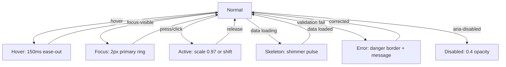

<!--
  SAMAVESH — AI Design System Specification (design.md)
  -----------------------------------------------------
  This file is the single, authoritative specification for the SAMAVESH Design
  System under the Ministry/Department of Social Justice & Empowerment (MoSJE),
  Government of India. It aligns with the UX4G Figma DS and GIGW 3.0 standards.
  
  This documentation is structured to match industry-benchmark design systems 
  (Google Material Design 3, IBM Carbon, Shopify Polaris, Atlassian), providing 
  clear guidelines for foundations, component catalogue, page patterns, modern 
  web APIs, and visual Dos & Don'ts.

  This file is rendered live at /design-system/resources/design-context.
  
  Last reviewed: 2026-09-05 · System version: v0.50.0 (THE FOUNDATION GAPS WERE CLOSED. A
  five-field audit of the live Figma library found the value checksums equal while description,
  codeSyntax, scopes and hiddenFromPublishing had drifted on hundreds of variables; the exporter
  now hides by LIBRARY-name tier (ref/* and all of Palette), Palette carries five explicit colour
  scopes, the weight rows are STRING, an alias-through-alpha no longer flattens, and the parity
  record hashes all five fields — the Plugin API's own HTML-entity encoding of descriptions is
  decoded before comparing. Thirty-two tokens the benchmark systems carry were added with a
  consumer each: neutral state fills and layers, the selected border, the two-tone focus ring,
  control heights, aspect ratios, icon fill, avatar sizes, chip/dialog/tooltip radii and the
  inset elevation. 594 literal font-weights bind the weight tokens. Figma: one focus/ring style
  (per-tone rings and legacy Shadows/* retired after an 83-page scan), eight token-bound grid
  styles, four new Component record frames, the Motion and Effects frames rewritten to the
  shipped vocabulary. Two ratchets: check:breakpoints and check:token-consumers.)

  Last reviewed: 2026-09-04 · System version: v0.49.0 (THE FOUNDATIONS WERE REBUILT TO A
  BENCHMARK SHAPE. Motion is twelve intents on a value-named ten-step ladder with five
  behaviour-named curves, and reduced motion is emitted ONCE at the token layer; layering is a
  fifteen-rung z ladder authored in Tier 2 and code-only (the Bootstrap primitive ladder nothing
  consumed is gone); opacity gained the two intents the DS actually uses (disabled, muted);
  shadows are DTCG composites; every semantic group carries a $type and a description; the
  stroke, z and motion tokens were bound across 60 DS stylesheets (126 edges, 21 layers, 145
  transitions). Documentation: one template — FoundationDocPage — for all 19 foundation pages,
  eight of them new (Brand, Breakpoints, Sizing, Stroke, Layering, Opacity, Interaction States,
  Content & Localisation), every table generated, a gate (check:foundations) with no baseline.
  Figma: every variable carries name, description, narrowest scopes, codeSyntax and
  hiddenFromPublishing per .claude/rules/figma-variables-standard.md.)

  Last reviewed: 2026-09-04 · System version: v0.48.0 (THREE TYPE SCALES WERE IN PRODUCTION —
  the token scale, a static px scale in globals.css and stock Tailwind, invisible to the gate;
  the scale is re-cut, Tailwind is bound to the 21 roles and nothing else, Heading and Text
  are the primitives, nothing renders below 12px, and the deviations from DBIM/UX4G are
  recorded — see the changelog.) v0.41.0 (TYPOGRAPHY WAS THE LAST TOKEN
  FAMILY WITH NO GATE, AND IT COST 562 LITERAL FONT SIZES — 224 of them off the 15-step
  ramp, 13px alone 71 times, plus 100 raw letter-spacings against 10 tracking tokens, a
  second hand-maintained type scale in globals.css, and a component shipping
  `var(--sa-type-body-4-size)`, a token that has never existed and that CSS drops in
  silence. `npm run check:type-linkage` is a per-file ratchet over size, leading
  (including UNITLESS ratios, which no px-grep can see), tracking and family; new debt
  fails the build and debt that shrinks without a re-baseline fails too, so the backlog
  only goes down. It shares one parser with ds-linkage via tools/ds-linkage/regions.mjs
  rather than growing a second copy. Alongside: ds-linkage went from 6 scopes to all 23
  and the estate was cleared 867 → 0, on 693 token bindings and 76 role-named palette
  entries, with each portal's own palette declared under a new `portal-palette`
  exemption and registered as divergence 9. Two precision bugs in ds-linkage itself were
  fixed — it mis-attributed the property of every bare numeric, which had been hiding 96
  real findings including 12 in these docs, and its --json truncated when piped. And
  Figma parity became a MEASUREMENT: all 115 Type variables were read live and diffed
  against the emitted clamps at 360/768/1280px on both surfaces, 438 of 438 name-by-mode
  pairs identical.)

  Last reviewed: 2026-09-04 · System version: v0.47.0 (EVERY TRANSLUCENT TOKEN IS A REFERENCE
  PLUS AN OPACITY REFERENCE. Figma can alias a colour and keep a separate, variable-bound
  opacity, so the 136 rgba() literals — 48 overlay tiers, scrim, inverse rules, inverse button
  states — are now `{base}` + `{alpha.N}`; CSS resolves them as color-mix() over two custom
  properties and they follow every brand island. Navy's scrim had been the Blue neutral and
  every DBIM wash a Blue literal. The opacity scale is ONE thirteen-step ladder, 0 · 4 · 8 · 16 ·
  24 · 32 · 40 · 48 · 64 · 72 · 80 · 88 · 100, bound as `alpha/*`; Figma reads an opacity-bound
  number as a percentage, so `ref/opacity/*` is projected ×100. The Plugin API cannot write an
  alias's opacity or the "Color variable opacity" scope — both are recorded as UI steps.
  Library scopes follow the agreed rule: Tier-1 `ref/*` is offered in no picker, each alias is
  scoped to the property it is for, and the exporter states the scope in the payload.
  Audit §16.)

  Last reviewed: 2026-09-04 · System version: v0.46.0 (THE COLOUR SYSTEM WAS DULL BECAUSE IT
  WAS TWO RUNGS TOO DARK, AND ONE RAMP WAS STARVING ITS OWN TINTS. Every status ink sat at
  rung 700 (7.8–11.7:1, L* 33–44) where peers sit at L* 48–57; India Green anchored at 500
  dragged its whole ladder a rung darker than every sibling, so the success fill under white
  text was 9.1:1 and its rung-100 tint held 17% of the chroma sRGB allows there — a sage grey
  called "success". Every status `bolder` ink was LIGHTER than its `base`. Info was the brand
  blue (dE 0.5). The alert painted its grounds with four hand-mixed percentages and its warning
  glyph with a 1.44:1 badge yellow; the solid warning badge was dark text on a brown, 2.08:1.
  Status inks now sit at 600 and bolder at 700; India Green anchors at 600 and IS the success
  ink and fill; the tint exponent
  is 0.5; danger rotated to hue 24; info is cyan-teal at 220; brand text is rung 600 (it was
  4.07:1 on the page ground); disabled ink is opaque; the resting control border is 4.65:1.
  Pushed to Figma and read back the same day — `reference/figma-live.json` records both halves.
  Audit: docs/audit/2026-09-04-colour-system-audit-and-redesign.md.)

  Last reviewed: 2026-09-03 · System version: v0.45.0 (THE LOGIN FORM WAS A DRAWING OF THE
  DESIGN, NOT AN ASSEMBLY OF IT. `PortalLoginTemplate` imported ZERO components from its own
  design system: 8 raw inputs, 8 raw labels, 6 raw buttons, a raw select and 77
  arbitrary-value Tailwind classes wrapping `var(--sa-*)` — token references no token gate
  can see and no brand mode can re-bind. That is the whole reason the screen drifted from
  the reference. It now renders Alert, Button, FormField, Input, OtpInput, PasswordInput,
  RadioGroup, Select and Tabs, and the arbitrary-value count is 0. `ConsentLine` and
  `AccountPrompt` were exported by the system and rendered by NOTHING — the consent
  sentence GIGW requires existed only in the Figma drawing. `AccountPrompt` also stopped
  drawing a second full-width outlined button under the primary action; a single
  registration route is a link on a rule, as the reference draws it. `BotCheck` replaces
  `CaptchaField`, invisible by default, with a REQUIRED escape route — and deliberately no
  audio mode, reversing this file's own earlier advice: bots solve audio challenges over
  85% of the time while only 31.2% of them get three-person agreement among people.
  `"darpan"` is back in `PortalAuthMode`; the audit that removed it could not have found an
  E-Anudaan DARPAN login because E-Anudaan has no login screen in the handoff at all.)

  Last reviewed: 2026-09-02 · System version: v0.44.0 (TWO LOGIN SWITCHES BELONGED TO
  THE ROLE AND WERE WRITTEN AS THE PORTAL'S. The DigiLocker card was first modelled as a
  fourth `PortalAuthMode`, then as an audience rule ("everyone who is not an officer");
  the Handoff supports neither. It carries the card on SMILE-Transgender's Citizen frames
  and on neither Admin nor Garima Greh, so it is `PortalRoleTab.digilocker`, and it draws
  only when `links.digilockerHref` is also set — a handoff CTA with nowhere to go is worse
  than no CTA. The "or sign in with credentials" divider belongs to the card: no card, no
  divider. The captcha moved the same way, to `role.captcha ?? config.captcha ?? false` —
  the same portal asks a Garima Greh organisation for a security code and asks its citizen
  for none, which a portal-wide boolean cannot express. `??` and not `||`, so a role
  setting `captcha: false` opts OUT of a portal-wide default instead of being read as
  unset. The default stays off: WCAG 2.2 3.3.8 Accessible Authentication (AA) forbids a
  cognitive function test without an alternative. `SSOButton` renders an `<a>` when given
  an `href`, because a handoff to a government identity provider is a navigation and not a
  form control, and takes the provider's mark via `markSrc`; the template stopped
  hand-rolling the card and the divider and now imports both. The DigiLocker mark ships at
  `/design-system/digilocker-mark.png`, and `brandAssets.digilockerLogoSrc` still has no
  default, because every portal mounts under its own `basePath`.)

  Last reviewed: 2026-09-02 · System version: v0.43.0 (THE LOGIN MASTER'S VARIANT AXIS
  CONFLATED TWO UNLIKE THINGS. `Device × Step` put `Credentials` and `OTP` — ways of
  proving identity — on the same axis as `Reset` and `Success`, which are stages of
  credential recovery, so recovery read as a login mode. The master is now
  `Device × Auth Method` (Password · OTP · PIN, six variants), recovery moved to
  `Auth / CredentialRecovery` with its component keys preserved, and `PortalAuthMode`
  gained `"pin"` — NOS is PIN-only and both its handoff screens are `Sign In Pin`, so
  the form has three modes, not two. The captcha stopped rendering unconditionally: it
  is a cognitive function test, WCAG 2.2 3.3.8 Accessible Authentication (AA) forbids
  one without an alternative, and `config.captcha` therefore defaults to OFF in code
  exactly as `Show captcha` does on the Figma card. A PIN now leaves the component as
  `credentials.pin` and never as `credentials.password`.)

  Last reviewed: 2026-09-01 · System version: v0.42.0 (THE SYSTEM EXPORTED NO
  BREADCRUMB, SO EVERY SURFACE THAT NEEDED ONE DREW ITS OWN. `Breadcrumb` is now the
  one trail, and it takes the two jobs that kept being conflated: a PAGE trail whose
  crumbs are links, and a DRILL trail whose crumbs are buttons popping client state
  that has no URL. The website's hand-rolled version stamped `aria-current="page"` on
  every non-linked crumb — on 64 pages a screen-reader user was told twice they were
  on the current page, once about a mega-menu section they were not on — so a crumb
  with neither `href` nor `onSelect` is now a labelled SECTION, and only the last
  crumb is current. The current crumb ellipsises rather than overflowing, because
  PM-AJAY's rail is 304px and "India › Andaman and Nicobar Islands" does not fit it,
  and `wrap={false}` keeps a fixed-width rail on one line so its height does not
  change as the reader drills.)

  Last reviewed: 2026-08-31 · System version: v0.40.0 (A BRUTAL AUDIT OF THE SAMAVESH
  PATTERN FOUND TWO LIVE ACCESSIBILITY FAILURES, ONE OF THEM SELF-INFLICTED. Escape
  left keyboard focus 1,380px off the top of the screen, because the exit animation
  added a release earlier carried the focused toggle away with the band; closing
  while pinned now has a PARKED phase that holds the band still while focus is on
  it. The drawer's footer link measured 4.24:1 on the peach ground — below AA, and
  passing only on hover. Alongside: the panel's three competing brand hues cut to
  two, the heading left-aligned onto the grid's own axis and dropped from 32px to
  22px, every card's mark top-aligned so a row's logos share one line, press
  feedback added and hover gated behind a pointer query, the card's two lines given
  a real size step, the stagger stopped running on exit, and `motion/reveal` +
  `motion/press` added so the pattern binds motion instead of typing it.)

  Last reviewed: 2026-08-31 · System version: v0.39.0 (EVERY ORGANISATION MARK NOW
  RESOLVES THROUGH ONE COMPONENT, AND `PortalCard` FINALLY ENDED THE DUPLICATION IT
  WAS EXTRACTED FOR. The same 16 marks sat in two byte-identical public directories
  while `organisation-details.ts` reached into three roots for them, so a mark
  replaced in one place stayed stale in the others. `OrgLogo` owns every path,
  `check:org-logos` is a per-file ratchet over the 99 literals that remain, and
  design.md had specified this component as "when built" for weeks. `PortalCard`
  grew a `detailed` variant and the `/portals` directory adopted it — it had kept
  drawing its own card with a derived two-letter code where the department has an
  actual crest, and its own labels, so the same portal read "PM / PM-AJAY" there
  and "PM-AJAY / Pradhan Mantri Anusuchit Jaati Abhyuday Yojana" in the banner.
  `PORTAL_LABELS` moved beside the registry so both surfaces answer alike; a
  `selected` state landed for the change-portal side sheet; `planned` and the
  live/onboarding badges went, because the estate lists live portals only. The
  band now pins ONLY while its panel is open — pinning always forced a condense,
  and the condense cost the subline, which is the wrong thing to trade.)

  Last reviewed: 2026-08-30 · System version: v0.38.0 (THE SAMAVESH BAND NOW TRAVELS
  WITH THE MASTHEAD INSTEAD OF DETACHING FROM IT BY UP TO 155px. It pinned to
  `--sa-header-pinned`, which is written ONLY while the masthead is resting because
  `scroll-padding-top` has to clear its taller state — so once the masthead condensed
  the band stayed at 154/212 against a header ending at 65/57, and a strip of page
  content ran between the two: 89px on desktop, 155px on a phone. `SiteHeader` now
  publishes `--sa-header-stuck`, the same edge measured in whichever state it is
  actually in, plus `data-sa-header-condensed` on `:root` so chrome underneath can
  condense with it rather than run a second copy of the scroll thresholds. The band
  pins ALWAYS rather than only while its drawer is open — SAMAVESH is the estate's
  single access mechanism, and a door that exists at one scroll depth is not one —
  and it condenses with the masthead, 80→52 desktop and 86→52 phone, which is what
  makes that affordable. Two further defects surfaced on the way: `measure()` read
  `condensed` from a stale effect closure and wrote the CONDENSED height into
  `--sa-header-pinned`, the one value that must never hold it, leaving an anchor
  155px short of clearing an expanded masthead; and a permanently pinned band owes
  the document its own share of `scroll-padding-top`, or every anchor and skip link
  lands underneath it. Both are WCAG 2.4.11, both invisible without measuring.)

  Last reviewed: 2026-08-30 · System version: v0.37.0 (THE SAMAVESH BAND'S TEXT WAS
  WHITE ON INDIA SAFFRON AT 2.91:1, AND THREE DOCUMENTS SAID IT PASSED AA. It failed
  for the subline and — as large text, which still needs 3:1 — for the title too. The
  saffron did not move; the INK did, to 5.56:1 on the same unchanged ground, so the
  brand paid nothing for it. Figma node 7116:33784 still carries the white version.
  Shipped alongside: NOS stopped 404-ing on every page of the website because portal
  status is now RESOLVED from the registry rather than restated here; the band adopted
  `.sa-container`, which fixed a 16px misalignment and a card running under the
  Important Links rail in one move; the badge went from a 743 KB eager SVG to 13 KB;
  and the drawer's `<h2>` moved out of `<main>`, where it had been sitting above every
  inner page's `<h1>`.)

  Last reviewed: 2026-08-28 · System version: v0.36.0 (THE CATEGORICAL CHART RAMP IS
  COLOUR-BLIND-SAFE FOR THE FIRST TIME, and the old one never was. The twelve slots sat
  at near-constant lightness (L 44-63), so they were told apart by HUE ALONE — the one
  channel a dichromat loses. Measured: it failed at every slot count including three,
  worst pair dE 1.0 under protanopia, which is one colour; it held for only five slots
  before two oranges collided; and cat/3 was byte-identical to chart/trend/up, so slot 3
  WAS the success green. The regenerated set varies lightness as well as hue: slots 1-9
  are guaranteed mutually distinguishable through every dichromacy (worst dE 8.0), zero
  colliding pairs across all twelve, every member 3:1 on both grounds and dE 12 or 25
  degrees clear of every semantic ink. cat/1 (gov-blue) did not move.
  REGENERATING THE RAMP WAS NECESSARY AND NOT SUFFICIENT. Three of four consumers were
  hand-picking slots including 10-12, which carry no guarantee: the PUBLIC NMBA facility
  locator went dE 1.2 -> 1.5 across the regeneration, still one colour, and only reached
  8.0 once it took slots in order. A guarantee about the ramp is not a guarantee about a
  chart. tools/chart-slot-order/check.mjs enforces the boundary — never reach past 9 —
  and deliberately not a no-gaps prefix, because one file can hold several independent
  charts. packages/tokens/test/chart-palette.test.mjs is the new gate on the ramp itself,
  with Machado 2009 dichromacy simulation in build/cvd.mjs. Pushed to Figma and re-read;
  eight of nine collections reproduced their recorded checksums byte-for-byte, so only
  Color moved.)

  Last reviewed: 2026-08-27 · System version: v0.35.0 (START OVER DESTROYS NOTHING,
  AND LEAVES SEND'S COLUMN. The chatbot's reset sat 25px directly below Send, in the
  same 32px column, with the whole of Send's width above it — the most-pressed
  control in the panel stacked on the rarest and the only destructive one. Every
  measurement passed (32px targets against WCAG 2.2 §2.5.8's 24, gaps of 24–36px
  against UX4G's 8), which is why no standards check would have caught it: compliance
  is not the test for frequency-versus-severity adjacency. Both halves shipped
  together because neither works alone — it APPENDS now, ruling the transcript off
  with a `from: "system"` separator and greeting beneath it, and it sits hard LEFT in
  the footer row, 171px from Send at 375px, at zero cost in panel height. A new
  `restartNotice` prop names the rule, because the estate serves Hindi too. Also
  fixed, and older than the change that exposed it: THE LOG NEVER FOLLOWED THE
  CONVERSATION. `scroll-behavior: smooth` plus a bare `scrollTop =` assignment turned
  every follow into an animation that each re-render restarted, so a long transcript
  sat pinned at 540 of 1046 here and 0 of 8102 on main; `scrollTo({ behavior:
  "instant" })` lands it. Previously v0.34.0: (THE MASTHEAD ANSWERS TO THE
  STANDARDS, NOT JUST TO FIGMA. SEARCH NOW OUTLIVES THE NAV: it used to hide at
  900px while the nav row held to 1024, so between 768 and 899 a reader had neither
  a menu nor a search box — the two wayfinding tools collapsing one breakpoint apart
  in the wrong order. Search is the FALLBACK for navigation; it stays inline to
  `tablet` and takes its own full-width row below it [GIGW 5.2]. BREAKPOINTS ARE THE
  TOKEN LADDER: 640, 900, 767 and 1279 are gone; the file mirrors `breakpoint/*`
  (360 · 768 · 1024 · 1280) which the estate already derived from Material 3's
  window size classes. THE NAVSHEET IS A REAL MODAL — `aria-modal="true"`, focus
  trapped, body scroll locked, and focus RESTORED to the trigger, which its own
  docstring had promised for months with no code behind it; it also sits above the
  wall-rail widgets now instead of opening underneath Important Links. ACCOUNTMENU
  IS REBUILT: the DS `Avatar` (circular — everything else square in this masthead is
  an institution), the full APG menu-button keyboard (arrows, Home/End, Escape
  restores focus, Tab closes) where `role="menu"` had previously promised all of it
  and implemented none, a caret that turns over on open, truncation with `title`,
  and a person glyph instead of "?" when there is no name. CO-BRANDING is capped at
  two [DBIM 5.4] and its marks are LINKS [DBIM 5.6] — `BrandMark.href` had been in
  the type and never rendered, so Digital India sat inert in every public masthead.
  Plus `scroll-padding-top` so the sticky header stops covering anchors and focus
  [WCAG 2.4.11], reduced-motion, print styles, hover-intent delays, and an
  institution glyph where an organisation has no emblem. Previously v0.33.0: (THE
  MASTHEAD IS THE HEIGHT IT
  WAS DESIGNED TO BE. The brand row stood at 124px against Figma's 100 because the
  lockup's four rows carried a 2px gap and the masthead search was 417px wide instead
  of 320 — which left the department line 361px, so it wrapped. Both fixed; the row is
  100 at rest, exactly as drawn.

  THE 88px "ON SCROLL" STATE IS RETIRED (27 August 2026). It shrank the brand row by
  dropping the ministry line: 146px to 134px on the live portal. Twelve pixels — 8% of
  the header, 1.7% of a 720px viewport — for a class, a listener, a media-query set and
  a Figma variant. `collapseOnScroll` now swaps the three tiers for ONE `.ds-hdr-cond`
  bar: 200 to 65 on desktop, 258 to 57 on a phone. The emblem holds the same left edge
  in both states, because it is also the go-home control and identity that crosses the
  screen on scroll reads as a different site; the department NAME is what is given up.
  `sticky` defaults ON for every variant now, not just portals — the public masthead
  used to scroll away entirely, leaving no navigation, no search and no identity for
  the length of a scheme page. The accessibility bar still does not collapse; the
  header pins at `top: calc(-1 * var(--sa-hdr-abar-h))` so the bar scrolls away and the
  brand and nav rows stay. THE MEGA-MENU COLUMN HAIRLINES ARE GONE: Figma's Col
  frames carry no strokes, they were added in code alone, and design won. The panel is
  now centred on the nav row rather than on the item that opened it, because a 1272px
  panel anchored to the third of seven items ran 256px off-screen. NAVSHEET KEEPS ITS
  COLUMNS — Figma's State=Mega nests the real MegaMenu, and the code was flattening
  five headed columns of emblems and full names into a list of bare abbreviations.
  THREE NEW FIGMA MASTERS close the other direction: Navbar/AccountMenu and
  Navbar/AccountMenuItem (the account dropdown shipped in code with nothing in the
  library), and Navbar/Compact (the third `variant`, which had no master — which is
  how its burger stayed a bare 40px icon after every other trigger became a 48px
  outlined IconButton). BrandLockup gained Size=Default|Compact plus Show org and
  Show ministry, mirroring the optional `BrandLines` fields. Nav items, dropdown rows
  and mega rows all take `disabled` now — Figma has shipped a State=Disabled variant
  for each of them all along. Previously v0.32.0: (NO HAND-ROLLED MASTHEAD OR
  ACCESSIBILITY BAR EXISTS ANYWHERE — `npm run check:chrome` fails the build on one.
  Twelve sites were converted, including a second accessibility bar INSIDE the design
  system and an invented abstract mark where the National Emblem belongs. Code Connect
  now covers the whole navbar family (10 templates, 12 recorded fixtures). Previously
  v0.31.0: (EVERY NAVBAR PART IS AN EXPORT —
  MenuToggle, SheetToggle, NavItemLink, NavDropdown, DropdownItem, MegaMenu, MegaMenuItem
  and the new NavSheet, which had no code counterpart at all. TWO TRIGGERS, DELIBERATELY:
  MenuToggle drives a persistent sidebar and mirrors its state; SheetToggle opens an
  overlay and has ONE glyph, because the sheet closes itself. Both are IconButton 48
  Outlined — a bare 40px glyph was the only control in the brand row with no container.
  The masthead search is the shared <Search>, not a button dressed as one.) Previously
  v0.30.0: (THE NAVBAR IS ONE COMPONENT FOR ALL
  THREE PLACEMENTS — website, portal and the new `compact` (hub index) variant; the hub's
  bespoke gate chrome is deleted. ALWAYS PASS `homeHref`: it defaulted to the hub root, so
  the emblem on every website page navigated out of the website. Every header glyph is now
  `<Icon>` (Material Symbols Rounded, wght 300) — the hand-rolled SVGs had drifted, and the
  sidebar toggle now swaps `menu_open`/`menu` off `navExpanded`.) Previously v0.29.0: THE ASSISTANT IS CALLED SAMAJIK
  SAHAYAK — सामाजिक सहायक — which is the name written on the seal it wears and the name
  of the live assistant on dosje.gov.in. The Figma mock's "Noddy" shipped briefly and was
  wrong three ways: it contradicted the badge, it contradicted the live service, and it is
  a British children's character. Previously v0.28.0: CHATBOT, the assistant
  surface, is in the system. Two rules travel with it and are easy to get wrong: its panel is
  NON-MODAL and must never trap focus, which is the opposite of `Modal`; and `placement="fixed"`
  marks itself `data-sa-wall-occupant` so the demo dock's rail measures around it. It carries
  two recorded divergences from its Figma mock — the mock's `#ff0004` fails AA at 4.00:1, and
  its `#EFE8FF` is not a SAMAVESH colour. Previously v0.27.0: THE RADIUS LADDER IS VALUE-NAMED TOO —
  `shape/md` is now `shape/8`, so both ladders read the same way and the rung IS the pixel value.
  `shape/full` deliberately keeps its name: it is a sentinel meaning fully rounded, not a
  measurement, and it is the only non-numeric rung the gate permits. NEVER type a `shape/*` rung
  on a component that has a role token — `cmp/card/radius`, `cmp/button/radius` and
  `control/radius` are the Tier-3 layer, and all three were found aliasing a HIDDEN Tier-1
  primitive. CARDS ARE 12px, not 8. Radius is 97.90% bound with every defect class at zero, and
  `check:radius-linkage` freezes it there — any new raw radius on any page fails the build. A new
  `stroke/*` ladder finally gives border width a semantic name; do not reach for
  `control/border/width` unless the border belongs to an interactive control. See §G.
  Previously v0.26.0: THE SPACING LADDER IS VALUE-NAMED — the
  rung IS the pixel value, `padding/16` is 16px and so is `inline/16`, `stack/16` and `section/16`.
  The t-shirt labels collided across families — `l` meant 16, 24, 20 and 56 — a defect inherited
  from UX4G 3.0. Every family now carries the same ladder, so no measurement is unexpressible, and
  a new step can be inserted without renaming anything. 38,799 spacing properties that were bound
  to a RADIUS variable are now zero; correct semantic spacing is 69.12%, up from 6.96%. See §G.
  NOTE — this narrative skips v0.21.0, v0.22.0, v0.24.0 and v0.25.0 (PortalLoginTemplate, the auth
  parts, the retirement of the invented `darpan` / `aadhaar` auth modes, the Tabs overflow menu and
  the font sizer). All are in the changelog at /design-system/resources/changelog, which is the
  complete record; this header carries only the releases whose rules an agent must hold in mind
  while writing UI.
  Previously v0.24.0: THE OVERFLOW ROW IS POLISHED, AND THE EDGE FADE IS SCOPED TO
  `track="none"` — an enclosed track paints its own border, fill and radius from the scrolling
  element, so a mask dissolved the container rather than the tabs.
  Previously v0.23.0: TABS MATCHES THE REBUILT FIGMA MASTERS.
  `<Tabs>` gains `indicator` (underline | rail | pill), `size` (s | m | l -> 36 / 44 / 48),
  `track` (none | enclosed) and `orientation`; `TabDef` gains `icon`, `badge` and `disabled`.
  INDICATOR AND TRACK PAIR — enclosed takes pill, none takes underline (horizontal) or rail
  (vertical); the other four combinations read as broken. A DISABLED TAB STAYS IN THE TABLIST,
  marked `aria-disabled` and skipped by the arrow keys — never the native `disabled` attribute,
  which would drop it out of the accessibility tree. Four tokens land with it —
  `text|icon/brand/primary/bolder` (the brand key colour fails AA on a tinted surface) and
  `layout/tab/{indicator,track}` — and `focus/ring` DROPS ITS 48% ALPHA in Blue and Navy, having
  composited to 1.16:1 on a selected pill.
  Previously v0.20.0 — ACCESSIBILITYBAR IS NOW A CODE COMPONENT AND
  SITEHEADER IS MIGRATED ONTO IT. `@mosje/design-system` exports `AccessibilityBar` — the UX4G/GIGW
  top utility bar with a working A−/A/A+ font-size stepper — mirroring the SAMAVESH Figma master,
  fully `--sa-*` tokenised, AA-clear. SiteHeader's own hand-rolled Tier-1 bar is DELETED and the
  shared component replaces it. SUPERSEDED BY v0.25.0 — the masthead now passes `fontSize`
  (ON). What follows described the v0.20.0 state: the masthead passed
  `fontSize={false}` — explicitly, because the prop DEFAULTS TO TRUE — so the UX4G widget remained
  the single mechanism for text size and contrast. `tone` is gone: colour is the brand MODE
  (`data-brand="navy"`), never a prop.
  Previously v0.19.0 — THE CONTENT CONTAINER IS UX4G'S TWO-STEP
  1200/1320 AND `.sa-container` IS THE ONLY WAY TO APPLY IT. Four widths shipped at once and the
  masthead sat 20px wider each side than the page beneath it; `SiteHeader.maxWidth` is now an
  override, not a default. New: `container/contentXl`, `ref/breakpoint/desktopXl`.
  Previously v0.18.2 — ICON IS NOW DECORATIVE BY DEFAULT — it
  sets aria-hidden itself unless given an aria-label, which then makes it role="img". The rule
  was documented but unenforced and was missed at 533 of 718 call sites; the component now
  decides instead of the caller. Do not add aria-hidden to decorative icons. Previously
  v0.18.0: FILLED PRIMARY MOVED TO THE bolder RUNG.
  A filled primary button now paints bg/brand/primary/bolder (#005EB9) instead of the ink of the
  same family (#0373DF), taking white-on-primary from 4.64:1 to 6.36:1 and Navy from 8.77:1 to
  12.61:1. 36 solid fills across the estate plus the DS Button, whose single --_color was split
  into --_fill and --_color so outlined and text appearances keep the ink. THE LADDER ALREADY
  SAID THIS: bg rungs sit one step deeper than the ink of the same family precisely because a
  fill carries white text and an ink sits on the page. The Button was reaching past its own
  system — and a slot migration the same day had briefly put a TEXT token in charge of its fill,
  which is what surfaced it. Success and danger were NOT moved: their bg bolder rungs are
  different values, so that is a separate decision. SS B and SS C were also rewritten onto
  canonical names — they still spelled tokens in the --ds-* vocabulary retired earlier that day.
  PREVIOUS ENTRY: COLOUR SECTIONS SS A/B/C/6 RECONCILED
  AGAINST THE BUILT STYLESHEET. Every colour value and every contrast ratio in this file was
  recomputed from packages/tokens/dist/tokens.css and corrected: the §C pairs table was wrong in
  eight of nine rows after the 2026-08-11 ramp rebuild, §B carried a Dark column for an axis
  removed on 2026-08-10, §A named DBIM Blue #162F6A as Navy's key colour when Navy is #003366
  at rung 600, and §6 listed --ds-danger-strong, which has never been an emitted token. The
  rung-shortfall ledger is SIXTEEN, not nineteen. The lesson is the one this file already states
  about itself and did not obey: a hand-maintained value table is a second source of truth, and
  it rots silently while every gate stays green — no test reads prose. PREVIOUS ENTRY:
  THE SHADOWS WERE TINTED TOWARD A COLOUR
  THE SYSTEM NO LONGER HAD. The ramp's own description claims it keeps "the SAMAVESH convention
  of tinting toward ink rather than UX4G's flat black", and it did not: five rungs plus the
  modal scrim carried `rgba(31, 36, 40)`, hand-written from a neutral/800 that the ramp rebuild
  moved to #1e2124. Derived from neutral/800 now — geometry stays authored, only the ink is
  generated, so it cannot drift again. Nobody could see it, which is precisely why deriving
  beat correcting: composited over white the two inks differ by dE 0.14-0.54, under the ~1.0
  just-noticeable threshold at every alpha this ramp uses. A wrong value you can see gets fixed
  the first time somebody looks; a wrong value you cannot see survives every review.
  A REAL BUG THIS SURFACED, shipped in v0.16.0: `text/disabled` fell back to the blue-grey in
  all six DBIM modes while `text/default` resolved to Deep Earthy Brown — enabled text brown,
  disabled text blue-grey, in modes whose entire claim is conformance. The DBIM preprocessor
  synthesises those modes by remapping token REFERENCES, so an rgba() literal was invisible to
  it and the hand-written override was deleted on the way past. `text/disabled` and the scrim
  now carry real brand ids and follow the ink everywhere.
  SHADOWS STAY BRAND-INVARIANT, structurally rather than by taste. Blue and Navy composite to
  dE 0.00 — identical — so the shipping brands gain nothing; DBIM differs by up to 1.63 at
  `xl`, marginally over threshold. Against that: a shadow is COMPOSITE and `elevation/*` inlines
  its resolved value rather than aliasing it, so a per-brand override repaints `--ds-shadow-*`
  and leaves `--sa-elevation-*` behind. Two names for one shadow disagreeing by brand is worse
  than a uniform sub-threshold difference. Revisit if `elevation/*` ever aliases.
  ONE ASSUMPTION CORRECTED IN TWO PLACES: the Figma exporter's `brandOwner` and the round-trip
  gate's axis check both read "has any colorModes" as "varies by brand". Figma's Palette models
  exactly one brand axis, [Blue, Navy], so a token whose only overrides are the code-only
  `dbim-*` modes has nothing brand-varying to say there — and giving the scrim DBIM inks
  promoted it out of single-mode Color into Palette as a new variable whose two modes were
  identical. Both now key on `navy` specifically.)

  **Every control in the condensed bar is 40px** (2026-09-05): the sidebar toggle, the sheet trigger, the search button, the account avatar (`AccountMenu avatarSize={40}`) and whatever the consumer passes as `actions` — the slot holds links and buttons at 40, so pass `Button size="default"`. The home link is a 40×40 target around the 20px emblem, emblem on the left edge; it was the bare 20×32 glyph, under WCAG 2.5.8.

  System version: v0.16.1 (THE CHART PALETTE NOW SAYS WHICH OF ITS
  VALUES ARE COPIES AND WHICH ARE CHOICES, per group, because the difference was not guessable
  and the copies had rotted. `chart/div/*` — the diverging scale for signed data — was seven
  hardcoded hexes, two of them copies of `danger/100` and `neutral/200` taken before those ramps
  were rebuilt and a positive end still on retired Material green. It REFERENCES the danger,
  neutral and success ramps now, exactly as `chart/trend/*` always has: negative here means what
  error means everywhere else, so a scale keeping its own red is a chart claiming bad news is a
  different kind of bad news. In Figma the same seven stopped being unlinked literals and became
  aliases onto the Palette collection.
  RUNGS CHOSEN FOR SYMMETRY, measured: a diverging scale whose wings differ in lightness encodes
  one sign as louder than the other, and the old set was 15.8 L* asymmetric across its three
  matched pairs. The new set is 2.1. `div/neg` does not move — #ec5042 turned out to be exactly
  `danger/400`, the anchor the copy was taken from.
  `cat/*` AND `seq/*` STAY LITERAL ON PURPOSE and now carry that argument in their own
  descriptions, because the next reader will otherwise "fix" them. A categorical palette is
  tuned as a SET and a reference lets one member drift out of that tuning on a brand swap; a
  sequential ramp needs even perceptual steps, which is a different constraint from
  primaryScale's contrast rungs.
  TWO CATEGORICAL SERIES WERE RETIRED BRAND COLOURS and both were replaced by measurement, not
  tidiness. cat/3 was Material green sitting dE 3.2 from cat/9 — two "distinguishable" series a
  reader cannot separate — and is India Green, 9.0 apart. cat/2 was the retired saffron at
  2.80:1 against the page, under WCAG 1.4.11's 3:1 and the only one of the twelve below it; it
  is `secondaryScale/500` at 3.79:1, so the whole set clears 3:1 for the first time. Bright
  India Saffron was tried and rejected at 2.91:1, and rung 600 rejected at dE 3.3 from cat/6 —
  a contrast fix that would have bought a collision.)

  System version: v0.16.0 (DBIM CONFORMANCE IS NOW SOMETHING YOU
  CAN SEE. All six of DBIM's published primary groups — Blue, Burgundy, Purple, Green, Chrome
  Yellow, Cinnamon Red — are selectable in the DemoDock's Colour tab, under their own heading,
  tagged DEMO ONLY. They are CODE-ONLY and never reach the Figma library: the exporter's
  Palette modes are a hardcoded [Blue, Navy] pair, so a DBIM brand is unreachable from it by
  construction rather than by discipline.
  FULL CONFORMANCE, not a repainted primary ramp. Selecting a group also swaps all four status
  colours to DBIM's own (Liberty Green #198754, Mustard Yellow #FFC107, Coral Red #DC3545, DBIM
  Blue #0D6EFD), replaces the brand-tinted greys with DBIM's PURE ones, and moves body text to
  Deep Earthy Brown #150202 — which is not a neutral step at all. A mode changing only the
  primary ramp would be a much weaker claim, so the UI states which one is being made.
  WHAT THE PREVIEW FOUND, which is the point of building it: DBIM's own palette does not always
  meet DBIM's own rule 4 ("colour usage must ensure accessibility"). `dbim-green`'s shade 2
  (#2D8686) lands on the filled rung at 4.32:1, BELOW AA. On Cinnamon Red the brand primary is
  2 degrees and dE 0.9 from the error status — indistinguishable. On Chrome Yellow the primary
  is 10 degrees from the warning status. All three are recorded with their measurements in
  `test/hue-separation.test.mjs` and `docs/design-system/colour-system.md` rather than
  corrected: a conformance palette that has been quietly fixed demonstrates nothing.
  THE SHAPE RULE DOES NOT APPLY to these six, and that is a deliberate, recorded exemption.
  Reproducing DBIM's exact hexes and holding a 4-16 L* ladder are mutually exclusive — a search
  over every assignment of five published shades to eleven rungs found no configuration
  satisfying both for five of the six groups. A transcription is exempt; the accessibility
  gates still bind.)

  System version: v0.15.3 (CODE AND FIGMA NOW AGREE ON EVERY
  VALUE, in all eight collections. The last difference was `ref/font/weight/*`, and it was
  fixed in the EXPORTER, not the library: it projected CSS numbers (400/500/600/700) where
  Figma holds STRING font-STYLE names (Regular/Medium/SemiBold/Bold), because Figma has no
  numeric weight — a text style selects a cut by `fontName.style`. The library was already
  right; the payload was the wrong side, and it could not have been fixed by pushing because a
  variable’s resolvedType is fixed at creation. Nothing renders differently: CSS still emits
  400/500/600/700.)

  System version: v0.15.2 (DESIGN-CONTEXT COVERAGE IS 100% — the
  three components the new gate recorded as debt are documented, and the baseline is empty.
  `BrandLockup` (always the National Emblem; a plain `<a>`/`` on purpose, which is what
  makes it server-safe inside a `basePath`-ed zone — do not "upgrade" it to `next/image`),
  `AccountMenu` (`items` decides what it IS: empty renders the static Figma block, non-empty an
  accessible dropdown; initials stand in for a missing avatar), and `Legend` (`aria-hidden` BY
  DESIGN — `ChartFrame`'s screen-reader table carries the values, so a series explained only by
  its legend label is invisible to a screen reader). Documenting them made the ratchet fail on
  its own baseline, which is the half of it worth having: coverage that improves forces the
  backlog to shrink with it.)

  System version: v0.15.1 (CODE AND FIGMA NOW AGREE ON VALUES, not
  just names. The library was holding 80 wrong values under the correct names — 13 component
  tokens bound to the wrong palette rung (one set stale since v0.13.0), a reverted webfont, and
  54 fluid-type variables carrying the previous tablet curve. Every existing check compared
  NAMES, so none of it was visible. All pushed, and `figma-value-parity.test.mjs` now fails the
  build when a value moves without the library record being refreshed. Seven of eight collections
  are byte-identical to the payload; the eighth differs only in `ref/font/weight/*`, which is
  CORRECT — Figma binds text styles by font-STYLE name ("Bold"), CSS needs the number (700), and
  a variable's resolvedType cannot change after creation.)

  System version: v0.15.0 (EVERY RAMP NOW OBEYS ONE RULE, and the
  system has ZERO WCAG AA shortfalls in every brand. The 2026-08-11 rebuild reached only the
  brand ramps; `dangerScale`, `warningScale`, `infoScale` and `neutralScale` still carried the
  shape the audit had measured — `danger/400` and `danger/500` 1.8 L* apart, `warning/500`
  darker AND duller than 400, and a neutral whose hue wandered 22 degrees. All four are now
  generated from anchors in `build/brand-ramps.mjs` like the rest, so all eight ramps step
  4-16 L* apart, monotonic, hue held within ~6 degrees, chroma on a single arc.
  ON THE TWO AA GAPS: `status-error-bolder` (4.40:1) and `status-warning-bolder` (4.46:1) were
  the last two failures in the estate, and both closed the same way — by anchoring a ramp at
  the rung its LIGHTNESS says rather than at 500 by convention. #ec5042 is L* 64 and #e09c1d
  is L* 76; forced to 500 they push the `bolder` rung into the dead zone (roughly L* 59-66)
  where a fill is too dark for dark ink and too light for white and NEITHER reaches 4.5:1.
  At 400 and 300 the same rungs measure 6.68:1 and 5.68:1. `KNOWN_BELOW_AA` is now empty.
  ON THE GREYS: they were always tinted — the defect was that the tint was never CHOSEN. Hue
  is now locked to the brand's own primary for the whole ramp (255 in blue, 264 in navy) with
  chroma on one arc peaking ~0.016 in the mid-tones and reaching zero at both ends, so `0` and
  `1000` stay exactly white and black. The ladder was also re-cut: it used to put four steps
  inside its lightest 7.7 L* and then cross the middle in two jumps of 15+, which is why there
  was exactly ONE grey between a light surface and a mid grey. Expect visibly different
  borders and subtle surfaces — `--ds-border` moves from #f1f3f5 to #dcdee1.
  DESTRUCTIVE BUTTONS lost their step override and now use the same 600/700/800 progression as
  every other intent; the override existed only because danger/600 could not carry white text.)

  System version: v0.14.3 (UX4G WIDGET DOCS RESTORED — the
  accessibility widget's entry documented the v3.28 upgrade and was then lost when this
  file's version chain was rewritten, so the code shipped (#34, #35, #37) while its
  authoritative context did not. The component section now records what carries a
  decision: the pin to `accessibility-v3.28` and the two upstream defects that made the
  old workarounds necessary — reintroducing settings seeding is how every page ended up
  at 110% zoom; `analytics` defaulting to OFF, because the widget beacons the full URL of
  every page view and a portal URL can carry beneficiary identifiers; the macOS `⌘⌥A`
  shortcut, since v3.28's hardcoded `Ctrl+F2` is a reserved macOS system shortcut that
  never fires; and the brand skin being PINNED to v3.28, re-checked on any upgrade.)

  System version: v0.14.2 (The six `Focus States/*` effect styles
  had NO description; they now have one each, so effect-style coverage is 18/18 to match the
  variables' 909/909. Unlike the `Shadows/*` these needed no correction — every one already
  BINDS its colour to `color/transparent/<family>/48`, so they follow the brand and cannot rot
  into literals. One thing to know before "fixing" it: each is a single flush 4px spread while
  the build renders a 2px ring held 2px off the control (`--sa-focus-width` / `--sa-focus-offset`
  are both 2px). Same 4px footprint, no transparent gap — a drop shadow cannot leave one without
  painting the backdrop, so this is a limitation, not drift.)

  System version: v0.14.1 (ELEVATION IS IN FIGMA, as effect
  STYLES — a shadow is composite and Figma variables hold only COLOR/FLOAT/STRING/BOOLEAN, so
  it could never be a variable. `elevation/{flat,card,raised,dropdown,modal,toast}` are
  generated from `shadow.*` exactly. CORRECTION to v0.14.0, which said designers had no shadow
  tokens: six `Shadows/shadow-*` effect styles already existed, unknown to the code — and NOT
  ONE matches the token source (all use flat #212121 vs the tokens' tinted rgb(31,36,40), and
  `shadow-s`/`shadow-md` also differ in geometry). They are deliberately NOT corrected — a
  published library whose consumers cannot be enumerated — but each now names the `elevation/*`
  that supersedes it. Effect styles are invisible to the payload, the checksums and the
  round-trip test, so `elevation-parity.test.mjs` is what keeps them honest.)

  System version: v0.14.0 (THE LAYOUT GRID NOW EXISTS, and the
  tap-target floor is a LADDER rather than a number. `grid/columns` (12) + `grid/gutter` (24px)
  are UX4G 3.0/Bootstrap exactly, because we hold a parity contract with the Government of
  India's own system; `grid/margin/{mobile,tablet,desktop}` (16/24/32px) is responsive rather
  than Bootstrap's flat 12px, which is too thin for a government page (Carbon 32, GOV.UK 30).
  UX4G ships its grid as CSS classes — which is why none of it ever reached Figma; ours are
  tokens, on Carbon's model, so a designer can bind a Figma layout grid.
  ON TAP TARGETS: 44px is WCAG 2.5.5, which is **AAA** — NOT the AA floor it is usually quoted
  as. The AA floor is WCAG 2.2 SC 2.5.8 at 24x24 CSS px with a spacing exception, and GIGW 3.0
  binds this estate to WCAG 2.1 AA + IS 17802, which contains NO target-size criterion at all.
  So `target/min` 24 (AA), `target/comfortable` 44 (AAA + Apple 44pt), `target/spacious` 48
  (Material 48dp) and `target/spacing` 8 each name their authority — all deliberate choices
  ABOVE the mandate. Still absent by necessity: shadow/elevation cannot be a Figma variable
  (composite value) and needs effect STYLES.)

  System version: v0.13.2 (DEV MODE NOW TELLS THE TRUTH.
  A re-audit of the Figma library looked past variable NAMES — which were already correct —
  at the metadata Figma actually shows people, and found 61 variables publishing a codeSyntax
  naming a CSS custom property that does not exist (the prominence ladder was renamed and
  codeSyntax was never re-pushed), plus 487 carrying none at all. All 863 code-owned variables
  now carry the exporter's own emitted name. Also fixed: 18 accent variables scoped to
  ALL_SCOPES so they appeared in every picker, and 12 blank or stale descriptions — coverage
  is now 900/900 and gated. KNOWN GAPS, not yet built: there are no layout/grid tokens at all
  (columns, gutter, margin); shadow/elevation exists in CSS but CANNOT be a Figma variable and
  needs effect styles; there are only 3 breakpoints; and nothing names the 44px touch-target
  floor. See the audit section in the changelog.)

  System version: v0.13.1 (v0.13.0 IS NOW LIVE IN FIGMA —
  36 variables created, 899 total across 8 collections, and set equality with the build
  payload is PROVEN per collection by checksum rather than inferred from counts. The six
  accent foregrounds were chosen BY MEASUREMENT, not by rung name: accent flips to white
  ink at `bolder` and its `bold` rung sits at 4.60:1, so inheriting primary's flip point
  would have shipped an unreadable pairing. The `on/*` coverage gate no longer asserts a
  floor — it derives the expected set from the fills, which is what a count could never do.
  NOTHING WAS DELETED: the neutral endpoints were renumbered by a two-step RENAME CHAIN
  with ids preserved, so no binding moved. An earlier note here called that a hard delete;
  it was inferred from a missing NAME, which cannot distinguish a rename from a deletion —
  only an id lookup can. See $incidents in packages/tokens/reference/figma-live.json.)

  System version: v0.13.0 (THE COLOUR LAYER WAS REBUILT.
  Audit finding C-02 is closed: in the Navy brand, bg/brand/secondary/bold and
  bg/status/success/bold measured 1.00:1 apart — a secondary-action chip and a saved-state
  chip were the same object. Secondary and accent are now brand-INVARIANT and only PRIMARY
  changes with data-brand. The two SAMAVESH logo colours are first-class ramps (India Saffron
  #FF671F, India Green #046A38), success is unified onto that same green, and Navy's key
  colour is the DBIM #162F6A that the DBIM audit fails the estate on twice.
  [CORRECTION, 2026-08-12: Navy's key colour in the shipped build is #003366, at rung 600.
  #162F6A is DBIM Blue, which reaches the estate only as a code-only conformance preview and
  is never in the Figma library. Verified against dist/tokens.css.] Ramps are now
  GENERATED from anchors by one rule (build/ramp.mjs) rather than hand-picked — the Navy ramp
  used to fall 27.4 L* in one step and crush four rungs into fifteen points. Every chromatic
  ramp gained step 950 for UX4G parity (11 steps) and the neutral endpoints renumbered so pure
  white is 0 and pure black is 1000. `gov-` was dropped from every colour name across 330 call
  sites. A hue-separation gate now makes the C-02 class of defect unshippable.)

  System version: v1.11.8 (DEMODOCK PLACEMENT: the FAB moves from
  bottom-left to bottom-right, docked directly above the UX4G accessibility widget's own trigger —
  one coordinated utility rail instead of two FABs in unrelated corners at different sizes/offsets.
  The gap above the widget is measured live off its real geometry (never hardcoded), so an upstream
  resize can't silently reopen an overlap. The per-registry-entry boolean that used to raise the FAB
  above `PortalLoginShell`'s "Signing Into" strip on NMBA's login routes (making the FAB visibly
  relocate between routes) is removed outright rather than automated further — moving off
  bottom-left eliminates that collision at the source, so every route now gets the identical FAB
  position with nothing to opt into and nothing to forget.) v1.11.7 (COLOUR TAB MOTIF TILES: the Colour tab's
  swatch-plus-live-preview layout is replaced by a wrapping grid of fixed-size (~72×48px) motif
  tiles — a miniature header bar/surface/accent/button abstraction per mode, each rendered in that
  mode's own palette via a nested `data-brand` island on the tile itself (no hardcoded hex; see the
  "Brand islands" note). The live `Button`/`Badge`/`Alert` preview block is deleted — the tiles
  themselves are the preview, and give the tab a fixed height regardless of mode count instead of
  one that grows with a live-component block. Selected state keeps the tick plus a visible ring
  (still non-colour-only, WCAG 1.4.1); touch targets stay ≥44px (AAA). v1.11.6 (DEMODOCK REDESIGN: the footer disclaimer
  row ("Demo tooling — not part of the product") is gone — the dock is unambiguous demo chrome by
  context, and the row was pure noise. The Colour tab's body min-height no longer collapses when a
  short tab replaces a long one, so switching tabs doesn't visibly resize the panel. Colour is now a
  plain row of brand-palette swatches driven directly by `useColorMode()` — no label, no pill track
  — and `ColorModeSwitcher` is **removed from the design system entirely** (deleted from
  `foundations/`, the barrel, and Storybook); an app that still wants a standalone brand-mode
  control builds one from `useColorMode()` the same way DemoDock's Colour tab now does. Sign in only
  renders on an actual login route (`isLoginRoute`: path ends in `/login`, `/login-otp` or
  `/sign-in`) rather than anywhere under a portal with a demo account set, and when it renders it is
  the first tab and the one selected on open. Open/close and swatch selection are animated
  (CSS-only, token durations/easings, `prefers-reduced-motion` respected). v1.11.5 (DEMO TOOLING
  CONSOLIDATED: `AppSwitcher`
  removed — it hand-rolled a duplicate of `ColorModeSwitcher` and was mounted as mandatory
  per-portal navigation. Replaced by `DemoDock`, one floating console mounted exactly once by the
  hub root layout, tabbed Apps/Colour/Sign in, gated estate-wide by `NEXT_PUBLIC_DEMO_TOOLS`
  (default ON). `AppSwitcherPanel` and `DemoAccountsPanel` extracted as reusable panel content;
  `DemoFab` kept, now sharing `DemoAccountsPanel` with `DemoDock` instead of its own table. Demo
  credentials moved from per-page consts into a pathname-keyed registry, `DEMO_ACCOUNTS` in
  `packages/design-system/demo/demo-accounts.ts` — now the source of truth over
  `.claude/rules/portal-login-demos.md`'s table. `AppEntry.group` gained `"Reports"`. v1.11.4
  (APPEARANCE AXIS REMOVED: `data-theme`
  (light/dark/hc) no longer exists. Figma's Theme collection is single-mode and `tokens.css` emits
  no `[data-theme]` block. The UX4G accessibility widget is the estate's single canonical dark and
  high-contrast mechanism — it applies its own `.dark-mode` class and never read `data-theme`, so
  this was a second parallel mechanism nothing consumed. Verified no-op: zero value drift in every
  surviving selector context. Removed three dead switches (gate header, docs header, playground),
  the Storybook theme picker, two theme modules, the no-flash script and the orphaned CSS; corrected
  Storybook's pre-rename brand labels to Blue/Navy. Also normalised 33 Figma alphas stored as 8-bit
  n/255 values rather than clean percentages (max shift 0.16pp). v1.11.3: (FIGMA SYNC, second pass: the library now
  matches the code on Spacing (49), Theme (374), Border Radius, Motion and Density, and on all 117
  Color names the exporter emits. Created 61 missing variables (Spacing 15->49, Typography 79->106);
  renamed 28 in place so ids and bindings survived; retired 8 unused Color leftovers (149->141).
  TWO DELIBERATE NON-GAPS: the 24 extra Color names are Figma-native primitives designers bind to
  directly and the exporter withholds them on purpose; the 5 type/*-weight variables are absent
  because Figma models font weight as a STRING style name while the code uses a numeric FLOAT, and
  Figma rejects an alias across types. Also fixed a silent catch-all in the exporter that filed 13
  px-valued numbers under font-family/. The library needs republishing for any of this to reach
  consumers. v1.11.2: (FIGMA SYNC: the SAMAVESH library had four
  variable names living in BOTH the Color and Theme collections, left over from an earlier
  hand-migration. All 504 live bindings were rebound onto the Theme copies and the Color leftovers
  removed; Color 153 -> 149. `Focus/Ring` stays in both on purpose — it is a brand-source companion
  the appearance layer consumes. Two leftovers were also MISLABELLED: Color's
  Background/Brand/Primary/Subtle held ramp step 50, which the prominence ladder calls `base`, and
  Strong held Source rather than 600. The Theme copies already matched the ladder, so retiring the
  leftovers brings Figma and dist/tokens.css into token-for-token agreement and raises white-on-brand
  contrast from 4.64:1 to 6.30:1 (Blue) and 12.61:1 to 14.22:1 (Navy). The Figma library needs
  republishing for consumers to pick this up. v1.11.1: (TOKEN GRAMMAR: `default` now means
  exactly one thing — a state. It previously occupied three slot dictionaries at once
  (prominence, state, link variant), so the parser bound it greedily and text/link/visited/default
  parsed as a prominence, losing the state it spelled. The prominence canonical is now `base`
  (`--sa-bg-neutral-base`) and the link variant is now `brand` (`--sa-text-link-brand-default`).
  NOTHING RENDERS DIFFERENTLY — a rename, not a redesign: all 27 moved names resolve
  byte-identically in all 7 selector contexts, pinned by test/visual-contract.test.mjs, and the
  `--ds-*` names app code uses are unchanged. `--ux4g-*` names are unchanged too and sit OUTSIDE
  the contrast contract by construction: an alias preserves UX4G's VALUE, not our rung. Two slot
  ambiguities remain, pinned by test/slot-disjointness.test.mjs — see spec §5.1c/§8.1a.
  v1.11.0: The estate is off lucide-react and off
  shadcn/Radix entirely. Every icon is Material Symbols Rounded via <Icon> — 668 call sites
  across 239 files — and SidebarNavItem.icon is now a Material Symbols NAME STRING, not a
  component, so nav configs stay serialisable. NEW components: Tooltip (WCAG 1.4.13 —
  dismissible, hoverable, persistent; portalled at z-index 90 so Card/DataTable overflow can't
  clip it); Skeleton/SkeletonText/SkeletonRow; Label (standalone, for controls outside
  FormField); LiveRegion + useLiveRegion; SectionTitle. Input gains leftIcon/rightIcon — a bare
  Input still renders with no wrapper. FIXED: CardTitle painted at 32px because it referenced
  the Headline-1 alias while its own fallback claimed 20px; it is now bound to the canonical
  --ds-type-title-1-size. Icon accepts a style prop. NOTE the legacy --ds-text-title-* aliases
  are still mis-mapped to headline-2 — use the canonical --ds-type-<role>-size tokens.
  v1.10.0: SlaProgressIndicator — Right to
  Service Act time-remaining, three variants, seven states including a neutral PAUSED clock and
  MISSED as distinct from BREACHED; pure logic in utils/sla.ts. v1.9.0: (Type is now sized in REM, not px: a
  reader who raises their browser's default font size without zooming now gets larger text —
  a px scale ignored them. Renders identically at the 16px default, proven by test. NEW
  components: PasswordInput (reveal toggle — use for every password field in the estate;
  real type="button" so it cannot submit, action-named label, browser's own reveal
  suppressed); AadhaarInput / OtpInput / PanInput (UX4G 3.0 identity controls) + pure
  validators in utils/india-id.ts; Aadhaar is Verhoeff-checked and masked to its last four
  digits by default per DPDP Act 2023 / UIDAI. FIXED: the dark theme shipped a primary button
  whose white label sat at 3.77:1 — below AA — since the ramp step was chosen for the link
  role, not the fill; the contrast gate now sweeps every colour mode AND theme, not just
  :root, and covers the hover state. v1.8.0: UX4G 3.0 adopted as the foundation.
  New: the opt-in `--ux4g-*` parity layer (`@mosje/design-system/ux4g.css`, all 755 UX4G tokens
  resolved onto SAMAVESH — structure at UX4G's exact values, colour role-mapped to the MoSJE
  palette) plus `ux4g-light`/`ux4g-dark` colour modes carrying UX4G's literal palette. Core
  additions: UX4G's four semantic spacing role families (`--ds-inline/stack/padding/section-*`)
  — prefer these over the raw t-shirt scale; `--ds-spacing-10xl/11xl`; a 6-level shadow ramp
  (adds `none`/`sm`/`md`); `--ds-font-display` (Noto Sans Display, 36px+). FIXED: the
  `[data-surface="portal"]` block did not re-assert the `--ds-text-*`/`--ds-leading-*` aliases,
  so every natively-mounted portal rendered the WEBSITE type scale (display headings to 80px
  instead of 56px) — alias re-assertion is now targeted per block, which also cut tokens.css
  from 92 KB to 60 KB. v1.7.3: The field stack reaches parity with the UX4G 3.0 Figma library and past it. All EIGHT states (adds success, warning, read-only), a four-step size scale (40/44/48/56 — UX4G's 32px S is not offered, because 44 is the AAA target size), prefix/suffix affixes, contextual help, a pending state, and a grapheme-counting CharacterCount. FIXED: the focus ring was rgba(3,115,223,0.48) — 2.01:1 flattened on white, failing SC 1.4.11 — and a box-shadow, invisible in forced-colours; it is now a solid 3px outline at 2px offset, 4.64:1. FIXED: `md` and `lg` both rendered at 50px because padding, not min-height, decided the height. FIXED: a server-rendered error was announced on load. FIXED: `.ds-sr-only` was undefined in date-picker.css, combobox.css and chip.css, so their visually-hidden text was visible. Label 14→16px and hint/message 12→14px, taking the larger where UX4G's two sources disagree. Every string is overridable through `FieldPolicyProvider`; `autoComplete` is typed to the autofill field names. v1.7.2: Text-entry controls take a hard 16px floor below 768px: iOS Safari zooms any focused control under 16px and does not zoom back out, and the fluid ramp put body-1 at ~14px on a phone. Desktop density unchanged. v1.7.1: `SideSheet` gains `side="left"` for navigation drawers, so portal shells can collapse a fixed sidebar into a drawer on small screens instead of squeezing the page. `DeclarationCheckbox` attestation row now meets the 44px touch floor. v1.7.0: Adds three components for field reporting with sign-off: `GeoPhotoInput` (EXIF/device geo-tagging + auto-downscale), `DeclarationCheckbox` (statutory certification panel), `ApprovalTimeline` (multi-tier approval audit trail). No token values changed. v1.6.2: Theming: `[data-color-mode="…"]` blocks now re-declare the `--ds-*` aliases, exactly as `[data-theme="…"]` blocks already did, so colour-mode "islands" repaint a nested subtree instead of only flipping `--sa-*` primitives. Fixed in the generator `packages/tokens/build/formats/legacy-ds-css.mjs`; surfaced when portals mounted natively in the hub and `data-brand` moved off `<html>` onto a wrapper. No token values changed. v1.6.1: Icon loading: icons.css now declares an inline @font-face (pinned gstatic woff2) instead of an @import, so the documented `import "@mosje/design-system/icons.css"` finally loads the font under Next/Turbopack — no per-app <link> hack. Typography: hyphenated Portal-DS role names — display-1…label-3; added -para (paragraph-spacing) + -tracking (letter-spacing) fluid props so code ↔ SAMAVESH Figma are at full parity. v1.6.0: two-surface fluid type via data-surface=website|portal, 21 role tokens as clamp(min@360px, fluid, max@1280px). v1.5.0: Figma→code colour sync, mode-aware Blue-Light/Blue-Dark, danger-strong #B8382F)
-->

# SAMAVESH Design System — Specification & AI Design Context

**SAMAVESH** (समावेश, "inclusion / bringing together") is the unified visual and interaction language for the **Ministry / Department of Social Justice & Empowerment (MoSJE/DoSJE), Government of India**. It serves as the single source of truth across 13 informational websites and 20+ workflow portals.

Any developer or AI agent building UI for any MoSJE application must read this document first and implement interfaces adhering strictly to the tokens, states, and guidelines specified below.

---

## Quick Start

```tsx
// 1. Import design system tokens once in your app root
import "@mosje/design-system/tokens.css";

// 2. Import components from the barrel
import {
  Button, FormField, Input, Card,
  SiteHeader, SidebarNav, Alert, Modal
} from "@mosje/design-system";

// 3. Use semantic tokens in custom CSS — never hardcoded hex values
const style = { background: "var(--ds-primary)", color: "var(--ds-on-primary)" };
```

| App type | Entry point | Token import |
|----------|-------------|--------------|
| Website (`apps/dosje`) | `src/app/globals.css` | `@import "@mosje/design-system/tokens.css"` |
| Portals (`apps/portals/*`) | `src/app/globals.css` | Same — Tailwind v4 everywhere |
| Design System docs | Loaded in `globals.css` | Already included |

> **New to SAMAVESH?** Start with the [Component Catalogue](#7-component-catalogue) → pick what you need → check the [Token Reference](#6-token-vocabulary-reference---ds-) for the exact tokens to use.

---

## 1. System Foundations

### A. Color Architecture & Theming Axes

SAMAVESH operates on three independent theme axes applied via HTML attributes on the root (`<html>`) element. Custom tokens respond automatically at runtime.

| Axis | Attribute | Values | Meaning |
| :--- | :--- | :--- | :--- |
| **Brand** | `data-brand` | `blue` (default), `navy` | Two peer brand palettes, BOTH on light surfaces. Renamed from `blue-light`/`blue-dark` on 2026-08-07: those read as appearance themes, which they never were. **Since 2026-08-11 a brand swap changes the PRIMARY ramp and the neutral greys, and nothing else** — `blue` anchors `#0373DF` at rung 500, `navy` anchors `#003366` at rung **600** (the rung its lightness says, not the rung convention expects). Verified against the built stylesheet on 2026-08-12: `primaryScale` differs in 11 of 11 rungs, `neutralScale` in 10 of 13, and every other ramp is byte-identical across the two brands. The neutral re-lock is a systemic guarantee that the grey follows the brand's hue, **not a visible change** — at 8-bit precision the two brands' greys differ by ≤1 per channel at most rungs, so do not describe them to a stakeholder as "warm" versus "cool". `#162F6A` is **not** navy: it is DBIM Blue, which exists only as a code-only conformance preview. **Secondary (India Saffron `#FF671F`) and accent (India Green `#046A38`) are brand-INVARIANT**: both are SAMAVESH logo colours, so they are constants of the identity rather than variants of it. Navy used to swap secondary to green, which landed it 1.00:1 from the success colour — see the changelog for audit C-02. |
| ~~Appearance~~ | ~~`data-theme`~~ | **REMOVED 2026-08-10** | Dark and high-contrast are owned entirely by the UX4G accessibility widget, which applies its own `.dark-mode` class to `<html>` and never read `data-theme`. This axis was a second, parallel mechanism nothing consumed. The token source still carries the overrides (unemitted) so it can be revived deliberately — see `docs/superpowers/records/2026-08-10-figma-theme-dark-hc-removed.md`. |
| **Density** | `data-density` | `comfortable` (default/unset), `compact` | Controls padding, heights, and spatial density. |
| **Surface** | `data-surface` | `website` (default/unset), `portal` | Selects the **typography scale**. `website` = the expressive editorial ramp (display-1 ≈ 80px); `portal` = the dense functional ramp (display-1 ≈ 56px). Same role token names in both; only the `--ds-type-*` values differ. Set `data-surface="portal"` on portal `<html>` roots; the website/hub stay default. Maps 1:1 to the SAMAVESH Figma `Website` / `Portal` type modes. |

> **Surface is a type axis only.** `data-surface` swaps the fluid type scale (`--ds-type-*`), nothing else — colour comes from `data-brand`. All type is fluid `clamp()` between a 360px-viewport min and a 1280px max, so the two surfaces each scale smoothly; there are no type media-query breakpoints.

> **Brand is the only colour axis.** `data-brand` (blue/navy) swaps the brand palette; `navy` is NOT a dark UI theme — it keeps light surfaces and simply uses navy/green/cool-grey. There is no appearance axis: dark and high-contrast belong to the UX4G accessibility widget, the estate's single canonical mechanism for both.

> **Two more colour modes ship opt-in: `ux4g` and `ux4gdeep`.** They carry UX4G 3.0's
> own palette (violet `#6a4eff` / `#4a2bc2`) *literally*, so UX4G conformance can be
> demonstrated by flipping one attribute instead of argued about. They live in
> `@mosje/design-system/ux4g.css` (opt-in — the default bundle does not grow) and are
> exported from `color-mode.ts` as `UX4G_COLOR_MODES`, deliberately **not** merged into
> `COLOR_MODES`: offering a mode in an app that has not loaded that stylesheet would show a
> switch that does nothing. Opt in explicitly:
> `<ColorModeSwitcher modes={[...COLOR_MODES, ...UX4G_COLOR_MODES]} />`.
> The MoSJE default stays the primary blue `#0373DF`, as DBIM requires.

> **Tip:** Nested brand "islands" (e.g. a navy portal shell inside the blue hub) must be explicitly scoped with a nested `[data-brand]` element. To prevent a flash on initial render, initialize the attribute with the exported `colorModeInitScript()`.

> **Brand islands.** You can put `data-brand` on any element, not just `<html>`, and the subtree re-themes, because the generated `tokens.css` re-declares the `--ds-*` aliases inside every `[data-brand="…"]` block (each also carrying the deprecated `[data-color-mode="…"]` selector, so existing markup keeps working). A custom property substitutes `var()` at the element where it is **declared**, so a block that only flipped the `--sa-*` primitives would leave `--ds-primary` resolved at whatever `:root` computed and the island would not repaint. Anything changing this lives in `packages/tokens/build/formats/legacy-ds-css.mjs`, never in the generated CSS.

### B. Colour Usage Contract

Use semantic tokens — never reference primitive `--sa-color-*` values directly in components. Primitives are referenced only within `tokens.css`.

**There is no Light/Dark column, because there is no appearance axis.** `data-theme` was removed on
2026-08-10; dark and high-contrast belong entirely to the UX4G accessibility widget. The only axis
that changes a colour is `data-brand`, so the two value columns below are Blue and Navy.

| Token | Blue | Navy | Correct usage | Never use for |
|-------|------|------|---------------|---------------|
| `--sa-bg-brand-primary-bolder` | `#005EB9` | `#003366` | **Solid primary fills** — filled buttons, active nav, brand banners | Text or borders on a light page; the ink slot below is measured for that |
| `--sa-text-brand-primary-base` | `#005EB9` | `#003366` | Brand-coloured text, links, outlined-button ink | Solid fills behind white text — that is the `bg` slot's job. Since 2026-09-04 this is rung 600, because #0373DF measured 4.07:1 on the page ground; the key colour stays on `icon/brand/primary/base` and the fills |
| `--sa-color-brand-saffron` | `#FF671F` | same | Accents, badges, decorative emphasis | Text, icons or chart series on white — **2.91:1**, below even the 3:1 non-text floor |
| `--sa-color-brand-yellow` | `#FFD323` | same | Nothing, in new work. Retained for older markup | Text at any size (**1.44:1**). For yellow emphasis use `bg/status/warning/subtler` behind dark ink |
| `--sa-text-neutral-base` | `#1E2124` | `#1E2024` | All body/heading text | Interactive elements, backgrounds |
| `--sa-text-neutral-subtle` | `#3A3D41` | `#3B3D41` | Captions, hints, helper text | — comfortably AA at 10.92:1; the old "check below 16px" caveat no longer applies |
| `--sa-bg-neutral-base` | `#FFFFFF` | same | Page and card backgrounds | Text or icon fills |
| `--sa-bg-neutral-subtler` | `#EEF0F3` | `#EFF0F2` | Inputs, code blocks, quiet panels | Anything needing a measured contrast — it is a surface, not a fill with a guarantee |
| `--sa-text-status-error-base` | `#AA2D30` | same | Error text and icons on white, destructive labels — rung 600, 6.72:1 | Decorative fills (use `bg/status/error/subtler`) |
| `--sa-text-status-success-base` | `#046A38` | same | Success states, validation confirmation — rung 600, which is India Green itself, 6.72:1 | Primary brand actions |
| `--sa-on-bg-brand-primary-bolder` | `#FFFFFF` | same | Text/icons on a solid primary fill | Any other background |

> **Ink and fill are different tokens even when they resolve to the same rung.** Since 2026-09-04
> `text/brand/primary/base` and `bg/brand/primary/bolder` are both `primaryScale/600`: the fill
> needs 4.5:1 under white text, the ink needs 4.5:1 on the muted page ground, and rung 600 is the
> first rung that pays both (6.36:1 and 5.57:1). The key colour `#0373DF` remains the ICON and
> the identity, not body text — it measured 4.07:1 on the ground every page carries. Reaching for
> the ink token to paint a button is still the mistake the split exists to prevent.
>
> **Status roles read the same ladder in every family.** `text|icon|border/status/*/base` is rung
> 600 (5.7–6.7:1 on white) and `bolder` is rung 700 (7.8–9.3:1). Until 2026-09-04 base was 700
> and bolder was 600 — the louder name was the lighter colour. Amber is the one family whose SOLID
> chip takes the `bold` rung (300, `#E09C1D`) with its measured dark ink (6.9:1) instead of
> `bolder` under white: warningScale/600 is a brown, and USWDS treats amber the same way.

*Every value above was read from `packages/tokens/dist/tokens.css` on 2026-09-04. The previous
table pre-dated the 2026-08-11 ramp rebuild and was wrong on `--ds-saffron`, `--ds-ink`,
`--ds-ink-muted`, `--ds-danger` and `--ds-success`, and carried a Dark column for an axis that had
already been removed.*

### C. Contrast Pairs (WCAG 2.2 AA — minimum 4.5:1 for text, 3:1 for UI elements)

| Foreground | Background | Ratio | Status | Usage context |
|-----------|-----------|-------|--------|---------------|
| `on/bg/brand/primary/bolder` (`#fff`) | `bg/brand/primary/bolder` (`#005EB9`) | **6.36:1** | ✅ Pass | **Filled primary buttons, active nav.** In Navy the same pair is 12.61:1 |
| `text/neutral/base` (`#1E2124`) | `bg/neutral/base` (`#fff`) | **16.18:1** | ✅ Pass | All body text |
| `text/neutral/subtle` (`#3A3D41`) | `bg/neutral/base` (`#fff`) | **10.92:1** | ✅ Pass | Hint text, captions — at any size |
| `text/neutral/subtle` (`#3A3D41`) | `bg/neutral/subtler` (`#EEF0F3`) | **9.56:1** | ✅ Pass | Safe on quiet panels too |
| `text/status/error/base` (`#8B1F18`) | `bg/neutral/base` (`#fff`) | **9.10:1** | ✅ Pass | Error text and icons on white |
| `text/brand/primary/base` (`#0373DF`) | `bg/neutral/base` (`#fff`) | **4.64:1** | ✅ Pass | Link text, outlined-button ink. Clears the floor by 0.14 — do not put white on it |
| `color/brand/saffron` (`#FF671F`) | `bg/neutral/base` (`#fff`) | **2.91:1** | ❌ Fail (even non-text) | Decorative fills only. Below the 3:1 of WCAG 1.4.11 |
| `color/brand/yellow` (`#FFD323`) | `bg/neutral/base` (`#fff`) | **1.44:1** | ❌ Fail | Never a text colour, at any size |
| `text/status/success/base` (`#004220`) | `bg/neutral/base` (`#fff`) | **11.67:1** | ✅ Pass | Confirmation text and icons |
| `border/neutral/subtle` (`#DCDEE1`) | `bg/neutral/base` (`#fff`) | **1.35:1** | ⚠️ Decorative | A hairline divider only. For a control boundary use `border/neutral/bolder/default` |

> **Critical rule — a fill is not an ink.** Paint a solid primary surface with
> `bg/brand/primary/bolder` and put `on/bg/brand/primary/bolder` on it; that pairing was measured
> and clears AA by 1.86. `text/brand/primary/base` is the *ink* of the same family — correct for a
> link or an outlined button on the page, and 0.14 above the floor there, but white text on it
> would be the marginal pairing this ladder exists to avoid.
>
> *Changed 2026-08-12 (v0.18.1):* success and danger filled buttons followed primary onto their
> `bg` bolder rungs — `#00542B` and `#AA2F25`. For these two the move **lowers** contrast (11.67:1
> → 9.12:1 and 9.10:1 → 6.68:1) where primary's raised it; both stay far clear of the floor, and the
> trade is consistency rather than accessibility. A fill comes from the `bg` slot in every family,
> or the rule is not a rule. The filled Button also stopped hardcoding primary's ink for every
> variant — each now declares the foreground measured for its own fill.
>
> *Changed 2026-08-12 (v0.18.0):* filled primary buttons moved from `#0373DF` to `#005EB9` across the estate
> (36 solid fills plus the DS Button), taking white-on-primary from 4.64:1 to 6.36:1 and Navy from
> 8.77:1 to 12.61:1. The DS Button's single `--_color` was split into `--_fill` and `--_color`, so
> outlined and text appearances keep the ink. Gradients and `color-mix` washes deliberately keep
> the lighter value. Success and danger were NOT moved: their `bg` bolder rungs are different
> values, so that is a separate decision.

> **The table above is hand-maintained; it is not the authority.** Every `--sa-*` colour token
> carries a contrast class that is **measured at build time** against its own surface, across every
> brand, and published in `dist/figma.variables.json` (`contrast.measured` / `contrast.shortfall`)
> and in each Figma variable's description. `test/prominence-contract.test.mjs` fails the build if
> any published class is not true. Read those numbers, not these, when the two disagree — and fix
> this table when they do.
>
> **A rung name is not a guarantee.** **Sixteen** tokens currently measure below the class their
> prominence rung implies — fourteen `bg/*` tonal chips plus `border/neutral/subtle` and
> `border/neutral/bolder/default`, where the fill ladder's ≥3:1 is the wrong requirement rather than
> the colour being wrong. They are listed in the ledger at the foot of
> `test/prominence-contract.test.mjs`, published in `dist/figma.variables.json`
> (`contrast.shortfall`), and stated plainly in their own Figma description. Choose a token by its
> measured number, never by how loud its name sounds. *(Was nineteen before the 2026-08-11 ramp
> rebuild; corrected 2026-08-12.)*

### D. Typography

- **Typeface**: Noto Sans — non-negotiable across all English interfaces (`--sa-font-latin`).
  Devanagari/Hindi is Noto Sans's own Devanagari subset (`--sa-font-devanagari`), applied by
  `lang="hi"`. The 40–80px Display roles use the optical **Noto Sans Display** cut
  (`--sa-font-display`), Latin only — a Hindi display heading falls through to Noto Sans.
- **Which faces are loaded** (`apps/hub` root layout): Noto Sans Latin 400/500/600/700
  (preloaded), Noto Sans Devanagari 400/500/600/700 (**not** preloaded — lazy through
  `unicode-range`, so an English page never downloads it; it was 99 KB on every page until
  2026-09-04), Noto Sans Display 500 Latin. No monospace webfont: `--sa-font-mono` is a
  system stack for code and token names in the docs only.
- **The two primitives.** `<Heading level={1..6} variant?>` and `<Text as? variant?>` are the
  only way a page asks for type. A Heading's level is the outline and is required; its role
  defaults from the level (h1 → headline-1 … h6 → headline-6) and `variant` departs from it
  (a hero at `display-3`, a card h3 at `title-1`). A Text is a body, label or title role;
  `measure` caps it at the measure token, `flow` spaces consecutive paragraphs with the role's
  paragraph-spacing token, `numeric` sets tabular figures, `lang="hi"` switches face and leading.
  `SectionTitle` (headline-4) composes them for a section heading with an eyebrow, count and
  actions. In Tailwind the same roles are `text-<role>` (size + leading + tracking + weight in
  one class; display roles add `font-display`), `tracking-caps`, `max-w-measure`.
- **There is no other typography.** `globals.css` clears Tailwind's stock `text-xs…6xl`,
  `leading-*`, `tracking-*` and the thin/light/extrabold/black weights, so they produce no
  CSS; `npm run check:type-linkage` reports every raw size, leading, tracking, family, a
  stock or static utility, a weight outside 400–700, and a file that writes Devanagari
  without `lang="hi"`. Nothing renders below 12px. A size the 21-role scale cannot express is
  a DESIGN question — the answer is a neighbouring role, never a 22nd size.
- **Weights.** Display 500 (on the Display cut), Headline 600, Title 600, Body 400, Label 500.
  700 is inline emphasis and KPI numerals only. 800 and 900 do not exist — they were
  browser-synthesised bold against a font that loads 400–700.
- **Case and tracking.** Uppercase is the `label-3` role only (12px, +0.06em
  `--sa-type-caps-tracking`), for 1–3-word overlines. Display roles carry negative tracking
  from one em rule per rung (−0.015em at display-1/2, −0.01em at 3/4, −0.005em at 5) on
  both surfaces; every other tier is zero.
- **Numbers are NOT a job for monospace.** `font-variant-numeric: tabular-nums` (Text's
  `numeric`) aligns a column of figures in the same face as the text beside them.
- **Line length**: the measure token `--sa-container-measure` (36rem ≈ 68 characters, in
  rem so a raised default font size keeps the character count). `.ds-prose`, `Text measure`
  and `max-w-measure` all bind it; nothing is wider.
- **Fluid type**: every role is `clamp(min@360px, fluid, max@1280px)` in rem. Two surfaces
  (`data-surface`): **Website** (expressive) and **Portal** (dense) differ ONLY in the Display
  and Headline tiers; Title, Body and Label are identical on both, so a card, a form and a
  table read the same wherever they sit.
- **Text wrapping**: `h1`–`h3` balance and `p`, `li`, `dd`, `figcaption` are `pretty`, from one
  `@layer base` rule in the hub and inside the primitives.
- **Standards**: DBIM §4, GIGW 5.2 and UX4G §2 are followed except where
  `docs/audit/typography-deviation-register.md` records why not (headline sizes one step
  above DBIM's ladder, display leading below 1.2, no 18px body). `packages/tokens/test/
  type-scale.test.mjs` asserts the floor, the ramp, the 4px grid, the leading band, the
  monotonic ratio, and the loaded weights on every build.

### E. Type Scale Reference

**21 responsive roles** in five tiers — `display-1…6`, `headline-1…6`, `title-1…3`,
`body-1…3`, `label-1…3` — each with four fluid properties: `--sa-type-<role>-size`,
`-lh` (line-height), `-para` (paragraph-spacing), `-tracking` (letter-spacing; grouped for
the non-display tiers as `--sa-type-{heading,title,body,label}-tracking`, plus
`--sa-type-caps-tracking`). Re-cut 2026-09-04: every size on the 16-step ramp
12·14·16·18·20·22·24·28·32·36·40·48·56·64·72·80, every line height on the 4px grid, leading
ratios rising as size falls (display 1.10 → 1.20, headline 1.20 → 1.50, body 1.50), and the
13px and 15px stops the old Portal ramp carried are gone. Source of truth:
`packages/tokens/src/primitive.json` (`font.role.*`, `font.tracking.*`); the generated
`typography-data.ts` feeds the docs page, and Figma's six Type modes (Website/Portal ×
Desktop/Tablet/Mobile) sample the same clamp() at 1280/768/360px, rounded to whole pixels.

| Role | Website max / min | Portal max / min | Leading (web) | Weight | Use |
|---|:--:|:--:|:--:|:--:|---|
| display-1 | 80 / 40 | 56 / 40 | 88 (1.10) | 500 | Hero only |
| display-3 | 64 / 32 | 40 / 28 | 72 (1.13) | 500 | Campaign hero |
| display-6 | 40 / 22 | 24 / 20 | 48 (1.20) | 500 | Small hero |
| headline-1 | 40 / 28 | 32 / 24 | 48 (1.20) | 600 | The page h1 |
| headline-2 | 32 / 24 | 28 / 20 | 40 (1.25) | 600 | Section h2 |
| headline-3 | 28 / 22 | 24 / 18 | 36 (1.29) | 600 | Sub-section |
| headline-4 | 24 / 20 | 20 / 16 | 32 (1.33) | 600 | `SectionTitle` |
| headline-5 | 20 / 18 | 18 / 16 | 28 (1.40) | 600 | Minor heading |
| headline-6 | 16 | 16 | 24 (1.50) | 600 | Smallest heading |
| title-1 | 22 / 18 | same | 28 (1.27) | 600 | Card, panel, dialog title |
| title-2 | 16 | same | 24 (1.50) | 600 | List-item title |
| title-3 | 14 | same | 20 (1.43) | 600 | Dense table header |
| body-1 | 16 | same | 24 (1.50) | 400 | Running text |
| body-2 | 14 | same | 20 (1.43) | 400 | Secondary, table cells |
| body-3 | 12 | same | 16 (1.33) | 400 | Captions, timestamps |
| label-1 | 14 | same | 20 (1.43) | 500 | Form labels, buttons |
| label-2 | 12 | same | 16 (1.33) | 500 | Badges, chips |
| label-3 | 12 | same | 16 (1.33) | 500 caps | Overlines, +0.06em |

> **Every role carries its reasoning.** The size leaf's `$description` in `primitive.json` says why the
> value is what it is (the ratio, the standard, the measurement) and the same text is each `type/*`
> Figma variable's description and the docs page's "Why these values" section. The Figma library holds
> exactly the 104 Type variables the code defines: the ten `deprecated/type/*` shadows and the retired
> `ref/font/family/heading|body` were deleted on 2026-09-04 after a full-file consumer scan and a
> rebinding pass, together with 28 colour, space and border orphans.
>
> **Rule: in code use `<Heading>` / `<Text>` or `text-<role>`; in a stylesheet bind
> `--sa-type-<role>-size` AND `-lh` in the same rule.** The retired `--ds-*` alias layer
> (removed 2026-08-12) is gone from code; its hazard record lives in
> `docs/rules-rationale/CLAUDE-md-full-2026-08-20.md`.

### F. Bilingual (English + Hindi) Usage

- Wrap inline Hindi text: `<span lang="hi">समावेश</span>` — always set the `lang` attribute.
- Apply Devanagari font: `font-family: var(--sa-font-devanagari)` on the `lang="hi"` element.
- **Leading is per role, never a flat ratio.** Every role carries `--sa-type-<role>-lhDevanagari`
  (Figma `type/<tier>/<n>/lhDevanagari`): the Latin leading plus a fifth of the size, rounded
  UP to the 4px grid, derived by the token build from `ref/font/lineHeight/devanagariOffset`
  (0.2). Body-1 is 16/24 Latin and 16/28 Hindi; headline-1 40/48 and 40/56; display-1 80/88 and
  80/104. `<Text lang="hi">` and `<Heading lang="hi">` take it for you; an INLINE Hindi run keeps
  the surrounding line's leading. `--sa-leading-devanagari` is body-1's, for a block with no
  role. The unitless 1.7 this replaced (2026-09-04) applied to every role, so a 40px Hindi
  headline sat at 68px, and Figma read it as 1.7px — it could never be bound.
- **Never use italic on Devanagari** — the script has no italic tradition; slanting degrades legibility.
- Page `lang` attribute must be `lang="en"` with `lang="hi"` on individual Hindi strings (not the reverse).
- Hindi text with no explicit size set will inherit from the English scale — this is intentional.

### G. Spacing & Elevation

**Spacing is VALUE-NAMED. The rung IS the pixel value: `padding/16` is 16px, and so are
`inline/16`, `stack/16` and `section/16`.** There is no lookup table and no T-shirt label.

```
0  2  4  6  8  12  16  20  24  32  40  48  56  64  72  80        + padding 120 · 360
```

Every family carries that ladder, so **no measurement is unexpressible**. `section` starts at
24 (page rhythm has no use for 2px) and `padding` keeps 120/360 for UX4G parity.

| Family | Use for |
|--------|---------|
| `--sa-inline-<px>` | Horizontal gaps between items **on the same line** |
| `--sa-stack-<px>` | Vertical gaps between **stacked** blocks, and vertical rhythm |
| `--sa-padding-<px>` | **Inner** padding of components and containers |
| `--sa-section-<px>` | Gaps between **page sections** |

```css
/* Prefer */  gap: var(--sa-stack-16);      /* 16px between stacked blocks */
/* Never  */  gap: var(--sa-ref-space-16);  /* Tier 1 — hidden, and banned by tier-discipline.test.mjs */
```

#### Why it is numbered, and why that is not a downgrade

Until 2026-08-18 the rungs were T-shirt labels, **and the same label carried a different value
in each family** — `l` was 16 in `inline`, 24 in `stack`, 20 in `padding` and 56 in `section`.
Seven of eleven labels collided; the inverse was as bad, with 24px answering to four names.
That is inherited verbatim from **UX4G 3.0**, whose published contract has `--ux4g-inline-l`=16
beside `--ux4g-stack-l`=24. `standards-precedence.md` puts UX4G at authority tier 4: where a
standard forces a worse interface, quality wins and the divergence is recorded. This is that.

Note UX4G's own *primitive* ramp is numeric (`space-1…16`) and only goes T-shirt at the semantic
layer — which is exactly where it fails. Numbering here is **more** consistent with UX4G, not less.
**UX4G conformance is untouched**: the `--ux4g-*` layer is emitted independently and never reads
these names, so `ux4g-parity.test.mjs` asserts the same contract as before.

The second reason is expandability. A T-shirt ramp has no slot between adjacent rungs, so every
insertion renames everything above it — that happened **twice in one day** before the change
(`inline` gained 24; `padding` needed a 6 it could not have). A numeric ladder absorbs any step
for free, which is how 6px arrived with no rename at all.

#### The one rule that keeps a value-name honest

> **Mode-varying spacing belongs in `density/*`, never in the ladder.**

A value-name lies the moment a mode changes the value. The Space collection has ONE mode and
density variance already lives in `density/*` with its own two modes. If a spacing value must
differ by mode, it is a density token, not a ladder rung. `space-linkage.test.mjs` asserts a
rung's name equals its resolved value, so a violation fails the build rather than shipping.

**Responsive Layout Grid — `<Grid>` / `<GridItem>`:**
- **Twelve columns at every breakpoint**, `24px` gutter (`grid/columns`, `grid/gutter`).
  A child spans *more* of them on a small screen rather than the track count changing —
  UX4G's model, and Bootstrap's. There is deliberately **no 4-column mobile grid**;
  the earlier claim of one contradicted `grid/columns`, which has always been 12.
- Side margin is responsive (`grid/margin/*`): 16 mobile · 24 tablet · 32 desktop.

**Content container — never hardcode a max-width.** Use the `.sa-container` class from
`@mosje/design-system/layout.css`, which carries the cap *and* the responsive side margin.
The estate uses a **three-step container**: `--sa-container-content` **1200px**, widening to
`--sa-container-contentXl` **1320px** at `--sa-ref-breakpoint-desktopXl` (**1440px**), then to
`--sa-container-contentWide` **1440px** at `--sa-ref-breakpoint-desktopWide` (1920px).

The **margin** ladder is deliberately out of step with the cap: 16px, 24px from 768, and 32px
only from 1920. It follows the CAP, not the viewport anchors — a wider margin buys breathing
room only while the container is still fluid, and once the cap binds it costs content instead.
Stepping it at the desktop anchor did exactly that: content went 1152 -> 1136 crossing 1280.
Holding 24px through Desktop XL is also what makes content there exactly **1272px**, the width
the Handoff frame draws at 1440. Effective content is
`min(cap, viewport) - 2 x margin`, and it only ever grows: **1152 -> 1272 -> 1376**.

UX4G publishes two widths (1200 / 1320) and no breakpoints, which left the estate on a single
widen at 1768px. That was measurably wrong in both directions: a 1728-wide viewport carried
264px of margin each side against 1768's own 224px — margins *narrowing* as the screen grew —
and one widen could not serve 1600 through 2560+, so a 2560 monitor rendered a 1320 column
between 620px margins. The third step and the corrected anchors follow Material 3's window size
classes. The 1320 anchor moved 1768 -> 1600 -> **1440** over 2026-08-24, each step decided by
measuring the page rather than citing a ladder: 1600 left the weakest point of the ladder sitting
on 1536, the most common desktop width. Recorded in `docs/guidelines/README.md`.
`--sa-container-page` is the derived variable that selects between them; bind that when a
media query is unavailable (an inline style, for instance — it is how `SiteHeader` caps its
own column).

**Two layouts, one margin ladder (2026-09-05).** The website is **contained**: every row of every
section sits in `.sa-container`, which is the three-step cap and the margin ladder together. Portals
are **fluid**: no cap at all, only the margin ladder, so a portal's masthead, page header and content
run edge to edge with `--sa-grid-margin-page` on each side — 16, 24 from 768, 32 from 1920. Figma
draws both on a 1440 frame: `Navbar/Website` caps each row at `container/page` (1320 there) and
`Navbar/Portal` lets each row fill, and both bind their side padding to `grid/margin/page` with the
variant pinned to its Viewport mode. In code the same split is `SiteHeader variant="website"` (cap
and margin) against `variant="portal"` (margin only), and `Container size="full"` is the fluid column
for anything else on a portal. **A new component asks which surface it is on and binds accordingly**:
`.sa-container` on the website, `--sa-grid-margin-page` on a portal — never a `padding/*` rung that
happens to equal the margin. The masthead and the accessibility bar carried exactly that: a literal
16 / 24 / 32 per breakpoint that agreed with the ladder at three widths and disagreed with it at 1920.

> A container is a **cap**, not a width. `grid/margin/*` (16 mobile / 24 tablet / 32 desktop)
> is a **floor** that wins on narrower viewports, so the effective column is
> `min(container, viewport − 2 × margin)`.

**Page-skeleton tokens (`--sa-layout-*`).** Only genuinely fixed measurements:

| Token | Value | Applies to |
| --- | --- | --- |
| `layout/bar/height` | 46 | accessibility bar — fixed |
| `layout/flag/width` | 33 | flag mark in the bar — fixed |
| `layout/masthead/minHeight` | 72 | brand row — **minimum only, it hugs** |
| `layout/chrome/minHeight` | 118 | sticky offsets and scroll anchors **only** |
| `layout/sidebar/width` | 300 | portal sidebar — fixed |

**Fixed, hug, or fill — decide this before sizing anything.**

| Region | Sizing |
| --- | --- |
| Accessibility bar · sidebar width · sidebar item | **Fixed** — a token sets it |
| Brand row · website nav row · page header · card, panel, band | **Hug** — content sets it; a minimum is allowed, a fixed size is not |
| Sidebar height · content area | **Fill** — what remains sets it |
| Content column | **Cap**, then the margin floor |

> **Never size a shell by subtracting a chrome height from the viewport.** The brand row
> hugs, so its height is not knowable in advance — `h-[calc(100vh-5.75rem)]` is wrong by
> construction. `AppShell` is a grid whose chrome rows are `auto` and whose body row is
> `1fr`. `layout/chrome/minHeight` is for sticky offsets, not layout arithmetic.

### Layout components

Primitives compose the content column; templates compose the page. All are presentational —
no store, no router, no redirect.

| Component | Use it for | Never |
| --- | --- | --- |
| `Container` | the centred content column; applies the cap **and** the side margin. `size="full"` is the portal's fluid column — margin, no cap | adding your own `px-*` — the margin is already there |
| `Grid` / `GridItem` | page-level column layouts; `span={{ base, md, lg }}` | a simple wrapping row of cards — flex is simpler |
| `Band` | a website section: full-bleed tone + rhythm around a `Container` | a portal page — portal content is fluid, not banded |
| `PageHeader` | the title + meta + actions row a portal page opens with | a heading *inside* a page — that is `SectionTitle` |
| `AppShell` | every signed-in portal page | a login screen — that is `PortalLoginShell` |
| `SiteLayout` | every public website page | a portal page |

Composition is always **`Band` → `Container` → content**. A bare `Container` where a `Band`
belongs produces a tint that stops short of the viewport edge.

### Floating widgets — the right wall, and it is not empty

**Floating widgets live on the right wall.** `DemoDock` is the only one today. Two rules
govern it, and both exist because a fixed position was wrong twice:

**1. The rail dodges what is already on the wall.** The wall is not empty, and the estate's
own measurements prove it — the walls are *inverted* between zones:

| Surface | Left wall | Right wall |
| --- | --- | --- |
| Website | free | **Important Links** (`fixed right-0 top-[42%]`, 37×175) |
| Docs / portals | **sidebar nav**, full height | free |

No fixed choice works, so the position is measured. `useWallRailOffset` finds the largest
free vertical band on the wall and centres the rail in the one nearest the middle of the
screen. On the docs that is the whole viewport, so nothing changes; on the website the rail
sits clear of Important Links.

> **Any fixed widget on the right wall must mark itself `data-sa-wall-occupant`.** That is
> the whole contract — one attribute, and every widget on the rail adapts. `ImportantLinks`
> carries it. A widget taller than 60% of the viewport is treated as scenery rather than an
> obstacle, because a full-height sidebar cannot be dodged.

**2. The panel opens on the side that covers less.** `usePanelSide` measures the form
underneath and opens the panel away from it. On the NMBA login route the panel used to sit
on top of both credential fields and the submit button — hit-testing the mobile input
returned a demo-accounts row. **The rail never moves; only the panel adapts**, so muscle
memory for the trigger holds.

**Neither rule is the per-route flag that was rejected.** That was a hand-set boolean a new
portal could forget, which relocated the widget for no reason a viewer could see. These
measure, and when the widget moves it moves *around something you can see*. Legibility is
the difference.

---

## 2. Component States & Interactive Behavior

Every interactive component (Buttons, Inputs, Cards, Links) must implement all standard states.



### A. State Definitions

1. **Normal** — Default idle state using standard semantic tokens.
2. **Hover** — the `motion/hover` pair: `var(--sa-motion-hover-duration) var(--sa-motion-hover-easing)` (150ms, decelerate) on colour, border and shadow. **Banned:** Linear or bouncy spring transitions, and a bare duration without its easing.
3. **Active** — Immediate visual feedback on press: scale `0.97` or slight background darkening. Confirms action register.
4. **Focus** — `outline: var(--sa-focus-width) solid var(--sa-focus-ring); outline-offset: var(--sa-focus-offset)` (2px, solid key colour, 2px offset), applied with the `motion/focus` pair — instantly. Drawn as an OUTLINE, never only a box-shadow (forced-colors mode discards shadows). Contrast against its surrounding background must be ≥ 3:1 (WCAG 2.4.11); the key colour measures 4.5:1 on white. Never suppress focus outlines.
5. **Disabled** — `opacity: var(--sa-alpha-disabled)` (48%) on the whole control, `text/neutral/disabled` (an opaque ink) for text alone, a neutral fill never a washed intent colour, and `motion/instant` so nothing animates. Add `aria-disabled="true"` (prefer it over `disabled` where the control must stay discoverable). The reason it is disabled is said in copy beside it, never inferred from grey.
6. **Loading/Skeleton** — While data is fetching, render `<Loader />` or a skeleton placeholder using `--ds-surface-muted` with a CSS shimmer animation. Never leave an empty container with no loading signal.
7. **Error** — Persistent state (unlike Disabled, the user must actively correct it). Show a `var(--sa-border-status-error-base)` border + inline error message in `var(--sa-text-status-error-base)` below the control. Error text requires `role="alert"` or `aria-describedby` linkage, and the border alone must never be the only error signal (WCAG 1.4.1).

### B. Keyboard Navigation & Focus Management

- **Overlays (Modals, Dropdowns, Drawers)**: Must trap keyboard focus inside the container while active. `Escape` must close and return focus to the trigger element. Use native `<dialog>` — it handles this automatically.
- **Lists and Navigations**: `Tab` moves between groups. Dropdowns and mega-menus support `Arrow` keys for list traversal within an open menu.
- **Forms**: `Tab` moves between form fields. `Enter` submits the closest `<form>`. `Space` toggles Checkbox and Radio.
- **WCAG SC 2.1.1** (Keyboard): All functionality operable by keyboard. **SC 2.4.3** (Focus Order): Focus moves in a meaningful sequence.

---

## 3. Visual Guidelines: Dos & Don'ts

### A. Buttons & Actions

| Do | Don't |
| :--- | :--- |
| Use predefined semantic roles: `variant="primary | secondary | tonal | danger"`. | Do not create custom button classes or override backgrounds with hardcoded hex/rgba values. |
| Use full-pill rounded shapes (`var(--sa-shape-full)`) for action buttons. | Banned: "Ghost" buttons using a `1px` border combined with a soft, wide drop shadow. |
| Ensure clear label text; use `aria-label` for icon-only buttons. | Do not use decorative text gradients (`background-clip: text`) on button labels. |
| Limit to one `primary` button per visual section. | Do not place two `primary` buttons side by side — demote one to `secondary`. |

### B. Cards & Containers

| Do | Don't |
| :--- | :--- |
| Group content into clean cards using `var(--sa-cmp-card-radius)` (12px). | Banned: Sharp corners (`0px` radius) or excessively rounded (`> 20px`) for cards. |
| Use solid semantic borders (`--ds-border`) or `--ds-surface-muted` background for separation. | Banned: Coloured accent side-stripes (`border-left: 4px solid`) on cards. These are a legacy gov-portal pattern that fragments visual hierarchy. |
| Keep grids structured with equal-height cards via flex or CSS grid. | Do not nest cards within other cards — flat hierarchy only. |
| Use `<CardHeader>`, `<CardBody>`, `<CardFooter>` sub-components. | Do not build bespoke card layouts with raw `div`s inside a `<Card>`. |

### C. Site Header & Navbars

| Do | Don't |
| :--- | :--- |
| Render the canonical `<SiteHeader>` with the functional accessibility toolbar. | Banned: Placing decorative Indian tricolour stripes in the header, footer, or hero section. |
| Configure `variant="website"` for public portals, `variant="portal"` for authenticated dashboards. | Do not override the official National Emblem with abstract logos or custom marks. |
| Let `NavSheet` keep the mega-menu's COLUMNS — headings, emblems and full organisation names. | Do not flatten the mega-menu to bare abbreviations in the drawer: "NCSK" alone is hardest to place on the smallest screen. |
| Leave `sticky` and `collapseOnScroll` at their defaults (both ON, every variant). Read the masthead's height from the variable that matches the job: **`--sa-header-stuck`** to pin something underneath it (current state), **`--sa-header-pinned`** for `scroll-padding` (resting state, the taller one), **`--sa-header-bottom`** to cap a panel hanging off it. `:root[data-sa-header-condensed]` says which state it is in. | Do not hardcode a pixel offset for sidebar top positioning, and do not pass `collapseOnScroll` "only on portal" — it serves the website too. **Do not pin to `--sa-header-pinned`** — it is deliberately frozen at the resting height, so anything pinned to it detaches by 89–155px the moment the masthead condenses. |
| Pass `sticky={false}` on a documentation SPECIMEN. | Do not let an inline example pin itself over the page it is illustrating. |

### D. Forms & Inputs

| Do | Don't |
| :--- | :--- |
| Wrap every input in `<FormField>` containing explicit label, hint, and error nodes. | Do not use placeholder text as a substitute for labels. Placeholders disappear on type and fail accessibility. |
| Show red error states (`var(--sa-border-status-error-base)` + `var(--sa-text-status-error-base)`) only after validation runs or input blur. | Do not render inline inputs without surrounding margin-bottom/padding constraints. |
| Use `<FormSection>` to group related fields under a sub-heading within a form. | Do not render a single `<form>` with 20+ fields — break it into `<FormSection>` groups or use `<Wizard>`. |
| Use `<Search>` (not `<Input>`) for search affordances — it includes the correct icon and clear button. | Do not use `type="search"` on a plain `<Input>` and style it manually. |
| Use `<Select>` for a FORM field — it is a native `<select>`, which every assistive technology and every mobile keyboard already knows. | Do not reach for `<FilterSelect>` in a form because it looks better. A native control is worth more than a hint column on a field a citizen submits. |
| Wrap any set of radios or checkboxes answering ONE question in `<RadioGroup>` / `<CheckboxGroup>`. They supply the `<fieldset>`/`<legend>` that gives the QUESTION an accessible name — without it a screen reader announces the options and never the question. `legend` is required; hide it with `sa-sr-only` if a heading already asks it. | Do not hand-roll a fieldset around bare `<Radio>`s, and do not omit the legend because the layout looks fine. Do not add `tabIndex` to the options — the browser's roving tabindex already makes the group one tab stop, and re-implementing it produces four. |
| Put an `<ErrorSummary>` at the top of any form a citizen cannot see all of at once, listing every failure in FIELD ORDER and linking each to its control. It takes focus when it appears, and each entry focuses the control rather than merely scrolling to it. | Do not ship it INSTEAD of the per-field errors — WCAG 3.3.1 wants the failure identified at the field as well as summarised, and `FormField` already does that half. Do not sort the list by severity; a summary ordered differently from the form sends the reader up and down the page. |
| Use `<FilterSelect>` in a DASHBOARD FILTER ROW, where the control is a query rather than an answer — it carries a hint beside each option (a count, a code), holds the 40px filter height on every platform, and can be styled on iOS, none of which a native select can do. | Do not hand-roll a button-plus-listbox per portal. Four did — `pm-ajay`, `nhapoa`, `tg`, `scw` — and every accessibility fix shipped here for three months reached none of them. `check:shadow-ui` counts them. |
| Let `<FilterSelect>` keep focus on the LISTBOX and name the active option with `aria-activedescendant`. | Do not move DOM focus onto each option. It works with a mouse and makes the list unreadable — a screen reader then announces a focus change where the reader expects a selection. |

### E. Data Tables

| Do | Don't |
| :--- | :--- |
| Use `<DataTable>` with proper `column` definitions for sortable, paginated government data. | Do not use `<div>` grids for tabular data. Always use semantic `<table>` with `scope` attributes. |
| Zebra-stripe alternate rows using `--ds-surface-muted` for dense tables (> 15 rows). | Do not apply row background colours semantically (green = good, red = bad) without a text label — colour alone fails WCAG 1.4.1. |
| Use sticky headers (`position: sticky`) for scrollable tall tables. | Do not render tables without a visible `<caption>` or an `aria-label` on the `<table>` element. |
| Right-align numeric columns and align the header text to match. | Do not mix left- and right-aligned text in the same column. |
| Always add a sort indicator icon when a column is sortable. | Do not rely on row order alone to communicate data ranking. |

| Mark a column `sortable` and give it a `sortValue` when its cell comes from `render`. | Do not sort a rendered column by its display string — "₹1,20,000" sorts before "₹9,000", which is the classic register defect. |
| Let `DataTable` sort the whole set and then page it. | Do not sort the visible page. Reordering ten rows inside a register of four thousand reads as correct and is not. |

### F. Empty States

| Do | Don't |
| :--- | :--- |
| Always show: icon + heading + 1-sentence explanation + a primary CTA to unblock the user. | Do not show only "No data found" with no action path. |
| Use `<EmptyState>` with `variant="no-results"` for filtered tables, `variant="no-data"` for fresh portals. | Do not use red or warning colours — an empty state is not an error. |
| Keep the message constructive: "Add your first application to get started." | Do not use passive voice: "No results were found." |

### F2. Illustration — the drawn language

`Illustration` renders a scene from the estate's own visual language. Import it,
never draw one: `<Illustration name="no-results" />`. The full reasoning lives in
`components/brand/illustration/language.ts` and is worth reading before adding a
scene; the operative parts are below.

| Rule | Why |
| :--- | :--- |
| One 64 × 48 geometry, three rendered tiers (`spot` 32×24, `scene` 192×144, `hero` 384×288). | The authored drawing does not change with size, so strokes, corners and gaps scale together and one definition is correct everywhere. |
| Every scene is drawn against the same floor at y = 40. **An object that stands MEETS it** — bars, seats, sheets, with a butt cap. **A mark that is not an object does not** — a ring is a proportion, a lens an instrument. | The charts are all grounded, so the illustrations are; the family reads as one family. Stating it as "every scene stands on the floor" was false of nine of the fourteen and made the line look decorative. |
| Four tokenised ink layers — `ground`, `ghost`, `ink`, `accent` — and **at most one accent per drawing**. | A raw hex in an illustration is the one asset on the page that keeps the old brand after a re-theme. Two accents means the drawing has not decided what it is about. |
| Three stroke weights: hairline 2, ink 3, mass 4. Round joins always; round caps EXCEPT where a mark meets the floor. | A round cap adds half the stroke past the endpoint, so a grounded mark drawn with one hangs two units below the line it stands on. |
| **Decorative by default.** Pass `alt` only where the drawing says something the surrounding text does not. | A drawing beside a heading that already reads "No records found" makes a screen reader announce it twice. |
| **No scene depicts a person.** | The Department serves Scheduled Castes, Scheduled Tribes, senior citizens, persons with disabilities and transgender persons. Any depicted person has a gender, an age and an apparent community, and tells every citizen who is not that person that the page is not for them. Where a drawing needs a human presence it shows the evidence of one — a seat, a form, a place in a queue. |
| The National Emblem is never illustration. | It is the estate's mark, it carries its own rules, and it does not appear inside a scene. |
| A new scene is **assembled** from the primitives in `primitives.tsx`, never drawn. If it needs a shape that is not there, add the primitive first. | Design-system-first, applied to artwork: a one-off drawn inside one scene is a shape the next scene redraws slightly differently. |
| The primitives are **not** exported from the barrel. | `Bars`, `Ring`, `Series`, `Sheet`, `Signal` are among the most generic nouns in the language; putting them in the public namespace would collide with the charts' own series vocabulary and with `SideSheet`. Scenes are added inside the module, where they are in scope. |

Reach for `EmptyState` or `CardState` first — they place the drawing, the sentence
and the action together, which is what a reader needs. `Illustration` on its own is
for composing something those two do not cover.

### G. Toast Notifications

| Do | Don't |
| :--- | :--- |
| Auto-dismiss success toasts after 4 seconds. Leave error and warning toasts persistent until manually dismissed. | Do not auto-dismiss error toasts — users may not have read the message. |
| Position toasts in bottom-right (desktop) or bottom-centre (mobile). | Do not stack more than 3 toasts simultaneously — queue overflow toasts. |
| Use `useToast()` from the design system for all notifications. | Do not use browser `alert()`, `confirm()`, or `prompt()`. |
| Use toasts for: save confirmation, copy success, brief status updates. | Do not use toasts for critical errors, blocking confirmations, or multi-line content — use Modal or inline Alert instead. |

### H. Modals & Overlays

| Do | Don't |
| :--- | :--- |
| Use `<Modal>` (which wraps native `<dialog>`) for confirmations, destructive action prompts, and detail views. | Do not build custom modal overlays with `z-index` stacking — use the native `<dialog>` element. |
| Always include a close button (`×`) in the top-right corner. | Do not close modals on backdrop click for destructive confirmations — data loss risk. |
| Use `size="sm"` for simple confirm dialogs; `size="lg"` for complex multi-field forms. | Do not nest a full page-level flow inside a modal. Link to a dedicated page instead. |
| Ensure `Escape` key always closes the modal and returns focus to the trigger. | Do not trap focus in a modal that requires clicking outside to close. |

---

## 4. Modern Web Standards & Browser APIs

SAMAVESH prioritizes native web platform capabilities over large JavaScript libraries to guarantee performance and visual stability.

### A. Native Overlays

All dropdowns, tooltips, select menus, and modal dialogs must use native browser features:
- **`<dialog>` Element**: Use for modal overlays. Leverages native stacking context (`::backdrop`), automatically traps keyboard focus, and handles Escape-key dismissals natively.
- **`popover` API**: Use the HTML `popover` attribute for lightweight non-modal overlays (tooltips, dropdowns) to prevent stacking z-index clipping inside `overflow: hidden` parent elements.

### B. Size-Aware Styling (Container Queries)

Responsive components (Cards, Grid panels, Lists) must use CSS Container Queries (`@container`) rather than viewport Media Queries (`@media`).

Card layout structures must adapt to their parent container width (`cqw` units) rather than screen size, enabling components to render correctly in both a full-bleed grid and a narrow sidebar widget.

### C. Parent Styling with `:has()`

Utilize the CSS `:has()` pseudo-class to style parent containers dynamically based on child states, reducing reactive state management in JavaScript:

```css
/* Style form fieldset wrap with a red border only when it contains an invalid input */
.ds-form-group:has(input:invalid:not(:placeholder-shown)) {
  border-color: var(--ds-danger);
}

/* Compact card when it contains a MetricCard component */
.ds-grid-cell:has(.ds-metric-card) {
  padding: var(--ds-spacing-sm);
}
```

### D. Performance & Visual Stability

- **VISUAL STABILITY**: All custom web fonts (Noto Sans) must configure `font-display: swap` and define visually stable font fallbacks to minimize Cumulative Layout Shift (CLS).
- **Lazy-load images below the fold**: Use `loading="lazy"` on all `` and `next/image` elements that are not in the first viewport.
- **`content-visibility: auto`**: Apply to off-screen sections in long pages (scheme listings, history tables) to defer rendering.
- **Graceful Degradation**: Provide lightweight fallbacks for modern APIs using feature detection: `@supports (container-type: inline-size)`.

---

## 5. Token Architecture (Three Tiers)

**Never reference Tier 1 primitives directly in component or page code.** Only reference semantic tokens (`--ds-*`) in components, pages, and Tailwind classes.

| Tier | Prefix | Examples | Who uses it |
|------|--------|---------|-------------|
| **1. Reference** | `--sa-ref-*` | `--sa-ref-color-primaryRamp-light-500: #0373DF`, `--sa-ref-spacing-lg` | **Banned in app code.** Referenced only inside `tokens.css`. |
| **2. System** | `--sa-*` (unmarked) | `--sa-color-status-danger`, `--sa-density-control-height` | All component and page code |
| **2. System (deprecated)** | `--ds-*` | `--ds-primary`, `--ds-danger`, `--ds-ink` | Still resolves; being migrated onto Tier 2 names |
| **3. Component** | `--sa-cmp-*` | `--sa-cmp-card-radius`, `--sa-cmp-action-brand-primary-hover-bg` | Advanced per-component overrides only |

> **The tier is in the name.** A token's tier comes from the file it is authored in
> (`primitive.json` / `brand.json` → `ref`, `component*.json` → `cmp`, everything else → system),
> and the marker is added when the CSS name is projected. Tier 2 carries **no** marker, so the
> token you type 90% of the time is the shortest. `ref` and `cmp` are reserved as Tier-2 first
> segments, which is what keeps the projection reversible for the Figma round-trip. See
> `packages/tokens/build/grammar.mjs` and the token-architecture spec §4.1, §5.

> **Caution:** Only ever reference **semantic tokens** (`--ds-*`) in component and page code. Referencing `--sa-color-*` primitives directly couples your component to the specific brand ramp and will break dark mode and high-contrast themes.

### The UX4G 3.0 parity layer (`--ux4g-*`) — opt-in

UX4G 3.0 is the foundation SAMAVESH is built against. `@mosje/design-system/ux4g.css` exposes
UX4G's **entire 755-token contract** resolved onto our own tokens, so UX4G-authored markup and
specs work here unchanged. It is a **separate, opt-in stylesheet**: the default bundle does not
grow by a byte.

```css
@import "@mosje/design-system/tokens.css";
@import "@mosje/design-system/ux4g.css";  /* only where you need --ux4g-* names */
```

Two mapping rules, applied by kind:

| Kind | Rule | Example |
|------|------|---------|
| **Structure** (spacing, radius, type sizes, weights, borders, opacity, blur, z-index) | UX4G's **exact values**. Where SAMAVESH already has a token with that value, the two are *bound* to one number so they cannot drift. | `--ux4g-stack-m` → `var(--sa-spacing-lg)` → `16px` = `--ds-stack-m` |
| **Colour** | Maps by **role**, not value → the MoSJE palette. DBIM requires a primary group built from the ministry's key colour; UX4G ships Theme Craft precisely to allow it. | `--ux4g-bg-primary-strong` → the primary blue, **not** UX4G violet |

Measured conformance is calculated, never estimated —
`node tools/ux4g-conformance/measure.mjs` (100% token coverage, 100% structural conformance,
59.3% component coverage as of 2026-08-06). Full position and rationale:
`docs/ux4g/UX4G-Code-Readiness-Audit.md`.

> **Do not `npm install ux4g-web-components`.** It is a 7.6 MB stylesheet plus a 286 KB runtime
> that rewrites the DOM React owns (11 MutationObservers, 42 `innerHTML` writes) — it breaks
> hydration in Next 16 and would regress every portal. We conform to the specification, not the
> distribution. Write React components against `--ds-*`; the `--ux4g-*` names exist for interop.

**One divergence, recorded deliberately:** UX4G sizes type in `rem`, SAMAVESH in `px`. The
`--ux4g-size-*` tokens keep UX4G's rem so browser default-font-size scaling keeps working; they
are **not** aliased to our px tokens. Moving the SAMAVESH fluid scale to rem is the top open
follow-up in the audit.

---

## 6. Token Vocabulary Reference (`--sa-*`)

Custom properties are defined in `@mosje/tokens` and generated into `packages/design-system/tokens.css`.

> **The legacy `--ds-*` vocabulary was RETIRED on 2026-08-12 and no longer exists.** Nothing emits
> it: zero occurrences in `tokens.css`, `tokens.ts`, `tailwind-preset.cjs`, `ux4g.css` or the Figma
> payload, and zero references in source. A `var(--ds-…)` in new code resolves to nothing and the
> declaration carrying it is dropped as invalid — which is exactly how ~40 pre-existing dangling
> references were found and fixed during the migration.
>
> All 3,561 call sites were moved to the canonical `--sa-*` token each legacy name already resolved
> to, so **nothing rendered differently**: the ux4g contract fixture re-baselined to 4,433 removals
> (every one a `--ds-*` name), 208 additions and **zero changed values** across all 13 selector
> contexts. The full old→new mapping is preserved at `tools/token-migration/mapping.json`, and the
> codemod that applied it at `tools/token-migration/migrate.py`.
>
> **Three Tier-2 groups were created to make the migration possible**, because 320 usages had no
> canonical home at all:
> - **`--sa-shape-*`** — corner radius. Named `shape`, not `radius`, because Style Dictionary merges
>   the primitive and semantic namespaces and a Tier-2 `radius` group self-references the Tier-1
>   scale it aliases. `shape` is also the word this section already used.
> - **`--sa-font-latin` / `-display` / `-mono`** — alongside the existing `--sa-font-devanagari`.
> - **`--sa-stack-40`** (40px) — the one spacing value with no purpose-scale home.
>
> **What the retired names could never express**, and why retiring beat maintaining:
> 1. **They stopped at rung 900.** Every canonical ramp runs to 950.
> 2. **There was no accent family at all.** India Green `#046A38` was unreachable by any `--ds-*` name.
> 3. **There was exactly one `on/*` pair** (`--ds-on-primary`) against 46 in the slot grammar, so the
>    measured-ink contract — the system's strongest safety property — was unavailable through them.
> 4. **`--ds-text-title-1` resolved to the headline-2 role.** That alias trap caused four production
>    bugs and is gone with the vocabulary that carried it. The only surviving record of the mismatch
>    is the `TYPE_TOKEN` table in `build/generate-ts-mirror.mjs`.
>
> The names below are grouped as they were, but every one is now a `--sa-*` token. Prefer the slot
> grammar (`bg` / `text` / `border` / `icon` / `on` / `overlay` / `layer` / `focus`, each × family ×
> prominence) over the flatter `--sa-color-*` names wherever a slot exists: only the slots carry the
> measured contrast guarantee.

### Color Tokens

**Text (Ink):**
- `--sa-color-text-default` — Primary body text (default)
- `--sa-text-neutral-bolder` — Maximum contrast headings
- `--sa-color-text-muted` — Hint text, captions, secondary info
- `--sa-color-text-onPrimary` — Text/icons placed on solid `--sa-color-action-primary-default` surface
- `--sa-color-text-info` — High-contrast text for info callout boxes

**Backgrounds:**
- `--sa-bg-neutral-base` — Base page/card background
- `--sa-bg-neutral-subtler` — Subtle background for inputs, code blocks

**Brand:**
- `--sa-color-action-primary-default` — Main brand blue (GoI Navy/Blue)
- `--sa-color-action-primary-hover` — Pressed/hover state of primary
- `--sa-color-action-primary-tonal` — Tonal (light wash) variant for backgrounds
- `--sa-focus-ring` — Focus ring colour

**Gov Accents:**
- `--sa-color-brand-saffron`, `--sa-color-brand-saffronDark`, `--sa-color-brand-saffronLight`
- `--sa-color-brand-navy` — Deep navy for footer backgrounds
- `--sa-color-brand-yellow` — Warning-only accent

**Borders:**
- `--sa-border-neutral-subtle` — Default subtle divider (1.35:1 — decorative only)
- `--sa-border-neutral-base` — Input/form control borders, table headers (1.66:1). For a boundary that must
  clear WCAG 1.4.11, use `--sa-border-neutral-bolder-default` — and note even that measures 3.06:1,
  which clears 3:1 but not the 4.5:1 its `bolder` rung implies

**Status:**
- `--sa-color-status-success`, `--sa-color-status-successTonal`
- `--sa-color-status-warning`, `--sa-color-status-warningTonal`
- `--sa-color-status-danger`, `--sa-color-status-dangerTonal` — **`--sa-color-status-danger-strong` does not exist and never has**; it was
  listed here in error until 2026-08-12
- `--sa-color-status-info`, `--sa-color-status-infoTonal`

**Full colour ramps (50–900 — the canonical `--sa-*` ramps run to 950; the legacy names stop one rung
short).** Each ramp is a semantic scale — use these for tints/shades beyond the single-shade
status/brand tokens above:
- `--sa-color-action-primary-default-50` … `--sa-color-action-primary-default-900` — primary (**brand-aware: blue in `blue`, navy in `navy`**)
- `--sa-color-secondaryScale-50` … `--sa-color-secondaryScale-900` — secondary, India Saffron `#FF671F` from the SAMAVESH logo. **BRAND-INVARIANT** — a brand swap does not touch it. (It used to swap to green in the Navy brand, which landed it 0.3 L\* from the success colour; that is audit finding C-02, fixed 2026-08-11 and pinned by `hue-separation.test.mjs`.) Maps to Figma `Secondary/*`.
- `--sa-color-neutralScale-0` … `--sa-color-neutralScale-1100` — neutral greys (**brand-aware: hue-locked to the brand's own primary — 255° in `blue`, 264° in `navy`**; maps to Figma `Neutral/*`). The tint is deliberate and follows a single chroma arc peaking ~0.016 in the mid-tones and falling to zero at both ends, so `0` is exactly `#ffffff` and `1000` exactly `#000000` — the two achromatic values, which is why they live only here and on no chromatic ramp. NOTE the canonical names renumbered on 2026-08-11 to match UX4G — `--sa-color-neutralScale-950` is the near-black shade and `-1000` is pure black; the two `--sa-*` names above keep their old spelling one rung lower.
- `--sa-color-status-success-50` … `--sa-color-status-success-900` — brand-invariant (Figma `Success/*`). Byte-identical to the
  accent ramp: `accentScale` and `successScale` are the same green, deliberately, and that union is
  recorded and gated in `hue-separation.test.mjs`
- `--sa-color-status-danger-50` … `--sa-color-status-danger-900` — brand-invariant (Figma `Danger/*`). Anchored at rung **400**
- `--sa-color-status-warning-50` … `--sa-color-status-warning-900` — brand-invariant (Figma `Warning/*`). Anchored at rung **300**
- `--sa-color-status-info-50` … `--sa-color-status-info-900` — brand-invariant (Figma `Info/*`). Anchored at rung 500, ~3° from
  primary — a deliberate union, so never rely on info and primary reading as different colours
- **No `--sa-accent-*` exists.** India Green `#046A38` is reachable only as `--sa-color-accentScale-*`
  or through the `brand/accent` slots

**Alpha / transparent overlays (8/16/24/32/40/48%, Figma `<Family> Transparent/*`).** Consumed via `--sa-color-transparent-<family>-<step>` (canonical `--sa-*` name; no `--sa-*` alias). `primary` and `neutral` are brand-aware; `secondary`, `accent`, `success`, `danger`, `warning`, `white` are brand-invariant. Example: `--sa-color-transparent-neutral-8`, `--sa-color-transparent-white-24`. **A translucent fill has no contrast of its own** — its measured ratio depends on what sits behind it, so never use one as the surface behind text you need to guarantee.

**Dates are TYPED, not paged to: use `<DatePicker>`.** The text input in
`dd/mm/yyyy` is the primary control and the calendar is the second way in — a date
of birth is roughly four hundred and eighty months in the past, and a calendar-first
picker asks a pensioner to page there. **Never use `<input type="date">`**: its
rendering, keyboard model and date ORDER belong to the browser and the OS, so one
government form shows `mm/dd/yyyy` to one citizen and `dd/mm/yyyy` to the next. A
form that cannot state its own date order will collect wrong dates, and here a wrong
date of birth is an eligibility decision. `value` is always ISO `yyyy-mm-dd`.

**A list longer than a reader will scroll: use `<Combobox>`.** Seven hundred
districts, every scheme, a beneficiary by name — roughly twenty options and up. Below
that a `Select` is better: no typing, and every assistive technology already knows it.
It is NOT `FilterSelect`, which is a button opening a listbox for a dashboard filter;
this is a real text input whose focus never leaves, so a screen reader announces it as
editable and reads the remaining match count after each keystroke. It refuses
unmatched text on blur — a box reading "Bankuraa" over a form value of "" is how a
district goes missing between the screen and the database.

**Reporting a figure against its target: use `<BulletChart>`.** Sanctioned against
released, released against utilised, places created against places filled — this is
the shape of almost every number the department publishes, and drawn as two bars it
reads as two comparable quantities instead of a measure and the bar it must clear.
The measure is the bar, the target is a tick across it. `ranges` are the department's
own thresholds and render in NEUTRAL bands: status colour is reserved for status, and
deciding that 60% is "amber" is a policy judgement belonging to the scheme.

**Past six series, stop using colour: use `<SmallMultiples>`.** The categorical ramp
has exactly six mutually distinguishable slots (`CHART_CATEGORICAL_SAFE_CAP`) and six
is the proven ceiling for any palette at this saturation. Twenty-eight states cannot
be coloured; as twenty-eight panels they need no colour at all, because position
carries identity. Every panel MUST share one scale — `valuesOf` is required and
`renderItem` receives `sharedMax` for that reason, and `BarChart` takes `max` to
accept it. Panels that each fit their own data look rigorous and are incomparable,
which is worse than no chart.

**Where colour cannot be relied on, add texture.** `textured` on a chart emits the
hatch `<defs>`; `texturedColor(i)` points a series at them through the `color`
override every chart already has. It is the encoding that survives colour-vision
deficiency, print and forced-colors, and it keeps the hue as well as the geometry, so
no reader loses anything. There are exactly six textures because there are six safe
colour slots — a seventh would imply a seventh series is fine, and it is not.

**Data-visualisation (charts):** brand-aware, used by the chart layer (§7). All twelve categorical series clear WCAG 1.4.11's 3:1 against the page; the worst is `--sa-chart-cat-2` at 3.79:1.
- `--sa-chart-cat-1` … `--sa-chart-cat-12` — categorical series. **They are NOT all
  mutually distinguishable, and this line used to claim they were.**
  `npm run check:chart-palette` measures the ramp and finds, under all-pairs:
  `cat-4`↔`cat-10` at OKLab **ΔE 1.5 under deuteranopia** (the same colour to
  roughly one man in twelve), `cat-6`↔`cat-12` at 4.4 under protanopia, and
  `cat-8`↔`cat-9` at **11.7 with normal colour vision** — below the floor of 15.
  **Only the first FOUR slots clear every floor**, which is
  `CHART_CATEGORICAL_SAFE_CAP`. Beyond four, identity must also be carried by
  something that is not colour: direct labels, small multiples, or folding the
  tail into "Other". `categoricalColor` still wraps at 12 but now warns in
  development instead of silently handing series 13 the colour of series 1.
- `--sa-chart-seq-50` … `--sa-chart-seq-900` — sequential single-hue ramp (choropleth, heatmap)
- `--sa-chart-div-neg-strong/neg/neg-soft/mid/pos-soft/pos/pos-strong` — diverging (signed data)
- `--sa-chart-trend-up/down/flat` — KPI trend
- `--sa-chart-grid`, `--sa-chart-axis`, `--sa-chart-tooltip-bg`, `--sa-chart-tooltip-ink`, `--sa-chart-region-empty`, `--sa-chart-region-stroke` — structural

**Code and terminal specimens (`--sa-code-*`).** The chrome a documentation page needs in
order to *show* code. **Brand-invariant and theme-invariant on purpose** — a terminal
specimen that flips to a light surface stops reading as a terminal, so there are no
`colorModes` or `themes` overrides and the block looks identical under blue, navy, dbim,
light and dark. Literal values rather than references, for the same reason `chart/cat/*`
is: the set is tuned against its own background, and a brand swap must not pull one member
out of that tuning.

- `--sa-code-bg` — the block surface · `--sa-code-shell` — the terminal *window*, one step
  darker so the titlebar reads as chrome and the code reads as content
- `--sa-code-text` (12.95:1) · `--sa-code-comment` (5.09:1) · `--sa-code-keyword` (6.04:1)
  · `--sa-code-string` (11.37:1) · `--sa-code-builtin` (9.58:1) — every foreground role
  clears AA against `--sa-code-bg`; `comment` is the floor, so re-measure if it is lightened
- `--sa-code-border` / `--sa-code-borderStrong`, `--sa-code-chrome` / `--sa-code-chromeHover`,
  `--sa-code-chromeText` (4.52:1) / `--sa-code-chromeTextStrong` — titlebar and affordances

**Not published as Figma variables**, deliberately: Figma's own documentation pages show
code as text and images, so a designer never binds to these, and publishing them would add
thirteen entries to the Palette picker that no frame can use. The exclusion carries that
reason in `figma.variables.json` rather than defaulting to "no mapping defined".

**Do not hand-colour code.** Use `TerminalCode` / `CodeBlock` and the `Syn.*` parts from
`docs-kit`; the palette existed as three independent hand-rolled copies before it was a
namespace, which is what these tokens exist to prevent.

### Shape Tokens

> **Corrected 2026-08-18.** This table used to document a `--ds-radius-*` vocabulary that was
> **retired on 2026-08-12** and has **zero occurrences** in the emitted CSS — and it got the
> values wrong on top of that, claiming `sm` = 8px against a real 6px and `md` = 12px against a
> real 8px. Two of the five names below therefore have no `--ds-*` ancestor at all. Verify with
> `grep -c -- "--ds-radius-" packages/design-system/tokens.css`, which returns 0.

**The ladder is VALUE-NAMED** — the rung IS the pixel value, matching the spacing ladder, with
`full` the single named exception (a sentinel, not a measurement).

**Tier 2 is what you write.** `--sa-shape-*` is the published vocabulary; `--sa-ref-radius-*` is
Tier 1, hidden from Figma publishing, and banned in app code.

| Token | Value | Usage |
|-------|-------|-------|
| `--sa-shape-0` | `0px` | Square corners — tables, full-bleed media |
| `--sa-shape-2` | `2px` | Smallest softening, on dense controls |
| `--sa-shape-4` | `4px` | Small chips, tags, inline badges |
| `--sa-shape-6` | `6px` | Inputs, selects, text-entry controls |
| `--sa-shape-8` | `8px` | Buttons and standard controls — **the system default** |
| `--sa-shape-12` | `12px` | Cards and panels |
| `--sa-shape-16` | `16px` | Large containers and modal surfaces |
| `--sa-shape-20` | `20px` | Hero and feature surfaces |
| `--sa-shape-24` | `24px` | Largest editorial surfaces |
| `--sa-shape-32` | `32px` | Oversized decorative surfaces — rare |
| `--sa-shape-40` | `40px` | Largest decorative surface — rare |
| `--sa-shape-full` | `999px` | Pills and circles. A **sentinel**, not a measurement: any value over half the shorter side renders fully rounded. Write this, never `9999px`, `100px` or `50%` |

**Figma:** the `Radius` documentation page (between `Spacing` and `Motion` in FOUNDATION) carries
the full ladder, the tier model and the census. It is audited at 100 % bound with zero unaccounted
nodes. **There is no web Shape page yet** — `apps/hub/src/app/design-system/foundations/` has
`spacing`, `color`, `typography`, `density`, `elevation`, `iconography`, `motion` and
`accessibility`, but no `shape`. That is an open gap, not an omission from this table.

**Resolved 2026-08-18 — cards are 12px.** `--sa-cmp-card-radius` now resolves to `shape/12`,
the rung published as "cards and panels". It had said 8px since it was created, contradicting its
own role and section 3.B below.

It had also been **orphaned**: `--sa-cmp-card-radius` appeared only in `tokens.css` and no
component consumed it, so `Card` was drawn at a raw `--sa-shape-8` and `MetricCard` at a raw
`--sa-shape-12` — already drifted apart. Both now bind the component token, so it is load-bearing
rather than decorative. **Bind `var(--sa-cmp-card-radius)` on a card surface, not a shape rung.**

### Elevation Tokens — six ROLES, chosen by what the surface is

Bind a role, never a ramp step. The Tier-1 ramp (`ref/shadow/none…xl`) is a superset of
UX4G 3.0's five-level `l0…l4`, authored as DTCG composite shadows and tinted toward
`neutral/800` (the body ink, retinted by the build) rather than UX4G's flat black: on a light
government surface a tinted shadow reads as depth, a black one as dirt. Each role also names
the layering rung it sits on. Figma carries these as effect styles, not variables.
Documented at `/design-system/foundations/elevation`; values are generated, never typed.

| Token | Layer | Usage |
|-------|-------|-------|
| `--sa-elevation-flat` | `z/base` | Deliberately no shadow — resets an inherited elevation |
| `--sa-elevation-card` | `z/base` | A card or panel resting on the page |
| `--sa-elevation-raised` | `z/raised` | A surface lifted on interaction — a hovered card, a parted sticky bar |
| `--sa-elevation-dropdown` | `z/dropdown` | A menu, select or popover opened from a control |
| `--sa-elevation-modal` | `z/modal` | A dialog or side sheet, paired with the scrim |
| `--sa-elevation-toast` | `z/toast` | A toast — the heaviest step, because it has no scrim |

### Motion Tokens — twelve INTENTS, each a duration + easing pair

You never pick a duration. Bind `--sa-motion-<intent>-duration` WITH
`--sa-motion-<intent>-easing`; a duration without its easing is half a decision. The Tier-1
ladder beneath (`ref/motion/duration/0…700`, value-named; `ref/motion/easing/linear ·
accelerate · decelerate · standard · emphasized`, behaviour-named per Material 3) is private.
`tokens.css` emits ONE `@media (prefers-reduced-motion: reduce)` block collapsing every
intent's duration to `0.01ms` — components bind the pair and need no query of their own.
`instant` is already zero and `loading` is exempt (a stopped spinner reads as a frozen page).
Documented at `/design-system/foundations/motion`.

| Intent | Duration | Easing | Use |
|--------|----------|--------|-----|
| `instant` | 0ms | linear | A state that must not animate — a tick, a dot; the reduced-motion floor |
| `hover` | 150ms | decelerate | Colour, border or shadow responding to the pointer |
| `press` | 150ms | emphasized | Press feedback — a translate, an icon nudge |
| `focus` | 0ms | linear | The focus ring appears instantly (WCAG 2.4.7) |
| `enter` | 250ms | decelerate | Something arriving |
| `exit` | 150ms | accelerate | Something leaving |
| `expand` | 250ms | standard | A surface growing in place |
| `collapse` | 200ms | standard | The same surface shrinking |
| `emphasis` | 400ms | standard | A deliberate, attention-carrying move — reserve it |
| `reveal` | 400ms | emphasized | A surface the reader opened — a drawer, a panel |
| `page` | 300ms | standard | A whole view changing |
| `loading` | spin 1000ms · pulse 700ms | linear | Indeterminate progress — exempt from reduced motion |
| `stagger` | step 45ms · max 8 | — | Cascading a list in |

### Layering Tokens — the z ladder, code-only

The ONLY `z-index` values app code may write. Tier 2, authored literally (a primitive would
have nothing to alias), and not exported to Figma because a canvas has no z-axis. Steps of 100
leave room for local order; inside a component's own stacking context use `z/raised` (1) or a
literal 2 at most. `statutory`, `demo` and `top` are RESERVED. Every elevation role names
its rung (table above). Documented at `/design-system/foundations/layering`.

| Token | Value | Use |
|-------|-------|-----|
| `--sa-z-base` | 0 | In flow; resets a raised context |
| `--sa-z-raised` | 1 | One step above siblings inside the same component |
| `--sa-z-dropdown` | 100 | Menu, listbox, date grid opened from a control |
| `--sa-z-sticky` | 200 | Sticky header, toolbar, table head |
| `--sa-z-fixed` | 300 | Viewport-pinned chrome |
| `--sa-z-overlay` | 400 | The scrim behind a modal |
| `--sa-z-modal` | 500 | Dialog or side sheet |
| `--sa-z-popover` | 600 | A popover opened from inside a modal |
| `--sa-z-toast` | 700 | Toasts — readable over a dialog |
| `--sa-z-tooltip` | 800 | Tooltips |
| `--sa-z-rail` | 1000 | The right-wall rail and its occupants |
| `--sa-z-launcher` | 1010 | Closed corner launchers — under the statutory panel |
| `--sa-z-statutory` | 999999 | RESERVED — the UX4G accessibility panel's own value |
| `--sa-z-demo` | 2147483000 | RESERVED — the DemoDock |
| `--sa-z-top` | 2147483001 | RESERVED — the one panel above the dock (the open chatbot) |

### Opacity and Stroke Tokens

- **Opacity:** `--sa-alpha-<0…100>`, a thirteen-step ladder (0 · 4 · 8 · 16 · 24 · 32 · 40 · 48 ·
  64 · 72 · 80 · 88 · 100), plus two INTENTS for a layer's own opacity — `--sa-alpha-disabled`
  (48%) and `--sa-alpha-muted` (64%). A translucent COLOUR is never an alpha alone: it is a
  colour reference plus an alpha reference (`color/transparent/*`, `overlay/*`).
  `/design-system/foundations/opacity`.
- **Stroke:** `--sa-stroke-0…4`, value-named widths; `--sa-control-border-width` for every
  form control; `--sa-focus-width` (2px) for the ring. Write `border: var(--sa-stroke-1) solid …`,
  never `1px solid`. `/design-system/foundations/stroke`.

---

## 7. Component Catalogue

All components are exported from `@mosje/design-system`. Import from the package root barrel, not from internal paths.

### Actions

#### Button
**Purpose**: The primary call-to-action trigger — submits forms, confirms dialogs, runs commands.  
**Variants**: `primary` (default), `success`, `danger`, `neutral`  
**Appearances**: `filled` (default), `outlined`, `text`, `tonal`, `inverse`, `inverseOutlined`  
**Sizes**: `sm`, `md` (default), `lg`  
**Props**: `variant`, `appearance`, `size`, `iconLeft`, `iconRight`, `disabled`, `href` (renders as `<a>`)  
**Rules**:
- One filled/`primary` button per visual section maximum.
- Use `appearance="outlined"` for the secondary action alongside a primary (e.g. Cancel next to Save).
- Icon-only buttons: **always** provide `aria-label`.
- **`variant="neutral"` is for an action with NO semantic charge** — a dismiss, a reset, a "start over". It exists because there was previously no way to say "quiet" without borrowing a signal colour, and that absence had a cost: the chatbot's reset control reached for `danger` and shipped outlined in the estate's rejection red for what is housekeeping, which made the least-used control the loudest thing in its panel. On a portal where red means "your application was rejected", spending it on a reset devalues the signal. Pair it with `appearance="text"` for the quietest register the system has.
  **It is the ONLY variant here that binds Tier 3**, and that is the point. A complete `cmp/action/neutral/*` family already existed — 72 variables in Figma, 464 `--sa-cmp-action-*` emitted into `tokens.css` — and the whole estate consumed exactly two of them, both inside comments. A Tier-3 token nothing binds reads as governance while the thing it governs drifts underneath, and the drift here was an author reaching for `danger` because no neutral action appeared to exist. `primary`/`success`/`danger` still reach into Tier-1 `ref/color/*/source`; repointing them is an estate-wide visual change and is recorded as open, not done.
  **Its ink is `cmp/action/neutral/tertiary/default/text`, which resolves to `neutralScale/800`** — identical to the `text/neutral/base` it first shipped with, so nothing moved on screen. It reads 800 rather than the matrix default 700 because of a **neutral-only override** in `src/component-matrix.json`: on every other ramp 700 is a saturated hue, but on the neutral ramp 700 IS `text/muted`, the exact ink disclaimers use, and a chrome-less control painted in it is indistinguishable from the paragraph beside it. Holding the ink constant across default/hover also matches `button.css`, where `--_color` never changes and the state is carried entirely by the background wash.
  **`--_fill` is `neutralScale/600`, a DARK grey with white ink** — changed from the light `bg/neutral/bold` it first shipped with, to match the Tier-3 matrix and the Figma variants built from it. Nothing consumed filled neutral yet, so aligning cost nothing.
- **On a solid brand-colour surface** (a navy/coloured page header, hero band, banner) use `appearance="inverse"` (solid white, variant-tinted text — for the emphasized action) and `appearance="inverseOutlined"` (transparent, white border/text — for the secondary/toggle action). **Never** hand-roll `className` overrides like `bg-white text-navy` to fake this — that was a repeated anti-pattern across ~50 files before these appearances existed; use the variant instead.

**Press feedback** is built in: every enabled button scales to `0.97` on `:active`, suppressed under `prefers-reduced-motion`. Colour alone tells you the button noticed; the give tells you it is listening. Do not re-add this per app, and do not increase it — 0.97 reads as a press, 0.9 reads as a toy.

**KNOWN DEFECTS, audited 2026-08-25, two closed 2026-08-27.** Full evidence in `docs/design-system/components/button-audit.md`; the brief is `button-cleanup-prompt.md`; the maintainer frame is `Button — Component record` in Figma.

**Closed:**

- ~~**`disabled` is inert on a link-button.**~~ Fixed 2026-08-27. `<Button href disabled>` now renders an `<a>` with **no `href`**, plus `aria-disabled="true"` and `role="link"`. Dropping the href is what makes it inert: an anchor without one is not focusable and not activatable by the browser's own rules, so there is no handler to get wrong and no `tabIndex` to keep in sync. Pinned in `e2e/design-system/button.spec.ts`.
- ~~**A fixed `height` clips the label at 200% text.**~~ Fixed 2026-08-27. Sizes set `min-height` plus vertical padding (`sm` 4/16, `md` 6/24, `lg` 8/24) and each names its own `--sa-type-*-lh`. **The padding is deliberately smaller than the amount that would fill the box** — `min-height` is what makes a button 32/40/48 at 100%, and the padding is the breathing room as the text grows. Sized the other way round, the button outgrows its own ladder at the first zoom step. Pinned at the criterion's own 200% threshold.

**Also closed 2026-08-27:**

- ~~**Four WCAG 1.4.11 failures, all `tonal`.**~~ **`tonal` is retired**, not repaired. Its fill and its border were the same pale wash, so the control had no edge against the page (1.21:1 – 1.52:1 against a 3:1 requirement) and darkening the border would simply have made it `outlined`. Two consumers in 494 buttons, both now `outlined`. The gate's exemption list **is now empty** and may only shrink.
- ~~**`inverseOutlined` renders identically for all four variants.**~~ Replaced by **`tone="inverse"`**, an axis that CROSSES `appearance` — which is the whole point: as two appearance words it could only ever have one look. The old words still work as deprecated aliases, because the Ticker's documented route-out, the login shell and two Code Connect templates all name them.
- ~~**There is no `loading` state.**~~ `loading` sets `aria-busy` and disables the control, so a form cannot be submitted twice. It deliberately does **not** swap the label — a control that loses its name mid-action is unusable with a screen reader.

**A FIFTH FAILURE THE AUDIT MISSED, found 2026-08-27 while fixing the fourth.** The audit measured every boundary against a **white page**. But `inverse` exists precisely because the button is *not* on white. Measured on a brand surface, `inverse`/`outlined` failed 1.4.11: its border was a flat `rgba(255, 255, 255, 0.4)` for every intent — **2.25:1 on `primaryScale/600`** (`#005eb9`) and 1.91:1 on gov-blue. It cleared 3:1 on navy alone, the one brand surface anybody had checked.

**WHERE IT PAINTS, stated carefully, because the first version of this note got it wrong.** The failure is real in the **portal login shell's "Signing Into" bar** (`auth-parts.tsx` at `tone="hero"`), on the design-system docs and in Storybook. It is **NOT** the Ticker's route-out, which was named here first and should not have been: `ticker.css` carries `.sa-ticker__action > :is(a, button) { border: 0 }`, which strips the border inside the same cascade layer at higher specificity, so that button renders as a text link and has no edge to measure. The token said 2.25:1; the rendered control had no border at all.

That mistake is worth keeping on the page, because it is **the same error this section criticises the audit for** — a token measured where a component was meant — made by the person correcting it, on the same afternoon. It survived a passing contrast gate, because the gate reads token values and `button.css` bindings and cannot see a third stylesheet overriding the result. The defence against that class of error is not care; it is measuring the rendered element, which is what `e2e/design-system/button.spec.ts` does.

The two defects had one cause and one fix: each intent now takes **its own scale at rung 100** (50 on hover, white when pressed — brighter as the control is engaged, which is the correct direction on a dark ground). That makes the four borders distinguishable *and* lifts them to **4.14 – 4.72:1** on the live bar. The **label stays white** deliberately: a 100-rung tint as text measures 4.49:1 there, a hundredth short of 1.4.3's 4.5. Two jobs, two values.

The gate now names the surfaces rather than assuming one, and asserts that the component **binds** the tokens — because these were fully modelled in the matrix long before anything read them, and fixing the values alone would have changed nothing on screen.

**Open:**
- **`--_color` does double duty** as the label ink *and* the border colour, for `outlined` and `text` alike. Those are governed by different criteria — 4.5:1 for text, 3:1 for non-text — and pull in different directions, which is why neutral's outlined border is a near-black 16.18:1 rather than a border weight anyone chose. Splitting it into an ink and an edge is the structural fix.
- **Text contrast is clean** on all 16 variant×appearance pairs, 4.64 – 16.18. The failures above are all non-text.

**The Figma surfaces were synced in the same pass (2026-08-27)**, because a documentation page that still describes a fixed defect is worse than one that says nothing — it is believed. Eleven text nodes on the `Buttons` page changed: the hero's "5 boundary failures" is **0**, the `03 Size › open` frame is no longer named `open` and no longer calls the height fixed, `04 States` stops saying loading is absent and stops warning against disabled link-buttons, `05 Accessibility` records both the phantom fifth failure and the real one that was missed, and the Component record reads **CLOSED · CODE**. The hero's **"46% colour on Tier 1" is now 0%** — that one belonged to the 2026-08-26 ref-tier cleanup and had never been carried onto the page; it was re-counted live before being rewritten (3,436 nodes walked, 2,257 colour bindings, **zero** on `ref/*`) rather than taken on trust from this file. The four `Sub-type=Tonal` variants were left alone deliberately: deleting a variant breaks every instance of it, which is a migration, not a doc fix.

**A CORRECTION, and the reason it is worth reading.** The audit reported *five* 1.4.11 failures, the fifth being "neutral outlined 2.15". There is no such failure. It measured `cmp/action/neutral/secondary/default/border` (`#adb1b7`), a token `button.css` does not bind; the border the component actually paints comes from `--_color` → `cmp/action/neutral/tertiary/default/text` → `#1e2124`, which measures **16.18:1**. This is the same error class as the "~400 button backgrounds on raw primary" claim corrected in `docs/design-system/figma-ref-tier-cleanup.md`: **a token was measured where a component was meant.** The new gate defends against it structurally — it parses the variant blocks out of `button.css` and measures whatever they actually bind, so no list in a test file can go stale.

Note the flip side, which IS real: Figma binds outlined→`secondary`, so the **library** paints that neutral border `#adb1b7` at 2.15:1 while the code paints `#1e2124`. Figma and code disagree here, and the library's side is the failing one.

**Target size, stated correctly because the docs got it wrong three times:** 32 / 40 / 48px all clear the **24×24** WCAG 2.2 §2.5.8 Level AA minimum. **44×44 is §2.5.5 (Enhanced), Level AAA** — only `lg` reaches it. UX4G 3.0 recommends 44×44 *on mobile* plus 8px between adjacent targets; that is a touch-context recommendation, not a WCAG failure on a pointer surface.

**Figma structure, counted not sampled (re-counted 2026-08-27):** **360 variants** (`3 Size × 4 Type × 3 Sub-type × 5 State × 2 Tone`), down from 720 **while gaining an axis** — `Tonal` was deleted and the `Icon` axis became two booleans, which is what paid for `Tone`. Without that removal, adding `Tone` would have produced 1,440. `State` stays a variant deliberately: a designer has to SEE hover, pressed and disabled, and Material and Polaris keep it too. Still above the ~30 cap in `.claude/rules/component-authoring.md` §4, and that is now a considered position rather than an accident — every remaining axis repaints the control.

**Radius** is clean: 360/360 on `shape/8`. **Colour** is now clean too — 993 of 1,102 bindings on Tier-3 `cmp/*`, 109 on palette rungs, **zero on Tier-1 `ref/*`** (it was 900 of 1,956 on 2026-08-25). **Padding is the one still wrong**: 960 of 1,440 bound and every one to the **Type** collection (`Font Size/6 ×480, /1 ×240, /3 ×240`), so a type-scale change silently re-paddings the estate. The other 480 cannot be bound at all — the vertical padding is a raw **10px**, and 10 is not a rung on the space scale. Code uses **6px** there, so the two surfaces disagree on a value neither can currently name; fixing it means moving 10 to 8 or 12, which moves geometry and needs a decision.

The colour half of that paragraph used to read "900 of 1,956 colour bindings reach Tier-1 `ref/*`". **That was wrong and is corrected** — most of those bindings were the icon vectors inside buttons, not the buttons' own fills, which already bound `cmp/action/brand/primary/*/bg`. The 2026-08-26 sweep (`docs/design-system/figma-ref-tier-cleanup.md`) closed the rest: **zero `ref/color/*` bindings remain on the Buttons page**, and 639 outlined/text state bindings now sit on `cmp/action/<family>/<sub-type>/<state>/<slot>`. The consequence for code is the interesting one — **Figma now models every button state explicitly while `button.css` still computes hover and active with `filter: brightness()`**, so the library is ahead of the code here, not behind it.

#### IconButton
**Purpose**: a Button whose whole label is its icon — a close ✕, a row's overflow ⋯, a
pagination arrow. It renders a real `Button`, so variant, appearance, `tone`, size,
`disabled`, `loading` and the link form all behave identically. There is one button in
this system; this is a shape of it, not a second implementation.

**Why a component and not an `iconOnly` prop.** UX4G models icon-only as a property of the
button, and that is a fair reading — it is not the one taken here. As a component,
**`aria-label` can be REQUIRED by the type system**. On an ordinary Button the accessible
name arrives as `children`, and a boolean prop cannot make a *different* prop mandatory, so
an unlabelled icon-only button would compile. This estate has already paid for that lesson:
**533 of 718 icon call sites were missing their label** before `Icon` started hiding itself
by default. A contract this easy to forget belongs in the type, not in a review checklist.

**Rules**: label what the control DOES, not what the glyph depicts — "Close dialog", never
"Cross". The glyph is `aria-hidden` because `Icon` renders a font ligature, which is real
text: unhidden, a screen reader says "arrow_back Close dialog". Square at 32 / 40 / 48 via
`min-width`, matching the Button ladder so the two cannot drift — `min-` rather than a fixed
size for the same WCAG 1.4.4 reason as the parent. All three clear 2.5.8's 24×24; only `lg`
reaches the 44×44 UX4G recommends for touch.

**Figma**: the `IconButton` set was migrated in place on 2026-08-27 — **60 variants → 45**.
`Tonal` was deleted (zero instances, and the appearance no longer exists in code), and the
property `Type` became `Sub-type` with its value `Default` renamed to `Text`: it rendered with
no fill and no stroke, so it *was* the text appearance wearing a name that made the quietest
option sound like the normal one. All 76 instances survived, verified after the rename.
`icon-button.figma.ts` maps it.

**Still divergent, recorded not hidden**: the Figma set has **no intent axis and no `Tone`**, so
a `danger` or inverse icon button cannot be drawn even though the code supports both.

#### ButtonGroup
**Purpose**: related actions kept together **and kept apart**. It gives the row a
`role="group"` and a required name, so a screen reader announces "Record actions, group"
instead of reading four loose buttons — and it holds them 8px apart.

**The spacing is the load-bearing half, and it is the one that gets forgotten.** UX4G 3.0
asks for 8px between adjacent targets, and WCAG 2.2 §2.5.8 lets a target smaller than 24×24
be met by SPACING instead. A row of adjacent `sm` buttons with no gap is exactly the case
that fails, and a group is exactly where adjacency happens. Reaching for a bare flex `div`
is what produces those rows.

**Props**: `vertical` stacks it; `align` is `start | end | between`; `attached` joins the
buttons into one segmented control (no gap, collapsed seams, rounded only at the outer ends).

**Rules**: use `attached` only when the buttons are ALTERNATIVES to one another — a view
switcher, a date range. Never for unrelated actions: attaching Save to Delete tells the
reader they are the same kind of thing, and puts the destructive one a pixel from the safe
one. Each segment still meets 24×24 on its own, which the size ladder guarantees.

#### Icon
**Purpose**: **Material Symbols Rounded** — the official SAMAVESH icon system.  
**Rendering (intended approach)**: icons render as an **icon font (text glyph)** via ligatures — i.e. the glyph is a text character in the `Material Symbols Rounded` family, **not** an inline `<svg>` and not a per-icon component. This is the house standard used everywhere applicable (e.g. the navbar mega-menu chevron).  
**Standard config**: family `Material Symbols Rounded`, **weight 300** (Figma style "Light"), size `24`, optical fill `0`. Colour via `currentColor`/`--ds-*` token — never a hardcoded hex.  
**Setup**: Load `import "@mosje/design-system/icons.css"` once in the app root (this is the **only** step — it declares the `@font-face` for Material Symbols Rounded + the `.material-symbols-rounded` class). No per-app `<link>` tag is needed. The font MUST be present wherever the UI renders — a missing font makes the glyph fall back to its literal ligature text (e.g. "chevron_right"). `icons.css` uses a plain inline `@font-face` (pinned to the versioned gstatic woff2), **not** an `@import` — Next/Turbopack silently drops a leading external `@import` from a bundled CSS module, which is why the earlier `@import`-based file loaded the class but never the font. To go CDN-free (offline kiosks / no-third-party-CDN policy) self-host that woff2 and swap the `src` — see the recipe in `icons.css`.  
**Sizes**: `16 / 20 / 24 / 32 / 40 / 48 / 64`. DBIM 3.0 §3.4 (Figure 9) publishes four — 24, 32, 48, 64 — and all four are here; those are FRAMES including 2px padding per edge, so their live area is size − 4 (24→20, 32→28, 48→44, 64→60). The other three are kept **deliberately**: §3.4 governs the downloadable asset bank, it does not forbid a smaller inline glyph, and **16px beside 14px body text is the estate's most-used icon size** (358 of 713 call sites). A standard's list is a floor, not a ceiling — see `.claude/rules/standards-precedence.md`. Tokens are named for the pixel value (`--sa-icon-size-16` …) so a name cannot drift from what it renders.  
**Figma text styles**: **`Icon/{16 · 20 · 24 · 32 · 40 · 48 · 64}/{Outline · Filled}`** — 14 styles. **Size is the folder and the cut is the leaf**, deliberately: a designer swapping a glyph is nearly always holding the size still and changing the cut, so both cuts of one size sit next to each other in the style picker. Each is each Material Symbols Rounded / **Light**, with **all four of `fontFamily`, `fontStyle`, `fontSize` and `lineHeight` bound to Tier-2 variables** — `font/icon`, `font/weight/light` and `icon/size/*` — so a change to the face, the cut or the scale reaches every style. Family and weight were literals until 2026-08-26, which made the icon ramp the only family in the library not bound to its own face while all 24 Noto Sans styles bound six properties each; the two variables they needed did not exist, so they were added to the token SOURCE and pushed rather than hand-made in Figma.

**The FILL axis is the one thing a script cannot set — it was applied BY HAND on 2026-08-26 and is verified.** Figma publishes Material Symbols with WEIGHT styles only (`Thin … Bold`) and the Plugin API exposes no font-variation axis, so `FILL 1` is set per style in the type panel's variable-axis control. There is no Figma scope a `fill` variable could bind to, so minting one would be a variable nothing can consume — the axis is a per-style toggle, and that is the honest shape of it. **Two things worth knowing if you ever redo this.** Applying the axis by hand *cleared* the `fontStyle` binding on all seven Filled styles — they kept rendering at Light, but the token link was gone, which a name-only audit would never have caught. And re-binding `fontStyle` afterwards is SAFE: the axis survives it, verified by rendering all seven sizes before and after. So the order is: create, apply FILL, then re-bind the weight. `letterSpacing` and `paragraphSpacing` stay literal 0 **deliberately**: a glyph is one character in one paragraph, so there is nothing for a tracking or paragraph token to govern, and a token whose only correct value is 0 is governance with nothing underneath it. Prefer the `Icon` **component** for normal work — it carries the size variants and the `icon` text property. The styles exist so a glyph that is already a text node can be *bound* rather than hand-set: they took the Icons documentation from 62% to 98% of text on a published style, converting 140 declared exemptions into real bindings.  
**Usage**: `<Icon name="home" size={24} />` (wraps the font glyph).  
**Accessibility — DECORATIVE BY DEFAULT (changed v0.18.2)**: the glyph is real text, so an unmarked icon is announced by a screen reader as its ligature ("arrow back"). The component therefore hides itself: no `aria-label` ⇒ `aria-hidden="true"`; `aria-label` given ⇒ `role="img"` and announced; an explicit `aria-hidden={false}` still wins. **Do not add `aria-hidden` to decorative icons — it is already the default.** For an icon-only control the label belongs on the **button**, not the glyph: `<button aria-label="Search"><Icon name="search" /></button>`. This replaced a convention that was being missed at **533 of 718** call sites.  
**Rules**:
- Use the Material Symbols Rounded **font glyph** for any icon in the Material set — never inline SVG for those.
- Brand/social marks are **not** in Material Symbols. **Social platform marks come from `BrandGlyph`** (below) — do not paste vendor path data at a call site. Other brand artwork (National Emblem, Digital India, NeGD) is a hyperlinked asset, not an icon.
- **Org/scheme logos** (NCSC, NMBA, SMILE, PM-AJAY, …) come from the shared **`OrgLogo`** component — a single source of truth, and **built as of 2026-08-31**. Never paste an org logo as a raster image and never write its path: `<OrgLogo path="/portals/nmba" />` or `<OrgLogo org="nmba" />`, so a mark fix in one place updates every consumer. `npm run check:org-logos` fails the build on a path written anywhere else.
- **Hover-revealed icons (house pattern):** keep the glyph **always visible at low opacity (~0.4)** and raise it to `1` on hover/focus — *not* `opacity: 0`. Persistent-faint keeps the affordance discoverable, avoids a blank reserved gap, and causes **no layout shift**. Mark the glyph `aria-hidden`; respect `prefers-reduced-motion` on the fade.

#### BrandGlyph
**Purpose**: A **third-party brand mark** — Facebook, X, Instagram, YouTube, WhatsApp — optically normalised against its siblings. `BRAND_GLYPHS` lists the names; `brandGlyphTitle(name)` returns the vendor's own name for docs and stories.
**Why it exists**: Material Symbols cannot supply a company's logo, and a logo may not be redrawn to match a stroke weight, so brand marks arrive as the vendors' own artwork. Five companies draw to five containment rules, and dropping them into one row at 24px does **not** make them a set.
**The three problems, which are different problems and need different fixes**:
1. **The wrong asset.** Facebook was supplied as its app **badge** — the "f" already inside a filled disc — while the other four were bare marks. A solid blob beside four open marks is a *different kind of object* and no amount of scaling fixes it. The same badge was also drawn *inside* a pale tinted chip on the homepage feed: a disc inside a disc. Now the bare "f" in both.
2. **Size.** Each mark's **longest side** is normalised to a shared optical square. Longest side — not bounding box, not area: YouTube is wide and short, so area-matching *inflates* it past the box edge. Measured, not guessed; the first attempt made the ink spread **worse**, 2.37× → 2.51×, before the metric was fixed.
3. **Shape — and this is the one sizing cannot touch.** Optical heights of 16.9–24 and an ink spread of 2.37× came down to 1.52×, and the rail *still* read as unbalanced. That is because the objection was never to the measurement: a letterform, a bare X, a hollow camera, a filled slab and a bubble are five different silhouettes, and no scaling makes them siblings. **Give them one repeating circle** and the circle becomes the unit the eye reads, the marks become its contents, and the variance stops mattering. Both rails in the estate now do this.
**Tuning belongs to the containment, not to the mark.** Before the chip, the corrections pulled hard toward equal *ink* (YouTube down to 0.86) because with nothing to compare against, the eye judges a mark by how dark it is. Inside a chip that reverses — the frame is constant, so the eye compares mark-to-chip and reads *extent*, and the hard correction left YouTube looking undersized in its circle. The shipped values are therefore light: YouTube 0.94, Instagram 0.98, the rest 1.0. Marks fill **47–50%** of the 40px chip; at 55% the chip stops reading as a frame and becomes a tight collar.
**Key props**: `name` (required) · `size` (default 24, on the DBIM 3.7 scale) · `aria-label`
**Colour**: always `currentColor` — set it on the parent. Brand colours belong to the brands, so they are **not** SAMAVESH tokens and a coloured treatment names its own value at the call site. This is the one sanctioned place a raw brand hex may appear.
**The chip is a proportion of the ground, not a ramp rung.** In the footer rail it is `color-mix(in srgb, primaryScale-100 12%, primaryScale-800)`. Rung 700 on the 800 ground looked right in blue, but the lift it produces depends on how each brand spaces its ramp — measured across the eight modes it ran from **1.13:1 in navy (invisible) to 1.39:1**. The mix gives **1.30–1.36 everywhere**. A rung fallback sits outside an `@supports` block: a custom property is substituted lazily, so an unsupported `color-mix` does not fall back to an earlier declaration, it makes the *using* property invalid and the chip vanishes. `@supports` is the only pattern that actually degrades.
**When NOT to reach for it**: anything in the Material set is `Icon`. Organisational and scheme logos (NeGD, Digital India, NCSC, SMILE) are **hyperlinked image assets**, not glyphs — they carry attribution and must stay clickable. And never add a mark for an account the estate does not actually publish on.
**Rules**:
- **Never paste vendor path data at a call site.** That is how the same five marks ended up duplicated across `SiteFooter` and the homepage social feed, drifting independently. `SiteFooterSocial.icon` takes a **name**, not a `d` attribute, for exactly this reason.
- **Decorative by default, like `Icon`.** The accessible name belongs on the wrapping link or button, so an unlabelled glyph is `aria-hidden`. Pass `aria-label` only for a standalone mark with no control to carry the name.
- **`box` and `path` are updated together.** `box` is the measured bounding box of `path` inside its own `viewBox`; a stale one misplaces the mark visibly, which is the intended failure mode.
- **Tune a new mark in its chip, in the row, never alone.** Start at `optical: 1`, render at 4× beside the others and adjust in steps of 0.02. A single mark always looks fine — the defect only exists in a set.
- **UX4G is not the reference here.** Its social set (node 14500:15582) has the same defect: bare marks at mixed weights with Facebook supplied as the badge. Per `.claude/rules/standards-precedence.md` UX4G is rank 4 and recommended, not mandatory, and quality wins where it would force a worse interface. Divergence recorded.

#### Divider
**Purpose**: The estate's thin rule — a 1px hairline between sections or between controls in a row. Code counterpart of the SAMAVESH Figma master `Divider` (`55061:700`, Orientation × Tone = 6 variants).  
**Why it exists**: the master existed from the day the AccessibilityBar was built and had **no code counterpart at all** until 2026-08-18, so every consumer hand-rolled its own rule — the bar with a styled `<span>`, others with a bordered `<div>`. That is how one 1px hairline ends up with several slightly different colours across one estate. **If you are about to write `border-top: 1px solid …`, use this instead.**  
**Variants**: `orientation` = `horizontal` (default) | `vertical` · `tone` = `default` | `inverse` | `inverse-subtle`  
**Key props**: `orientation`, `tone`, `length`, `decorative`, `className`  
**When NOT to reach for it**: don't use a Divider to create space — that is `stack/*` or `inline/*`. A rule is a semantic separation, not padding. And don't use one between every item in a list; a list already reads as a list, and rules between rows add noise the eye has to filter.  
**Rules**:
- **Tone follows the surface, not the taste.** `default` on light. `inverse` (white) for a rule separating **sections** on a dark surface. `inverse-subtle` (white @ 40%) between **controls** inside a brand surface — at full strength the rule competes with the thing it separates, which is why the AccessibilityBar uses the subtle one.
- **`length` is usually wrong to set.** Omit it and the rule stretches — horizontal fills its container, vertical stretches to its tallest sibling via `align-self: stretch` (not `height: 100%`, which resolves against a parent with no height and collapses to nothing). Pass a length only when the design draws a short rule; the bar passes `20` because Figma matches the glyph beside it, not the 46px row.
- **`decorative` defaults to `true`, and that is deliberate.** A rule between toolbar controls is presentation — announcing "separator" between every pair of buttons is noise — so the default is `aria-hidden` with no role. A genuine thematic break passes `decorative={false}` and renders a real `<hr>`, which already carries `role="separator"`.
- **Only the thickness is component-scoped** (`cmp/divider/width` → `ref/border-width/hairline`). The tones bind straight to `border/neutral/*` because a rule's colour is a shared semantic, not this component's private business.

---

### Forms

#### FormField
**Purpose**: The binding wrapper that associates label, help, control, hint, status message and
character count, and owns every accessibility decision the field stack makes.  
**Rules**:
- Every `<Input>`, `<Select>`, `<Textarea>` **must** be wrapped in `<FormField>`. `<Checkbox>`, `<Radio>` and `<Toggle>` carry their own label and description wiring and are NOT wrapped; a set goes in `<RadioGroup>` / `<CheckboxGroup>`.
- FormField auto-generates `htmlFor` / `aria-describedby` linkage. Do not bypass it.
- Layout order is **label → help → control → hint → message → count** (the hint renders *below*
  the control so inputs stay aligned across grid rows, which is also where UX4G's Input master
  draws its Caption). Every part is linked via `aria-describedby`.
- **`aria-describedby` is COMPOSED, never replaced.** Hint, help, message, count and anything
  passed in `describedBy` are joined by one expression, in reading order. Assigning the
  attribute per feature lets the last writer win, and the reader loses the hint the moment an
  error appears.
- **Three message channels, one at a time.** `error` (blocks), `warning` (does not block),
  `success` (a real check passed, not "you typed something"). Precedence is fixed and not
  configurable. `warning` and `success` deliberately do **not** set `aria-invalid`.
- **The error is not announced on first paint.** Two live regions sit on the page from the
  first render holding nothing, and fill only when the message changes away from the one the
  field was born with. A server-rendered error belongs to `ErrorSummary`, which takes focus.
- **`readOnly` is a real `readonly`**, not a dressed-up `disabled`: focusable, selectable,
  announced as read-only. Use it for pre-filled and under-review values.
- Customise through `classNames` (per-part) and the `data-part` / `data-status` / `data-size`
  attributes. Never write a selector against a `.ds-field__*` class — that is an
  implementation detail and it will move.
- Its parts — `FieldLabel`, `FieldHint`, `FieldMessage`, `FieldHelp`, `FieldHelpToggle` — are
  exported with `useFieldIds` for the rare screen that needs a different arrangement. Ids are
  derived from one `useId` rather than registered through context, so `aria-describedby` is
  correct on the server's first paint.

#### FieldPolicyProvider · RequiredFieldsLegend
**Purpose**: Sets, for every field beneath it, whether the form marks its **mandatory** fields
or its **optional** ones — and what words the whole field stack uses.  
**Rules**:
- **Mark the minority.** A form where two of forty fields are optional marks those two. Most
  scheme applications here are almost entirely mandatory, so `necessity="optional"` is usually
  right; asterisking forty of forty-two fields marks nothing.
- **One provider per form.** Necessity is a form-level decision. Putting it on the field lets
  one form mark half its fields each way, and the unmarked ones then read as a third category.
- `RequiredFieldsLegend` prints the sentence that explains the mark, reading the same policy,
  so the key and the marks cannot disagree. UX4G publishes this as its own component in the
  Form Field Group. A mark with no key is not an instruction — an asterisk means "footnote" to
  a great many readers.
- **`copy` translates the whole stack.** Put one provider at the root of a portal.  Overrides
  merge over the English defaults and are inherited by nested providers, so a form that changes
  only `necessity` inside a Hindi portal stays in Hindi. The count strings are functions, not
  templates, because pluralisation is not the same shape in every language.
- Do not reach for `necessity="none"` unless every field is mandatory **and** the form says so
  in prose above the fields.

#### CharacterCount
**Purpose**: A live count of how much of a text field's limit is left.  
**Rules**:
- Reach for it through `FormField`'s `characterCount` prop, which wires its description into
  the field's `aria-describedby`. Render it directly only outside a field.
- **Do not also set `maxLength` on the control.** A hard limit silently swallows keystrokes,
  and a reader pasting a prepared answer loses the end of it without being told. Let them go
  over and let the count say so — that is what its over-limit state is for. The browser also
  counts UTF-16 units, so on Devanagari it would cut a word mid-cluster.
- It counts **grapheme clusters**: `"नमस्ते".length` is 6 where a reader counts 3, and
  `"👍🏽".length` is 4 where a reader counts 1.
- Silent until three quarters of the limit is used, then debounced; polite inside the limit and
  assertive past it, in two separate live regions.
- Use it only where the limit is real and reachable. A count against a 4,000-character box
  nobody fills is decoration.

#### Label
**Purpose**: A standalone `<label>` for controls that are **not** wrapped in `<FormField>`.  
**Props**: `required`, `hint`, plus everything `<label>` takes (`htmlFor`, …)  
**Rule**: Reach for this only when you are hand-wiring `htmlFor` / `aria-describedby` yourself — labelling a checkbox row, a filter control, a toolbar select. For anything inside a form, `<FormField>` is still the answer; it renders its own label and does the wiring. The visual language is identical either way.

#### Input
**Purpose**: Single-line text entry.  
**Props**: `type`, `placeholder`, `disabled`, `invalid`, `leftIcon`, `rightIcon`  
**Rules**:
- The **error message lives on `<FormField>`**, not here. Input only carries `invalid`, which sets `aria-invalid` and the error border — and FormField passes it for you.
- `leftIcon` is decorative and `aria-hidden`; the field still needs a real label. `rightIcon` is *not* hidden, because it is usually an interactive control (clear, reveal) that needs its own accessible name.
- With either icon the input is wrapped in a positioned shell and padded to clear it; a bare Input renders no wrapper at all, so existing layouts are unaffected.
- For a password reveal use `<PasswordInput>` rather than passing your own `rightIcon`.

> *Corrected 2026-08-07:* this entry previously listed `error`, `iconLeft` and `iconRight`. None
> of the three existed on the component — `error` belongs to FormField, and the icon props are
> named `leftIcon` / `rightIcon` (added 2026-08-07, replacing the wrapper every portal was
> hand-rolling).

#### PasswordInput
**Purpose**: Password entry with a reveal toggle. **Use this for every password field in the
estate** — typing a credential blind is the largest single cause of failed sign-ins, and each
portal hand-rolling its own toggle is how the accessible details get dropped.  
**Props**: everything `Input` takes except `type`, plus `showLabel`, `hideLabel`, `hideToggle`.

The details it exists to guarantee:
- The toggle is a real `<button type="button">`. A bare `<button>` inside a form defaults to
  `type="submit"`, so revealing the password would submit the form — the commonest bug in
  hand-rolled versions.
- Its accessible name states the **action** ("Show password" / "Hide password"), with
  `aria-pressed` carrying the state, so a screen-reader user hears what pressing it will do.
- `mousedown` is prevented, so clicking the toggle does not steal focus from the field and
  strand the caret.
- The browser's own reveal control is suppressed (Chromium/Edge `::-ms-reveal`, Safari's
  autofill button is offset), so the user never sees two competing affordances.

**Rule**: pair with `<FormField>` like any other control, and always pass `autoComplete` —
`"current-password"` to sign in, `"new-password"` to set one. Password managers key on it.

#### PasswordStrengthMeter
**Purpose**: Four segments and a word, under a password the user is **creating**.
**Props**: `score` (zxcvbn 0–4, or `null` when empty), `caption`, `aria-describedby`, `id`, `className`. `strengthFromScore` exports the same mapping.
**Rules**:
- **Registration and reset only.** Never beside a password someone is *entering*: on a sign-in screen it tells an attacker how close a guess is, and tells a legitimate user something they cannot act on.
- **Pass zxcvbn's own score.** Do not compute it from character classes ("one capital, one symbol") — those measure the wrong thing, failing a strong passphrase and passing `Passw0rd!`.
- **Advisory, not a gate.** Never block submit on a Fair score. A policy minimum belongs in the field's error message, where it can say what to change; a colour bar cannot.
- The word carries the meaning, not the colour — a red bar and an amber bar are the same bar to a colour-blind user. Announce politely, never assertively.

#### BotCheck

**Confirms a request came from a person without asking the person to prove it.** The
replacement for `CaptchaField`, and the component a new portal reaches for.

- **`mode` is `invisible` by default, and invisible draws NOTHING.** The server decides
  from a self-hosted proof-of-work token, a honeypot and rate limiting. The component
  appears only when the check has FAILED — a form that silently refuses to submit is the
  worst of the three outcomes. `checkbox` adds one deliberate gesture, which is not a
  cognitive function test and is therefore permitted. `challenge` is the legacy
  distorted-characters test and is **deprecated**.
- **`helpHref` is REQUIRED, and that is the whole design.** A proof-of-work or reputation
  check has no accessible workaround of its own: a citizen on a shared connection, an
  older device that fails the work factor, or a screen reader that cannot complete the
  gesture is simply locked out with no way to identify themselves as a person. The link is
  the alternative **WCAG 2.2 3.3.8** asks for, and making it optional is how it goes
  missing from the one portal that needed it. `PortalLoginTemplate` enforces the same rule
  one level up: no route, no check at all. Required is not always shown: the link renders in
  every `challenge` state (a sensory barrier) and in every mode once the check has failed;
  an idle checkbox carries nothing beneath it.
- **There is deliberately NO audio mode, reversing earlier advice in this file.** Measured:
  bots solve audio challenges **over 85%** of the time while only **31.2%** of them get
  three-person agreement among people; a blind citizen takes **65s** against 9.8s for the
  visual form, and **29.5%** of blind users disagree that audio alternatives are accessible
  to them at all. An audio alternative is therefore harder for the people it is for and
  easier for the software it exists to stop — worse on both axes at once.
- **A hosted service is a data-residency decision, not an import.** Cloudflare Turnstile
  solves the same problem but sends every visitor's signals to another company. Self-hosted
  proof-of-work (ALTCHA / Cap, SHA-256) keeps it inside the estate, which also means no
  cookie and no consent banner. The estate's order of preference is: nothing, then
  `invisible`, then `checkbox`, then `challenge`.
- **It cannot enforce anything.** The component renders the presentation and the escape
  hatch; whether a request is refused is entirely server-side, and a bot never runs this
  code.

#### CaptchaField
**Purpose**: A security-check challenge, a refresh control, and an answer field.
**Props**: `challenge` (`{type:"image"|"text"}`), `value`, `onValueChange`, `onRefresh`, `error`, `label`, `placeholder`, `disabled`, `id`, `className`.
**Rules**:
- **A captcha is an accessibility risk, not a feature.** WCAG 2.2 SC 3.3.8 *Accessible Authentication (Minimum)* is Level AA and this estate targets AA, so a cognitive-function test with no alternative is a conformance failure. Prefer rate limiting or a server-side signal. If you must ship one, ship an audio alternative beside it.
- Exactly one surface uses this today (SMILE-Transgender / Garima Greh). A second portal needs a reason.
- `onRefresh` replaces the challenge **and** clears the answer — the control says so rather than wiping the field silently.
- An `error` needs the message. A red border alone is not one.

#### AadhaarInput / OtpInput / PanInput — the identity controls
**Purpose**: The three Indian identity fields nearly every service journey asks for. UX4G 3.0
names all three (`Input - Aadhaar`, `Input - OTP`, `Input - Pan Card`). **Never hand-roll these
as a plain `<Input>` with a regex** — each carries a checksum or a statutory obligation.

- **`AadhaarInput`** — 12 digits, grouped `XXXX XXXX XXXX`, validated with the **Verhoeff**
  checksum UIDAI uses (catches every single-digit typo and every adjacent transposition).
  **Masks to the last four digits by default** once complete and blurred — Aadhaar is sensitive
  personal data under the **DPDP Act 2023** and UIDAI requires masked display. `onValueChange`
  emits raw digits only. Use `maskAadhaar()` anywhere else you display one (review steps,
  tables, print, PDF). Never log it; never put it in a URL.
- **`OtpInput`** — six boxes (UX4G's spec). Paste-fills all six, supports SMS
  `one-time-code` autofill, backspace-on-empty steps back, arrow keys navigate, each box is
  announced as "Digit 3 of 6".
- **`PanInput`** — `AAAAA9999A`, auto-uppercased, validates the 4th character against the
  holder-type codes `PCHFATBLJGE`. `panHolderType()` decodes it ("Individual", "Company", …).

**Rule**: pair each with `<FormField>` like any other control. Validation helpers
(`isValidAadhaar`, `isValidPan`, `maskAadhaar`, `maskPan`, `panHolderType`) are exported from
the barrel and are pure, so the same rules can run server-side.
Docs: `/design-system/components/identity-inputs`.

#### SlaProgressIndicator (Feedback)
**Purpose**: Time remaining against a **Right to Service Act** guarantee. Not a decorative
progress bar — the Act gives a citizen a maximum time and attaches the consequences of missing
it to a named officer, so this renders a statutory promise.

**Variants**: `linear` (default — case rows, queues) · `circular` (dashboard tiles) ·
`badge` (table cells).

**States** (derived from the fraction consumed; defaults 0.75 due-soon, 0.9 at-risk):
`on-track` · `due-soon` · `at-risk` · `breached` · `met` · `missed` · `paused`.

**Rules**:
- **Always state a concrete number and unit.** A vague "Processing…" is explicitly a UX4G
  Don't — an unspecific status is what erodes confidence in a guarantee. Every state here
  names one, including breach ("3 days overdue") and pause.
- **A paused clock renders neutral and hatched, never escalating.** When the delay sits with
  the applicant, nothing is being consumed; a reddening bar for time the officer is not
  accountable for is wrong and corrosive to trust in the number.
- **Unit-agnostic.** RTS Acts are usually written in *working* days, which needs a state
  holiday calendar — an application concern. Count them, then pass numbers plus `unit`.
- Thresholds are **fractions**, not absolute days: "5 days left" means something different
  against a 7-day allowance than a 90-day one. For an absolute rule use
  `slaFractionForRemaining(total, remaining)`.
- Don't use it for generic progress (`Progress`) or step-based workflows (`Stepper`,
  `ApprovalTimeline`).

Logic lives in `utils/sla.ts` as pure functions (`slaStatus`, `slaSummary`, `slaValueText`, …)
so escalation jobs, reports and reminder emails share it.
Docs: `/design-system/components/sla-progress`.

#### Search
**Purpose**: Search affordance with built-in icon, clear (`×`) button, optional submit, and optional autocomplete.  
**Props**: `value`, `onChange`, `size` (`sm|md|lg`), `onClear`, `onSubmit`, `suggestions`, `onSuggestionSelect`, `suggestionsLabel`  
**Rules**:
- Use `<Search>` (not `<Input type="search">`) for all search boxes. The masthead uses this same atom — that is why they cannot drift.
- `onSubmit` fires on Enter and on the leading glyph. Wire it when the search leaves the page (a results route); leave it off when the field filters a list in place.
- **`suggestions` turns the field into an ARIA 1.2 combobox.** Omit it entirely for a field with no autocomplete — passing `[]` still announces the field as a combobox that never has options.
- **The component neither fetches nor debounces.** The owner does both, because an in-memory list and a network route want different intervals. The website masthead debounces 150ms and aborts in-flight lookups (`use-search-suggestions.ts`).
- Three behaviours that must not be "simplified": arrow keys move `aria-activedescendant` and **never focus**; `Esc` closes the list and **keeps the text**; `Enter` on raw text always submits, so the suggestion list is a shortcut and never the only route. `[DBIM 9.viii]`
- The list closes on blur, not on `mouseleave`, so it can be read without being dismissed. `[WCAG 1.4.13]`

#### Select
**Purpose**: Dropdown value selector.  
**Props**: `options: SelectOption[]`, `placeholder`, `disabled`, `error`

#### Textarea
**Purpose**: Multi-line text entry. Auto-resizes up to a max-height.

#### Checkbox / Radio
**Purpose**: The selection controls. `Checkbox` — any number from a set, or one option on/off; `Radio` — exactly one of a mutually exclusive set. Both are a real native `<input>` sized to the touch target beside a drawn box or circle; nothing about keyboard, focus or grouping is re-implemented.
**Shared props**: `label`, `hideLabel`, `description` (via `aria-describedby`, never in the name), `invalid`, `readOnly`, `required`, `size` (`sm` 16 · `md` 20 · `lg` 24 — hit area 24 · 44 · 48), `labelPlacement` (`end` | `start`), `variant` (`default` | `card`), `cardLayout` (`compact` | `detailed` — the detailed tile has an icon tile, `meta` and a trailing control), `icon` and `meta` (card), `checked` / `defaultChecked`, `onChange`, `onCheckedChange`. Checkbox adds `indeterminate` and `error`; Radio adds `name` and `value` (required).
**Groups**: `RadioGroup` / `CheckboxGroup` — `legend` (REQUIRED; `hideLegend` to hide it), `options[{ value, label, description, disabled, icon, meta, reveal, exclusive }]`, `hint`, `error`, `invalid`, `required`, `disabled` (native fieldset), `readOnly`, `size`, `labelPlacement`, `variant`, `cardLayout`, `orientation`, `value` / `defaultValue`, `onChange`. `CheckboxGroup` adds `name` (posted on every box), `selectAll` and `exclusiveDivider`. `RadioGroup` is `role="radiogroup"` so `aria-required` / `aria-invalid` are permitted on it; a checkbox group is role `group`, so each box carries its own `aria-invalid`.
**Tokens**: `--sa-control-selection-size-*`, `-glyph-*`, `-dot-*`, `-border-width` (2px), `-radius` (4px), `-gap`; targets from `--sa-target-min|comfortable|spacious`; motion from `--sa-motion-press-*` / `--sa-motion-exit-*`.
**Rules**:
- **Never pre-check a consent, declaration or opt-in** (`defaultChecked`/`checked` true). UX4G §7 prohibits it; a citizen who did not act did not agree. The Figma masters default to Off for the same reason.
- **A set answering ONE question goes in a group.** The singles label themselves; only the group's `<fieldset>`/`<legend>` names the question (WCAG 1.3.1, 3.3.2). Do not hand-roll the fieldset, and do not add `tabIndex` to a radio.
- **`description` is a description.** It is linked through `aria-describedby` and sits outside the `<label>`. Do not put a paragraph in `label`.
- **`readOnly` is not `disabled`.** Read-only keeps the tab stop and the submitted value; disabled removes both and tells the reader they did something wrong.
- **No `aria-checked` on a native checkbox** — the DOM `indeterminate` property is what exposes the mixed state. Style off `data-state`.
- **Radio has no `error` prop.** The error belongs to the question, i.e. the group. Radios are laid out vertically; up to six options are radios rather than a dropdown (DBIM B.xi).
- **A "none of the above" is an `exclusive` option**, after an "or" divider — not an empty selection the reader has to infer.
- Do not wrap these in `<FormField>`: they carry their own label, description and error wiring.

#### Toggle
**Purpose**: An on/off setting that applies immediately (`role="switch"`). Not for form submission — if flipping it needs a Save button, it is a Checkbox.
**Props**: `checked` + `onChange` (controlled), `label`, `size` (`default` | `small`).

#### Chip
**Purpose**: Compact filter badge. Used for multi-select filter groups.
**Key props**: `selected` + `onSelectedChange`, `onDismiss`, `leadingIcon`, `count`, `countLabel`, `size`, `tone`, `trailingDropdown`
**Rules**:
- Use `<Chip>` for tag-style multi-selects, not for navigation or status display.
- **`count` is a prop, not something you write into the label.** Two callers were already doing it by hand and disagreeing — `DocumentLibrary` wrote `{group} ({count})` into the children, PM-AJAY's coverage map appended a muted `<span>`. It renders muted, `tabular-nums`, and OUTSIDE the label, so a screen reader hears "Guidelines, 2 documents" rather than "Guidelines open bracket two close bracket". Name the unit with `countLabel`. Pass a **string** when the figure needs Indian grouping (`formatIndian(n)`).
- **`size="sm"` is for a dense filter row** — chips sharing a line with other controls, where `md`'s 32px pushes the row onto a second line. It stays past the 24px minimum target (WCAG 2.2 SC 2.5.8). It is not a licence to fit more chips into a space that is simply too small.
- **`tone="neutral"` is for a filter that sits beside something louder.** Three brand-blue pills next to a chart's own legend outshout the two keys they belong to, and the eye reads the filter before the thing being filtered. It is a filled neutral rather than a tint, because at `sm` a tinted selected state and an unselected one differ by too little to read across a control bar.
- A `leadingIcon` may carry a **colour key** rather than a glyph, for chips that filter classes of mark on a chart or map. Keep the key **filled in both states**: the chip's own selected treatment carries the state, and a key that changes with selection stops matching the thing it keys.

#### MediaUpload
**Purpose**: Image/file upload with drag-and-drop, preview, replace/remove, and client-side type + size validation. Reads to a data-URL (no network).  
**Props**: `value`, `fileName`, `onChange(dataUrl, fileName)`, `onClear`, `accept` (default `"image/*"`), `maxSizeMb` (default 5), `invalid`, `disabled`.  
**Rule**: Wrap in `<FormField>` and spread its control props (`id`, `invalid`, `aria-describedby`) onto `<MediaUpload>`. Do not hand-roll `<input type="file">` in apps — use this so previews, validation, and a11y stay consistent.

#### MediaGalleryInput
**Purpose**: Multi-file image **and** video uploader. **Empty state** is a full-width dashed drop-zone using the *same* visual language as `MediaUpload` (one upload affordance across the estate); once files are added it becomes a thumbnail grid with per-item remove, video play badges (and a film-glyph fallback when a video has no poster), an `n/max` counter, a max-reached notice, drag-and-drop, and client-side type/size validation. Auto-captures a poster frame for videos. Reads each file to a data-URL (no network).
**Props**: `value: GalleryMediaItem[]`, `onChange(items)`, `accept` (default `"image/*,video/*"`), `maxItems` (default 12), `maxSizeMb` (default 25), `invalid`, `disabled`.
**Rule**: Use whenever a record can hold **several** photos/clips (event galleries, inspection evidence). For a single image use `MediaUpload`. Pair the captured items with `<Lightbox>` for viewing.

#### GeoPhotoInput
**Purpose**: Evidence-photo uploader that records **where** each photo was taken. Resolves coordinates per photo from the image's own EXIF GPS tag, falling back to the device's location at upload time; photos yielding neither are still accepted and marked `UNAVAILABLE`. Re-encodes every file into a ~1600px view copy and a ~320px thumbnail so a submission persists at a few hundred KB instead of tens of MB. Thumbnail grid with per-photo location chips, drag-and-drop, MIME-based type validation and per-file size limits.
**Props**: `value: GeoPhoto[]`, `onChange(photos)`, `maxItems` (default 4), `minItems` (default 1), `maxSizeMb` (default 10), `viewMaxEdge` (default 1600), `thumbMaxEdge` (default 320), `quality` (default 0.72), `invalid`, `disabled`.
**Rule**: Use for **field reporting where the location is part of the record** (event evidence, inspection proof). Never block submission on a missing location — forwarded photos routinely lose EXIF, and the `UNAVAILABLE` source exists so the reviewing officer can judge. For gallery uploads with no location meaning, use `MediaGalleryInput`.

#### DeclarationCheckbox
**Purpose**: The statutory certification block that closes a government form — a bordered panel carrying the declaration text with a single required checkbox, bound to the statement via `aria-describedby`.
**Props**: `checked`, `onChange(checked)`, `children` (the statement), `title` (default `"Declaration"`), `lead` (default `"I certify that:"`), `error`, `disabled`.
**Rule**: Use for any form where the user attests to the truth of what they submitted. Do not substitute a bare `<Checkbox>` — the declaration must read as a distinct, deliberate act, not one more field in a grid.

#### FormSection
**Purpose**: Groups related fields under a sub-heading with optional description.  
**Rule**: Use one `<FormSection>` per logical group of fields within a larger form (e.g. "Personal Details", "Address").

#### FormCard
**Purpose**: A titled surface card with the **same header styling as `<FormSection>`** but a custom (non-grid) body — for sections whose content isn't a simple field grid (repeatable cards, tables, mixed content).  
**Rule**: Never hand-roll a `<section>` with its own heading classes for a custom-layout group — use `<FormCard title=… description=… required? headingId?>` so every section header across the estate stays visually identical. Pass `headingId` when a child needs `aria-labelledby` (e.g. a data table).

#### Wizard
**Purpose**: Multi-step form experience with a progress `<Stepper>`.  
**Rule**: Each wizard step should have 3–6 fields. The final step must always be a `<ReviewSection>` showing all entered values before submit.

---

### Feedback

#### Alert
**Purpose**: Inline, persistent status messages within a page.  
**Variants**: `info`, `success`, `warning`, `danger`  
**Rule**: Use Alert for form-level errors and important informational callouts. Use Toast for transient confirmations.

#### Badge
**Purpose**: Compact status or count indicator.  
**Rule**: Text inside a Badge must always have a machine-readable label (via `aria-label` or visually-hidden text) when the badge is contextually meaningful.

#### Chatbot / ChatbotMascot
**Purpose**: Samajik Sahayak (सामाजिक सहायक), the SAMAVESH assistant — a launcher that folds open into a quick-reply conversation panel, for the help a citizen reaches for when the page has not answered their question.
**Props**: `open` · `defaultOpen` · `onOpenChange` · `title` · `subtitle` · `endChatLabel` · `restartNotice` · `launcherLabel` · `note` · `composer` · `composerPlaceholder` · `onSubmit` · `greeting` · `quickReplies` · `messages` · `typing` · `onQuickReply` · `onEndChat` · `typingDelayMs` · `placement` (`fixed` | `inline`)

**It is called Samajik Sahayak / सामाजिक सहायक, and the name is not negotiable.** The mark this component renders has that name written on it, twice around the seal, and the live assistant on dosje.gov.in is called the same thing. The Figma mock's "Noddy" shipped briefly and was wrong three ways: it contradicted the badge the widget wears, it contradicted the live national service a citizen may already have used, and it is a British children's character — somebody else's property, and the wrong register for a Government of India service. The name lives in the **header**, not only the greeting, because the greeting scrolls away after two exchanges and takes the answer to "who am I talking to" with it.

**Two modes, and they must not be mixed.** Pass `greeting` + `quickReplies` and the widget runs the whole scripted opening itself — panel, typing, greeting, then the suggestions cascading in — and `onQuickReply` may return a `ChatbotReply` so the bot answers with no backend. Pass `messages` (and `typing`) and it renders exactly that, running no sequence of its own. Two things writing one transcript is how a chat surface starts double-posting, so the controlled path disables the scripted one outright.

**Rules**:
- **NOTHING IN THIS PANEL DESTROYS ANYTHING.** The header's ✕ ("Minimise chat") closes and KEEPS the conversation; expand resizes; the footer's **"Start over"** rules the transcript off with a labelled separator (`restartNotice`, "New conversation") and greets again **beneath** it, leaving every earlier turn scrolled up and the panel open.
  **That took three corrections, and the last two are one decision.** Until 2026-08-25 the control was called "End chat" and closed *and* wiped, which made it a second ✕ and made the label untrue whichever of its two words you trusted. Until 2026-08-27 it still CLEARED — and it sat **25px directly below Send, in the same 32px column, with the whole of Send's width above it**. Send is the most-pressed control in the panel; this was the rarest and the only destructive one. **Every measurement passed** — 32px targets against WCAG 2.2 §2.5.8's 24, gaps of 24–36px against UX4G's 8 — which is exactly why no standards check would ever have caught it. Compliance is not the test for frequency-versus-severity adjacency.
  **Both halves shipped together, and neither is sufficient alone.** Moving it without the append leaves a destructive control that people still press *on purpose*, having read "Start over" as "start this question over". Appending without the move leaves a control grouped with the wrong neighbour. **It is a HEADER control, and getting there took three failed footer arrangements.** Each broke something measurable, and no gate caught any of them:

  | Footer arrangement | What it cost |
  |---|---|
  | hard **right** | 25px under Send in the same 32px column — the most-pressed control in the panel stacked on the rarest |
  | head of the note's **row** | 101px of button pushed the disclaimer **109px** off the panel's left edge and rewrapped it to three lines |
  | its own **line** | **24px** of panel height, on a panel already tight at 375px |

  **The premise had changed underneath all three.** Start over was kept OUT of the header twice while it still CLEARED the transcript — an unlabelled icon beside ✕ is how somebody loses a conversation reaching for close. It appends now, so that danger is gone, and what was left was a panel-level control sitting among the citizen's own composing tools. **Three icons in one corner are only safe BECAUSE none of them destroys.**
  **Order is start over → expand → ✕, and ✕ is LAST**, because the top-right corner is where every user on earth reaches to dismiss. The label is not lost: `aria-label` and `title` both carry it, so a screen reader announces it and a pointer reveals it.
  **The header gap is 8, not 12, and it is load-bearing.** With three controls the brand had **125px for a title needing 128** — a three-pixel shortfall, enough to wrap "Samajik Sahayak" onto two lines and shove the Devanagari subtitle down with it. Four gaps at 8 give back 16px, so the title clears by 13. **If a fourth control is ever proposed for that row, measure the title first** — it is what breaks, and it breaks silently.
  **It is an `__icon-btn`, NOT a DS `Button` — and that reverses a decision that was right where it stood.** In the footer, `variant="neutral" appearance="text"` was correct and hard-won: hand-rolled, that control had landed in the estate's rejection red for housekeeping. In the header the same reasoning points the other way — it is one of three icons in one corner, and a third that styled itself differently would be the same design-system failure inverted. **Consequence worth knowing: `neutral` is once again a Button variant with no product consumer.** It stays in the DS on its merits; it is simply no longer demonstrated by this component.
  Pinned in `e2e/chatbot/end-chat.spec.ts`: the header placement, the icon-btn class, ✕ being last, the title not wrapping, and the footer holding nothing but composer and note.
  **`from: "system"` is a third kind of turn** — not a speaker, a labelled rule. Two greetings in a row read as the assistant repeating itself; a rule between them reads as a new start. `restartNotice` is a prop, not a constant, because this estate serves Hindi as well as English.
  **A CONTROLLED consumer gets the control too, provided it passes `onEndChat`** — the gate asks whether the chat can be reset, not who is driving the widget. It once read `!controlledTranscript`, which silently took the affordance away from every controlled consumer; a widget that drops an affordance because of HOW it is driven, rather than whether the affordance can work, is making a decision that is not its to make. The widget will not touch a transcript it does not own, so **a controlled consumer must do the append itself**: carry the turns it is showing, add its own `from: "system"` separator, and greet again. It must NOT clear. Re-key the carried messages — the finder derives ids from script nodes, so a second run produces the same ids and two children share a React key.
- **UPSTREAM DEPENDENCY — `Button` is being rebuilt separately.** The chatbot's reset binds `variant="neutral" appearance="text" size="sm"`, its e2e asserts `.ds-btn--neutral` and `.ds-btn--text` by name, and **its own Figma-parity claim (node `55828:766`) asserts two lines inside `button.css` and `component-matrix.json`** — so a Button change can fail a gate that names the CHATBOT. Three things must survive or be updated in the same change: those class names, the neutral tertiary ink at `neutralScale/800` (not the matrix default 700 — on the neutral ramp 700 is `text/muted`, the ink of the disclaimer this control sits beside), and the three Figma `Size=Small, Type=Neutral, Sub-type=Text` instances. What the chatbot should ADOPT afterwards: `min-height` (the reset will grow at 200% text — re-verify the footer row absorbs it) and a `loading` state for the send control. No impact from deleting `tonal`/`inverseOutlined` or fixing the disabled-link defect. Detail: `docs/design-system/components/chatbot.md` → *Upstream dependency*.
- **It is a design-system `Button` in BOTH surfaces** — `variant="neutral" appearance="text" size="sm"` in code, and a `Size=Small, Type=Neutral, Sub-type=Text` **instance** in the Figma master, where it had been a hand-drawn frame with a stroke. This is the clearest case in the estate for why the design-system-first rule exists. Hand-rolled, it was ~40 lines re-implementing padding, radius, focus ring, press scale and hover wash — and it landed **outlined in the estate's rejection red** for an action that is housekeeping, which made the least-used control the loudest thing in a footer whose only filled control (Send) is disabled at rest. On a portal where red means "your application was rejected", spending it on a reset devalues the signal. `neutral` was added to `ButtonVariant` in the same change, because there was no way to express "quiet, no semantic charge" and that absence is exactly what pushed the original author to `danger`.
- **There is a composer, and it does not pretend to be a language model.** `composer` defaults on because the live assistant has one and a citizen arriving from dosje.gov.in expects it. `onSubmit` answers a typed question; with no handler the bot says plainly that it can only help with a few things and re-offers the suggestions. Silence and a fabricated answer are both worse. `composer={false}` for a strictly scripted surface.
- **`note` is an honest limitation, not a copied disclaimer.** The live panel says its assistant "can make mistakes" because it is generative. Ours runs a fixed script, so that sentence would be false; what a citizen needs to know is that it routes and does not decide. Copying the wording would have been cargo-culting the shape of a disclaimer without its meaning.
- **Non-modal.** It never traps focus and never blocks the page behind it. `Escape` closes it and returns focus to the launcher. A help widget that hostages the keyboard is worse than no help widget — this is the opposite of `Modal`'s contract, deliberately.
- **`placement="fixed"` marks itself `data-sa-wall-occupant` AND `data-sa-corner-occupant`, and its bottom offset is MEASURED, not chosen.** Two attributes because they are two contracts: the wall one keeps the demo dock's rail off it (`.claude/rules/portal-appswitcher.md`), the corner one lets the next corner widget stack above it. The offset itself comes from `useCornerRailOffset`, which writes `--sa-corner-rail-bottom` — the corner is shared with the UX4G accessibility widget's floating button, which is `display: none` on every page carrying an `AccessibilityBar` and visible on every page that is not, so a constant there would be wrong on half the estate. Do not strip either attribute, do not replace the measured offset with a number, and do not hand-roll a second floating chat widget beside it.
- **NEVER end-align the transcript's scroll container.** `.ds-chatbot__log` is `overflow-y: auto`, and a flex container that is `justify-content: flex-end` overflows in the block-**start** direction — where there is no such thing as a negative `scrollTop`. The browser then reports `scrollHeight === clientHeight`, draws no scrollbar, and every message above the fold becomes unreachable by any means. Measured on a real transcript: a 5810px stream inside a 533px box, its top at **-5291px**, `scrollHeight` still reporting 533. The floor-anchoring that alignment was there for is done by **`margin-block-start: auto` on `.ds-chatbot__stream`** instead — it absorbs the free space when there is any and resolves to zero when there is not, which is the whole difference. Typecheck, lint, the unit tests and every token gate passed throughout; only a browser can see it, so it is pinned in `e2e/chatbot/transcript-scroll.spec.ts`. The same trap applies to `center` and to any scroller you are tempted to align.
- **THE LOG'S AUTO-SCROLL MUST USE `behavior: "instant"`, AND THAT IS NOT A STYLE CHOICE.** `.ds-chatbot__log` carries `scroll-behavior: smooth` so a citizen's own scrolling glides. A bare `log.scrollTop = log.scrollHeight` inherits it, turning every follow into an ANIMATION — and the effect re-runs on each render, because `messages` is a fresh array identity whenever a controlled consumer builds it, so each run restarts the animation and it never arrives. Measured 2026-08-27: a long transcript pinned at `scrollTop` **540 of 1046** on the branch and **0 of 8102** on `main`, while the same element accepted `scrollTo({ behavior: "instant" })` and landed exactly. The bug predates the append and was simply invisible, because "Start over" used to empty the log and leave nothing to scroll. `instant` overrides the CSS for that one call, so hand-scrolling stays smooth.
- **Do not reach for it to paper over an unclear page.** It occupies 84px of every viewport, on every page, for every visitor. That cost is only worth paying where a scripted set of answers genuinely helps.
- **`ChatbotMascot`** is the mark on its own — `size` sets the diameter, `ring` adds the white band carrying the circular bilingual wordmark ("Samajik Sahayak · सामाजिक सहायक"), `spin` turns its rotation on. Use `ring` at 84px and not at 37px, where the wordmark is unreadable.

**The close disc is FULL BLEED, and the outline is the only separator.** Insetting it leaves the launcher's 12px white band showing around a small navy circle, and that band is only a ring when the wordmark is on it — empty, at that width, it reads as a sticker outline. So the disc fills the whole mark and a **1px hairline** does the separating. One pixel is enough, and it is the right pixel: the hairline is *light*, so it reads against the blue masthead, navy portal chrome and the orange band, while the shadow carries the case a hairline cannot — white on white.

**The widget must be visible on ANY background, and that is not a shadow's job.** The launcher owns a **white ring** and a **1px hairline**, and both persist in the open state — the ring used to belong to the mascot, which fades out when the panel opens, so the close control became a bare navy disc that vanished against the website's blue masthead and the navy portal chrome. The panel carries the same hairline, because a white panel on a white page has no visible top edge no matter how much shadow is under it. Elevation is `toast` **layered over** `raised`: a floating control casts both a wide ambient shadow and a tight contact one, and the ambient rung alone reads as fog over photography.

**Motion encodes state; it does not decorate — and NOTHING may start or stop abruptly.** The seal turns for **one reason only: the assistant is thinking**, at **10s**. Hover does not touch it. An animation snapping from stopped to full speed and back cannot be eased in CSS, so any hover-driven keyframe is abrupt by construction; hover is carried entirely by the lift and the shadow, which are transitions and therefore interrupt and reverse cleanly.

Three rules were learned by getting them wrong, and each was invisible in the source:

- **Never change `animation-duration` on a running animation.** The seal briefly used 14s / 8s / 4s for rest / hover / thinking. The browser recomputes progress against the new duration, so the wordmark **jumps** — two jumps in, two out. The signal a citizen reads is *moving versus still*, never 8s versus 4s, so the nuance was not worth a visible fault.
- **Never add or remove a transform animation to express a state, and never modulate one either.** Removing the float snapped the mascot home from wherever in its cycle it was. Transitioning its amplitude instead was better but still not smooth *enough*: the keyframe and the amplitude were two independent clocks, so how it looked depended on where in the cycle the pointer happened to arrive. The float is now **constant — 2.5px over 5s, one clock, no phase to get unlucky with — and it runs on the LAUNCHER ONLY**. It used to run on every mascot the component renders, which is the 84px launcher, the 40px brand mark in the header AND a 40px avatar beside every run of bot messages: four measured bobbing at once on one page, each at its own phase because each started when its element mounted. The justification below is a claim about ONE mark on an otherwise still page and does not survive being multiplied down a scrolling transcript, where the movement is the only thing moving and the reader is trying to read. Avatars are punctuation; punctuation holds still. `.ds-chatbot-mascot--float` is the opt-in for a specimen that wants to show it. It drifts continuously, which is a deliberate reversal of "nothing moves at rest", and it is affordable at this size: 2.5px on a 55px mascot carries no information, draws no eye, and collapses entirely under `prefers-reduced-motion`, which is the accommodation WCAG 2.2.2 exists to require.
- **Never interpolate box-shadow stacks of different lengths.** Rest was `elevation/toast` (1 layer) and hover added `elevation/raised` (2 more). CSS cannot interpolate 1 layer into 3 — it snaps. The deeper hover shadow is now a **`::after` faded by opacity**, which always interpolates.

**Hover has its own duration and curve** (`200ms`, symmetric `ease`) precisely because it is *reversible*. The strong ease-out used elsewhere is right for something arriving once and watched; played backwards on mouse-leave it leaves the element loitering and then dropping, which is what "abrupt on leave" actually is.

The mascot floats **3px over 4.5s**, because the artwork is a legless robot drawn mid-hover and a still picture of a floating thing is subtly wrong. The launcher **arrives once per page load** with a 320ms settle, so it does not pop into a finished layout like a late advert. **There is no sound, and none is planned** — unsolicited audio is hostile on shared terminals and at common service centres, and browsers block it before first interaction anyway, so it would fire inconsistently even if it were wanted.

**Motion** is otherwise authored, not imported — the Figma node carries no keyframes. The panel is **origin-aware**, growing from `bottom right` so it visibly comes out of the launcher (note this is the opposite of `Modal`, which stays centred because it is anchored to nothing). Enter 240ms, exit 160ms, both on a strong ease-out; nothing uses `ease-in`. **The wordmark is static at rest** and turns only on hover/focus: a mark on every page that spins all day would be the estate's most-seen animation and its least useful, and it would pull WCAG 2.2.2 in for nothing. The unread nudge pulses three times, then stops, for the same reason. Only `transform`, `opacity` and `filter` animate.

**Where it appears is configuration, not code.** `/admin/portals` — the estate registry, one row per surface — carries the assistant's switch beside each entry's status, and writes a sparse patch to the `chatbot_config` settings row; `apps/hub/src/lib/chatbot/` resolves it and the hub root layout mounts `ConditionalChatbot` once. On by default on `/website` and nowhere else — a new portal arrives switched off. What it *says* is deliberately NOT configurable: an admin panel that publishes unreviewed answers about eligibility to citizens is a content-governance problem, not a settings toggle.

**Two deliberate divergences from the Figma mock**, both recorded rather than hidden:
- **The reset control is not red at all**, where the mock made it `#ff0004`. That value measures **4.00:1** on white and fails AA for text, so it never shipped; the system's error ink was used instead at 9.10:1. As of 2026-08-25 the colour is gone too — clearing a scripted routing transcript is housekeeping, not a failure, and it now paints `text/neutral/base` at **16.18:1** with no border. Accessibility was never traded against fidelity; the second pass corrected the *signal*, which fidelity had got wrong in a way contrast alone could not fix.
- **Quick replies use `bg/brand/primary/base`, not the mock's `#EFE8FF`.** Nothing in the ramp resolves near that lavender; the pale brand tint is the same *role*. Per `.claude/rules/documentation-ds-linkage.md`, a value that is not a design-system colour means the design moves — not that the system grows a one-off variable.
- **The transcript sits on a 16px bottom gutter, not the mock's 57px.** The mock floats the message stack 56.68px above the panel floor — space that holds nothing in any of its four frames. An unexplained gap at the foot of a chat panel reads as a composer that failed to render; matching the panel's other gutters reads as intentional. Every other measurement is reproduced exactly (panel 400 wide, radius 16, mark 84 / disc 60 / wordmark 73.7×76.7 / figure 55.4, bubble capped at 67%). **719 is the panel's CAP, not its height.** Pinned there, the opening state was a 531px log holding 96px of greeting — 435px of white, about 45% of the panel, collecting under the header because the log is floor-anchored. The panel sizes to its content up to `min(719px, viewport room)`, so it opens at ~420px and grows with the conversation.

#### ActionBanner
**Purpose**: A call to action — a title, an optional sentence, **one** control. The website uses it for the "need help?" invitation that sits above the footer.
**Variants**: `variant` = `banner` (default) | `card`
- **`banner`** — full width, text left, action right. The strip that closes a page section. Stacks below 640px with the action full width, because a button floating alone on a narrow screen reads as orphaned.
- **`card`** — the same content in a column, for a grid of two or three parallel offers. **It stretches to its grid cell and pins the action to the bottom**, so a row of cards is one height and the buttons land on one line whatever length the descriptions run to. That single rule is most of what makes a card grid look composed rather than assembled.
**Why variants and not two components**: the content model is identical and only the axis changes. A second component is a second thing to keep in step, and the first symptom of that is two CTAs on one estate with different padding — which is exactly what happened when the footer grew its own support strip alongside this. There is now one way to render a CTA.
**Key props**: `title` · `description` · `action` · `variant` · `as` (heading level, default `h3`)
**Colour**: resolves through `--sa-color-primaryScale-*`, so the panel follows `data-brand` across all eight modes. It previously painted `bg-gradient-to-r from-blue-50 to-indigo-50` with a `blue-100` border and `neutral-900/600` text. That was wrong three ways: **`indigo` is not a SAMAVESH colour** and appears nowhere else in the estate; a **literal palette cannot answer to the brand mode**, so the panel stayed blue in navy, burgundy and green — the same defect the footer had when it painted `bg-navy`; and **grey text on a coloured ground** reads as washed out, where the secondary line should be a deeper shade of the same tint. The gradient went too: two near-identical tints a fraction apart is not a gradient anyone perceives, it is a second colour to keep in sync for no visible return.
**On the website**: the panel is the **right-hand rail of Our Offerings**, not a strip under the hero. It ran full-bleed under the hero until 2026-08-25, which stacked a third full-width coloured band beneath the saffron SAMAVESH bar and the hero, and put a second pause control 65px below the carousel's own — two controls on one screen that both stop something, neither saying what. The section's card grid reflows 3-up to 2-up at **exactly the same 408px card width** (a 12-column grid on `gap-6` in the 1272 container gives 84px columns: 8 columns = 840 = two 408 cards plus one gutter), so the rail costs the cards nothing.
**When NOT to reach for it**: not for a statutory or compliance notice — that is `Alert`. Not as a page hero. And not inside `SiteFooter`: a CTA is page content and the footer is statutory chrome, so the website puts this on a **light band above** the footer, where the change of ground says the two are different registers.
**Rules**:
- **One action.** `action` is a slot and will hold whatever it is given, but a banner with two equal buttons has no call to action — it has a decision. If a secondary path is genuinely needed, make it a text link beside the button, not a second button.
- **The action never shrinks.** A long sentence wraps instead; the button is the point of the component and is the last thing that should give way.
- **The title is a real heading** so the CTA appears in the document outline. Pass `as` so the page's outline does not skip a level. The panel is **not** a landmark and must not be given a `region` role — it is a paragraph and a button, and naming it adds a stop to the landmark list that leads nowhere.
- **Keep the sentence short.** Past ~60ch it is a paragraph, and a paragraph beside a button reads as an article with a button stuck on it.

#### Ticker
**Purpose**: The full-bleed announcement strip that runs under the masthead on public pages — "Latest Updates" on the DoSJE website. A named plinth, one message at a time, and the controls to move through them.
**Source of truth**: Figma **SAMAVESH › Ticker**, recreated from *MoSJE Handoff › Latest Updates* (`8137:48790`).
**Key props**: `items` (`{ id?, title, description?, date?, dateTime?, href, linkLabel? }[]`) · `label` (default `"Latest Updates"`) · `icon` (slot, defaults to `TickerMark` — the drawn megaphone whose arcs answer to the strip's state) · `action` (slot) · `orientation` (`horizontal` default | `vertical`) · `height` (`auto` default | `fill`) · `interval` (default 5000) · `autoplay` · `linkAs`
**Contrast — the ground is `primaryScale/600`, not `/500`, and that is a fix rather than a preference.** White on `/500` (`#0373df`) measures **4.64:1** — it clears WCAG 1.4.3's 4.5:1 by four hundredths — and the moment secondary text is dimmed it fails outright: 90% is **4.06:1**, 80% is **3.52:1**. This component shipped an 80% description line on that ground and its own documentation claimed 6.3:1, which was simply wrong. On `/600` (`#005eb9`) the primary line is **6.36:1** and 80% is **4.66:1**, so a title-over-subtitle structure is possible at all. The plinth moves to `/800` with it, holding the tonal step at 1.77:1 against the 1.85:1 the two had before — the shape is unchanged.
**Each row is a title over a subtitle**, the structure the live site uses and the one the bar already had: the notice is the title, its kind and date the subtitle. It replaced a bold lead-in and a colon on one line, which read as a label when the data's kinds repeat. **A subtitle is allowed to repeat**, because it is plainly the quieter line — which is why the kind can be shown at all now.
**Each row is marked, and the marker hangs.** A small 48%-ink dot sits in its own grid column with the title and subtitle stacked beside it, so wrapped lines return to the text column and the dot is the only thing at the outer edge. Without it every line in the rail starts at the same x and nothing but a vertical gap says whether a line begins a notice or continues the one above — 32px between rows against 20px inside a wrapped title, a ratio of 1.6 that is thin enough to misread *while the list is moving*. A reader here is re-acquiring the list constantly, items arriving clipped at one edge and leaving at the other, so a fixed column of markers is an anchor that survives the movement. **The hanging indent is the point, not the dot**: a marker with the text wrapping back underneath it would be decoration. The bar has none — it shows one message and there is no list to scan.
**Rows do not underline on hover.** WCAG 1.4.1 asks that a link be distinguishable from the text *around* it, and in a list where every row is a link there is no surrounding text to confuse it with. The row's own background wash and the cursor carry the affordance; an underline on a wrapped two-line notice struck through both lines and fought the subtitle for the same few pixels.
**Pause holds its place.** The animation is applied whenever the list *can* scroll and only its `animation-play-state` moves. Gating the `animation` property itself on "is it playing" removed it outright, returned the track to `translateY(0)`, unmounted the duplicated copy and re-sliced the first — so resuming started again from the top. A pause that loses your place is not a pause.
**Hover is gated behind `(hover: hover) and (pointer: fine)`**; focus is not. On a touch screen `:hover` sticks after a tap and would freeze the list for the rest of the visit on the one device that cannot un-hover. A keyboard user has no pointer to withdraw, so `:focus-within` stays unconditional.
**Nothing is truncated, in either shape.** Both lines clipped to an ellipsis until 2026-08-25, and on a notice list that is not a compromise but a loss of meaning: two DoSJE notices both open *"Extension of Application Submission Date for Financial Adviser (FA) Post at…"* and clipped to the **same visible string** — two links reading identically and leading to different pages, WCAG 2.4.9 failed by a CSS property. Text wraps; the bar has a **minimum** height rather than a fixed one and grows to fit, and the panel measures its window instead of calculating it.
**Orientation — two shapes, one data model**: `horizontal` (default) is the **bar** — the 72px full-bleed strip under the masthead, one message at a time, stepped with prev/next. `vertical` is the **panel** — the same items stacked as rows, scrolling upward under a header that carries the name, the pause control and the way out. Several headlines are legible at once, which is what a notice board is for, and there is no stepping because the list moves on its own. They are one component because the data is identical (a lead-in, a sentence, a link) and a site usually wants both: the bar on the home page, the panel in a column beside it.
**How the panel maps the item**: `title` is the notice and renders as the row's own line; `description` and `date` fall to the subtitle beneath it, and a row carrying neither renders the title alone. There is **no colon and no bold lead-in** — that was the shape until 2026-08-25, and it read as a label rather than a notice whenever the data's kinds repeat: the DoSJE list is "Documents" seven times out of eight, which drew the same bold word down the rail four times over carrying no information. Demoting the kind to the subtitle is what makes it safe to show at all. `linkLabel` is ignored here: on a scrolling list it would repeat on every row, and the whole row is already the link. `rows` (default 4) sets how many are visible and therefore the panel's height.
**The panel is built from the bar's parts, deliberately**: its header is the bar's **navy plinth** — the same `primaryScale/800` behind the same mark and name — over the same `primaryScale/600` ground in the same single ink, and its rows are set in the bar's own title role (`title-3`, 500). Side by side the two read as one component in two shapes, which is what they are. It carried its own treatment (a transparent header over a hairline rule) until 2026-08-25 and looked like a different component wearing the same colours. **There is no rule under the header** — the plinth's colour change already separates it, and a hairline on top is a second boundary doing the first one's job.
**`fill` needs a parent whose height does not come from the panel.** A grid or flex item is sized by its own content, so a long list grows the row and the panel then fills what it just inflated — the website reached **2,616px** that way before the rail was taken out of flow. Give the rail `position: relative` and the panel's wrapper `position: absolute; inset: 0`, so whatever shares the row decides its height and the panel scrolls the remainder.
**Height — `auto` stands, `fill` takes the row**: `auto` is the header plus the `rows` window, for a widget with a row to itself. `fill` takes the height of the row it shares and `rows` becomes a floor — the website's panel uses it beside the Offerings cards. **It is a prop rather than something inferred**, and the first attempt is why: `block-size: 100%` looks like it would do this for free (resolving to `auto` against an auto-height parent, the row otherwise) and in practice filled almost everywhere, because a flex parent already has a resolved height by the time the child asks. Only the consumer knows which situation it is in.
**Whether it scrolls is measured, not counted**: `count > rows` was only ever a proxy for "does the list overflow its window", and it stopped being true the moment the panel could take a row's height — given a tall enough column the whole list fits, and a marquee moving content already entirely on screen is motion for its own sake. One copy of the list is compared against the viewport. **A panel that is not scrolling itself scrolls by hand** (`overflow-y: auto`): the full list is always in the DOM, because slicing it to `rows` both stranded the notices past the cut and latched the overflow check off — a sliced list can never be found to overflow, so a panel that stopped scrolling could never start again.
**The date is optional and separate from the kind**: `description` carries the kind, `date` the display text, `dateTime` the ISO form. The component owns the separator, so a notice without a date does not trail a dangling middot, and the date renders as a real `<time>` rather than a run of characters that looks like one. Formatting stays with the consumer — locale and time zone are the site's policy, not the design system's.
**The window is measured, not calculated**: rows wrap, so their heights differ and no arithmetic on a nominal row height can be right. A `ResizeObserver` sums the first `rows` items and re-measures when the column resizes or the citizen changes their font size — both of which rewrap the text and change the answer.
**The edges fade, but only while it moves**: a scrolling window cuts whichever row straddles it, and a notice sliced mid-word against a hard edge reads as a rendering fault rather than as more text arriving. Twenty pixels of mask at each end says "this continues". It is gated on movement because a **still** list has no straddling row, so a fade there would dim the last notice for nothing — precisely the defect the reference implementation carries on mobile, where the fade stayed behind after the scrolling was removed.
**How the loop is seamless**: one animated **wrapper** (`.sa-ticker__track`) holds two copies of the list (`.sa-ticker__list`), and the wrapper travels exactly `-50%` — which is one list, exactly where the second copy already sits, so the reset lands on an identical frame. **This was the jerk.** Each copy was previously its own animated element translating `-50%` of *its own* height, so every cycle moved the list half a length and snapped back: one visible jump per loop. A percentage of the *wrapper* is also the only figure that stays correct as notices are added. **The duplicate is `aria-hidden` and out of the tab order** — a seamless loop needs the list twice; announcing it twice would be a defect.

**Structural, not content-bound**: every string, href and route arrives as a prop, so the website's notices and a portal's scheme alerts are the same component with different data. An **empty `items` list renders nothing at all** — no plinth, no empty blue band; a strip with no message is chrome with nothing to say, and leaving the band in place pushes the page down for no reason.
**Colour**: the ground is `--sa-color-primaryScale-600` and the plinth `--sa-color-primaryScale-800` — the two tokens that resolve to the frame's `Primary/500` and `Primary/700` exactly *and* answer to `data-brand`. The single ink is `--sa-text-neutral-inverse`; hover and pressed are transparencies of it, never a second colour.
**Rules**:
- **A strip that moves on its own must be stoppable.** The pause control is not decoration and not optional — WCAG 2.2.2 requires a mechanism to stop motion that starts automatically and runs past five seconds, and prev/next do not satisfy it. It is the one control that survives every breakpoint. **Never hide it to win space.**
- **Reduced motion means it does not advance**, not that it advances without a transition. Suppressing only the animation leaves the message replacing itself every few seconds, which is the part that hurts. The timer never starts under `prefers-reduced-motion`; the citizen steps through with the arrows.
- **The live region is `off` while playing, `polite` once paused.** An auto-rotating region set to `polite` interrupts a screen-reader user every interval with text they did not ask for. Pausing is the act that signals intent, so pausing is what turns announcements on — the APG carousel behaviour.
- **One item is in the DOM at a time.** The frame stacks every slide absolutely and fades the inactive ones to `opacity: 0`, which is right on a canvas and wrong in a browser: an invisible link is still in the tab order and still read out, so a citizen would tab through eight links they cannot see. Rendering only the active item costs the exit animation — the entry animation carries the movement alone — and buys a tab order that matches the screen.
- **The panel also stops on hover and on focus**, not only on the button. A moving row is a moving tap target: without it the line a citizen is reading walks out from under the pointer just as they reach for it. `:focus-within` covers the keyboard, where it is worse — a focused row that scrolls away takes the focus ring with it. The button is the deliberate control; this is the one that prevents accidents.
- **The panel does not scroll on a phone.** Below 640px it becomes a still list of its first `rows` items, the rest behind the action. On touch there is no hover to stop it with, so a citizen would be chasing the link. The bar is unaffected — it holds one message, so nothing moves out from under a thumb.
- **Nothing that cannot move shows controls that govern motion.** Below two items (bar), or when the list is no longer than its own window (panel), the **entire control cluster is removed** — pause included. A pause button on something that is not moving is *worse* than absent: it advertises motion a citizen may be trying to escape. This is the one place pause legitimately disappears, and it disappears because there is no motion to stop.
- **The action slot takes `inverseOutlined`.** The strip is a solid brand surface; a normal `outlined` button draws its border in a blue that is invisible against it.
- **The focus ring is inverse ink, not `--sa-focus-ring`.** The ring token is `#0373DF` — this bar's own fill — measuring 1:1 against it and failing the 3:1 floor of WCAG 1.4.11 / 2.4.11 outright. The identical defect was found and fixed on `AccessibilityBar`; do not "restore the token" here.
**Reflow (WCAG 1.4.10)**: the control row cannot compress, so things drop in order of cost against value — prev/next below 640px, the action button below 1024px, the plinth's label text below 640px (the section's accessible name already carries it). **Pause never drops**: trading a reflow failure for a 2.2.2 failure is not a trade.
**Four deliberate divergences from the Figma frame**, recorded rather than hidden:
- **The plinth hugs its label**; it is not the frame's absolutely-placed 265x72 rectangle. That width ends just past "Latest Updates" *in English* — not in Hindi, and not once a citizen raises their browser font size. A fixed rectangle would clip the label or trail empty colour past it, so the plinth is the heading's own background.
- **The pause control is added.** See the rule above; per `.claude/rules/standards-precedence.md` a published set of values is a floor, not a ceiling, so what is missing gets added rather than the frame shipped as drawn.
- **The nav gap is 8px, not 16px.** The frame spaces two arrows; this row runs three because of the pause control, and 16px would cost another 56px of a row that already had to be taught to compress.
- **The tile border is 1px, not 0.5px.** Half a pixel is not a colour any display renders predictably — it dithers lighter at 1x and disappears against the white tile at some zoom levels.
**Figma**: SAMAVESH › Ticker — `Breakpoint` (Desktop · Tablet · Mobile) × `Direction` (Horizontal · Vertical) × `Motion` (Playing A · Playing B · Paused A · Paused B). The A/B pair is what makes the file a working prototype rather than a still: `Playing A` advances to `Playing B` on a 5s delay and back again, both with Smart Animate, so the strip cycles on its own in presentation mode and the pause control actually stops it. `Paused A` / `Paused B` exist so a citizen can pause **and then still step** — a single Paused variant would have left prev and next with nowhere to go. Interaction states live in three nested library parts — `Ticker / Control`, `Ticker / Action` and `Ticker / Row` — rather than as axes on the parent, which would have multiplied 24 variants into hundreds. **Two motion mechanisms, each where it fits:** the bar uses prototype reactions (Smart Animate on the component's own 240ms ease-out, with hover states at 150ms — the same two numbers the CSS uses) so the file cycles by itself in presentation mode; the panel uses **Figma Motion** — a `TRANSLATION_Y` keyframe track on its Track, linear, because a timed variant swap cannot express a continuous scroll and any easing would make the marquee hesitate at the loop point.
**The outlined button appears only at 1024px and up — in BOTH shapes (2026-08-26)**: one rule by container width rather than per shape. The bar is that wide when it runs full-bleed; the **panel never is** — it is a column, 408px at desktop and 326px on a phone — so it always takes the text link. That is not a special case, it is the same measurement reaching a different answer. An outlined button costs 32px of padding plus a border, and in a 408px header already carrying a mark, the name and the pause it was the widest element competing with the component's own identity: **130px down to 53px**, giving 77px back. The outline was doing decorative work there, not affordance work — a header row is a place a citizen expects links, and the hairline already separates it from the control.
**`labelAs` puts the strip's name in the document outline**: the section is labelled, so landmark navigation already reaches it, but **heading navigation skipped it entirely** because the name was a `span` — and on a notice board that is the one thing somebody is most likely to jump to. It defaults to `"span"`, the existing behaviour, because the right LEVEL depends on the page: the website's rail sits inside a section that owns an `h2`, so it passes `h3`, while a bar under the masthead wants `h2`. A component cannot know that, and guessing would skip a level — worse than not being a heading. The label's own type is stated rather than inherited, so a browser's `h2` default cannot drag the plinth to 32px.
**The Figma bar was 102px against the code's 72px**: the bar's Row instance carried the **panel's** row padding — 16px top and bottom, meant for spacing a list — and the Body added 16 more. Row spacing belongs to the LIST, not to the message, so it is stripped on the bar's instances. That was the "extra space" the design showed and the build never had.
**The hairline draws wherever the control and the route sit together (fixed 2026-08-26)**: it was scoped to the narrow bar, so the **desktop bar and every panel** had the pause and "View All" abutting with nothing between them — while the library drew a divider. It is an **adjacent-sibling rule** (`.sa-ticker__nav + .sa-ticker__action`) rather than one keyed on shape or width: the nav is only rendered when something can actually move, so the hairline appears exactly when there is a control to separate from and vanishes with it. On a phone the panel has no control, so it correctly has no hairline. The panel also stopped rendering an EMPTY nav wrapper, which would have been a sibling separating the route from nothing. It is the published **`Divider`** component in Figma, at `Orientation=Vertical, Tone=Inverse subtle`.
**The bar's slide is now visible in Figma (2026-08-26)**: the prototype had reactions but the message carried **no keyframes at all**, so Smart Animate crossfaded the text and the entry this component is built around could not be seen. Each of the twelve bar variants now carries `TRANSLATION_X` and `OPACITY` manual keyframe tracks — 12px to 0 and 0 to 1 over **240ms on the same cubic-bezier the CSS uses**. **One fidelity limit, recorded**: a Figma variant cannot branch on WHICH control was pressed, so the prototype always plays the forward slide. The direction-awareness is code-only, and `e2e/ticker/motion.spec.ts` is what holds it.
**The bar enters from the side it came from (fixed 2026-08-26)**: the entry offset was a fixed `+2rem`, so a message summoned by **Previous** still slid in from the right — the motion saying "forward" while the control said "back". On a stepped component that is the difference between holding a position and reshuffling, and it is invisible in a still screenshot, which is why it survived several visual passes. `data-step` now carries the direction and the offset flips with it. **Logical, not physical**: the estate runs `dir="rtl"` in Urdu, where "next" travels leftward, so the sign flips again with the writing direction.
**240ms and 12px, down from 320ms and 32px**: a citizen reading the page for a minute sees the message change a dozen times, and at that frequency the job of the movement is to say "this is new" and then get out of the way. 32px over a third of a second announces itself every five seconds; 12px registers as arrival without becoming the thing you watch. It stays **keyframes rather than a transition** because the item MOUNTS — only the active message is in the DOM, so there is no previous value to interpolate from. The Figma prototype carries the same 240ms and the same curve, and its hover states the same 150ms.
**ONE MESSAGE, BOTH SHAPES — in code and in Figma (2026-08-26)**. The two shapes show the same four things — a notice, its kind, its date, a link — so they must not have two ways of drawing them, and they did. The panel used `rowtitle`/`rowmeta`, which are specified; the bar used `title`/`description`/`more`, which had **no CSS at all** and were styled only by what they inherited. The same item therefore rendered at a different size and weight depending on which shape it was dropped into, and only the panel's second line had ever been checked for contrast. Both shapes now call **one `renderMessage`** and share one style block. In Figma `Ticker / Message` is **deleted** and the bar carries a **`Ticker / Row` instance with `Show Marker` off** — one component, two shapes, which is what the author's reference frame showed all along. The marker is the only difference: the panel is a list and needs a hanging marker, the bar shows one message and has no list to scan. `linkLabel` stays the one bar-only element, and it is **underlined** because it sits inside a sentence — the case WCAG 1.4.1 is actually about, and the opposite of a list row where every line is a link.
**The controls and the route are one `Actions` cluster**, as the author's reference frame has them, rather than four siblings spread by `SPACE_BETWEEN` — which left the divider floating in the middle of the header instead of beside the thing it separates. `Ticker / Message` is deleted: nothing referenced it once the bar took a Row.
**Reuse what exists**: the hairline in the bar's header is the published **`Divider`** component at `Orientation=Vertical, Tone=Inverse subtle`, not a hand-drawn rectangle. It already had the tone this needed.
**The panel is drawn at the width it really renders (fixed 2026-08-26)**: the vertical variants were 1440 / 834 / 390 — the VIEWPORT's width, not the panel's. The panel is a column component: measured off the live site it is **408 / 762 / 326**, and drawing it full-bleed made the desktop specimen a fiction nobody could design against. Two earlier attempts failed because each Row instance carried a **pinned inner width** from the 1440 era that `FILL` could not override — Figma recomputes a fill-width child from a layout that had not reflowed, so every write silently reverted. `resetOverrides()` on each row clears the pin; the content is captured first and restored after, since a reset drops the notice text with it. Rows reflow properly now — 90/110/70/90 on desktop, and zero overflow at all three widths.
**The part masters are shown on the strip's ground, deliberately**: `Control`, `Action`, `Message` and `Row` are all **inverse-inked**, because they only ever live on the blue bar. On the default white section they rendered white on white and read as an empty page — the parts looked broken when they were merely invisible. The sections carry the ground colour and say so in their names.
**A section positions its children RELATIVELY**: `child.x` inside a `SECTION` is measured from the section, not the canvas. Positioning them with absolute coordinates adds the section origin twice and throws everything roughly double the distance away — which is how four component sets ended up at (3840, 14896) while their section sat at (1880, 7408), and why the page read as broken.
**The date is optional in Figma too, and the Row master was inverted (2026-08-26)**: the meta line is now `Kind` + an optional `Date group` carrying the separator, driven by a **`Show Date`** boolean, so the library can express the same optionality the component has. Fixing it surfaced a defect in the master: the layer bound to `Title` held *"Vacancy · 12 Aug 2026"* and the one bound to `Subtitle` held the notice — **inverted**, so every fresh Row instance rendered its metadata as the headline. Instances had overridden their way past it, which is exactly why nobody saw it.
**The documentation is specimens and matrices, not prose cards (2026-08-26)**: the Figma page carried nine sections of text cards, which is the wrong shape for "what does this do at each width" — a reader comparing three breakpoints across six behaviours had to hold eighteen facts in their head to answer one question. It now embeds **live instances** of both shapes and answers by intersection, in two behaviour matrices that state plainly where auto-scroll exists and where it does not. `MatrixTable` was added to `docs-kit` for the web half rather than hand-rolled, and the same two matrices appear there. Audited at 100% bound with 149/149 text nodes on a published style.
**The filled control glyph is expressible in Figma now**: the `Icon/Filled/*` text styles exist, so the 25 pause and play glyphs bind to `Icon/Filled/24` and the library matches what the build ships. The earlier note that this was impossible was true of the plugin API, not of text styles.
**One row composition, both shapes (2026-08-26)**: the bar used to ignore `date` entirely while the panel owned the whole second line, so the *same* item read differently depending on which shape it was dropped into. Both now compose it identically — kind, separator, date — each part appearing only when it is present, and the separator only when there are two things to separate. **`linkLabel` is the one deliberate difference and it stays bar-only**: the bar shows one message so a trailing call to action reads once, where in a scrolling list it would repeat on every row.
**Figma cannot express the filled glyph, and the reason is worth recording (2026-08-26)**: the plugin API exposes no variable-font axes at all — `fontVariations`, `variantAxes` and `setRangeFontVariations` are all absent from `TextNode` — and the file's Material Symbols Rounded is installed as **weight styles only** (Thin…Bold), with no Filled family. So a text style cannot carry `FILL 1`, and creating an `Icon/Filled/*` set would produce styles that point at a font which cannot render them. Closing this needs the filled family installed and published to the library; only then can the style set be added. Until then the library draws the stroke glyph and the build ships the filled one.
**The library was truncating where the component forbids it (fixed 2026-08-26)**: every bar `Title` and `Description` node carried `textTruncation: ENDING`, so the drawn message clipped to an ellipsis — the exact defect removed from the code, still shipping in the design. 24 nodes corrected, and the message now hugs its wrapped height instead of clipping at one line.
**The bar's route out is no longer dropped — the row wraps (2026-08-25)**: `.sa-ticker__action` was `display: none` below 1023px, and that was the one drop in the reflow ladder that removed a **destination** rather than a convenience. Prev/next are conveniences (the strip cycles itself, and the same items are on the linked page); the label is a convenience (the section's accessible name still carries it). But "View All" is the only route from the strip to the archive behind it, so the citizen on a phone — the one likeliest to want a list rather than one rotating headline — was the only one who could not reach it. The message now takes the full width and the controls drop to a second line beneath it. The bar has a **minimum** height rather than a fixed one precisely so it can grow, so this spends height it could already spend and costs nothing above 1023px. WCAG 1.4.10 asks that content **reorganise** rather than be lost; hiding the only link out was the wrong reading of it.
**The play/pause glyph is FILLED, and it is the estate's only filled icon**: at 24px on a solid brand surface the outlined `pause` is two hairline rectangles that read as outlines rather than as a control — on the one control WCAG 2.2.2 requires to be findable. `Icon` already carries the `fill` axis, so this is `fill` on that one glyph, not a new component. **The contrast RATIO is unchanged** (the same inverse ink on the same ground); what changes is the mark's weight and therefore how quickly it is found. Every other icon in the estate stays stroke.
**The website's rail must bound its own height below `lg` (fixed 2026-08-25)**: it did not, so `fill` had nothing to fill against and grew to fit every notice — measured at **2,016px on an 834px viewport and 2,936px on a 390px one**, a wall of 24 headlines with **no pause control**, because a list that never overflows its window is never found to be scrolling and the whole control cluster is then correctly removed. This is the panel's own documented precondition, broken at exactly the widths nobody had measured. With the rail bounded the panel is **512px at tablet and 448px on a phone**; tablet auto-scrolls with its pause control back, and the phone is a hand-scrolled list, which is the documented behaviour.
**Figma cannot express the filled glyph (known gap 2026-08-25)**: the file's Material Symbols Rounded is installed as weight styles only (Thin…Bold) with no FILL axis, so the library draws the outlined glyph while the build ships the filled one. Recorded rather than hidden; closing it means adding a Filled style to the `Icon` component.
**The Figma property model was wrong, and is fixed (2026-08-25)**: the set exposes exactly four properties — `Label` (text) and the axes `Breakpoint`, `Direction`, `Motion`. The parent's single text property was **named `Title` while it drove the plinth label**, and `ticker.figma.ts` read five more — `Title`, `Description`, `Show Description`, `Action Label`, `Show Action` — that **had never existed on the set**; they are properties of the nested parts and were never exposed. So the generated snippet put the strip's own name into the first notice's headline and left `label` blank. The template now reads only `Label` and `Direction`, and seeds a realistic pair for `items`. **The library's sample content is "What's New" / "View All" and that is deliberate** — it is demo copy chosen by the design owner, not a drift from the code defaults (`"Latest Updates"`, and whatever the consuming site passes to `action`). Do not "correct" it to match the props; the prop defaults and the library's specimen copy are allowed to differ.
**The Figma panel now draws its window and its fade the way the CSS does (2026-08-25)**: the viewport was a flat 176px at every breakpoint — about two and a half rows against the documented `rows` default of 4 — and no breakpoint drew the edge fade at all. Each viewport is now the **measured** height of its own first four rows, which is a different number per breakpoint precisely because rows wrap: **280px desktop, 300px tablet, 360px mobile**. That is the same reason the component measures instead of multiplying a nominal row height. The fade is a 20px alpha mask at each end, applied to **desktop and tablet in all four motion variants and to no mobile variant** — it is gated on `data-scroll` in the CSS, not on play state, so pausing keeps it and a phone (which never scrolls) never gets it. Drawing it on mobile would be the exact defect the reference implementation carries, where the fade outlived the scrolling it explained.
**The panel clipped its rows at tablet and mobile (fixed 2026-08-25)**: `Track` is absolutely positioned inside `Viewport` — it has to be, since translating it is the scroll — and it was left **`FIXED` at the desktop 1376px in every breakpoint** while the viewport correctly filled. Tablet overflowed by 542px and mobile by 986px, so notice titles ran off the right edge and were cut. Each track is now sized to its viewport with a `STRETCH` constraint, and one stray row pinned at 632px was unpinned. **The mobile panel also drew a pause control**, which contradicts the still-list rule: below 640px nothing moves, so nothing may show a control that governs motion.
**The Figma page is organised and documented (2026-08-25)**: `1 · Ticker` holds the published set, `2 · Ticker Parts` the four nested interaction parts, `3 · Ticker Mark` the drawn megaphone — the convention the Chatbot page set. A **Ticker — Documentation** frame carries the hero, nine numbered sections and the same claims this section makes; a separate **Ticker — Component record** frame carries what is still open, so the documentation is not diluted with maintenance notes. Audited at 100% bound on fills, padding, gaps and radii with every text node on a published style. **Never round-trip a component `description`** — reading it returns HTML-escaped text and writing that back escapes it again, so edits compound (`'` → `&#39;` → `&amp;#39;`); this one had reached six levels. A single-level `&#39;` is Figma's normal projection and is not a defect. → `.claude/rules/component-authoring.md` §12b.
**Known gap (2026-08-25)**: the Figma `Button` set has no inverse axis, so `Ticker / Action` is a local part bound to `cmp/action/brand/secondary/inverse/*` rather than a Button instance. Recorded in `docs/design-system/follow-ups.md`; it is picked up when Button is next reworked.
**On the website**: the panel is the **right-hand rail of Our Offerings**, not a strip under the hero. It ran full-bleed under the hero until 2026-08-25, which stacked a third full-width coloured band beneath the saffron SAMAVESH bar and the hero, and put a second pause control 65px below the carousel's own — two controls on one screen that both stop something, neither saying what. The section's card grid reflows 3-up to 2-up at **exactly the same 408px card width** (a 12-column grid on `gap-6` in the 1272 container gives 84px columns: 8 columns = 840 = two 408 cards plus one gutter), so the rail costs the cards nothing.
**When NOT to reach for it**: not for a statutory or compliance notice — that is `Alert`, which does not move. Not for a single non-recurring announcement — that is `ActionBanner`. Not inside a portal workflow, where a moving strip competes with the task.

#### Modal
**Purpose**: Blocking overlay for confirmations, destructive prompts, and detail views.  
**Props**: `open`, `onClose`, `title`, `size` (`sm` | `md` | `lg`)  
**Rules**: `Escape` key closes; focus is trapped while open and restored to the trigger on close; background page scroll is locked while open. Do not use for full-page workflows.

#### SideSheet
**Purpose**: Right-anchored drawer for multi-field forms and file-upload flows where the user benefits from the list context staying visible behind the panel.
**Props**: `open`, `onClose`, `title`, `size` (`sm` 400 · `md` 480 · `lg` 560), `footer`
**Rules**: `Escape` closes; focus trapped while open and restored on close; background scroll locked. Use a `<Modal>` for ≤5-field forms and confirmations; use `<SideSheet>` for 6+ fields, textareas, or upload flows.
**Anchoring**: `side="right"` (default) for task panels; `side="left"` for navigation drawers, where the left edge is the convention users expect. Used by the NMBA admin shell below `lg` in place of the persistent sidebar.


#### Lightbox
**Purpose**: Full-screen viewer for a gallery of **mixed images and videos** (UIkit-lightbox pattern): grouped items, prev/next slidenav, an item counter, a caption bar, and a thumbnail strip.
**Props**: `open`, `items: LightboxItem[]` (`{ type: "image" | "video", src, caption?, poster?, alt? }`), `index`, `onClose`, `onIndexChange?`
**Rules**: Keyboard `←`/`→` page, `Esc` closes, focus trapped, background scroll locked. Renders through a portal so an ancestor's `overflow-hidden` never clips it. Videos use native controls; images are object-fit contained. Pair with `MediaGalleryInput` for the capture side.

#### Toast / useToast
**Purpose**: Transient notification system.  
**Usage**: `const toast = useToast(); toast.success("Saved!");`  
**Rules**: Success toasts auto-dismiss (4s). Error/warning toasts are persistent. Queue overflow toasts — never display more than 3 simultaneously.

#### Loader
**Purpose**: Progress indicator for async operations.  
**Rule**: Always show Loader (or Skeleton) when data is fetching. Never leave an empty container with no loading signal.

#### Skeleton / SkeletonText / SkeletonRow
**Purpose**: Shaped placeholder shown while data is fetching.  
**Props**: `width`, `height`, `circle` · `SkeletonText({ lines })` · `SkeletonRow({ cols })`  
**Rules**:
- Use Skeleton (not Loader) when the eventual shape is known — a table row, a card, a paragraph — so the layout does not jump when data lands.
- Always `aria-hidden`; it is decorative. Put `aria-busy` or a `<LiveRegion>` announcement on the surrounding region instead.
- The shimmer is suppressed under `prefers-reduced-motion`; the muted surface still reads as "pending".

#### Tooltip
**Purpose**: A short hint revealed on hover **and** focus.  
**Props**: `content`, `side` (`top|bottom|left|right`, auto-flips), `sideOffset`, `delay`, `disabled`  
**Rules**:
- Meets WCAG 1.4.13: Escape dismisses it without moving focus, the bubble itself is hoverable, and it never times out on its own.
- The trigger must be a single focusable element that forwards a ref. A hover-only tooltip is unreachable by keyboard and unavailable on touch.
- Never put essential information here and nowhere else — tooltips do not exist for touch users.
- Renders through a portal at `z-index: 90`, above Modal (50) and Lightbox (80), so an ancestor's `overflow: hidden` cannot clip it.

#### Stepper
**Purpose**: Displays progress through a multi-step form or process.  
**Rule**: Used with `<Wizard>`. Steps must show completed, current, and upcoming states.

#### Tabs / TabPanel
**Purpose**: Accessible tabbed navigation for **non-linear** sections the user revisits in any order (vs `<Wizard>`, which is a linear stepper).  
**Props**: `indicator` (`underline` | `rail` | `pill`, default `pill`) · `size` (`s` | `m` | `l` → 36 / 44 / 48, default `m`) · `track` (`none` | `enclosed`, default `enclosed`) · `orientation` (`horizontal` | `vertical`) · `divider` · `overflow`. `TabDef` carries `id`, `label`, `icon?`, `badge?`, `disabled?`.  
**Rules**:
- Implements the WAI-ARIA Tabs pattern (`role=tablist/tab/tabpanel`, `aria-selected`, `aria-controls`, roving `tabindex`, Arrow/Home/End keys) with a polite live-region announce.
- Pair each active tab with a `<TabPanel>` sharing the same `idBase`. Parent owns the active index and renders one panel at a time.
- Never hand-roll tab `<button>`s — reuse this so the keyboard/SR contract holds estate-wide.
- **`indicator` and `track` pair; only two of the six combinations are correct.** `track="enclosed"` takes `pill`. `track="none"` takes `underline` when horizontal, `rail` when vertical. A pill on an open list has nothing to sit in; an underline in a filled track draws a second edge inside the first.
- **`size` and `indicator` are LIST props, never per tab** — even though Figma carries them on each tab, because that is where they are drawn. A list whose tabs disagree about size is a defect.
- **Heights are hugs** (padding + line-height), never fixed. A pinned tab height stops the label growing when a citizen raises their browser font size.
- **A disabled tab stays in the tablist**, marked `aria-disabled` and skipped by the arrow keys. Never use the native `disabled` attribute: it drops the button out of the accessibility tree, so a screen-reader user loses the fact that the section exists at all.
- Selected ink is `text/brand/primary/bolder`, **not** `/base` — the brand key colour measures 4.07:1 on the track and fails WCAG 1.4.3 AA.
- A horizontal list that outgrows its container **scrolls**. Set **`overflow`** (off by default) to add the `Tabs / More` trigger, which appears only when the row actually overflows. It is a **menu button, not a tab** (`role="button"`, `aria-haspopup="menu"`) and renders *outside* the tablist — which is what keeps it pinned while tabs scroll, and why enabling it wraps the tablist in a positioning element. It never removes tabs from the tablist: they stay focusable and arrow-reachable, and the menu is a pointer shortcut. The menu lists **every** tab and marks the current one with `role="menuitemradio"` + `aria-checked` — an earlier build listed only the hidden ones, so its contents shifted with scroll position. Enabling it also stops tabs sharing the track equally, because equal-width tabs never overflow — they truncate harder instead; hides the native scrollbar (only here, where the menu is an alternative affordance); and snaps tabs so none is sliced mid-word. **Measured per-direction edge fades apply to `track="none"` only.** An open row has nothing to explain a cut; an enclosed row is a bordered, rounded container and content clipped by a container reads as clipped — the call Material and Carbon also make. It equally *cannot* be faded cleanly, because the border, fill and radius are painted by the scrolling element, so a mask dissolves the container itself (at 200% zoom the track lost its corner and read as a smudge). `scroll-padding` keeps a focused tab off both the fade and the clip edge (WCAG 2.4.11). Edge detection uses `Math.abs(scrollLeft)` because RTL reports it negative.

**Tab label rules** (these govern the CONTENT, and are the rules most often broken):
1. **A tab label names a destination.** It is not a sentence. One or two words; aim for ≤ 20 characters in English.
2. **Budget for the longest translation, not the English.** Devanagari renders the same phrase 10–30% longer. A label that fits in English and truncates in Hindi is a defect found in production, not in review.
3. **In `track="enclosed"` every tab is the same width**, so the *longest* label sets what all of them can show. One long label degrades the whole set, not just its own tab.
4. **When a label does not fit, escalate in this order — truncation is last:** (a) shorten the label, almost always the right answer; (b) move to `track="none"`, where tabs are content-width and the row scrolls, so every label keeps its full width; (c) add the overflow menu when the scrolled tabs would be undiscoverable; (d) only then accept the ellipsis.
5. **Truncation is CSS-only, never JavaScript**, and it is solved per input rather than by one affordance. Shortening the string in code would rewrite the accessible name too. A clipped tab keeps its full name in the accessibility tree and pairs with a `Tooltip` that opens on hover **and instantly on keyboard focus**; the bubble is `aria-hidden` with no `aria-describedby`, so the name is never announced twice. On **touch** (`@media (hover: none)`) nothing is clipped at all — enclosed tabs size to content and the row scrolls, because a tooltip is unreachable there.
6. **Two tabs must never truncate to the same visible string.** "Application details" and "Application status" both become "Application…". Where a set shares a prefix, front-load the distinguishing word — "Details" / "Status" — rather than trusting truncation to stay readable.
7. **Never wrap to two lines in a ROW** — it makes the row's height depend on the longest label. **Vertical lists wrap deliberately**: their items size independently and the rail is measured at runtime, so wrapping hides nothing and needs no affordance. The documented heights describe a single-line tab.

#### EmptyState
**Purpose**: Fills empty data containers with context + a call-to-action.  
**Variants**: `no-data` (fresh/empty portal), `no-results` (filtered table returned nothing)  
**Rule**: Always include: icon + heading + description + primary CTA.

---

#### ErrorView (Feedback)
**Purpose**: The full-page dead end — what renders from a `not-found.tsx` or an `error.tsx` boundary when a whole route failed, rather than one region of a working page. Presets for `404`, `500`, `403` and `maintenance`, each with badge, icon, headline, body, optional search, up to two actions, optional diagnostics, and a row of wayfinding cards.
**Why it exists**: the estate consolidated **13 legacy websites**, so a dead URL here is far more often a *moved* page than a missing one. A 404 that only apologises leaves the citizen guessing whether the scheme was renamed, relocated or never existed — and the ones who guess wrong leave. The wayfinding cards name the four places a lost page most likely moved to, which is the part that actually recovers the visit.
**Variants**: `kind` = `404` (default) | `500` | `403` | `maintenance`
**Key props**: `kind`, `badge`, `title`, `description`, `icon`, `searchUrl`, `primaryAction`, `secondaryAction`, `errorDetails`, `wayfindingLinks`, `className`
**When NOT to reach for it**: not for a failure *inside* a working page. A panel that failed to load is an `Alert`; a filter that matched nothing is an `EmptyState` with `no-results`; a card with no figure to draw is `CardState`. Reaching for ErrorView there replaces a page the reader can still use with one they cannot.
**Rules**:
- **The preset is a starting point, not a straitjacket.** Every value it sets is individually overridable; `kind` exists so the four common cases do not each get hand-written copy that drifts apart.
- **Offer search only where searching could help.** `404` gets it, because the page probably moved and the citizen can find it. Pass `searchUrl={null}` on `500`, `403` and `maintenance` — a server fault is not something the reader can route around, and a box that cannot help costs them an attempt before they learn it was never going to work. `null` removes the field rather than disabling it, for the same reason.
- **`primaryAction` takes `onClick` as well as `href`.** That is what lets an `error.tsx` boundary wire "Try Again" to Next's `reset()` — a retry that re-renders in place instead of a link that reloads and loses state.
- **`errorDetails` is staff-facing, and it is NOT environment-gated.** It renders inside a collapsed `<details>`, but the string is in the delivered HTML whether or not the reader opens it, and in production exactly as in dev. Pass a digest on citizen-facing surfaces if you must, never a raw stack or an internal message.
- **Override `wayfindingLinks` where the surface knows better.** The defaults are estate-wide (schemes, tenders, officials directory, portals hub). A citizen who hit a dead end inside a scholarship journey is better served by scholarship destinations than by procurement tenders.

---

### Data Display

#### Card / CardHeader / CardBody / CardFooter / CardTitle / CardSubtitle
**Purpose**: The primary content container. Use sub-components to structure card content.  
**Rule**: Never nest `<Card>` inside another `<Card>`.

#### FactStrip
**Purpose**: The row of standing facts under a page hero — headquarters, number of components, who a scheme serves. One card divided by hairlines, not a row of cards.
**Key props**: `items` (`{icon, value, label}[]`), `overlap`, `ariaLabel`
**Rules**:
- **NOT `MetricCard`.** A metric is a measurement that moves and carries a trend; MetricCard has the change pill to prove it. These are facts that never trend, so the two differ in what they may *contain*, not only in how they look. Giving MetricCard a centred variant would have put a change arrow one prop away from a headquarters address.
- **One surface, not four cards.** Separate cards read as four things to compare; a divided surface reads as one summary of one organisation, which is what it is.
- `ariaLabel` is required. Unlabelled, the strip is announced as the bare run "New Delhi, Headquarters, 3, Scheme components".
- Renders as a `<dl>`; the value is moved above the label with `order`, so the DOM keeps `<dt>` first and the pair is read "Headquarters: New Delhi".
- `overlap` pulls the card up over the band above it. Use it only directly under a hero — elsewhere it bites into whatever precedes it.

#### SitePageHeader
**Purpose**: The blue band every **website** page opens with, in the two levels the Figma handoff defines — **L1** an organisation or scheme's own front page, **L2** any page beneath one.
**Key props**: `level`, `eyebrow`, `title`, `lead`, `media`, `overlay`, `reservesOverlap`, `breadcrumb`
**Rules**:
- **Not `PageHeader`.** That one is the portal title row — a heading, a meta line and some buttons on the page's own background, used by 80 admin pages. This is a full-bleed banner with a brand gradient, a portrait and an overlapping fact card. They share a word in English and nothing else.
- **The gradient is built from the brand ramp, never from the handoff's second hex.** The design paints the band `#0373df → #3f83c6`; only the first is a Figma variable and the second is an unbound raw fill (flagged for the library owner). Reproducing it would freeze the band to the blue brand, and this estate is white-label — `data-brand="navy"` and the DBIM palette must retheme it, so the second stop is the ramp's own next shade.
- `overlay` is the slot the "at a glance" card sits in — normally a `FactStrip` with `overlap`. It straddles the band's lower edge by 64px: the header reserves the space, the page decides what goes in it.
- **`reservesOverlap` is for a page with no overlay that sits beside pages that have one.** It pads the band by the same 64px so the blue does not change height as a reader moves between an organisation's front page and its inner pages. It is ignored when `overlay` is present — reserving the space twice leaves a gutter of empty blue.
- **The halo behind `media` is three filled discs on one 6s loop, not three rings.** Each is born at the portrait's exact radius, so it is opaque where nobody can see it and emerges already fading; each dies at zero. That is what makes the loop seamless without a fade-in, and it is why the keyframes are `linear` — the deceleration is in the published samples, and easing an already-eased set of values twice makes the motion lurch then stall. Under `prefers-reduced-motion` two discs park at the component's own resting drawing and the third is not rendered.

#### Avatar
**Purpose**: Circular user or entity representation.  
**Rule**: Always provide `alt` text. For decorative-only avatars, `alt=""`.

#### VisitorCounter
**Purpose**: The "Total Visits" figure a government footer carries (DBIM's illustrative footer shows one). Rendered inside `SiteFooter`'s `colophonSlot`, beside the copyright and last-updated.
**Props**: `label`, `baseline`, `since`, `perDay`, `tickSeconds`
**Rules**:
- **THE DATA IS MOCK, BY DESIGN, AND MUST STAY OBVIOUSLY SO.** There is no analytics backend on this estate. The figure is DERIVED — `baseline` counted at `since`, extrapolated at `perDay` — so it moves like a real counter and is reproducible from its inputs. It is **not** a measurement. Swap the props for a real feed before the site carries a number anyone might quote, and never reuse this component anywhere the number has consequences (a dashboard, a report, an RTI response).
- Printing an invented constant was the alternative and was rejected: a fixed number on a government footer is a fabricated record, and a derived one at least declares its own arithmetic.
- **The first paint is blank on purpose.** The value depends on the clock, so server and client would disagree and React would report a hydration mismatch. It renders a placeholder until mounted.
- **It is deliberately NOT a live region.** A figure re-announcing every twelve seconds talks over the page. `aria-label` names it once; digits are `tabular-nums` so they do not jitter; ticking stops under `prefers-reduced-motion`. `tickSeconds={0}` freezes it.
- Colour is inherited (`--ds-footer-ink*` inside the footer, `currentColor` elsewhere) — it carries no palette of its own.

#### MetricCard
**Purpose**: KPI tile for portal dashboards.  
**Props**: `label`, `value`, `icon`, `changeLabel`, `changeValue`, `changeDirection`, `size`  
**Rules**:
- Maximum 4 MetricCards per row on desktop (2-col tablet, 1-col mobile).
- `changeValue` (e.g. `"12%"`) renders the delta as a tinted success/danger pill with `changeLabel` (e.g. `"vs last month"`) as a muted suffix — the SAMAVESH KPI treatment. Omit `changeValue` for the legacy inline-text change.
- Use `Intl.NumberFormat` for all numeric values — never hardcode `₹ 1,00,000`.
- Maximum 2 decimal places.

#### DataTable
**Purpose**: Sortable, paginated data table with column definitions.  
**Props**: `columns: DataTableColumn[]`, `data`, `pagination`  
**Rules**: Always supply a `caption` prop or `aria-label`. Right-align numeric columns. Support keyboard sort via column header buttons.

#### Accordion / AccordionItem
**Purpose**: A stack of disclosures, for reference content that is long, list-shaped, and mostly **not** what the reader came for. The estate's case is the About Us bureau breakdown — nine officials with four to six responsibilities each, which printed flat is sixty bullets nobody reads and behind disclosures is a scannable list of nine names.
**Props**: `AccordionItem` — `title`, `defaultOpen`. `Accordion` is the wrapper and takes only HTML attributes.
**The test**: **the headings must be useful closed**, because closed is the state the reader spends most of their time in. If someone has to open every panel to find what they want, the accordion is hiding content rather than organising it and a plain list is better.
**When NOT to reach for it**: not for content the reader definitely needs — a disclosure adds a click to everything it contains. **Never for form fields**: hidden fields get skipped, and browser validation cannot focus an unmounted control. Not as a substitute for a page — five accordions on one screen is a table of contents made harder to use. Not for a single item, which is a native `<details>`.
**Rules**:
- **`defaultOpen` should usually stay false.** Opening the first item by habit makes the row heights uneven and quietly says the first one matters most. Set it when that panel genuinely is the common case.
- **Items open independently.** This is an accordion, not a radio group; closing one to open another loses a comparison the reader may be mid-way through.
- **Known accessibility gaps, recorded rather than hidden.** The trigger carries `aria-expanded` and an accessible name, so it is operable and its state is announced — but it diverges from the WAI-ARIA Authoring Practices accordion pattern in three ways: the trigger is **not wrapped in a heading**, so screen reader users cannot move between panels by heading; there is no `aria-controls` / `role="region"` association between trigger and panel; and the panel is **unmounted** when closed rather than hidden, so browser find-in-page cannot reach it. None is a WCAG failure on its own and all three are fixable without changing the API. Fix them before this component carries statutory content.

#### VerticalTimeline / VerticalTimelineItem
**Purpose**: A **narrative chronology** — dated events on a public information page, written as prose, where the reader is learning history. The estate's case is the About Us page: eight events from the 1985–86 bifurcation of the Ministry of Welfare to the 2012 split into DoSJE and DEPwD.
**Props**: `VerticalTimelineItem` — `title`, `date`. `VerticalTimeline` is the wrapper and takes only HTML attributes.
**THE ESTATE HAS TWO TIMELINES AND THEY ARE NOT INTERCHANGEABLE.** This one is editorial. **`ApprovalTimeline` is a record** — the audit trail of one application moving Block → District → State, where marker colour encodes the action and a returned step must never be dropped. If the thing you are rendering has a status, an actor and consequences, it is ApprovalTimeline. If it is something that happened and is being recounted, it is this one.
**When NOT to reach for it**: not for a process the reader is currently moving through — that is `Stepper`, which shows where you *are*. Not past roughly a dozen entries, where the vertical rule becomes a long walk and a table sorts, filters and scans better. Not for undated items: `date` is what makes a timeline a timeline, and without it you have a list of cards with a decorative line down the side.
**Rules**:
- **`date` is free text, deliberately.** Real government chronology does not fit an ISO date — the estate ships "1985-1986", "May 1998" and "11th Five Year Plan Period" as legitimate entries. It renders as a pill beside the title, so keep it short; a long date wraps and pushes the title around.
- **`title` renders as a fixed `h3`.** It suits a section already introduced by an `h2`. There is no prop to change the level, so a deeper section will produce a heading skip.
- Items are `div`s, not an ordered list, so the chronology is carried visually and by the dates rather than structurally.

#### ProfileCard
**Purpose**: A person as a portrait card — photograph, name, role, optional tag over the image. The estate's case is the About Us political leadership row: the Minister and Ministers of State shown together as a set of equal standing, where the portrait does real work because the reader may be trying to recognise a face.
**Props**: `title`, `subtitle`, `image`, `tag`
**When NOT to reach for it**: **not for a directory.** Who's Who lists dozens of officials with designation, division and contact details, and a grid of 320px-tall portraits is the wrong tool for a list you scan or search — that is a table. Not for one person alone, where a portrait card floating in a section reads as an advertisement. Not for organisations or schemes — the subtitle is a *role*, and `Card` is the general container. And not without a real photograph: a placeholder avatar in a portrait frame draws attention to the gap it is filling.
**Rules**:
- **`image` is a slot with a contract.** Pass a rendered `` or a `next/image` with `fill`; the wrapper is `position: relative` at a fixed height. The stylesheet styles a direct `> img` child — object-fit, top cropping and the hover zoom — so **the image needs no classes of its own**. `object-position: top`, because a portrait cropped from the centre takes the top off people's heads.
- **`tag` is text over an uncontrolled photograph.** One short qualifier only (the estate uses "MoSJE GOI"). White on a translucent dark pill is legible over most portraits, but check it against the real images, not a grey box. Omit it rather than repeating what the title already says.
- **`title` is a fixed `h3`, `subtitle` a paragraph** — sized for a name and one line, not a biography.

#### ApprovalTimeline
**Purpose**: Renders the full audit trail of a multi-tier approval chain — who acted, in what role, when, and what they said when returning something for correction. Marker colour encodes the action (submitted / approved / returned), and `pendingLabel` shows the step still being waited on.
**Props**: `events: ApprovalTimelineEvent[]` (oldest-first), `pendingLabel`.
**Rules**: Use for any workflow that moves through tiers of sign-off (Block → District → State). Show the **whole** history, not just the current status: a returned-then-resubmitted record must display both. Remarks are mandatory on a `RETURNED` event.

#### Accordion
**Purpose**: A stack of disclosures. Each `AccordionItem` hides its body until the reader asks for it.
**Props**: `AccordionItem` takes `title`, `defaultOpen`. `AccordionItem` is a sub-part of `Accordion` and is not used alone.
**Rules**: Use where a page carries several sections a reader wants *one* of — an FAQ, a scheme's eligibility rules, a form's optional detail. Never hide something every reader needs: a step nobody opens is a step nobody completes. Open the first item with `defaultOpen` only when it shows the shape of what is in the rest.

#### ActionBanner
**Purpose**: A full-width band naming one thing the reader can do next, with the control to do it.
**Props**: `title`, `description`, `action`.
**Rules**: One per page, at the foot of a section. Two banners cancel each other out — if everything is the call to action, nothing is. It is not a status message: a warning or an error is `Alert`, which carries a semantic colour and a role screen readers announce. Drop `description` when the title already says everything.

#### ProfileCard
**Purpose**: A portrait, a name and a role — the ministers, secretaries and officers pages.
**Props**: `title`, `subtitle`, `image` (a slot, not a src), `tag`.
**Rules**: Use when a person's face is what the reader is scanning for. When they are scanning *names* — a directory, a contact list, a committee roster — a table or plain list finds the answer faster and reads far better on a phone. Keep `tag` to one short phrase; it overlays the portrait.

#### VerticalTimeline
**Purpose**: Dated entries down a single rule. `VerticalTimelineItem` carries one entry.
**Props**: `VerticalTimelineItem` takes `title`, `date`. `VerticalTimelineItem` is a sub-part of `VerticalTimeline`.
**Rules**: Use where the *order* of events is the content — a ministry's milestones, a scheme's history. Do not use it for a list that merely has dates on it; a table sorts, filters and scans, and a timeline does none of those. For an application moving through an approval chain use `ApprovalTimeline`, which knows about actors and outcomes. `date` is optional, so an entry whose date is unknown still gets its marker.

---

### Data Visualization

A dependency-free (no recharts/d3/visx), token-driven, theme-aware SVG chart
layer. Every chart re-themes automatically under `data-brand` /
`data-density`, renders `role="img"` + `<title>`/`<desc>`, and
ships a visually-hidden `<table>` data equivalent. Interactive marks (bars,
points, slices, map regions) are keyboard-focusable with tooltips on hover +
focus. Colours come from the chart token group (see §6: `--ds-chart-cat-1..12`
categorical, `--ds-chart-seq-50..900` sequential, `--ds-chart-div-*` diverging,
`--ds-chart-trend-*`, plus `--ds-chart-grid/axis/tooltip-*/region-*`).

**Shared data shapes**: `ChartDatum = { label, value, color? }` (single series);
`ChartMultiSeries = { labels: string[], series: { name, data[], color?, fill? }[] }`
(multi-series). Every chart takes a required `title` (its accessible name) and an
optional `valueFormat` (defaults to `en-IN` grouping).

| Component | Purpose | Key props |
|-----------|---------|-----------|
| `PieChart` | Categorical share | `data: ChartDatum[]`, `title` |
| `DonutChart` | Donut **or** progress ring (+target) | `data` **or** `value`/`max`, `title`, `center`, `centerSub` |
| `BarChart` | Vertical/horizontal, single/grouped/stacked | `data` **or** `labels`+`series`, `orientation`, `variant`, `yLabel` |
| `LineChart` / `AreaChart` | Multi-series trend (area = filled) | `labels`, `series`, `area`, `yLabel` |
| `Sparkline` | Compact inline trend (decorative) | `data: number[]`, `color`, `label` |
| `Gauge` | Semicircular gauge | `value`, `max`, `title`, `unit` |
| `Progress` | Accessible linear progress bar | `value`, `max`, `label` |
| `FunnelChart` | Conversion funnel | `stages: { label, value, color? }[]`, `title` |
| `ScatterChart` | XY scatter (multi-series) | `series: { name, points }[]`, `xLabel`, `yLabel` |
| `Heatmap` | Matrix (sequential/diverging) | `xLabels`, `yLabels`, `matrix`, `scale` |
| `ComboChart` | Bars (left axis) + lines (right axis) | `labels`, `bars`, `lines`, `leftLabel`, `rightLabel` |
| `IndiaMap` | State choropleth (pre-baked geo paths) | `data: { state, value }[]`, `title`, `highlightState` |
| `IndiaBubbleMap` | State bubble map, **area** ∝ value (same geo paths) | `data: { state, value }[]`, `title`, `maxRadius`, `highlightState`, `onSelectState` |
| `IndiaPointMap` | Real coordinates: hex **density** + proportional **bubbles** + categorical **pins**, with state zoom | `bins`, `pins`, `pinKinds`, `bubbles`, `bubbleVariant`, `focusRegion`, `highlightRegion`, `onSelectRegion`, `table` |

**Composition primitives** (dashboard layout): `ChartCard` (titled widget
container with actions slot + loading/empty states + grid `span`), `DashboardGrid`
(responsive 12-col grid; full-width on mobile), `KpiRow` (a row of `MetricCard`
tiles — reuses `MetricCard`, not a re-implementation), `FilterBar` +
`SegmentedControl` (filter row + period toggle).

**States**: `CardState` and `CardSkeleton` are what a card shows when it has
nothing to draw. Pass `ChartCard` a `state` and a `skeleton` rather than reaching
for either directly — the card also suppresses its own footer and export control
while it cannot show data, and a footer still reading "2023-24 is the largest
year at 7,343 approvals" over a body saying the figures did not arrive is a card
contradicting itself.

`CardStateKind` is **six reasons, not two, and the distinction is the point**.
"No data to display" fits every one of them and helps with none:

| kind | means | the action is |
| --- | --- | --- |
| `empty` | the selection is valid and holds nothing | nobody's |
| `no-results` | a filter matched nothing | **the reader's** — say which filter |
| `not-published` | the source does not publish this yet | nobody's, and it is not a failure |
| `error` | the request failed, locally to this card | sometimes the reader's — offer it |
| `restricted` | the figures exist; this viewer may not see them | not the reader's |
| `offline` | the device has no connection | the reader's |

Telling someone "nothing to show yet" about a figure that will never appear under
their current filters sends them hunting for a control that does not exist.

The illustrations are **drawn in the chart vocabulary**, not borrowed from an icon
set: an axis, a baseline, bars, a ring, arranged to depict what happened, so a
card whose chart is missing shows that chart's own skeleton with the data taken
out. Three things make the six a family — a shared axis, two shared ink layers
(`ghost` for the chart that would have been there, `ink` for what happened to
it), and one two-layer plate. **Three tones, not six**: neutral where there is
nothing to do, info where the reader can change something, warning where
something went wrong. Colour is never the only signal.

`CardSkeletonShape` is `bars · line · donut · rows · region · figures`. **Match
it to the chart the card actually holds.** A donut card that shimmers as a bar
chart promises the wrong picture and then replaces it, which is worse than a
plain block because it was specific and wrong. Every shape shimmers on one clock
and staggers on one 90ms step, so six loading cards read as a page arriving
rather than six spinners.

Give `onRetry` an action that genuinely resolves what is on screen. A "Try again"
that cannot change the state is worse than no button; omit it where nothing the
reader can do would help.

**Export**: pass `exportable` to a `ChartCard` for a header download control
(`ChartExport`) offering **PNG · SVG · CSV**. It needs no wiring — it reads the
chart's own `<svg>` (PNG rasterised via canvas at 2×, SVG with the live theme's
paint inlined so it stands alone) and the screen-reader `<table>` (CSV, UTF-8
with a BOM so Excel reads Indian-digit grouping). The same functions ship as
`downloadPng` / `downloadSvg` / `downloadCsv` for bespoke controls. `ChartExport`
is a client component (it touches the DOM); `ChartCard` stays a server component
and renders it only when `exportable`.

**Rules**:
- Always pass a `title` — it is the chart's accessible name and SR-table caption.
- Never encode meaning by colour alone: the SR table + per-mark `aria-label` +
  tooltip carry values. `IndiaMap` announces each region's value on focus.
- Pie/donut: prefer ≤ 6 slices; group the remainder into "Other".
- `IndiaMap` geometry is generated — see `components/data-display/charts/geo/README.md`.
- **`IndiaMap` for a RATE, `IndiaBubbleMap` for a COUNT.** A choropleth gives each
  state as much ink as it has land, so a map of counts reports "big state" as "big
  number" — Rajasthan's 1,493 villages and Delhi's 1 differ 1,493× in the data and
  ~250× in area, and shading lets area win. Circles carry their own area, so the
  ratio survives. `IndiaBubbleMap` scales the RADIUS by `√v`: scaling it by `v`
  squares the difference the eye receives and is the usual defect in bubble maps.
  Both share the generated geometry; the bubble map derives each state's centroid
  from the largest closed ring of its path, so archipelagos land on land.
- **`IndiaPointMap` when the data is a list of PLACES, not a per-state figure.**
  The other two maps take a value already aggregated to a region and draw it at
  that region's centre; both therefore discard coordinates. That is right for a
  quantity that belongs to the whole territory and wrong for a list of points.
  PM-AJAY's 19,768 Adarsh Gram villages are a belt across West Bengal, Bihar and
  north Tamil Nadu — 44% of them in the first two states — and no per-state mark
  can show it. Three marks, for three different questions: `bins` for a density
  too thick to tell apart (overplotting, not resolution, is what would ruin the
  answer), `bubbles` for named units at a zoomed grain, `pins` for records few
  enough to be individuals. Combining them is normal — draw villages as density
  and hostels as pins rather than forcing one mark on both.
  - **Bin on the server.** `binIndiaPoints()` runs where the coordinates are, so
    a page ships ~1,000 cells instead of 19,768 latitudes — ~85 KB out of 5.4 MB
    for PM-AJAY. It must use the same `hexRadius` the map renders, and it bins in
    PROJECTED space: bin in lon/lat and the cells shrink towards the Himalaya,
    painting a density gradient that is purely an artefact of the projection.
  - **`repairIndiaCoordinate()` before you plot anything.** Government point
    feeds transpose latitude and longitude — 155 of PM-AJAY's 19,971 records do.
    The swap is unambiguous here only because India's latitude band (6–37.6) and
    longitude band (68–97.5) do not overlap; for a country that straddles the
    equator it would be a guess. It never snaps a bad coordinate towards land: a
    point invented at a district's centre is indistinguishable, to a reader, from
    a village that is really there. Count the records it rejects and SAY SO on
    the page.
  - **The ramp is `log1p`, not linear**, because cell counts run 1 → ~390 with a
    long tail and a linear ramp leaves 95% of the map on the palest step. Print
    the real counts in your legend; the component will not guess what a shade is
    worth.
  - **A hex is deliberately not keyboard-reachable.** A density cell is not an
    entity and has no identity to land on; tabbing through a thousand would be
    hostile. Pass `table` so the named rows reach a screen reader — that is what
    a keyboard user actually wants. Bubbles and pins ARE focusable and announced.
  - **`bubbleVariant="outlined"` whenever a density field is already underneath.**
    Two filled layers encoding the same quantity double the ink and the reader
    adds them up by eye.
- Charts are CSS-var driven (no Tailwind), so they work in every app including
  pm-ajay (no Tailwind) and the v3/v4 portals.
- **`Legend` can be the SWITCH for what it keys.** Pass `onToggle` and each
  entry becomes a control — `role="button"`, `aria-pressed`, Enter and Space —
  and set `item.on` to say which series are drawn. Charts whose series can be
  switched on and off are ubiquitous, and until this existed every one of them
  hand-rolled a row of buttons beside a legend that could not do it. The
  capability arrives with the handler, exactly as `Chip`'s `onSelectedChange`
  and `Pagination`'s `onPageChange` do.
- **An interactive legend LOOKS like a control, and that reverses an earlier
  call.** It was deliberately quiet — bare text with a hover ground — so it
  would not compete with the chart it labels. That cost the feature: a reader
  who cannot see that a key is pressable does not press it, and "hover to
  discover it" is not an answer on a touchscreen. Each entry is now a bordered
  pill in `Chip`'s language, because a `Chip` is usually what sits beside it
  doing the same job. State is carried three ways, never by colour alone (WCAG
  1.4.1): the pill fills when on and empties with a dashed border when off, a
  `solid` key goes **hollow** when off (the switched-off checkbox convention,
  and the one cue that survives greyscale), and `aria-pressed` reports it. A
  `ramp` and `dots` fade instead — there is no single shape to empty.
- **`item.swatch` draws the key the way its series is drawn.** `solid` (default)
  is one square, right for a categorical series. `ramp` builds the sequential
  scale from `colors` — give it `scale` so a reader can tell what a shade is
  worth, because a gradient with no numbers says only "more is darker", which
  they could already see. `dots` is for a series that is itself a GROUP of
  marks drawn separately; PM-AJAY's hostels are one layer rendered in three
  colours by type, and one square would have keyed a colour the map never uses.
- **`Legend` is `aria-hidden` WHILE IT IS ONLY A KEY, and that is not a bug to
  fix.** Passing `onToggle` removes it, because a control may never be hidden
  from assistive technology. Without it, the real
  values live in `ChartFrame`'s screen-reader data table; the legend is the sighted
  reader's colour key and would otherwise read out a second, redundant list of
  labels with no numbers. The consequence is the rule above restated with teeth:
  never put information in the legend that is not also in the data — a series whose
  only explanation is its legend label is invisible to a screen reader. It renders
  `null` for an empty `items`, so a chart with no series shows no empty rail, and
  takes `orientation` (`horizontal` default, `vertical` for a side rail).

---

### Navigation

#### ContentNav
**Purpose**: The grouped section index beside a long website content page — a table of contents for a document, sticky as the reader scrolls.
**Key props**: `groups` (`{label?, items: {label, href, current?, children?}[]}[]`), `ariaLabel`, `sticky`, `linkAs`
**Rules**:
- **NOT `SidebarNav`.** SidebarNav is a portal application rail: an icon per item, collapsible, `"use client"` because it owns state. ContentNav is a document index — no icons, no state, no client bundle. If the destinations are sections of the current page it is this; if they are screens of an application it is SidebarNav.
- **`ariaLabel` is required.** A page already carries a masthead nav and a breadcrumb nav; a third announced as "navigation" tells a screen-reader user nothing.
- **Exactly one item may carry `current`.** It renders as the filled pill *and* sets `aria-current="page"`, so state is not conveyed by the blue fill alone (WCAG 1.4.1).
- **Group labels are not headings.** They render as a banded caps label inside the nav landmark, because the page's heading outline should describe its content, not its navigation.
- **Mark off-site entries `external`** (on an item or a child). An index reads as a list of places on *this page*; an entry that is really a PDF on another host has to say so, or the reader finds out when a download starts. It renders a real `<a target="_blank">` with the launch glyph **and** a screen-reader phrase — the glyph alone conveys the fact by icon only.
- **`current` is a prop, not a behaviour.** The component does no scroll-spying, deliberately: otherwise every page with an index ships client JavaScript for it. A consumer that wants the section in view highlighted computes `current` itself — `OrganisationIndex` (`apps/hub/src/components/website/templates/`) is the reference, and is the only client component on an otherwise server-rendered page.
- `sticky` (default) caps the index's height and scrolls it internally, so a long index cannot hide its own tail. It disables itself below 1024px, where the index sits above the article in normal flow.
- Pass `linkAs={Link}` in the hub so in-page navigation is not a full reload.

#### AccessibilityBar
**Purpose**: The government top utility bar (UX4G / GIGW) — the Government of India link plus the accessibility controls (skip to content, font size A−/A/A+, accessibility, language). The a11y surface itself; matches the SAMAVESH Figma *Accessibility Bar* component.  
**Variants**: `layout` = `narrow` (720) | `wide` (1200, default) | `fluid` (full-bleed) · `device` = `auto` (default) | `mobile` | `tablet` | `desktop` | `desktop-xl`  
**Key props**: `govLink`, `skipTo`, `showSkip`, `skipLabel`, `fontSize`, `accessibility`, `accessibilityHref`, `onAccessibility`, `language`, `layout`, `maxWidth`, `device`, `onFontScaleChange`  
**Rules**:
- Every control is keyboard-operable and labelled; the skip link is the first interactive element and must target an id that exists.
- **The font-size stepper WORKS as of v0.25.0** (2026-08-18). It sets `--sa-font-scale` + `data-sa-font-scale` on the root, and `:root[data-sa-font-scale] { font-size: calc(100% * var(--sa-font-scale,1)) }` consumes it — scaling the ROOT, so the whole rem-authored ramp follows. Until then the variable was written and read by nothing. The choice persists in `localStorage`; `onFontScaleChange` is only for consumers that must mirror it elsewhere.
- The rule is armed by the **attribute**, never the variable's fallback: a page with no bar keeps the browser's own root size. Never take over the reader's browser zoom uninvited.
- **Hardcoded px in page markup defeats it.** Measured 1 → 1.2: docs 80.4%, a portal 29.3%, the public homepage **14.0%** (it uses `text-[15px]`-style arbitrary values). When you author a page, size type in `rem` or through the type roles — an arbitrary px class silently opts that text out of the estate's text-size control.
- **`fontSize` is ON in `SiteHeader` since v0.25.0**, reversing the earlier `fontSize={false}`. The old rule said the widget was the single mechanism and a second stepper would double up; the stepper was inert at the time, so it was never a competing mechanism. Text size is now the bar's; contrast, spacing and dark mode remain the widget's, and the widget's floating button is HIDDEN (never unmounted) wherever the bar offers the entry.
- **Never unmount `#uw-widget-custom-trigger`.** The bar opens the UX4G panel by dispatching a click on it, so removing it from the DOM silently breaks the bar's own accessibility icon. Hide it with CSS, scoped to `[data-sa-abar-a11y]`.
- `skipLabel` exists because the estate is bilingual — the skip text was hardcoded English, which a Hindi surface cannot use.
- **INTERACTION STATES (§04 of the Figma doc page).** Every clickable control resolves: Default (no bg) · Hover **white 8%** (`overlay/on-brand/hover`) · Focus-visible **2px inverse-ink ring, never removed** · Active **white 16%** (`overlay/on-brand/pressed`). ACTIVE means **pressed**, OR — for the font-size pill only — **the reader is away from the default size**. Declare `:active` AFTER `:hover`; a pointer is always hovering what it presses. Text links (GoI, skip) are not tinted — they carry the underline affordance.
- **The DIRECTION button lights, never the centre** (2026-08-19). `A−` lights below the default size, `A+` above it, neither at it; the centre is purely the reset. It lit the centre briefly and that was wrong twice over — the highlight sat on a button nobody pressed, so it read as "selected", and one indicator cannot express direction (90% and 120% looked identical). No `aria-pressed` anywhere in the stepper: these are actions, not toggles, and the current size rides on the centre's accessible name.
- **Every clickable control needs a ≥24×24 hit area.** The bar ships 24×24 steppers and 28×28 icon buttons; the Figma master gained matching `hit-area` frames on 2026-08-18 (it had bare 20×20 glyphs, which would have failed WCAG 2.5.8). Hit frames are transparent — they change the target, not the look.
- **Do NOT use `focus/ring` on this bar.** It is `#0373DF` and measures **1.37:1** on the `#005EB9` fill — WCAG 1.4.11/2.4.11 need 3:1. Inverse ink is 6.36:1. The Figma page said `focus/ring` and was corrected on 2026-08-18. A ring's contrast is a property of what it lands on, not of its name.
- **There is NO `tone` prop.** Blue vs Navy is the brand axis — `data-brand="navy"` on the bar
  or an ancestor re-resolves `bg/brand/primary/bolder` to the navy ramp (#003366), which is what
  the retired prop hardcoded. Figma models it the same way (Palette modes), so the master has no
  Tone variant. `SiteHeader` keeps a `tone` prop as its own public API and implements it this way.
- Set `onAccessibility` OR `accessibilityHref`, not both. Left unset, the accessibility
  control **opens the UX4G accessibility widget** (it replays the click on the widget's own
  trigger — the vendor's `[data-uw-trigger]` hook is broken, see the source comment).
- **Icons are Material Symbols** (`launch`, `text_decrease`, `text_increase`,
  `accessibility_new`, `language`, `arrow_drop_down`), matching the Figma master.
- **Geometry is Tier-3**: `--sa-cmp-accessibilityBar-*` (height 46, flag, divider, pill,
  hover, step, launch icon). The CSS references no Tier-1 token and no raw colour.
- `device="mobile"` collapses the right cluster as Figma does, but **keeps the skip link** —
  WCAG 2.4.1 outranks a structural preference. Recorded in the component spec.

#### SiteFooter
**Purpose**: The statutory footer for the estate, in two variants. `website` (default) renders an optional support strip, the working footer (identity, address, social, four link columns) and the statutory bar; `portal` renders the statutory bar alone.
**Key props**: `variant`, `supportStrip`, `emblem`, `organisation`, `address`, `social`, `columns`, `lineage`, `credits`, `policyLinks`, `relatedLinks`, `copyright`, `lastUpdated`, `colophonSlot`, `linkAs`, `maxWidth`
**Rules**:
- **`variant="portal"` is why this is one component and not two.** The statutory bar is the half that must stay DBIM-compliant, and a separate portal footer is a second thing to keep compliant that will drift. The DS still ships `Footer`, a slim strip written for portals that **no portal ever adopted** — prefer `variant="portal"` for new work and do not extend `Footer`.
- On `portal`, `columns` / `social` / `address` / `supportStrip` are **ignored rather than erroring**, so one content object can drive both variants.
- **`lineage`, `policyLinks` and `copyright` are REQUIRED PROPS on both variants.** A footer without them is not a government footer, and making them optional would let a caller ship one that is not.
- **`supportStrip` is opt-in and absent from the DOM when omitted.** It is a band, not an item in the identity column: a call to action needs the sentence that explains it, and folded into the column it became a naked button between an address and a row of social marks. Omitting the prop is how a site switches it off — there is no empty state.
- **It is structural, not content-bound.** Every label, href, logo and sentence arrives as a prop. Never fork it to change wording.
- **NEVER pass a background through `className`.** Colour binds to the mode-aware `--sa-color-primaryScale-*` family — ground = rung 800, hairlines = rung 600, the support strip = rung 900 — so the footer repaints for `blue`, `navy`, `dbim` and the five DBIM hues with no work at the call site. In `dbim` the ground resolves to **#162F6A**, DBIM's own published Blue shade 1, satisfying **[DBIM 5.6]** by construction.
- **ONE ground, ONE hairline.** The two bands ran rungs 800 and 900 for a while; a 1.28:1 step is not a distinction, it is a smudge. The support strip is the deliberate exception, because it is the one element that is a different kind of thing and the one a site can switch off.
- **Ink is same-hue, never white-alpha.** Three levels: rungs 100 and 200 plus `on/bg/brand/primary/boldest`. Worst case across all **eight** brand modes the tokens define is 5.37:1 (dbim-green, dim ink) against the 4.5:1 AA asks for.
- **The CTA is an OUTLINE, and reverting it to a fill is a hierarchy regression.** A white fill made a tertiary action the brightest object in the footer, out-shouting the National Emblem. Border 6.18:1 (1.4.11 wants 3:1), label 11.4:1 (1.4.3 wants 4.5:1).
- **Social marks carry no ring at rest.** The 40px target is unchanged; WCAG 2.5.8 is satisfied by the box, which does not have to be visible to be clickable.
- **No visible eyebrows on the policy and related navs**, which share one wrapped row. Both keep their `aria-label`. Two uppercase micro-labels inside one small band is the most templated thing a footer can do.
- **`lastUpdated` must be the CURRENT PAGE's date** — pass it down from the page layout, never the site-wide build date, or the footer contradicts the page hero.
- **Do not put the same destination behind two labels.** The link graph is deduplicated deliberately: "Vision & Mission" and "Help & Support" both pointed at pages already linked one line above them. The two remaining shared destinations are role-distinct and intended (the support CTA vs the Help nav entry; the Digital India related-link vs its mandated credit logo).
- Every `<nav>` is labelled, the footer is named by a visually-hidden `<h2>`, and one focus ring is defined once for the subtree — do not add per-control rings.

#### OrgLogo
**Purpose**: An organisation or scheme mark in the estate's standard tile — and **the only place a mark's path is written**.
**Key props**: `path`, `org`, `size`, `name`, `src`
**Also exports**: `ORG_LOGOS`, `PORTAL_ORG_LOGOS`, `orgLogoSrc`, `portalLogoSrc`, `SAMAVESH_MARK`, `SAMAVESH_MARK_VECTOR`, `NATIONAL_EMBLEM`, `NATIONAL_EMBLEM_INVERSE` — all from `org-logo-registry.ts`, which carries **no `"use client"`**
**Rules**:
- **NEVER write a mark's path anywhere else.** Before this existed the same 16 files sat in TWO byte-identical public directories — `/design-system/org-logos/` and `/website/images/org-logos/` — and `organisation-details.ts` reached into THREE roots for the same class of asset, one of them used by a single organisation. Nothing reconciled them, so a mark replaced in one place stayed stale in the others and nobody could say where "the others" were. `/design-system/org-logos/` is canonical: these are design-system assets and the website is a consumer of them, not their owner.
- **`npm run check:org-logos` enforces it, as a RATCHET.** 99 literals across 48 files are frozen as declared debt; a new file that writes one fails, a baselined file that grows fails, and a baselined file that SHRINKS also fails — telling you to re-baseline, so one surface's cleanup cannot be spent silently on another's regression. Same shape as `check:storybook` and `check:radius-linkage`. An unavoidable literal declares itself: `// org-logo-exempt(portal-local): why`.
- **Pass `path` or `org`, never a file.** `path` is a portal route and is the normal case, because a route is what the registry hands you. `src` exists only for a mark not yet in the registry and every use is reported by the gate.
- **The tile belongs to the component.** White ground, hairline rule, `shape/8`, three sizes (32 / 48 / 56). Four surfaces drew it by hand at three different radii before this existed. Never re-draw it.
- **The mark is CONTAINED, never cropped.** `object-fit: contain`, always. A departmental crest with its edges cut off is a brand error, not a layout one.
- **Leave `name` off.** A mark beside the org's name in real text is decorative and takes an empty alt [WCAG H67]; a name here makes a screen reader read the organisation twice. Pass one only where the mark stands alone.
- **THE DATA AND THE RESOLVERS LIVE IN `org-logo-registry.ts`, WITH NO `"use client"`.** They are plain values that SERVER code needs — page metadata, an og:image, a server-rendered directory. In the component file a server component importing `ORG_LOGOS` got a client-reference proxy: `Object.keys()` returned `[]`, the documentation page's catalogue of every mark rendered as nothing, and no error appeared anywhere. The component re-exports them so callers see one module.
- **FIGMA PARITY: 17 marks, one per `org-logo` variant, on the library's `Brand` page.** Moved off Iconography 2026-08-31 — a departmental crest is a brand asset, not an icon — so the Figma page, the code folder (`components/brand/`) and the docs route (`/design-system/components/brand/org-logo`) now all read the same. A move preserves the component key, so every instance followed.
- **THREE GAPS IN THE ARTWORK, recorded rather than papered over.** NCSK, DAF, DWBDNC and SCW share one image hash (the State Emblem) — a correct fallback, but if any has its own crest it was never supplied. DAIC carries two stacked image fills. SAMBAL had no usable export until 2026-08-31: its device sat under a 74-node, one-text-node-per-character strapline inside the 56px box, so it had never been exported and `/portals/nhapoa` fell back to the emblem. Repaired in the library and exported; do not re-add a strapline at this size.
- **The fallback is the State Emblem and it is CORRECT, not a placeholder.** A portal with no bespoke mark is still a Government of India property. Never substitute a grey box, an initial or a generic icon — which is exactly what `/portals` did, drawing a derived two-letter code in a coloured box where the department has an actual crest.

#### PortalCard
**Purpose**: One portal in a grid of them, in two densities. Used by the SAMAVESH banner drawer, the `/portals` directory, and the change-portal side sheet on a login page.
**Key props**: `variant`, `code`, `name`, `href`, `path`, `org`, `description`, `category`, `ctaLabel`, `selected`, `external`
**Rules**:
- **TWO VARIANTS, ONE VISUAL LANGUAGE.** `compact` (default) is mark + code + name, for a reader who already knows which portal they want and is FINDING it. `detailed` adds description, category and an action, for a reader CHOOSING. The rule, ground, tile, saffron code and every shared measurement are identical between them — three surfaces show the same object, and a reader who learns to recognise it in one must recognise it in the others. Pick by which the reader is doing, never by how much space is going spare.
- **`description` and `category` render on `detailed` ONLY.** `compact` ignores both rather than truncating them, so passing them to the wrong variant loses content silently.
- **It is DUMB on purpose.** It takes strings and renders them. Which portals to show belongs to the caller reading the registry — a card that looked up its own status would put that query in three places.
- **THE MARK COMES FROM `OrgLogo`.** Pass `path` (a route) or `org` (a slug), never a file. `logoSrc` is GONE: a card that named its own asset is how the estate got the same 16 marks in two directories and three roots.
- **`href` IS REQUIRED and `planned` IS GONE.** Every surface lists LIVE portals only, so the non-interactive "In development" card has no caller — and an OPTIONAL destination is how an unbuilt portal got rendered as a link, which shipped a 404 to citizens on every page of the website. A required prop makes that impossible at build time rather than at runtime.
- **NO RESTING SHADOW; elevation is reserved for hover and selected.** The card already has a saffron rule doing the separating, and a shadow under a border is two boundary treatments for one edge — the handoff reference carries none either. If every card is elevated, elevation says nothing. Press removes the shadow entirely, so the card reads as going DOWN rather than merely shrinking.
- **`selected` is a heavier rule plus a filled check, never a fill.** A tinted card competes with the saffron code for the same attention. It sets `aria-current="true"` and carries a visually-hidden "Current portal", because a green tick alone is colour and shape carrying meaning [WCAG 1.4.1]. Its padding subtracts the extra border pixel so selecting a card does not shift the grid.
- **MOTION BINDS `motion/reveal/*` AND `motion/press/*`; no duration or curve is typed.** The pattern used to hand-type seven durations and four curves while the system had motion tokens, and one literal was character-identical to `--sa-motion-exit-easing` — a literal that merely equals a token is a defect. Binding to the existing pairs alone would have been a downgrade (the built-in decelerate curve is too weak on a large surface), so `outStrong` was **added** rather than the good curve deleted.
- **THE MARK AND THE CONTENT TOP-ALIGN; nothing in the card is vertically centred.** Grid rows stretch cards to the tallest in the row, so centring put every mark on a different baseline — the head row centred against names of one to three lines, and the card centred its content inside the stretched box. Two causes one level apart, one visible defect. Slack falls below the text.
- **HOVER IS GATED, PRESS IS NOT.** `:hover` sticks on a touchscreen — the card stayed lifted after the tap. The lift is a pointer affordance and lives behind `(hover: hover) and (pointer: fine)`; `:active` is the only feedback a touch reader gets and the card had none.
- **THE BORDER AND THE CODE SIT ON DIFFERENT SAFFRON STEPS, and that is the whole trick.** They have different jobs and therefore different thresholds: the border is the card's ONLY boundary so WCAG 1.4.11 asks 3:1; the code is 16px BOLD, which is not "large" (that starts at 18.66px bold), so 1.4.3 asks 4.5:1. Binding both to one token lets the stricter govern both and makes the card darker than it needs to be. Measured on white / on the pale saffron drawer: `secondaryScale-400` `#ff671f` 2.91 / 2.66 (**the Figma reference's choice — fails both**), `-500` `#e1560f` 3.79 / 3.46 (border ✓, text ✗), `-600` `#c34700` 4.97 / 4.54 (both ✓), `-700` 6.60 / 6.02. **Border takes 500, code and CTA take 600, the focus ring takes 600** — the lightest pair that clears both, two steps lighter on the border than the single token this used to carry. Do not copy the reference: at 2.91:1 its border fails non-text contrast and its code fails text contrast.
- **Radius is `shape/20` and `selected` washes saffronLight → white**, matching the handoff's change-portal side sheet.
- **Never put `role="listitem"` on it.** An explicit role REPLACES the implicit `link` one. Wrap it in a real `<li>` instead.
- **`external` carries its own cue** — an `open_in_new` glyph plus a visually-hidden "(opens in a new tab)", both, because the glyph is `aria-hidden` and a label is invisible to a sighted reader [WCAG G201]. Every portal is a separate property in production, so this ends up on for all of them — which is exactly why it is NOT a separate card style. A directory where every card carries the same decoration is one where the decoration says nothing.
- **Not a generic link card.** The accent slot expects a short code and the palette is bound to SAMAVESH saffron. Use `Card` for general content.

#### SamaveshBanner
**Purpose**: The canonical top banner and portal exploration drawer for SAMAVESH (Figma: the library set `56479:42386`, Tone × State; nodes `7116:33784` / `7298:29968` are the original handoff MOCKUPS, not a component, so Code Connect cannot resolve them). Consolidates the saffron identity bar with an interactive accordion drawer to discover and access the ministry's portals (SCW, SMILE-Transgender, NOS, NMBA, etc.).
**Key props**: `defaultOpen`, `isOpen`, `onToggle`, `portals`, `sticky`, `tone`, `drawerTitle`, `viewAllHref`, `viewAllLabel`, `allLabel`, `logoSrc`, `title`, `subline`, `exploreLabel`
**Rules**:
- **Single Source of Truth.** Replaces all hand-rolled website banners with a unified token-driven component exported from `@mosje/design-system`.
- **THE BAND HAS THREE TONES AND THE DEFAULT KNOWINGLY FAILS WCAG 2.** `tone` is `light` (default) | `dark` | `tint`. This is the single most consequential thing to know about the component, and it is a researched decision rather than a preference:

  | tone | ink on ground | WCAG 2 | APCA Lc | body | large |
  |---|---|---|---|---|---|
  | `light` **(default)** | `#ffffff` on `#ff671f` | **2.91 ✗** | 59.8 | fails both | fails WCAG, passes APCA |
  | `dark` | `#0e1114` on `#ff671f` | 6.50 ✓ | 48.9 | WCAG only | passes both |
  | `tint` | `#0e1114` on `#fff2ed` | 17.29 ✓ | 99.1 | **passes both** | **passes both** |

  - **The ground is the constraint, not the ink.** India Saffron is a saturated mid-tone — too light for white, too vivid and dark for reading-size dark text. Scanning ~700,000 colours against `#ff671f` found **ZERO** that clear WCAG 2's 4.5:1 *and* APCA's Lc 75 for the 14px subline; still zero relaxed to Lc 60. For the large bold wordmark, 34,887 clear both. The black-versus-white argument cannot be won on this band.
  - **Why the standards disagree.** WCAG 2 measures relative luminance only; the Helmholtz–Kohlrausch effect makes saturated colours read far brighter than their luminance, so WCAG 2 misjudges vivid mid-tones. This is a named field problem — "the orange button problem" — and APCA ranks the inks in the opposite order.
  - **User testing sides with APCA.** 61% of ~20 colour-blind participants preferred white, 71% among protanopia (Bounteous/Seastrand); the monochrome participant preferred black. Both a "halo effect" around dark text and white "falling into the background" are real and affect different people, which is why alternatives ship rather than one answer.
  - **APCA is NOT a compliance defence.** Removed from WCAG 3 consideration in 2023, only ever exploratory; WCAG 2.1/2.2 AA remains enforceable and GIGW binds this estate to it. The default is a **recorded non-conformance** — entry 8 in `docs/guidelines/README.md` — chosen for reference fidelity and perceptual legibility. `tone="tint"` is the one-word remedy if an audit challenges it, and needs no redesign.
  - **Do not substitute the brand green for `dark`.** `--sa-color-status-successStrong` measures 4.85:1 and Lc **43.9** — below APCA's 45 headline floor, making it the worst of the credible dark inks despite looking the most on-brand.
  - **The saffron itself is never altered by any tone.** Only the ink and the ground's role change. Figma node 7116:33784 draws the `light` tone.
- **The Explore CTA is `--sa-brand-samavesh-green`** (India Green, white at 6.72:1), not `--sa-color-status-success`. It is simultaneously closer to the Figma reference's mid-green and more accessible than it — the reference's own #198754 measures 4.53:1.
- **Tokenised.** Header ground `--sa-color-brand-saffron`, badge ground `--sa-bg-neutral-base`, drawer ground **flat `--sa-color-brand-saffronLight`** (matching the Figma render exactly — it was a `color-mix(…, white)` gradient, which was both an unbound literal and a different colour), card ground `--sa-bg-neutral-base`, card border `--sa-color-brand-saffronDark` (6.02:1 — it is the card's only boundary, so 1.4.11 applies). Type binds to `--sa-type-*`; there are no raw font sizes and no colour keywords.
- **It owns no width.** Both rows carry `.sa-container`, which supplies the 1200/1320/1440 ladder AND the right-wall gutter that keeps the last portal card clear of `ImportantLinks`. A restated `max-width` here is a defect — the one that existed put the banner 16px out of line with the rest of the page.
- **The portal list is DERIVED from the registry, never restated.** `liveSamaveshPortals()` returns every `DEFAULT_APPS` entry the registry reports as built; a planned portal cannot appear at all. This is why NOS no longer ships a 404 on every page of the website. A `PORTAL_LABELS` map owns only how each portal READS (short code + full name), because the registry's `name` is an admin label and its `abbr` a two-letter icon code.
- **The category filter renders only when it would DO something.** `portalCategoriesIn` reports the categories present; below two, the chip row is not rendered — "All (8)" beside "Scheme Portals (8)" is two controls with one outcome. Every portal live today is a scheme portal, so the live banner shows no filter, and it will appear by itself when a commission or corporation ships. Pinned in `portal-categories.test.ts`.
- **`PORTAL_CATEGORIES` is the estate's ONE portal-filter vocabulary** — `Commission · Scheme Portals · Corporations · Training & Capacity Building · Foundation & Autonomous Bodies`, from the design. Anything that filters portals uses these and only these.
- **The drawer OVERLAYS the page; it does not push it.** In flow it moved everything below down by ~300px, so opening it read as the page rebuilding itself. `position: absolute` off the band, dismissed by Escape (focus returns to the toggle) or a click outside (focus does not — the pointer has already moved on).
- **Below 768px the button IS the band.** A 375px row cannot hold the wordmark, a subline and a labelled pill, and the subline is the half that earns its place — so the pill loses its chrome and label, stretches over the whole band, and leaves only its chevron. One control, one node in the accessibility tree.
- **The drawer's bottom rule belongs to the OPEN state only.** A collapsed drawer still reserves its border in layout while `visibility: hidden` stops it painting — which showed the page background through as a 2px white line under the orange band, on every page, at every width.
- **Accessible state machine.** Explore manages `aria-expanded` / `aria-controls`. Escape collapses the drawer **and returns focus to the toggle** — without that, focus is stranded on a card the collapse just hid. Cards are `<li>` wrapping real `<a>`; never put `role="listitem"` on the anchor, which replaces its link role.
- **Site-wide chrome — mount it BETWEEN the header and `<main>`, never inside.** Its drawer title is a `<p>` naming a `<nav>`, deliberately NOT an `<h2>`: the banner renders before every page's `<h1>`, so a heading there inverts the document outline, and moving it out of `<main>` does not fix that — heading order is a property of the document, not the landmark. The footer's `sr-only` `<h2>` is fine only because it comes after the `<h1>`.
- **The drawer animates on `grid-template-rows`, not `max-height`.** A `max-height` cap is a guess that clips silently once `portals` grows. `prefers-reduced-motion` removes the tween and the card hover lift; the drawer still opens.
- **IT CONDENSES WHILE PINNED, AND THE SUBLINE STAYS.** `:root[data-sa-header-condensed]` (published by `SiteHeader`) drives it, so the band and the masthead condense on the same scroll with the same asymmetric hysteresis rather than two components sampling `scrollY` independently. Padding 12→6, badge 52→40, wordmark and subline one type step each, the Explore control tighter: **80px → 60px**, measured. This is affordable HERE and was not when the band pinned permanently — shrinking something ALWAYS present forces you to drop the subline; shrinking something present only while the reader is choosing a portal does not. Reducing scale is a different act from deleting content, and only the second was wrong.
- **PLACEMENT DEFAULTS TO THE HOMEPAGE ONLY** (`DEFAULT_SAMAVESH_BANNER_PLACEMENT`). It is an ENTRY POINT: it earns 80px where a reader is deciding where to go, and costs 80px on every page where they already have. The other two placements — all pages, all except organisation details — are an admin setting at `/admin/portals`, applied without a redeploy.
- **AN EMPTY STATE EXISTS BECAUSE THE LIST IS DERIVED.** A registry with nothing marked live, a failed read, or a filter matching nothing leaves it empty; a heading over an empty `<ul>` reads as a broken page. `emptyLabel` says so, and the footer link stays because it is the route that still works.
- **`grid-template-rows` IS A LAYOUT ANIMATION AND THAT COST IS ACCEPTED, NOT MISSED.** 0fr → 1fr re-lays-out eight cards and their images every frame. The obvious fix — transform + opacity, which the panel can afford because it is `position: absolute` and pushes nothing — was implemented and REVERTED on 2026-08-31: `--open`'s transform and opacity did not take effect while `visibility` from the same rule did, and the page cannot read the stylesheet to find what overrode them. A rewrite of a panel's show/hide that cannot be verified is worse than a measured cost that works.
- **CLOSING WHILE PINNED HAS THREE PHASES, AND THE MIDDLE ONE EXISTS FOR THE KEYBOARD.** `idle` → `parked` → `leaving`. Escape returns focus to the toggle, the toggle is INSIDE the band, and an exit animation carried it off-screen: measured at `top: -1380` with no visible focus indicator [WCAG 2.4.7]. Guarding the animation was not enough — the teleport sat underneath it. So while focus is inside, the band stays **parked**: pinned, full opacity, anchor visible. It leaves on **`focusout`, the next scroll, or a pointer-down outside** — all three were needed: with only `focusout`, a reader who pressed Escape and then simply SCROLLED kept a band pinned to the top of every screen for the rest of the session, and a click on empty page space fires `focusout` with a null `relatedTarget` that is indistinguishable from a window blur. **A modal may return focus to its trigger because the trigger does not move; ours does.** Never collapse this back to two states.
- **`Node.contains` THROWS on a non-Node**, so both outside-click handlers guard with `instanceof Node` before calling it. A thrown listener leaves the band parked forever with no error anyone sees.
- **CLOSING WHILE PINNED IS AN EXIT, NOT A DISAPPEARANCE.** Dropping `--open` reverts the band to `relative` in the same frame, which returns it to a flow position a thousand pixels above the fold — not a slide, an absence, and an 80px bar vanishing out of the top of the viewport reads as a rendering fault. `--closing` holds it pinned for 260ms and translates it up and out, the path it would have taken if the reader had scrolled it away, then releases it once it is off-screen. Guarded twice: only when ACTUALLY pinned (measured from the element's own rect against its resolved `top`, not re-derived from scroll position), and never under `prefers-reduced-motion`. Reopening mid-exit cancels it.
- **THE BAND PINS WHILE ITS PANEL IS OPEN, AND ONLY THEN.** `sticky` defaults to `true` and governs that state alone; closed, the band scrolls away like any other. The pin exists to keep the TOGGLE with the PANEL — without it ~540px of scroll took the band, and the only visible way to close, off the top while the panel stayed over the page. That problem exists only in the open state, so the fix lives only there.
  - **Pin to `--sa-header-stuck`, NEVER `--sa-header-pinned`.** They are different measurements of the same edge. `--sa-header-pinned` is written only while the masthead is RESTING, because `scroll-padding-top` has to clear its taller state; a sticky offset needs whichever state it is in NOW. Reading the wrong one put the band at 154/212 against a condensed header ending at 65/57 — an 89px strip of page content between the two on desktop, 155px on a phone. **That was the real defect, and it was about WHICH VARIABLE, not about when the band pins.**
  - **THE SUBLINE SURVIVES EVERY STATE.** A version that pinned ALWAYS had to condense to be affordable, and the condense cost the subline — the one line telling a first visitor SAMAVESH is a single access mechanism rather than a logo. Trading the component's only explanatory sentence for chrome that is present when nobody is using it is the wrong way round. Do not reintroduce a condensed band.
  - **It owes the document NO `scroll-padding-top`.** A permanently pinned band does, and briefly published `--sa-band-rest` for that; pinning only while open removes the debt, because a closed band obscures nothing and an open panel is not a state you land an anchor in. Leaving that rule behind would have over-padded every anchor on every page by 80–86px forever.
- **`sticky={false}` for every inline specimen.** A pinned example detaches from the prose explaining it, and three stacked tone specimens pin to the same offset and cover each other. Both documentation specimens and every Storybook story pass it, exactly as `SiteHeader`'s own previews do.
- **The badge default is a 13 KB raster, not the 743 KB master SVG.** The mark renders at 44–52px; the master is a traced 80-path emblem and was `loading="eager"` on every page of the website. Pass `logoSrc` to use the vector where the mark is rendered large.

#### SiteHeader
**Purpose**: The SAMAVESH Navbar. **One component serves every placement in the estate** — there is no second masthead to reach for and none to write.  
**Variants**: `website` (static three-tier masthead) | `portal` (sticky, sidebar toggle, account) | `compact` (one 64px tier for hub index surfaces)  
**Key props**: `emblemSrc`, `brandLines`, `homeHref`, `nav`, `variant`, `search`, `account`, `actions`, `onToggleNav`, `navExpanded`  
**Rules**:
- **Choose the variant by PLACEMENT, not by taste.** `website` for public pages, `portal`
  for signed-in app shells, `compact` for internal index / wayfinding surfaces (the hub
  landing, `/portals`, `/reports`) that carry no government masthead. `compact` drops the
  accessibility bar and moves the nav inline — so **the page must supply its own skip
  link**, which the accessibility bar would otherwise have provided.
- **ALWAYS pass `homeHref`.** It defaults to `/`, the hub root. Until v0.30.0 nothing
  passed it, so clicking the emblem on any website page left the website and landed on the
  estate index. Pass the zone root: `/website`, `/portals/<slug>`, `/` only for the hub.
- Website: always pass `search` and `actions` (Login button). Below 1024px `actions` moves
  into the drawer — Figma's mobile masthead carries only the search and drawer buttons, and
  a text CTA in a 375px brand row crowds the lockup out of its own box.
- Portal: pass `onToggleNav`, **`navExpanded`**, `navControlsId`, `brandDivider`,
  `cobranding`, `account`, `accountMenu`. `navExpanded` is not optional decoration — it
  drives both `aria-expanded` and the glyph (`menu_open` when the sidebar is expanded,
  `menu` when collapsed), mirroring Figma's `Navbar/MenuToggle` `Sidebar` variant. Pass
  `navControlsId` **only** when a real element carries that id (`SidebarNav` takes `id`);
  an `aria-controls` that names nothing is worse than none.
- `collapseOnScroll` is opt-in on Portal variant — when on, ensure sidebar offsets account for the shorter scrolled height.
- **Every glyph is `<Icon>`, never a hand-rolled SVG.** The header carried its own inline
  `IcMenu`/`IcSearch`/`IcCaret` until v0.30.0 and all three had drifted from the library —
  the toggle never swapped to `menu_open`, and the mega-menu chevron was a caret rotated
  −90°. A font icon cannot drift, because the name *is* the contract.
- **`search` renders the shared `<Search>`, not a lookalike.** It was a `<button>` styled as
  a search box, which is precisely how it drifted from the field it copied. Figma has always
  embedded the shared component here. `onSearch` receives the typed query, so the masthead
  hands it to the results page instead of discarding it.
- **Two triggers, and they are not interchangeable.** `MenuToggle` drives a **persistent
  sidebar**: the sidebar is on screen either way, so the control shows which way it will go
  and takes `navExpanded`. `SheetToggle` opens `NavSheet`, an **overlay** dismissed by its
  own close button — one glyph, no state. Putting a sidebar-shaped property on the overlay
  trigger describes something that does not exist.
- **NO HAND-ROLLED MASTHEAD OR ACCESSIBILITY BAR EXISTS, ANYWHERE, EVER.** Both are
  trivial to retype — an emblem, a government line, a skip link, an A−/A/A+ stepper —
  and every retyped copy is a place where GIGW compliance, the emblem rule, the
  font-size mechanism and the brand tokens drift independently. They had.
  `npm run check:chrome` (`tools/chrome-single-source/check.mjs`) fails the build on
  any `<header>` or masthead-named component that renders the government identity
  without `<SiteHeader>`/`<BrandLockup>`, or any skip link / text-size stepper
  outside `<AccessibilityBar>`. Exemptions live in that script, in code, with a
  reason — never inline. Footers and body copy are content, not chrome, and are out
  of its scope. Twelve sites were converted when the gate went in, including a
  SECOND ACCESSIBILITY BAR INSIDE THE DESIGN SYSTEM (`portal-login-shell`, with two
  skip links to one target and ◑ ♿ 🌐 as literal emoji) and an INVENTED ABSTRACT
  MARK where the National Emblem belongs (`eutthan-shell`).
- **The parts are importable.** `MenuToggle`, `SheetToggle`, `NavItemLink`, `NavDropdown`,
  `DropdownItem`, `MegaMenu`, `MegaMenuItem` and `NavSheet` are exported. Reach for one when
  a surface needs that piece **without** the masthead; do not re-implement it beside one.

#### BrandLockup
**Purpose**: The National Emblem plus the government text stack — BETA badge on its
own row, then `org` (12/16) · `ministry` (14/20) · `department` (20/24 **SemiBold**) —
matching Figma `Navbar/BrandLockup` exactly. The emblem is the one dimension that varies
by device: **45 mobile · 52 tablet · 58 desktop** (it was pinned at the tablet value until
v0.30.0, and `department` was Bold 20/20, a half-step heavier and a line tighter than the
library).  
**Key props**: `emblemSrc`, `lines`, `href`, `beta`, `compact`, `divider`, `textHiddenOnMobile`  
**Rules**:
- **Always the National Emblem, never an invented or abstract mark.** This is an
  estate rule, not a component preference — see CLAUDE.md.
- It renders a plain `<a>`/``, deliberately, and is **server-safe**. That is
  what lets it work inside any `basePath`-ed zone, which is why the app supplies a
  basePath-aware `emblemSrc` rather than the component resolving one. Do not
  "upgrade" it to `next/image`: that couples the design system to Next and breaks
  the zones.
- `SiteHeader` composes it for you. Reach for it directly only when building a
  surface that is not a `SiteHeader` — a gate page, a standalone print header —
  not to rebuild a masthead beside one.

#### AccountMenu
**Purpose**: The portal header's account block — name / email plus a 48px avatar,
matching the Figma "Navbar Portal" account.  
**Key props**: `account`, `items`  
**Rules**:
- **`items` decides what it IS.** Empty (the default) renders a *static* block, which
  is the Figma portal display; passing items makes it an interactive dropdown with
  `aria-haspopup="menu"`, Escape-to-close and focus returned to the trigger. Do not
  pass `items: []` expecting a menu, and do not wrap a static one in your own button.
- The avatar falls back to **derived initials** (up to two letters, first + last) when
  `account.avatarSrc` is absent, so a missing image is never a broken image.
- Outside-click and Escape are hand-rolled rather than taken from Radix, because the
  design system ships **zero runtime dependencies**. Match that pattern if you add a
  popover; do not introduce a menu library for one component.

#### SidebarNav
**Purpose**: Portal app-shell left navigation.  
**Rules**:
- Groups are collapsible. Active item must be indicated with `active: true`. Never hardcode colours in sidebar item overrides.
- `SidebarNavItem.icon` is a **Material Symbols name string** (`"dashboard"`, `"group"`), not a component. Nav configs therefore stay plain serialisable data and cross the RSC boundary without ceremony.

#### Breadcrumb
**Purpose**: Where this page, or this drilled-in view, sits in the hierarchy.  
**Props**: `items`, `label`, `wrap`, `linkAs`, `className`  
**Rules**:
- **A crumb is one of four things**, and the component picks by what the item carries: `href` → a link to an ancestor page (the preferred shape); `onSelect` → a button that pops CLIENT STATE back to that level; **neither** → a section with no landing page of its own; and **the last item** → the page you are on, never interactive whatever it carries.
- The third case is this estate's convention, not an oversight. "Department", "Documents", "Connect" and "Associated Organisations" are mega-menu categories with no route behind them and 64 website pages pass one as a middle crumb. **Label it, do not link it, and do not claim it is the current page** — the markup this replaced stamped `aria-current="page"` on every non-linked crumb, so those 64 pages announced two current pages and the wrong one came first.
- **`aria-current="page"` goes on exactly ONE crumb: the last.** Separators are `chevron_right` glyphs and are `aria-hidden`, so the trail is read as a list of names, never punctuated with "chevron right".
- **The current crumb ellipsises; it never overflows.** `wrap` (default `true`) decides only whether the crumbs BEFORE it may take a second line — pass `false` in a fixed-width rail, where a second line would change the panel's height each time the reader drills.
- **`linkAs` takes `next/link`** so a site trail keeps soft navigation. It is safe from a server component because this file does not claim `"use client"` — the same reason `Pagination` does not, and for the same failure it would otherwise cause.
- Crumbs clear 24px vertically (WCAG 2.2 AA §2.5.8). Link ink is 4.6:1 at rest and deepens to the `bolder` rung on hover, because the base rung over the hover wash measures 4.07:1 — under the floor.
- An empty `items` renders `null`, so a page with no trail needs no guard at the call site.

#### Pagination
**Purpose**: Page navigation for a result set.  
**Props**: `page`, `totalPages`, `hrefFor`, `onPageChange`, `label`, `siblings`, `size`, `className`  
**Rules**:
- **Prefer the link form.** Pass `hrefFor` and the numbers render as real `<a>`s, so page 3 is shareable, bookmarkable, reachable with the back button, crawlable, and works before hydration. Use `onPageChange` only for client-side state that genuinely has no URL — and when it *could* have one, it should.
- `DataTable` paginates its own state and does not use this. This is for anything whose result set comes out of the URL: search results, filtered listings, directories.
- `totalPages < 2` renders `null`, so a single-page set needs no guard at the call site.
- The current page carries `aria-current="page"` and is **not a link**. Previous/Next are **removed** at the ends, never disabled — a disabled control still in the tab order is worse than one that is not there.
- Targets are 40px, clearing WCAG 2.2 AA §2.5.8 (24×24 minimum) with room for the 4px inter-target gap.
- **`size="sm"` is for a pager INSIDE a card or a rail** — a panel paginating its own contents rather than the page. `md` is sized for a page-level pager with the full width to sit in; in PM-AJAY's 19rem coverage rail the same control asked for 267px it did not have and wrapped onto two lines. `sm` is 32px, still past the 24×24 minimum, and drops the step labels to icons at **every** width — a card pager sits directly beside the list it pages, so a chevron has a visible referent that a pager stranded at the foot of a document does not. The words stay in the accessibility tree either way, so a screen reader still hears "Previous".

#### SectionTitle
**Purpose**: The shared heading row for a content section — eyebrow, heading, count pill, description, right-aligned actions.  
**Props**: `eyebrow`, `title`, `description`, `count`, `as` (2|3|4), `headingId`, `children` (actions)  
**Rules**:
- Never hand-roll a `flex justify-between` with its own heading classes; reuse this so section headers stay identical estate-wide.
- Pick `as` so the page's heading outline stays sequential; pass `headingId` when a table or list needs `aria-labelledby`.
- For a **form** section use `<FormSection>` / `<FormCard>` — those own the card chrome and fieldset semantics. This is the plain-content equivalent.

#### Footer
**Purpose**: Slim dark-navy app-shell footer with NeGD/DoSJE credit + policy links.  
**Rule**: Always include: copyright, Accessibility Statement link, Privacy Policy link, Terms of Use link.

#### AppSwitcher
**Purpose**: Portal-to-portal navigation overlay. Shows all MoSJE portals the user has access to.  
**Groups**: `Website` · `Portals` · `Resources` (the design system and Storybook).  
**Rule**: Render `<AppSwitcher />`. The `devMode` prop is **deprecated and inert** — remove it from call sites.

`Resources` was the old `Dev` group, hidden unless `devMode` was true. That gated the design system and Storybook on `NODE_ENV`, which hid them from exactly the people who most need to check what a component is meant to do — BAs, QAs and designers, none of whom run a dev build. Nothing in the switcher is environment-gated now.

---

### Auth

#### PortalLoginShell
**Purpose**: Full-page login layout shared across all MoSJE portals.  
**Rule**: Never rebuild the login layout per-portal. Slot in portal-specific content: logo paths, portal name, tab configuration, form JSX.  
**Slots**: `children` is the form. `extraContent` sits **below** the form inside the card and is for page-level content, not credentials — the portal switcher grid, a demo-data notice. A field placed in `extraContent` lands after the submit button, which is the wrong tab order.

#### PortalLoginTemplate
**Purpose**: A login page described by a **config object** instead of assembled by hand. Renders role tabs, the login-method selector and the right fields for each `PortalAuthMode` — `password`, `otp`, `pin` — and returns one `LoginSubmitPayload` (role + mode + credentials) from `onSubmit`.

> **`darpan` and `aadhaar` were removed on 2026-08-17.** A full read of the Handoff — 69 auth screens across 10 pages — found no DARPAN and no Aadhaar screen in any portal. Both were invented from a written brief before the design file was available.

> **`digilocker` left the union on 2026-09-02.** It was never a mode of the credential form, and carrying it there made it one — the template rendered it as a fourth selectable method and suppressed the submit button while it was chosen, so the form had no way to be completed. It is now **`PortalRoleTab.digilocker`**, a per-role boolean that draws a card above the credentials divider with the form untouched beneath it. Nothing renders unless `config.links.digilockerHref` is set too, and the divider belongs to the card: no card, no divider.

> **`pin` was added on 2026-09-02, and it is not a reinstatement of those two.** NOS is PIN-only and both its auth screens in the Handoff (`2436:15957`) are `Sign In Pin`, so the credential form has three modes. The Figma master was re-cut in place the same day — `Device × Step` (8 variants) became **`Device × Auth Method`** (Password · OTP · PIN, 6 variants) — because the old axis put `Credentials` and `OTP`, which are ways of proving identity, beside `Reset` and `Success`, which are stages of recovery. Recovery moved to `Auth / CredentialRecovery`; the component nodes were moved rather than re-created, so their keys and every instance link survived.  
**Props**: `config` (`PortalLoginConfig`), `onSubmit`, `loading`, `error`, `onFooterLinkClick`  
**Rules**:
- **The captcha is per ROLE, and OFF unless a role asks for it.** It resolves `role.captcha` ?? `config.captcha` ?? `false`, drawing the security-code field on the password and PIN forms. It belongs to the tab because that is how the Handoff uses it — SMILE-Transgender asks a Garima Greh organisation for a captcha and asks the same portal's citizen for none, and a portal-wide boolean can express neither without imposing it on the other. The fallback is `??` and not `||` so that a role setting `captcha: false` opts OUT of a portal-wide default rather than being read as unset. The default stays `false`: a captcha is a cognitive function test, and **WCAG 2.2 3.3.8 Accessible Authentication (AA)** forbids one without an alternative — switch it on only where that alternative exists, and say which in the same change. `Show captcha` on the Figma `Auth / AuthFormCard` defaults to `false` for the same reason.
- **A PIN never leaves the component as `credentials.password`.** The PIN form reuses the password field's internal state, but the payload carries it as `credentials.pin`, so a consumer cannot mistake one secret for the other.
- **Reach for this when the portal's login is one of the shapes the Handoff already describes** — which is most of them, and the reason it exists is that those shapes kept being re-typed per portal.
- **Use `PortalLoginShell` directly when the form is genuinely bespoke** (an extra consent step, a non-standard identity provider). Forcing a one-off through a config object produces a worse page than composing it.
- A single role hides the role tabs — a one-audience portal must not render a one-tab strip.
- **Not yet adopted**: no page renders this today; both E-Anudaan logins still use `PortalLoginShell`. Adoption is portal by portal, not one sweep.
- **Status: Beta, mid-rescope.** `components/auth/LOGIN-SYSTEM-ANALYSIS.md` supersedes `FIGMA-SPEC.md` §9 — the Handoff carries **69 auth screens across 10 pages**, not the 25 the designer's index frame counts. This covers the original reading; the config shape is expected to grow.

#### Auth parts — the pieces a login is assembled from

Seven small components mirroring the `Auth / *` sets in the SAMAVESH Figma library. They exist because nine portals were each hand-rolling the same fragments with different rules; the rules now live in one place. Import them when composing a bespoke login through `PortalLoginShell`; `PortalLoginTemplate` already uses them internally.

**`AuthDivider`** — a labelled rule between two ways of signing in.
- The label names the route **below** it ("or sign in with credentials"), never a bare "or". A reader should know what the second route is before choosing it.
- `aria-hidden`: the two routes are already separate controls, so announcing the rule adds noise.

**`ConsentLine`** — the standing consent sentence under every auth form.
- **The wording is fixed estate-wide and is deliberately not a prop.** It is legal copy; changing it is a legal decision, not a design one. Only the two hrefs vary.
- GIGW requires the disclosure. Never drop it to reclaim vertical space, and never turn it into a checkbox unless legal asks — it states a consequence, it does not collect an agreement.

**`ResendTimer`** — the resend affordance under an OTP field.
- The cooldown is **text, not a disabled button**. A disabled control that silently becomes enabled on a timer is announced badly and invites clicking.
- **On an incorrect-OTP error, pass `secondsRemaining={0}`.** Resending does not wait out the remaining cooldown — the code the user holds is known-bad, and making them sit out a timer for the system's benefit is the wrong trade. This is the rule most often got wrong.
- Never put the countdown in a live region; announce the switch to active, once.

**`MaskedContactRow`** — confirms where a one-time code went, and offers the way back.
- **`maskedValue` must arrive already masked.** The component never masks for you, and these screens are routinely used on shared and public devices. Keep the last 4 of a phone and the first and last of an email local part.
- `onEdit` returns to the previous step with the value pre-filled. It must never silently spend another send.

**`SSOButton`** — the DigiLocker handoff.
- **Offer it per ROLE, not per audience.** It was keyed off `PortalRoleTab.audience` until 2026-09-02, on the reading that officers hold no DigiLocker account. The Handoff (`10767:71293`) disproves it: SMILE-Transgender carries the card on Citizen and on neither Admin nor Garima Greh, so an audience rule would have put it on the organisation tab. Set `PortalRoleTab.digilocker` on the roles the portal has actually agreed it for, and never key it off the tab's label.
- It sits **above** the credentials divider: an alternative to the form, not a field in it.
- **Give it an `href` and it renders an `<a>`.** A handoff to an external identity provider is a navigation, not a form control. Left unset it stays a `<button>`, for a caller running the redirect itself in `onClick`.
- **The provider's mark comes from the caller.** `markSrc` takes it as an image path, `mark` as a node; without either the card draws a Material Symbols glyph, which is complete and honest. `PortalBrandAssets.digilockerLogoSrc` has no default even though the estate holds a copy of the mark at `/design-system/digilocker-mark.png`, because every portal mounts under its own `basePath` and a default would resolve to the wrong path on most of them.
- The subtitle is a trust signal, not decoration. Do not drop it.

**`AccountPrompt`** — the registration route at the foot of a sign-in form.
- Two options exist for one reason: SCW registers an individual Volunteer *and* a SAGE Organisation, and making someone guess which "Create Account" means them is the failure this prevents. Not for two brands of the same thing.
- Portals with no self-registration pass `options={[]}` and get **nothing** — never a disabled Create Account.
- Buttons are outlined, never filled: the filled button on this screen is Log In, and two filled buttons compete.

**`SigningIntoBar`** — which portal you are signing into, and how to change it.
- `portalName` is the **scheme** name, never the acronym: "Senior Citizens Welfare", not "SCW"; NHAPOA shows "SAMBAL (NHAA 2.0)".
- **`tone` follows the surface, not the brand** — `hero` over the photograph scrim, `surface` anywhere else. Backwards is the fastest way to fail contrast here.
- `onChange` opens the portal picker. It never submits, and anything already typed must survive the round trip.

#### PortalAudience — one taxonomy for the estate

`citizen · officer · organisation`. Every portal's own wording maps onto these three: NMBA's "Patient Monitoring", SMILE-Transgender's "Garima Greh" and SCW's "SAGE Organisation" are all `organisation`, renamed via the tab's `label`. Before this existed there were five bespoke taxonomies across nine portals and no way to write a rule about who is signing in that held in more than one of them. **Do not add a fourth**; a portal that seems to need one is renaming, not adding.

**The DigiLocker handoff is NOT an audience rule**, though it was written as one until 2026-09-02 — see `SSOButton` above. Where a rule is narrower than the audience, it belongs on the role.

---

### Accessibility

#### LiveRegion / useLiveRegion
**Purpose**: Announces a change that produces no focus change — "12 records exported", "Filter applied, 3 results", "Saved".  
**Props**: `politeness` (`polite` default | `assertive`)  
**Rules**:
- Mount **one** per page near the root and drive it with `useLiveRegion()`. Without one, screen-reader users get silence after an async action completes.
- Keep it `polite`; `assertive` interrupts whatever is being read and is for genuine errors only.
- The message is written via `textContent` on a ref, so announcing never re-renders the page. Repeating the same message re-announces correctly (it clears first) rather than going silent, which is the default screen-reader behaviour for an unchanged live region.
- For toast-style feedback use `<ToastProvider>` instead — it announces itself.

#### UX4GAccessibilityWidget — the single, canonical accessibility mechanism
**Purpose**: The **official Government of India (MeitY / UX4G) Accessibility Widget** — a floating control providing high-contrast, text sizing, spacing, link highlighting, dark mode and more. This is the **ONE** accessibility/HC mechanism for the entire estate; every portal and site routes through it. Compliant with **WCAG, GIGW and IS 17802**.

**Rule**: Render `<UX4GAccessibilityWidget />` once near the end of every app's root layout (like `AppSwitcher`). Do **not** build per-app contrast toggles, and do **not** hand-embed the CDN script — use the shared component.

```tsx
import { UX4GAccessibilityWidget } from "@mosje/design-system";
<UX4GAccessibilityWidget />   // injects https://cdn.ux4g.gov.in/.../accessibility-widget.js, idempotently
```

**Pinned to `accessibility-v3.28`** — the build ux4g.gov.in itself serves. Upgraded
from `accessibility-beta-v1.15`, which had two defects the estate worked around in
code and v3.x fixes upstream: `detectRouteChange()` dereferenced its settings with no
null check, and `loadSettings()` restored state by calling the widget's own CLICK
handlers, each of which advances a counter unconditionally. Working around the first
by seeding the settings key therefore triggered the second, and every page loaded at
110% zoom with three features falsely active. Both workarounds are gone with the
upgrade — do not reintroduce settings seeding.

**`analytics` defaults to `false`, and that is a deliberate estate decision, not an
upstream default.** v3.28 beacons the full URL, pathname, referrer, user agent,
language, screen resolution and a session id to `audit360.ux4g.gov.in` on load, then
tracks panel opens and feature toggles. On an authenticated portal a full URL can
carry application and beneficiary identifiers, so it is off everywhere. Turn it on
only for a public, non-authenticated property, and only after checking that against
the estate's privacy position.

**The keyboard shortcut is platform-aware.** v3.28 hardcodes `Ctrl+F2` in both label
and binding; on macOS that is a reserved system shortcut (focus the menu bar) and F2
is a media key besides, so it never fires. Macs get `⌘⌥A` instead — relabelled on the
trigger and appended to its `aria-label`, since the aria-label overrides the visible
text. Deliberately NOT `⌃⌥`, which is VoiceOver's modifier. Windows and Linux keep
`Ctrl+F2`.

**Brand skin**: `ux4g-accessibility-widget.css` re-points the widget's palette at
`--sa-color-action-primary-*`. v3.x hardcodes ~13 literal violets that its own
`--color-dark-blue-1` hook never reaches, so that file is **pinned to v3.28** and must
be re-checked on any widget upgrade — open the panel and look for violet. Two icons
stay violet by design: they carry `fill='#613AF5'` inside an SVG `data:` URI, which no
CSS colour property can reach, and re-emitting it would hardcode a brand hex in a
multi-brand estate.

---

### Demo Tooling (NOT product UI)

Everything in this subsection lives in `packages/design-system/demo/`, is
demo-only, and must never be reached for when building a screen a citizen or
officer will actually use. It is the estate's tooling for reviewers,
stakeholders and QAs to drive a demo without real accounts. If you are
building product UI and find yourself about to import from here, stop —
these are not the components you want.

#### DemoDock
**Purpose**: The single floating demo console — a **folding rail** flush to
the right wall (see "Floating widgets" under Foundations). At rest it is a
52×56 tab: a 26px flask in a tinted cell, and nothing else. Engaged, it
unfolds *downward* into three doors — flask, colour, apps — all opening the
same tabbed panel, pre-selected, and all three entries show which tab is
active via `aria-current`. The lead stands for the tab with no door of its
own — Sign in, on a login route — so the rail is the complete set of
destinations rather than a set with a hole in it. It does not close the
panel: that is the panel's own header button, Escape, or outside-click. The flask never moves across the fold, which is what makes it
read as unfolding rather than as a popup: the container is anchored by its
`top`, and its width is constant (widening a right-anchored box slides its
centred children left). There is no wordmark — the label is a tooltip on
hover/focus, because a permanent "DEMO" on every government screen draws
attention to scaffolding.
The panel: **Sign in** (demo credentials for the current login
route, `DemoAccountsPanel`, shown — and shown *first* — only when `pathname`
is itself a login route; see `isLoginRoute`), **Apps** (cross-zone
destination search, `AppSwitcherPanel`), **Colour** (a wrapping grid of
labelled motif tiles, driven directly by `useColorMode()` — no separate
switcher component; click a tile to apply that mode immediately). Each tile
is a fixed-size (~72×48px) miniature UI abstraction — header bar, content
surface, accent mark, button shape — rendered in *that* mode's own palette
via a nested `data-brand` island on the tile itself (see "Brand islands"
above), so a tile shows what a mode looks like without switching the whole
page first, and without hardcoding hex. The grid wraps into rows within a
fixed floor height instead of growing one row per mode, so the tab's height
doesn't change as modes are added.
**Props**: `pathname` (drives "Currently in", which accounts exist for the
path via `findDemoAccounts`, and whether Sign in renders via `isLoginRoute`),
`apps` (registry override, default `DEFAULT_APPS`), `label` (default
`"Demo tools"`).
**Rule**: Mounted **exactly once**, by the hub's root layout via
`ConditionalDemoDock` — never per portal, never per page. Requires a
`ColorModeProvider` ancestor (the Colour tab throws without one). Gated
estate-wide by `NEXT_PUBLIC_DEMO_TOOLS`: absent or anything but the exact
string `"false"` means visible; `"false"` removes it entirely, which is the
correct state for a genuinely public deployment. Open/close and swatch
selection are animated in CSS only, using the `--sa-motion-<intent>-*` pairs,
and collapse to instant under `prefers-reduced-motion` at the token layer. The FAB's
`FlaskIcon` is driven from `demo-dock.css` by custom property, not by React
state — hover/focus starts the bubbles, `aria-expanded="true"` speeds them
up and raises the liquid, so the FAB reports whether the dock is open even
while the panel covers the screen above it. See
`.claude/rules/portal-appswitcher.md`.

#### FlaskIcon
**Purpose**: The animated round-bottom flask that marks `DemoDock` — the
estate's "this is a demo tool, not the product" glyph.
**Props**: `size` (default `16`), `className`.
**Rule**: **Do not reach for this.** `<Icon>` (Material Symbols Rounded) is
the SAMAVESH icon system and remains the answer for every icon in every
portal and on every page. This one is hand-drawn because it has to move its
own insides — a liquid level and three bubbles — to show idle vs hovered vs
running, and a font glyph is a single indivisible shape that structurally
cannot. Nothing else in the estate earns a bespoke icon on those grounds;
adding a second would start an icon dialect, which is exactly what the
Material Symbols rule prevents.
It animates nothing by itself. Animations ship permanently paused and are
switched on from outside via four custom properties — `--ds-flask-play`
(`paused`/`running`), `--ds-flask-bubbles` (`0`/`1`), `--ds-flask-cycle`
(a `<time>`), `--ds-flask-level` (a `<length>`) — so the consumer owns the
selectors, because only the consumer knows its own markup. Colour is
`currentColor` throughout (the liquid via `fill-opacity`), so it re-tones
with its container in all eight brand modes with no token of its own.
Decorative and `aria-hidden`; the accessible name belongs to the containing
control. Under `prefers-reduced-motion` nothing moves but state survives —
a raised level stays raised and the bubbles hold a static frame.

#### AppSwitcherPanel
**Purpose**: The searchable, grouped destination list — DemoDock's Apps tab.
**Groups**: `Website` · `Portals` · `Reports` · `Resources` (the design
system and Storybook).
**Props**: `apps`, `pathname`, `onNavigate`, `showCurrentApp` (default
`true`; a shell that states the current app itself, like `DemoDock`'s own
header, sets this `false` to avoid saying it twice).
**Rule**: Pure content — no fixed positioning, no open/close state. Reused
directly by `DemoDock`; do not fork a second copy for a different shell.

#### DemoAccountsPanel
**Purpose**: The shared demo-credentials table — one definition used by both
`DemoFab` and `DemoDock`'s Sign in tab, so they cannot drift apart.
**Props**: `accounts`, `idLabel` (default `"Mobile / ID"`), `onFill`
(replaces the default global dispatch), `onUse` (fires after either fill
path, so a containing shell can close itself).
**Rule**: **Use**'s default behaviour dispatches a `demo:fill` CustomEvent
with `{ id, password, extra }` — that is what lets a login page anywhere in
the tree prefill itself with no prop-drilling. Accounts come from
`DEMO_ACCOUNTS` / `findDemoAccounts` in
`packages/design-system/demo/demo-accounts.ts` — see
`.claude/rules/portal-login-demos.md`.

#### DemoFab
**Purpose**: A standalone, per-page demo-credentials FAB — the older pattern
`DemoDock` superseded for every page inside the hub. Still exported and still
valid for a page genuinely outside the hub's layout tree; not to be mounted
alongside `DemoDock` inside it.
**Props**: `accounts`, `devMode` (renders `null` when falsy — never
hard-code `true`), `idLabel`, `onFill`.

**DOM note:** the widget applies the class **`.dark-mode`** to `<html>` for its dark theme. This is **distinct** from the design system's own `data-brand` token theming — keep the two concerns separate (see the consolidation spec). Since `data-theme` was removed on 2026-08-10, the widget is the estate's *only* dark and high-contrast mechanism; do not build a second one.

**Brand skin, official functionality:** the CDN widget's look is reskinned to the SAMAVESH
brand via `ux4g-accessibility-widget.css`, which overrides the widget's own
`--color-dark-blue-1` theme variable to `--sa-color-action-primary-default` (`#0373df`) — the
colour the Figma "AccessibilityWidget / FAB" component is specced in. No functionality is
reimplemented; this only points the widget's existing theme hook at our brand colour.

**Fixed:** the CDN script wires most of its controls to `DOMContentLoaded`, which has already
fired by the time a React effect injects the script — `UX4GAccessibilityWidget` now replays a
synthetic `DOMContentLoaded` once the script loads so those controls actually work (see the
consolidation spec §7 for the full root-cause writeup).

**Retired (see `docs/specs/samavesh-accessibility-consolidation.md`):**
- `useA11yToolbar()` + `data-theme="hc"` — deleted from `SiteHeader`; the header no longer duplicates the widget.
- `apps/portals/smile-admin` local `data-highcontrast`/`data-fontscale` + non-token CSS — deleted.
- Rendered-but-unwired contrast buttons and the standalone `AccessibilityFab` in SCW `gov-chrome.tsx` — deleted.

**Removed:**
- `AccessibilityWidget` — the bespoke React reimplementation. Deleted (it had zero consumers
  once every app migrated). Its Figma twin ("AccessibilityWidget / FAB") still documents the
  visual spec the brand skin above matches — that lives in Figma, not in code.

---

## 8. Page Patterns

These are the approved page-level scaffolds. Do not deviate from these layouts without a documented reason.

### Dashboard Scaffold (Portal)

```
<SiteHeader variant="portal" sticky collapseOnScroll ... />
<div style={{ display: "flex" }}>
  <SidebarNav ... />
  <main id="main-content">
    {/* Row 1: KPIs */}
    <div class="metric-grid">  {/* 4-col desktop, 2-col tablet, 1-col mobile */}
      <MetricCard label="Applications" value={1234} change={{ direction: "up", percent: 12 }} />
      ...
    </div>
    {/* Row 2: Charts */}
    <div class="chart-grid">  {/* 2-col desktop, 1-col mobile */}
      <Card><BarChart ... /></Card>
      <Card><PieChart ... /></Card>
    </div>
    {/* Row 3: Data Table */}
    <Card>
      <DataTable columns={...} data={...} pagination />
    </Card>
  </main>
</div>
<Footer ... />
```

**Rules**: 
- MetricCard grid: `grid-template-columns: repeat(auto-fill, minmax(240px, 1fr))`
- Charts row: `grid-template-columns: 2fr 1fr` on desktop, `1fr` on mobile.
- SiteHeader must be `sticky` on portal variant.

### Portal Login Page

```tsx
<PortalLoginShell
  emblemSrc="/emblem.png"
  portalName="PM-AJAY"
  tabs={[{ label: "OTP Login", content: <OtpForm /> }, { label: "Password", content: <PasswordForm /> }]}
/>
```

**Rules**:
- Never build a custom login layout — always use `<PortalLoginShell>`.
- The shell handles responsive layout, accessibility, and the GIGW-required government branding.

### Form Wizard (Multi-step Application)

```tsx
<Wizard steps={["Personal", "Address", "Documents", "Review"]} currentStep={step}>
  <FormSection title="Personal Details">
    <FormField label="Full Name" required><Input /></FormField>
    <FormField label="Date of Birth"><Input type="date" /></FormField>
  </FormSection>
  {/* ... */}
  <ReviewSection data={formData} />
</Wizard>
```

**Rules**:
- Each step: 3–6 FormFields. Never exceed 8 visible fields per step.
- Final step is always `<ReviewSection>` — show all entered values before submit.
- Show `<Stepper>` at the top of the wizard to communicate progress.

### Media Gallery Manager (Portal — photos/videos, documents, any record-with-attachments list)

The canonical pattern for any screen that manages a collection of uploaded media or
files (centre photo galleries, activity/event documentation, evidence attachments).
Built once for the NMBA "Center Photos" screen; adopt this composition rather than
inventing a page-local variant.

```tsx
<header /* brand-colour band */>
  <h1>{title}</h1>
  <Button appearance={selectMode ? "inverse" : "inverseOutlined"}>Select</Button>
  {!selectMode && <Button appearance="inverse"><Plus /> Upload</Button>}
</header>

{demoOrDataLossRisk && (
  <Alert status="warning" dismissible onDismiss={...}>
    Explain exactly what is/isn't persisted — never let storage semantics be a surprise.
  </Alert>
)}

<StatStrip /> {/* optional — only if the counts aren't already visible via filter chips */}

<Toolbar>
  <Search />
  <Select /* sort */ />
  <ViewToggle /* grid | list */ />
  <Chip /* one per category, with live counts, "All" first */ />
</Toolbar>

{selectMode && <StickySelectionBar>{/* select-all, bulk download, bulk delete */}</StickySelectionBar>}

{items.length === 0
  ? <EmptyState ... />
  : view === "grid"
    ? <div class="grid">{items.map(i => <GalleryCard key={i.id} .../>)}</div>
    : <div class="list">{items.map(i => <GalleryRow key={i.id} .../>)}</div>}

<UploadSheet />   {/* SideSheet: MediaGalleryInput + category/date/caption metadata */}
<EditSheet />     {/* SideSheet: per-item metadata edit */}
<Lightbox />      {/* full-screen viewer, opened from any card/row */}
<Modal />         {/* delete confirm — single or bulk */}
```

**Rules**:
- Header actions use `Button` `inverse`/`inverseOutlined` appearances (never a hand-rolled `className` override) — see Button rules above.
- While `selectMode` is active, hide actions that don't apply mid-selection (e.g. Upload) rather than leaving them alongside the sticky selection bar — two competing action rows fight for the same attention.
- If storage is not yet durable (in-session demo data, no backend), disclose it with a dismissible `Alert` near the top of the page — don't let a refresh silently discard a user's work with no warning.
- Category/tag `Badge` colours are taxonomy, not severity — never map a neutral category to `danger`/`warning`; reserve those for actual error/warning states elsewhere on the same screen.
- Every icon-only status indicator (e.g. a "featured/pinned" star) needs a screen-reader-visible label, not just a `title` tooltip.
- Grid and list views must share the same action set (view/edit/delete/download) and the same selection/lightbox state — the view toggle changes density, not capability.

### Organisation Detail Page (Website)

**Every organisation page in the estate renders this, and the order below is the pattern —
not one page's layout.** Source: Figma *MoSJE [Handoff] → Organisation Details* (`69:589`).
Implemented by `apps/hub/src/components/website/templates/OrganisationDetail.tsx`, driven by
the ingested record plus a hand-authored entry in
`apps/hub/src/content/website/organisation-details.ts`.

```
<PageLayout>                       {/* masthead + banner + footer */}
  <PageHero>                       {/* blue band: emblem, H1, lead, optional CTA */}
  <FactStrip overlap />            {/* straddles the banner's lower edge */}
  <div class="orgd">               {/* ONE grid: index rail | bands */}
    <OrganisationIndex />          {/* column 1, spans the whole page; wraps
                                        ContentNav to mark the section in view —
                                        the page's ONLY client component */}
    <section id="about-…">         {/* tinted  — ingested prose */}
    <section id="components">      {/* white   — cards that open the child pages */}
    <section id="circulars-…">     {/* tinted  — documents.json, filtered */}
    <section id="resources">       {/* white   — documents.json, filtered */}
    <section id="downloads">       {/* tinted  — published files, grouped */}
    <section id="gallery">         {/* white   */}
    <section id="contact">         {/* white   — support + officer tables */}
  </div>
</PageLayout>                      {/* SiteFooter already ends the page with
                                        its own "Need support?" ActionBanner */}
```

**Rules**:
- **THE INDEX CARRIES PLACES, NOT FILES.** Every `ContentNav` entry is a section
  of this page, a sub-page, or another site. A PDF is not a place — put the files in
  a `downloads` section as cards and let the index link to *that*. This is written
  down because it was got wrong: the source site inlines ten PDF links in its
  sidebar, and copying that shape produced an index where half the entries silently
  started a download. The card carries what the index cannot — the file type, and an
  action that says what will happen.
- **A download card states its KIND, taken from the destination.** `PDF`,
  `Presentation (PPTX)`, `Web page` — and the action follows it, so a link to an HTML
  page never offers to "download" anything.
- **The band tones ALTERNATE and must keep alternating.** Each band is a different kind of
  thing — prose, destinations, documents, pictures, people — and the tone change is the only
  separator between them. Two tinted bands in a row merge into one, and a reader scanning for
  the contact table loses the landmark they were counting against.
- **The index spans the page, not the first band.** `.orgd` is one grid with the rail in
  column one and every band in column two. A nav that scrolls away at the second section is
  not an index.
- **Bands bleed with a pseudo-element, and the wrapper uses `overflow-x: clip`, never
  `hidden`.** `hidden` makes the wrapper a scroll container, and a scroll container is what
  `position: sticky` sticks to — the rail would pin to the top of the page and stop moving.
- **A section with no data is omitted, never stubbed.** An organisation with no gallery has
  no gallery band. An "empty state" for content that was never promised is noise.
- **Documents are FILTERED, never re-typed.** Circulars and resources come from
  `documents.json` by title match, so the lists follow the next content ingest on their own.
- **Hand-authored structure does NOT go in `organisation.json`.** That file is the scrape and
  is rewritten wholesale on ingest. Facts, index and contacts live in
  `organisation-details.ts`, keyed by the same slug.
- **Only facts the source page states.** A founding year, a budget or a beneficiary count that
  dosje.gov.in does not publish must not appear — an invented statistic on a government page
  is a defect of a different order from a layout bug.
- Section ids are stable and are what `ContentNav` links to; one `<h1>` (the banner) and every
  band opening at `<h2>`. An id may sit on a group *inside* a band (the two download lists do)
  when the index needs to reach it — and every anchor target carries `scroll-margin-top`, or the
  heading lands under the sticky masthead (WCAG 2.2 §2.4.11).
- **Documents and downloads render from ONE card definition** (`FileGrid`). A circular and a
  published format are the same object to a reader: a name, a line saying what it is, and a way
  in. Two card definitions on one page is how the two drift a padding step apart.

---

### Data page motion (any page with a dashboard section)

Four movements, and no more. Each answers a question the reader is already
asking; none is decoration. Primitive: `useScrollReveal` +
`foundations/reveal.css`. Reference implementation:
`apps/hub/src/components/website/AdarshGramDashboard.tsx` and its stylesheet.

| Movement | Driver | Why it earns its place |
| --- | --- | --- |
| Bars grow from the left, once, on load | plain CSS animation | the fill IS the number, so drawing it is the number arriving |
| Blocks rise and fade as they REACH the viewport | `useScrollReveal` (IntersectionObserver) | tells a reader scrolling a long section they have arrived somewhere new |
| Chart marks fade in, lines draw left to right | CSS, held until the block reveals | the chart assembles as the reader gets to it, rather than three screens early |
| Sticky header condenses when it pins | `data-pinned` from an IntersectionObserver sentinel | shows the controls changing state from heading to toolbar |

```tsx
const root = React.useRef<HTMLElement>(null);
useScrollReveal(root);

<section ref={root}>
  <div data-sa-reveal>…</div>
  <ChartCard data-sa-reveal title="…">…</ChartCard>
</section>
```

Rules that are not negotiable:

1. **Entry motion is OBSERVER-driven, not scroll-LINKED.** `animation-timeline:
   view()` ties progress to scroll POSITION, so a range resolves to whatever
   fraction the reader's scroll implies and can rest there indefinitely: this
   estate measured a chart card at `opacity: 0.34` while the reader was looking
   at it, and earlier stranded a ~1800px grid at `0.06` because a block taller
   than the viewport never resolved its `entry` range. An observer decides only
   WHEN to start; the transition then runs to completion on its own clock and
   cannot be parked half-way. **That difference is what makes a fade safe here
   and unsafe there** — a scroll-linked entry must be transform-only, an
   observer-driven one need not be.
2. **The hidden state is gated on an attribute only JavaScript sets.**
   `useScrollReveal` writes `data-sa-reveal-root` on mount, and the stylesheet
   hides nothing without it. No script — or no `IntersectionObserver` — means no
   motion and no hidden content, rather than a page of invisible government
   figures. Never put `data-sa-reveal-root` in markup.
3. **Reveal once. Never un-reveal.** A block that fades back out on scroll-up is
   a block that has to be read twice, and re-reading a number is exactly what a
   government page must not ask for.
4. **Chart marks FADE. They never scale or slide.** A bar caught mid-scale is a
   bar showing a value that is not true; a half-opaque bar is still exactly as
   long as its number. Lines draw along the axis direction, using
   `pathLength="1"` so one keyframe serves every series length.
5. **Never animate a value past its own number.** Bars are critically damped, no
   overshoot — a bar that springs past and settles back has, for a moment, told
   the reader something untrue.
6. **A sticky header cannot condense itself with `view()`.** A scroll-driven
   range measures an element's position in the scrollport, and a pinned
   element's position stops changing — which is the exact moment to detect. Use
   a zero-height sentinel in normal flow and an observer; the first attempt at
   this managed a 4px padding nudge and never read as condensed.
7. **Everything is gated on `prefers-reduced-motion: reduce`**, and every
   reduced-motion path ends with the content visible.
8. **No scroll listeners.** IntersectionObserver or nothing; a `scroll` handler
   re-rendering React per frame is banned.

### Informational Page (Website)

```
<SiteHeader variant="website" ... />
<main id="main-content">
  <section> {/* Hero */}
  <section> {/* Key features / scheme overview */}
  <section> {/* CTA block */}
  <section> {/* Contact / links */}
</main>
<Footer ... />
```

**Rules**:
- Only one `<h1>` per page.
- All sections must have an `id` for deep-linking.
- Content max-width: use `.sa-container` (1200 / 1320 / 1440 — see §1). Never a literal.
  Prose sections: `max-w-prose` (`65ch`).

---

## 9. Workflows & Syncing

### Token Compilation

If a token value needs modification, edit `packages/tokens/src/*.json`, then compile:

```bash
npm run build -w @mosje/tokens
```

Ensure the generated contract is valid:
```bash
npm test -w @mosje/tokens
```

### Figma Code Connect — NOT SET UP (blocked on plan)

**Do not assume a Figma component carries our code snippet — none do.** Code Connect
needs a Developer seat on an Organization/Enterprise plan. Verified 2026-08-12: zero
mappings in the SAMAVESH file, zero `*.figma.ts(x)` in the repo, no
`@figma/code-connect` dependency. Do not author mapping files in anticipation; they
cannot be published and read as a finished integration.

**What syncs code ↔ Figma today:** tokens through `@mosje/tokens` (DTCG → Style
Dictionary), and on the Iconography page the size scale (`iconSize`) and the 223-icon
catalogue, both **generated** from their sources. Everything else is manual and drifts
— prefer generating a fact over transcribing one.

Status, the per-component node map, and the Icon mapping (Figma `Size` variant → `size`,
Figma `icon` text property → `name`): `docs/research/figma-code-connect-readiness.md`.
Sync workflow for tokens: `/sync-figma`.

### Adding a New Component — Contribution Checklist

- [ ] Component is not already in the catalogue (check `index.ts` before building)
- [ ] Component uses only semantic `--ds-*` tokens (no hardcoded hex)
- [ ] Implements all 7 interactive states (Normal, Hover, Focus, Active, Loading, Error, Disabled)
- [ ] Passes WCAG 2.2 AA colour contrast — verify with browser DevTools Accessibility panel
- [ ] Has a paired `.css` file in the same directory as the component `.tsx`
- [ ] Exported from `index.ts` barrel with full TypeScript types
- [ ] Added to the Component Catalogue section in this `design.md`
- [ ] Navigation entry added to `apps/hub/src/lib/design-system/nav.ts`
- [ ] Reviewed by the Design System Guardian agent (`.claude/agents/design-system-guardian.md`)

### Specification Maintenance

Whenever a new component is added, a token contract is updated, or a page pattern changes:
1. Update this `design.md` (Component Catalogue and/or relevant section).
2. Bump the `Last reviewed` date in the HTML comment header.
3. Run `npm run dev` (repo root, port 3007) and verify the change renders at `/design-system/resources/design-context`.

### Names that look like tokens and are not

Thirty custom properties in the `--sa-` namespace are **runtime hooks**, not tokens: `--sa-btn-fill/ink/edge/ring`
(Button's public override layer), `--sa-hdr-abar-h`, `--sa-header-bottom/pinned/stuck` (measured by the masthead),
`--sa-grid-cols`, `--sa-grid-row-gap`, `--sa-span-base/md/lg` (layout grid utilities), `--sa-reveal-delay`,
`--sa-font-scale` (the accessibility bar's live scale), `--sa-wall-rail-top`, `--sa-corner-rail-bottom`,
`--sa-wall-clearance`, `--sa-action-banner-*`, `--sa-ticker-*`. They are set by JavaScript or by a consumer and
read with an inline fallback; none is declared in `tokens.css`, and `check:dangling-vars` knows them as such.
Do not add a token with one of these names, and do not treat one of them as a design decision — the decision
is the fallback beside it.
