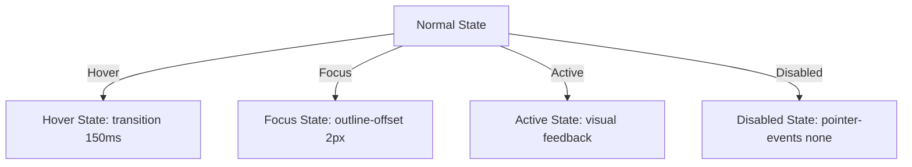

<!--
  SAMAVESH — AI Design System Specification (design.md)
  -----------------------------------------------------
  This file is the single, authoritative specification for the SAMAVESH Design
  System under the Ministry/Department of Social Justice & Empowerment (MoSJE),
  Government of India. It aligns with the UX4G Figma DS and GIGW 3.0 standards.
  
  This documentation is structured to match industry-benchmark design systems 
  (such as Google Material Design 3, IBM Carbon, and Shopify Polaris), providing 
  clear guidelines for foundations, component states, modern web APIs, and visual Dos & Don'ts.

  Last reviewed: 2026-06-23 · System version: v1.0.0
-->

# SAMAVESH Design System — Specification & AI Design Context

**SAMAVESH** (समावेश, "inclusion / bringing together") is the unified visual and interaction language for the **Ministry / Department of Social Justice & Empowerment (MoSJE/DoSJE), Government of India**. It serves as the single source of truth across 13 informational websites and 20+ workflow portals.

Any developer or AI agent building UI for any MoSJE application must read this document first and implement interfaces adhering strictly to the tokens, states, and guidelines specified below.

---

## 1. System Foundations

### A. Color Architecture & Theming Axes
SAMAVESH operates on three independent theme axes applied via HTML attributes on the root (`<html>`) element. Custom tokens respond automatically at runtime.

| Axis | Attribute | Values | Meaning |
| :--- | :--- | :--- | :--- |
| **Brand Mode** | `data-color-mode` | `blue-light` (default), `blue-dark` | Selects the primary brand color ramp. |
| **Appearance** | `data-theme` | `light` (default/unset), `dark`, `hc` | Light theme, dark theme, or high-contrast (a11y). |
| **Density** | `data-density` | `comfortable` (default/unset), `compact` | Controls padding, heights, and spatial density. |

> [!TIP]
> Nested theme "islands" (e.g. a dark-themed preview wrapper inside a light page) must be explicitly scoped using nested `[data-theme="dark"]` elements. To prevent theme flashes on initial render, initialize attributes using the exported `colorModeInitScript()`.

### B. Typography
- **Typography Stack**: Noto Sans (`var(--ds-font-sans)`) is the non-negotiable typeface across all English interfaces. Devanagari/Hindi uses `--sa-font-family-devanagari`.
- **Line Length Constraints**: To optimize cognitive load, restrict body text and prose containers to a maximum width of `65ch` to `75ch` (`max-w-prose` / `max-w-3xl`).
- **Responsive Sizing**: Sizing is responsive and mobile-first, using the `--ds-type-ROLE-size` and `--ds-type-ROLE-lh` tokens (where `ROLE` matches `display1-6`, `headline1-6`, `title1-3`, `body1-3`, `label1-3`).
- **Typography Scale Rules**: Large display heading sizes (`clamp()`) must maintain a letter-spacing floor of `-0.04em` to prevent compressed, overlapping glyphs on mobile screens. Use `text-wrap: balance` on headers `h1-h3` and `text-wrap: pretty` on paragraphs to prevent typographic orphans.

### C. Spacing & Elevation
- **Spacing Scale**: Spacing is locked to a named t-shirt scale. Custom padding and margins must map to:
  `--ds-spacing-none (0px)`, `--ds-spacing-xxs (2px)`, `--ds-spacing-xs (4px)`, `--ds-spacing-sm (8px)`, `--ds-spacing-md (12px)`, `--ds-spacing-lg (16px)`, `--ds-spacing-xl (20px)`, `--ds-spacing-2xl (24px)`, `--ds-spacing-3xl (32px)`, `--ds-spacing-4xl (40px)`, `--ds-spacing-5xl (48px)`
- **Responsive Layout Grid**:
  - **Desktop (>= 1024px)**: 12-column grid, max-width `1280px`, `24px` (`var(--ds-spacing-2xl)`) gutters and margins.
  - **Mobile (< 1024px)**: 4-column fluid grid, `16px` (`var(--ds-spacing-lg)`) gutters and margins.

---

## 2. Component States & Interactive Behavior

Every interactive component (Buttons, Inputs, Cards, Links) must implement standard states to ensure consistent, responsive, and accessible feedback.



### A. State Definitions
1.  **Normal**: The default idle state of the component using standard semantic tokens.
2.  **Hover**: Triggered when a pointer moves over the element. Must use a CSS transition of `150ms` (`var(--ds-duration-fast)`) with an exponential ease-out curve (`var(--ds-easing-out)`). Banned: Linear or bouncy/springy transitions.
3.  **Active**: Triggered during user press/tap. Provides immediate visual sinking or color shifting to confirm the action.
4.  **Focus**: Triggered via keyboard tab or selection. Must render a high-contrast focus indicator: `2px solid var(--ds-primary-ring)` with a `2px` outline offset. The focus state contrast ratio against its surrounding background must be at least `4.5:1`.
5.  **Disabled**: Indicated using opacity `0.4` (`var(--ds-opacity-disabled)`) or a flat neutral color. Must append `pointer-events: none`, `tabindex="-1"`, and `aria-disabled="true"` to prevent user interaction.

### B. Keyboard Navigation & Focus Management
Components must be fully navigable via keyboard, adhering to WCAG 2.1 AA keyboard navigation (2.1.1) and focus order (2.4.3):
- **Overlays (Modals, Dropdowns, Drawers)**: Must catch the keyboard focus, trapping it inside the container while active. Pressing `Escape` must immediately close the overlay and return focus to the trigger element.
- **Lists and Navigations**: Tab moves focus linearly between groups. Interactive dropdowns and mega-menus should support Arrow keys for list traversal.

---

## 3. Visual Guidelines: Dos & Don'ts

To ensure the visual system remains premium, clean, and consistent, all developers and AI models must follow these component-specific rules.

### A. Buttons & Actions
| Do | Don't |
| :--- | :--- |
| Use predefined semantic roles: `variant="primary \| secondary \| tonal \| danger"`. | Do not create custom button classes or override backgrounds with hardcoded hex/rgba values. |
| Use full-pill rounded shapes (`var(--ds-radius-pill)`) for action buttons. | Banned: "Ghost" buttons using a `1px` border combined with a soft, wide drop shadow. |
| Ensure clear label text, using `aria-label` for icon-only button contexts. | Do not use decorative text gradients (`background-clip: text`) on button labels. |

### B. Cards & Containers
| Do | Don't |
| :--- | :--- |
| Group content into clean, structural cards using `var(--ds-radius-md)` (`12px-16px` border-radius). | Banned: Sharp corners (`0px` radius) or excessively rounded corners (`> 20px`) for cards. |
| Maintain clean separation using solid semantic borders or light background colors. | Banned: Colored accent side-stripes (e.g. `border-left: 4px solid var(--ds-primary)`) on cards. |
| Keep grids structured with equal height cards using flex or CSS grid. | Do not nest cards within other cards (nested containers). |

### C. Site Header & Navbars
| Do | Don't |
| :--- | :--- |
| Render the canonical three-tiered `SiteHeader` with the functional accessibility toolbar. | Banned: Placing decorative Indian tricolour stripes in the header, footer, or hero section. |
| Configure `variant="website"` for public portals and `variant="portal"` for authenticated dashboards. | Do not override the official National Emblem with abstract logos or custom marks. |
| Ensure the mobile drawer flattens the mega-menu structure dynamically. | Do not disable collapse-on-scroll or keyboard navigation properties. |

### D. Forms & Inputs
| Do | Don't |
| :--- | :--- |
| Wrap every input in a `FormField` component containing explicit label, hint, and error nodes. | Do not use placeholder text as a substitute for labels. Placeholders disappear on type and fail accessibility. |
| Show red error states (`var(--ds-danger)`) only after validation runs or input blur. | Do not render inline inputs without surrounding margin-bottom/padding constraints. |

---

## 4. Modern Web Standards & Browser APIs

SAMAVESH prioritizes native web platform capabilities over large JavaScript libraries to guarantee performance and visual stability.

### A. Native Overlays
All dropdowns, tooltips, select menus, and modal dialogs must use native browser features:
- **`dialog` Element**: Use `<dialog>` for modal overlays. This leverages the browser's native stacking context (`::backdrop` pseudo-element), automatically traps keyboard focus, and handles Escape-key dismissals.
- **`popover` API**: Use the HTML `popover` attribute for lightweight non-modal overlays (tooltips, dropdowns) to prevent stacking z-index clipping inside overflow-hidden parent elements.

### B. Size-Aware Styling (Container Queries)
Responsive components (such as Cards, Grid panels, and Lists) must use CSS Container Queries (`@container`) rather than viewport Media Queries (`@media`).
- Card layout structures must adapt to the width of their parent container (`cqw` units) rather than the screen size, enabling components to render correctly whether placed in a full-bleed grid or a narrow sidebar widget.

### C. Parent Styling with `:has()`
Utilize the CSS `:has()` pseudo-class to style parent containers dynamically based on child states, reducing reactive state management in JavaScript:
```css
/* Style form fieldset wrap with a red border only when it contains an invalid input */
.ds-form-group:has(input:invalid:not(:placeholder-shown)) {
  border-color: var(--ds-danger);
}
```

### D. Performance & Visual Stability
- **VISUAL STABILITY**: All custom web fonts (Noto Sans) must configure `font-display: swap` and define visually stable font fallbacks to minimize Cumulative Layout Shift (CLS).
- **Graceful Degradation**: Always provide lightweight fallbacks for modern APIs using feature detection (e.g. `@supports (container-type: inline-size)`).

---

## 5. Token Vocabulary Reference (`--ds-*`)

Custom properties are defined in `@mosje/tokens` and generated into `packages/design-system/tokens.css`.

- **Color Semantics**: 
  - Text: `--ds-ink` (primary text), `--ds-ink-strong`, `--ds-ink-muted`, `--ds-on-primary` (text on solid brand bg), `--ds-ink-info` (high-contrast text for info boxes).
  - Backgrounds: `--ds-surface` (base card/page bg), `--ds-surface-muted`, `--ds-surface-alt`.
  - Brand: `--ds-primary` (GoI Navy/Blue), `--ds-primary-dark`, `--ds-primary-tonal`, `--ds-primary-ring`.
  - Gov Accents: `--ds-saffron`, `--ds-saffron-dark`, `--ds-saffron-light`, `--ds-gov-navy`, `--ds-gov-yellow`.
  - Borders: `--ds-border` (light divider), `--ds-border-strong`.
  - Status: `--ds-success`, `--ds-warning`, `--ds-danger`, `--ds-info` (and corresponding `-tonal` variables).
- **Radii**: `--ds-radius-xxs (2px)`, `--ds-radius-xs (4px)`, `--ds-radius-sm (8px)`, `--ds-radius-md (12px)`, `--ds-radius-pill (9999px)`.
- **Shadows**: `--ds-shadow-xs`, `--ds-shadow-lg`, `--ds-shadow-xl`.
- **Motion Durations**: `--ds-duration-fast (150ms)`, `--ds-duration-base (300ms)`, `--ds-duration-slow (500ms)`.

---

## 6. Workflows & Syncing

- **Token Compilation**:
  If a token value needs modification, edit `packages/tokens/src/*.json`, then compile:
  ```bash
  npm run build -w @mosje/tokens
  ```
  Ensure the generated contract is valid:
  ```bash
  npm test -w @mosje/tokens
  ```
- **Figma Code Connect**:
  Visual components are synced with the designer Figma library using Code Connect. See `/sync-figma` and `docs/research/figma-code-connect-readiness.md` for sync workflows.
- **Specification Maintenance**:
  Whenever a new component is added, or a token contract is updated, this specification must be reviewed and its "Last reviewed" date bumped.
