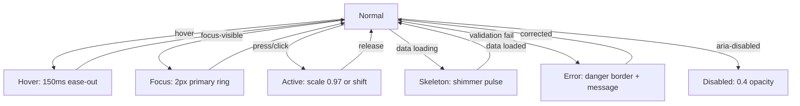

<!--
  SAMAVESH — AI Design System Specification (design.md)
  -----------------------------------------------------
  This file is the single, authoritative specification for the SAMAVESH Design
  System under the Ministry/Department of Social Justice & Empowerment (MoSJE),
  Government of India. It aligns with the UX4G Figma DS and GIGW 3.0 standards.
  
  This documentation is structured to match industry-benchmark design systems 
  (Google Material Design 3, IBM Carbon, Shopify Polaris, Atlassian), providing 
  clear guidelines for foundations, component catalogue, page patterns, modern 
  web APIs, and visual Dos & Don'ts.

  This file is rendered live at /design-system/resources/design-context.
  
  Last reviewed: 2026-08-10 · System version: v1.12.3 (SIX GAPS CLOSED — each of these existed
  as a hardcoded literal before it was a token, which is exactly what a token system is meant to
  remove. icon/size/* (5; md=24px is the estate default <Icon> ships with, and every component
  had been hardcoding its own). focus/width + focus/offset — the ring's COLOUR was tokenised long
  before its geometry, so WCAG 2.4.7's most-regulated affordance was two-thirds hardcoded.
  container/* (5) including the 1280px content width CLAUDE.md mandates estate-wide, which lived
  only as a literal. elevation/* (6) — a semantic layer over the raw shadow ramp, so a card
  versus a modal is chosen by WHAT THE SURFACE IS rather than by how deep the shadow looks; CSS
  only, because Figma models shadows as EFFECT STYLES not variables, and that exclusion is now
  asserted to stay explained. motion/{enter,exit,emphasis} pairing a duration with the easing
  that belongs to it — entering decelerates and may take its time, leaving accelerates and gets
  out of the way; a bare duration loses that. control/{radius,border/width}, because density
  moved a control's SIZE while its SHAPE stayed hardcoded. Figma routing became TYPE-AWARE in the
  process: focus, icon and control each own both a colour and a measurement, so routing by root
  alone had put five FLOATs in the colour collection. 865 variables, 102 tests.
  v1.12.2: (USAGE GUIDANCE — every semantic token now
  says WHEN to reach for it, not only what it is worth. Descriptions were a measured contrast
  ratio plus, at best, a two-word label ("Hovered rows, quiet panels"): rigorous and nearly
  useless for choosing between neighbours. UX4G's Figma does the opposite ("Use when the tonal
  button's action is not available") — worse evidence, much better guidance. Both halves now ship:
  what it is FOR, then what it is WORTH. 417 variables had NO description; 7 do now, and those are
  deliberate. The vocabulary lives in ONE module (build/usage-guidance.mjs) derived from the path,
  not 400 hand-written strings that would drift apart unnoticed. ALSO FOUND AND FIXED: the Tier-2
  generator had been UNRUNNABLE since the ordinal-ladder rename — it validates every path and
  exits before writing, and five put() calls still used retired rung names, so
  src/system.generated.json said "GENERATED — do not edit" while being hand-maintained. Both
  generators are now gated by a test that runs them and diffs the output. CAVEAT: the Figma push
  computed guidance in-plugin and its prose differs from the module by 1-4 characters on ~330
  variables; the build is authoritative and a faithful re-push is queued.
  v1.12.1: (ADOPTED FROM UX4G — the three conventions
  where UX4G was plainly better, plus the one scale we simply lacked. (1) VALUE-NAMED type
  primitives: `--sa-ref-font-size-400` told you nothing, `--sa-ref-font-size-16` cannot be
  misread, which is UX4G's convention and Tailwind's and Spectrum's. (2) A general `size/*` scale
  — UX4G's 20 steps at their exact rem values, plus 22 and 44 as a SAMAVESH superset — and font
  sizes now ALIAS it, exactly as UX4G's `fs-16 -> size-16` does, so a px value has one definition
  instead of one per namespace. (3) `breakpoint/*`, which matters less as a token than as a fix:
  360/768/1280 were restated as literals in TWO build files, and the fluid type curve now reads
  the token in both, gated by a test that fails if a literal returns. (4) `blur/*` (8), UX4G
  verbatim, which we had none of. NOT adopted: UX4G's 116 utility-value tokens
  (`--ux4g-object-fit-cover: cover`) — a CSS keyword with a variable wrapped round it is not a
  design decision, and copying them would inflate the count while buying nothing. The px->rem
  shift on the raw type steps is a UNIT change, not a rename, and is recorded as such: nothing
  renders from those tokens, and their one consumer is the UX4G parity layer, where rem is what
  UX4G's own contract says. Conformance is unaffected — all 755 names still emit.
  v1.12.0: (INVENTORY COMPLETED — the four scales the
  spec promised and never built now exist. NEW: border/width (5) and opacity (14) at UX4G's exact
  values, the z ladder (8, Bootstrap's numbers that UX4G inherited and third-party CSS already
  assumes), layer/* (8, Carbon's nestable surfaces) and on/* (40). Every on/* pairing was CHOSEN BY
  MEASUREMENT — the ink that clears AA on that fill in the WORST brand — and §9.3's
  on-pair-contrast test finally exists to hold it; three pairings sit below AA and are the SAME
  tokens as the prominence shortfall ledger, reached independently, which is asserted rather than
  assumed. Density went from ONE variable to 8, so the axis moves control padding, gaps and row
  heights instead of a single height. REMOVED: the dead fixed 5-role type scale (0 consumers,
  shadowed the fluid scale under a friendlier name) — renamed to deprecated/* in Figma rather than
  deleted, because a binding in a consuming file cannot be ruled out from inside a published
  library. NEW Figma collection `Static` for the unitless scales — the one place §8.4's design was
  buildable, precisely because those tokens are new and nothing is bound to them. 267 variables
  scoped, so a colour is no longer offered for corner radius; ref/z/* hidden (no canvas property,
  provably unbound). Blanket-hiding ref/* was NOT done and should not be: ref/color/ink/dark alone
  carries 1,143 bindings, and un-publishing a bound variable strands it. Also fixed a test-suite
  RACE that made results non-deterministic — brand-contrast rebuilds dist/ under another brand
  while node --test parallelises across files; the suite now runs serially.
  v1.11.9: (COMPONENT TIER FOLLOWS THE BRAND — all
  296 `--sa-cmp-*` shipped as frozen hexes, so the entire component layer ignored `data-brand`:
  `--sa-cmp-action-brand-primary-default-bg` was #025fb8 under Blue AND under Navy — the primary
  button never changed brand. The CSS format handed var() chains only to system.generated.json
  and Tier 3 fell through to the resolved literal. The SOURCE was never at fault: Tier 3 is 196
  references plus 92 deliberate literals (white-alpha inverse variants and transparent fills,
  correctly brand-invariant). Two fixes were needed, not one — the format now emits Tier-3 chains,
  AND re-assertion inside an axis block became TRANSITIVE, because a chain three deep
  (cmp -> bg/brand/primary/bolder -> color/primaryScale/600) is not reached by a single pass.
  101 component tokens now repaint under Navy, up from 0. Figma held the same tokens as ALIASES
  where 85 repainted, so the two sides had silently disagreed about the layer that describes
  buttons; 16 live variables were rebound and both now report 101 repainting / 195 invariant,
  exactly. :root is byte-identical — the only values that moved are inside [data-brand=navy], and
  the one Tier-3 token anything currently consumes (--sa-cmp-badge-beta-bg, gov-yellow) is
  correctly unchanged. Also fixed the gate that missed all of this: action-contrast.test.mjs
  resolved only :root — it checked Blue and called that coverage — and now runs the full matrix
  per brand. Navy passes AA.
  v1.11.8: (UX4G WIDGET v3.28 — the accessibility
  widget is upgraded from `accessibility-beta-v1.15`, and the workaround that made every page
  load at 110% zoom with three features falsely active is deleted rather than corrected, because
  v3.x fixes the null dereference that forced it. The brand skin now covers ~13 hardcoded violets
  that `--color-dark-blue-1` never reached — overriding the variable alone left the panel half
  violet. Telemetry new in v3.28 is OFF by default: it beacons the full URL of every page view,
  which on an authenticated portal can carry beneficiary identifiers. See the `analytics` prop.
  Two icons bake their colour into an SVG `data:` URI and stay violet by design — recolouring
  them would hardcode a brand hex in a multi-brand estate. The keyboard shortcut is now
  platform-aware: v3.28 advertises and binds Ctrl+F2, which macOS reserves for the menu bar and
  which needs `fn` on Apple keyboards, so Macs get `⌘⌥A` — relabelled on the trigger and appended
  to its aria-label. Deliberately NOT `⌃⌥`, which is VoiceOver's modifier. Windows and Linux keep
  Ctrl+F2.) v1.11.7 (ORDINAL LADDER — the prominence scale is
  renamed and now actually ORDERS. UX4G's `base · soft · subtle · emphasis · strong · stronger`
  did not: `subtle` sat louder than `soft` while reading quieter, and `base` was quietest of all
  while reading like the default. The ladder is now `base · subtler · subtle · bold · bolder ·
  boldest` for fills and `subtler · subtle · base · bolder · boldest` for ink — Atlassian's shipped
  pattern, not a private scale. Ink adopts the SAME words, which finally dissolves the
  `primary`/`secondary`/`tertiary` overload: those three are variants and nothing else now, so the
  collision cannot be spelled, and the three `brand:` entries are gone from KNOWN_AMBIGUITIES.
  `base` is the canonical value rather than a loudness, which is why it sits at a different rung
  per ladder — the ordinary fill is the quietest thing on the page, the ordinary ink is mid-way.
  Sharing words forced the contrast contract to become PER-LADDER: `subtle` is a quiet tonal chip
  on a fill (≥3:1, WCAG 1.4.11) and a caption on ink (≥4.5:1, 1.4.3), and one flat table could
  only ever be right about one of them. 34 names moved, all byte-identical, pinned by
  visual-contract.test.mjs. Figma collection names also dropped their tier-number prefixes —
  redundant once tier moved into the variable path, and six of seven read '2 ·' anyway.
  v1.11.6: (FIGMA STRUCTURE — the library is canonical
  end to end. All 691 variables renamed IN PLACE to their DTCG paths, so a Figma variable name IS
  its token path: `bg/neutral/subtle`, `ref/space/md`, `cmp/action/brand/primary/hover/bg`.
  Collections are tier-ordered: 1 · Palette, 2 · Color, 2 · Space, 2 · Type, 2 · Radius, 2 · Motion,
  2 · Density. RENAME ONLY, never recreate: Figma refuses to move a variable between collections
  (variableCollectionId is get-only, probed not assumed), and this is a PUBLISHED library whose
  consumers are other files — so a delete could not be shown to be safe from inside it. Renaming
  preserves the variable id, so every binding followed automatically; tier therefore lives in the
  NAME (ref/ … cmp/), which Figma's picker navigates exactly like a collection. 40 tokens got a
  Figma home for the first time: the 38 data-viz tokens and the two Devanagari type tokens, whose
  old names collided. Source paths were canonicalised FIRST so the projection would not import
  naming debt — `spacing/*`→`space/*`, `color/chart/*`→`chart/*` (spec §11.4, decided but never
  done), brand ramps `light|dark`→`blue|navy` (§4.2: palettes, not appearance). The grammar
  allowlist is now ITEMISED (150 paths) instead of four ROOTS, which had exempted every future
  token under them too. NOTHING RENDERS DIFFERENTLY — proven by visual-contract.test.mjs. Five
  variables remain uncreatable in Figma by construction: type/*/weight is a FLOAT in code and a
  STRING style name in Figma, and Figma rejects an alias across resolved types.
  v1.11.5: (CONTRAST CLAIMS: the Figma library was
  publishing 322 WCAG contrast guarantees that nothing had measured, produced by a substring scan
  of the token path. 192 sat on Tier-3 Action/* variables, which have no prominence slot;
  Background/Brand/Primary/Base claimed "body and heading text" because `primary` is a brand
  VARIANT that spells an ink rung; motion/duration-base, a NUMBER, claimed a contrast class. Of the
  41 measurable claims, 23 were false. A class is now a MEASUREMENT: resolved through the alias
  chain, composited if translucent, measured against its own surface across every brand, worst case
  published. The permission sentence is added only where the threshold is met. Text and icon tokens
  can no longer be silent — where the ladder has no rung, WCAG 1.4.3 / 1.4.11 apply. Enforced by
  test/prominence-contract.test.mjs (spec §9.2, previously unwritten) with a 19-token shortfall
  ledger that may only shrink. NOTHING RENDERS DIFFERENTLY — description-only, proven by
  visual-contract.test.mjs. The Figma library needs republishing for the corrected descriptions to
  reach designers. v1.11.3: (FIGMA SYNC, second pass: the library now
  v1.11.4: (APPEARANCE AXIS REMOVED: `data-theme`
  (light/dark/hc) no longer exists. Figma's Theme collection is single-mode and `tokens.css` emits
  no `[data-theme]` block. The UX4G accessibility widget is the estate's single canonical dark and
  high-contrast mechanism — it applies its own `.dark-mode` class and never read `data-theme`, so
  this was a second parallel mechanism nothing consumed. Verified no-op: zero value drift in every
  surviving selector context. Removed three dead switches (gate header, docs header, playground),
  the Storybook theme picker, two theme modules, the no-flash script and the orphaned CSS; corrected
  Storybook's pre-rename brand labels to Blue/Navy. Also normalised 33 Figma alphas stored as 8-bit
  n/255 values rather than clean percentages (max shift 0.16pp). v1.11.3: (FIGMA SYNC, second pass: the library now
  matches the code on Spacing (49), Theme (374), Border Radius, Motion and Density, and on all 117
  Color names the exporter emits. Created 61 missing variables (Spacing 15->49, Typography 79->106);
  renamed 28 in place so ids and bindings survived; retired 8 unused Color leftovers (149->141).
  TWO DELIBERATE NON-GAPS: the 24 extra Color names are Figma-native primitives designers bind to
  directly and the exporter withholds them on purpose; the 5 type/*-weight variables are absent
  because Figma models font weight as a STRING style name while the code uses a numeric FLOAT, and
  Figma rejects an alias across types. Also fixed a silent catch-all in the exporter that filed 13
  px-valued numbers under font-family/. The library needs republishing for any of this to reach
  consumers. v1.11.2: (FIGMA SYNC: the SAMAVESH library had four
  variable names living in BOTH the Color and Theme collections, left over from an earlier
  hand-migration. All 504 live bindings were rebound onto the Theme copies and the Color leftovers
  removed; Color 153 -> 149. `Focus/Ring` stays in both on purpose — it is a brand-source companion
  the appearance layer consumes. Two leftovers were also MISLABELLED: Color's
  Background/Brand/Primary/Subtle held ramp step 50, which the prominence ladder calls `base`, and
  Strong held Source rather than 600. The Theme copies already matched the ladder, so retiring the
  leftovers brings Figma and dist/tokens.css into token-for-token agreement and raises white-on-brand
  contrast from 4.64:1 to 6.30:1 (Blue) and 12.61:1 to 14.22:1 (Navy). The Figma library needs
  republishing for consumers to pick this up. v1.11.1: (TOKEN GRAMMAR: `default` now means
  exactly one thing — a state. It previously occupied three slot dictionaries at once
  (prominence, state, link variant), so the parser bound it greedily and text/link/visited/default
  parsed as a prominence, losing the state it spelled. The prominence canonical is now `base`
  (`--sa-bg-neutral-base`) and the link variant is now `brand` (`--sa-text-link-brand-default`).
  NOTHING RENDERS DIFFERENTLY — a rename, not a redesign: all 27 moved names resolve
  byte-identically in all 7 selector contexts, pinned by test/visual-contract.test.mjs, and the
  `--ds-*` names app code uses are unchanged. `--ux4g-*` names are unchanged too and sit OUTSIDE
  the contrast contract by construction: an alias preserves UX4G's VALUE, not our rung. Two slot
  ambiguities remain, pinned by test/slot-disjointness.test.mjs — see spec §5.1c/§8.1a.
  v1.11.0: The estate is off lucide-react and off
  shadcn/Radix entirely. Every icon is Material Symbols Rounded via <Icon> — 668 call sites
  across 239 files — and SidebarNavItem.icon is now a Material Symbols NAME STRING, not a
  component, so nav configs stay serialisable. NEW components: Tooltip (WCAG 1.4.13 —
  dismissible, hoverable, persistent; portalled at z-index 90 so Card/DataTable overflow can't
  clip it); Skeleton/SkeletonText/SkeletonRow; Label (standalone, for controls outside
  FormField); LiveRegion + useLiveRegion; SectionTitle. Input gains leftIcon/rightIcon — a bare
  Input still renders with no wrapper. FIXED: CardTitle painted at 32px because it referenced
  the Headline-1 alias while its own fallback claimed 20px; it is now bound to the canonical
  --ds-type-title-1-size. Icon accepts a style prop. NOTE the legacy --ds-text-title-* aliases
  are still mis-mapped to headline-2 — use the canonical --ds-type-<role>-size tokens.
  v1.10.0: SlaProgressIndicator — Right to
  Service Act time-remaining, three variants, seven states including a neutral PAUSED clock and
  MISSED as distinct from BREACHED; pure logic in utils/sla.ts. v1.9.0: (Type is now sized in REM, not px: a
  reader who raises their browser's default font size without zooming now gets larger text —
  a px scale ignored them. Renders identically at the 16px default, proven by test. NEW
  components: PasswordInput (reveal toggle — use for every password field in the estate;
  real type="button" so it cannot submit, action-named label, browser's own reveal
  suppressed); AadhaarInput / OtpInput / PanInput (UX4G 3.0 identity controls) + pure
  validators in utils/india-id.ts; Aadhaar is Verhoeff-checked and masked to its last four
  digits by default per DPDP Act 2023 / UIDAI. FIXED: the dark theme shipped a primary button
  whose white label sat at 3.77:1 — below AA — since the ramp step was chosen for the link
  role, not the fill; the contrast gate now sweeps every colour mode AND theme, not just
  :root, and covers the hover state. v1.8.0: UX4G 3.0 adopted as the foundation.
  New: the opt-in `--ux4g-*` parity layer (`@mosje/design-system/ux4g.css`, all 755 UX4G tokens
  resolved onto SAMAVESH — structure at UX4G's exact values, colour role-mapped to the MoSJE
  palette) plus `ux4g-light`/`ux4g-dark` colour modes carrying UX4G's literal palette. Core
  additions: UX4G's four semantic spacing role families (`--ds-inline/stack/padding/section-*`)
  — prefer these over the raw t-shirt scale; `--ds-spacing-10xl/11xl`; a 6-level shadow ramp
  (adds `none`/`sm`/`md`); `--ds-font-display` (Noto Sans Display, 36px+). FIXED: the
  `[data-surface="portal"]` block did not re-assert the `--ds-text-*`/`--ds-leading-*` aliases,
  so every natively-mounted portal rendered the WEBSITE type scale (display headings to 80px
  instead of 56px) — alias re-assertion is now targeted per block, which also cut tokens.css
  from 92 KB to 60 KB. v1.7.2: Text-entry controls take a hard 16px floor below 768px: iOS Safari zooms any focused control under 16px and does not zoom back out, and the fluid ramp put body-1 at ~14px on a phone. Desktop density unchanged. v1.7.1: `SideSheet` gains `side="left"` for navigation drawers, so portal shells can collapse a fixed sidebar into a drawer on small screens instead of squeezing the page. `DeclarationCheckbox` attestation row now meets the 44px touch floor. v1.7.0: Adds three components for field reporting with sign-off: `GeoPhotoInput` (EXIF/device geo-tagging + auto-downscale), `DeclarationCheckbox` (statutory certification panel), `ApprovalTimeline` (multi-tier approval audit trail). No token values changed. v1.6.2: Theming: `[data-color-mode="…"]` blocks now re-declare the `--ds-*` aliases, exactly as `[data-theme="…"]` blocks already did, so colour-mode "islands" repaint a nested subtree instead of only flipping `--sa-*` primitives. Fixed in the generator `packages/tokens/build/formats/legacy-ds-css.mjs`; surfaced when portals mounted natively in the hub and `data-brand` moved off `<html>` onto a wrapper. No token values changed. v1.6.1: Icon loading: icons.css now declares an inline @font-face (pinned gstatic woff2) instead of an @import, so the documented `import "@mosje/design-system/icons.css"` finally loads the font under Next/Turbopack — no per-app <link> hack. Typography: hyphenated Portal-DS role names — display-1…label-3; added -para (paragraph-spacing) + -tracking (letter-spacing) fluid props so code ↔ SAMAVESH Figma are at full parity. v1.6.0: two-surface fluid type via data-surface=website|portal, 21 role tokens as clamp(min@360px, fluid, max@1280px). v1.5.0: Figma→code colour sync, mode-aware Blue-Light/Blue-Dark, danger-strong #B8382F)
-->

# SAMAVESH Design System — Specification & AI Design Context

**SAMAVESH** (समावेश, "inclusion / bringing together") is the unified visual and interaction language for the **Ministry / Department of Social Justice & Empowerment (MoSJE/DoSJE), Government of India**. It serves as the single source of truth across 13 informational websites and 20+ workflow portals.

Any developer or AI agent building UI for any MoSJE application must read this document first and implement interfaces adhering strictly to the tokens, states, and guidelines specified below.

---

## Quick Start

```tsx
// 1. Import design system tokens once in your app root
import "@mosje/design-system/tokens.css";

// 2. Import components from the barrel
import {
  Button, FormField, Input, Card,
  SiteHeader, SidebarNav, Alert, Modal
} from "@mosje/design-system";

// 3. Use semantic tokens in custom CSS — never hardcoded hex values
const style = { background: "var(--ds-primary)", color: "var(--ds-on-primary)" };
```

| App type | Entry point | Token import |
|----------|-------------|--------------|
| Website (`apps/dosje`) | `src/app/globals.css` | `@import "@mosje/design-system/tokens.css"` |
| Portals (`apps/portals/*`) | `src/app/globals.css` | Same — Tailwind v4 everywhere |
| Design System docs | Loaded in `globals.css` | Already included |

> **New to SAMAVESH?** Start with the [Component Catalogue](#7-component-catalogue) → pick what you need → check the [Token Reference](#6-token-vocabulary-reference---ds-) for the exact tokens to use.

---

## 1. System Foundations

### A. Color Architecture & Theming Axes

SAMAVESH operates on three independent theme axes applied via HTML attributes on the root (`<html>`) element. Custom tokens respond automatically at runtime.

| Axis | Attribute | Values | Meaning |
| :--- | :--- | :--- | :--- |
| **Brand** | `data-brand` | `blue` (default), `navy` | Two peer brand palettes, BOTH on light surfaces — `blue` is gov-blue + saffron + warm grey, `navy` is gov-navy + green + cool grey. Renamed from `blue-light`/`blue-dark` on 2026-08-07: those read as appearance themes, which they never were. In Figma they are the brand half of the `2 · Color` collection's `Brand × Theme` modes. Selects the whole mode-aware palette: **primary** (blue↔navy), **secondary** (saffron↔green), **neutral** greys (warm↔cool), and the primary/secondary/neutral **transparent** tiers. |
| ~~Appearance~~ | ~~`data-theme`~~ | **REMOVED 2026-08-10** | Dark and high-contrast are owned entirely by the UX4G accessibility widget, which applies its own `.dark-mode` class to `<html>` and never read `data-theme`. This axis was a second, parallel mechanism nothing consumed. The token source still carries the overrides (unemitted) so it can be revived deliberately — see `docs/superpowers/records/2026-08-10-figma-theme-dark-hc-removed.md`. |
| **Density** | `data-density` | `comfortable` (default/unset), `compact` | Controls padding, heights, and spatial density. |
| **Surface** | `data-surface` | `website` (default/unset), `portal` | Selects the **typography scale**. `website` = the expressive editorial ramp (display-1 ≈ 80px); `portal` = the dense functional ramp (display-1 ≈ 56px). Same role token names in both; only the `--ds-type-*` values differ. Set `data-surface="portal"` on portal `<html>` roots; the website/hub stay default. Maps 1:1 to the SAMAVESH Figma `Website` / `Portal` type modes. |

> **Surface is a type axis only.** `data-surface` swaps the fluid type scale (`--ds-type-*`), nothing else — colour comes from `data-brand`. All type is fluid `clamp()` between a 360px-viewport min and a 1280px max, so the two surfaces each scale smoothly; there are no type media-query breakpoints.

> **Brand is the only colour axis.** `data-brand` (blue/navy) swaps the brand palette; `navy` is NOT a dark UI theme — it keeps light surfaces and simply uses navy/green/cool-grey. There is no appearance axis: dark and high-contrast belong to the UX4G accessibility widget, the estate's single canonical mechanism for both.

> **Two more colour modes ship opt-in: `ux4g` and `ux4gdeep`.** They carry UX4G 3.0's
> own palette (violet `#6a4eff` / `#4a2bc2`) *literally*, so UX4G conformance can be
> demonstrated by flipping one attribute instead of argued about. They live in
> `@mosje/design-system/ux4g.css` (opt-in — the default bundle does not grow) and are
> exported from `color-mode.ts` as `UX4G_COLOR_MODES`, deliberately **not** merged into
> `COLOR_MODES`: offering a mode in an app that has not loaded that stylesheet would show a
> switch that does nothing. Opt in explicitly:
> `<ColorModeSwitcher modes={[...COLOR_MODES, ...UX4G_COLOR_MODES]} />`.
> The MoSJE default stays gov-blue, as DBIM requires.

> **Tip:** Nested brand "islands" (e.g. a navy portal shell inside the blue hub) must be explicitly scoped with a nested `[data-brand]` element. To prevent a flash on initial render, initialize the attribute with the exported `colorModeInitScript()`.

> **Brand islands.** You can put `data-brand` on any element, not just `<html>`, and the subtree re-themes, because the generated `tokens.css` re-declares the `--ds-*` aliases inside every `[data-brand="…"]` block (each also carrying the deprecated `[data-color-mode="…"]` selector, so existing markup keeps working). A custom property substitutes `var()` at the element where it is **declared**, so a block that only flipped the `--sa-*` primitives would leave `--ds-primary` resolved at whatever `:root` computed and the island would not repaint. Anything changing this lives in `packages/tokens/build/formats/legacy-ds-css.mjs`, never in the generated CSS.

### B. Colour Usage Contract

Use semantic tokens — never reference primitive `--sa-color-*` values directly in components. Primitives are referenced only within `tokens.css`.

| Token | Light value | Dark value | Correct usage | Never use for |
|-------|------------|------------|---------------|---------------|
| `--ds-primary` | `#0373DF` | `#3f83c6` | CTA buttons, active links, key icons, focus rings | Body text, large backgrounds |
| `--ds-saffron` | `#F97316` | `#F97316` | Accents, warning highlights, badges | Primary actions, heading text |
| `--ds-gov-yellow` | `#FFD323` | `#FFD323` | Warning state backgrounds only | Text on any background (fails WCAG AA contrast) |
| `--ds-ink` | `#1F2428` | `#F4F3F9` | All body/heading text | Interactive elements, backgrounds |
| `--ds-ink-muted` | `#6C757D` | `#9AA3AF` | Captions, hints, helper text | Primary content (check contrast below 16px) |
| `--ds-surface` | `#FFFFFF` | `#1F2428` | Page and card backgrounds | Text or icon fills |
| `--ds-danger` | `#B8382F` | `#B8382F` | Error states, destructive action labels, error text on white | Decorative fills (use `--ds-danger-tonal`) |
| `--ds-success` | `#2E7D32` | `#4CAF50` | Success states, validation confirmation | Primary brand actions |
| `--ds-on-primary` | `#FFFFFF` | `#FFFFFF` | Text/icons placed on solid `--ds-primary` backgrounds | Any other background |

### C. Contrast Pairs (WCAG 2.1 AA — minimum 4.5:1 for text, 3:1 for UI elements)

| Foreground | Background | Ratio | Status | Usage context |
|-----------|-----------|-------|--------|---------------|
| `--ds-on-primary` (`#fff`) | `--ds-primary` (`#0373DF`) | **5.4:1** | ✅ Pass | Filled primary buttons, nav active state |
| `--ds-ink` (`#1F2428`) | `--ds-surface` (`#fff`) | **17.5:1** | ✅ Pass | All body text |
| `--ds-ink-muted` (`#6C757D`) | `--ds-surface` (`#fff`) | **4.6:1** | ✅ Pass | Hint text, captions (≥14px only) |
| `--ds-ink-muted` (`#6C757D`) | `--ds-surface-muted` (`#F8F9FA`) | **4.1:1** | ⚠️ Borderline | Avoid for body text; use `--ds-ink` instead |
| `--ds-danger` (`#B8382F`) | `--ds-surface` (`#fff`) | **5.8:1** | ✅ Pass | Error text and icons on white |
| `--ds-danger-500` (`#EC5042`) | `--ds-surface` (`#fff`) | **3.8:1** | ❌ Fail (text) | Borders and decorative fills only — never error text |
| `--ds-gov-yellow` (`#FFD323`) | `--ds-surface` (`#fff`) | **1.4:1** | ❌ Fail | Never use as text colour |
| `--ds-primary` (`#0373DF`) | `--ds-surface` (`#fff`) | **4.7:1** | ✅ Pass | Link text (≥16px) |

> **Critical rule:** use `var(--ds-danger)` for red error text on white — it resolves to `#B8382F` (Figma `Danger/700`) at **5.8:1**, which passes AA. Do **not** reach into the ramp for `--ds-danger-500` (`#EC5042`, 3.8:1); it is a border/fill value and fails for text.
>
> *Corrected 2026-08-07:* this rule previously stated that `--ds-danger` fails AA and directed callers to `--ds-danger-strong`. `--ds-danger` was rebound from `red.500` to `red.700` and now passes; `--ds-danger-strong` has never been an emitted token. Verified against `packages/tokens/dist/tokens.css`. The old `#A11D12` survives only as the `--ds-chart-div-neg-strong` data-viz literal.

> **The table above is hand-maintained; it is not the authority.** Every `--sa-*` colour token
> carries a contrast class that is **measured at build time** against its own surface, across every
> brand, and published in `dist/figma.variables.json` (`contrast.measured` / `contrast.shortfall`)
> and in each Figma variable's description. `test/prominence-contract.test.mjs` fails the build if
> any published class is not true. Read those numbers, not these, when the two disagree — and fix
> this table when they do.
>
> **A rung name is not a guarantee.** Nineteen tokens currently measure below the class their
> prominence rung implies — mostly `Background/*` tonal chips, where the fill ladder's ≥3:1 is the
> wrong requirement rather than the colour being wrong. They are listed in the ledger at the foot
> of `test/prominence-contract.test.mjs` and stated plainly in their own Figma description. Choose
> a token by its measured number, never by how loud its name sounds.

### D. Typography

- **Typeface**: Noto Sans (`var(--ds-font-sans)`) — non-negotiable across all English interfaces. Devanagari/Hindi uses `--sa-font-devanagari`.
- **Line Length**: Body text and prose containers max-width `65ch`–`75ch` (`max-w-prose`). Never wider.
- **Fluid type**: Every role is `clamp(min, fluid, max)` — `min` at a 360px viewport, `max` at 1280px. No type media queries. Two surfaces (`data-surface`) supply different min/max: **Website** (expressive) vs **Portal** (dense).
- **Text Wrapping**: Use `text-wrap: balance` on `h1`–`h3`; `text-wrap: pretty` on paragraphs to eliminate orphans.

### E. Type Scale Reference

**21 responsive roles** with **hyphenated Portal-DS names** (`display-1…6`, `headline-1…6`, `title-1…3`,
`body-1…3`, `label-1…3`), each exposed with four fluid properties:
`--ds-type-<role>-size`, `-lh` (line-height), `-para` (paragraph-spacing), `-tracking` (letter-spacing),
plus friendly aliases `--ds-text-<role>` / `--ds-leading-<role>`. Letter-spacing is also grouped for non-display
tiers: `--ds-type-{heading,title,body,label}-tracking`. Values differ by **surface** — the table shows desktop
(`max`) size; both surfaces scale fluidly to their 360px `min`. Full min/max tables live in
`packages/tokens/src/primitive.json` (`font.role.*` + `font.tracking.*`) and
`docs/specs/samavesh-typography-unification-spec.md`. Names match the SAMAVESH Figma library 1:1.

| Role (sample) | Canonical token | Website max | Portal max | Weight | When to use |
|------|---------------|:-----------:|:----------:|--------|-------------|
| Display 1 | `--ds-type-display-1-size` | 80px | 56px | 500 | Hero headings only |
| Headline 1 | `--ds-type-headline-1-size` | 40px | 32px | 600 | Major section headings |
| Title 1 | `--ds-type-title-1-size` | 22px | 20px | 500 | Section headings, page titles |
| Body 1 | `--ds-type-body-1-size` | 16px | 16px | 400 | Standard body text |
| Body 2 | `--ds-type-body-2-size` | 14px | 14px | 400 | Secondary text, table cells |
| Label 1 | `--ds-type-label-1-size` | 14px | 14px | 500 | Input labels, button text |
| Label 3 | `--ds-type-label-3-size` | 11px | 11px | 500 | Table headers, caps labels |

> **Surface selection:** the website & hub render the Website scale (default); portals set `data-surface="portal"`
> on `<html>` to get the Portal scale. Legacy aliases (`--ds-text-display`, `--ds-text-title-1`, …) still resolve and
> inherit the active surface automatically.

> ### ⚠ The table above names `--ds-type-<role>-*`. It does **not** describe `--ds-text-<role>`.
>
> Three families of typography variable exist, and only the first two agree with this table:
>
> | Family | Example | Relationship to the table |
> |---|---|---|
> | **Canonical roles** | `--ds-type-title-1-size` | ✅ Exactly the table. **Use these.** |
> | Unhyphenated aliases | `--ds-text-title1` | ✅ 1:1 with the role of the same name |
> | **Hyphenated legacy aliases** | `--ds-text-title-1` | ❌ **Named for the pre-Portal-DS scale** |
>
> The hyphenated family is mapped to whichever role reproduces each alias's
> *historical rendered value*, so its names deliberately do not line up:
> `--ds-text-title-1` is the **headline-2** role (24→32px), not Title 1 (20/22px);
> `--ds-text-title-2` is Title 1. Those values are frozen in
> `packages/tokens/test/legacy-snapshot.json` and asserted on every build — re-pointing
> one at its same-named role silently resizes every legacy callsite in the estate.
>
> **This has caused four separate bugs**, all the same mistake — reading the alias
> name instead of its resolved size: `CardTitle` painted at 32–40px; the docs portal's
> `h2` rendered *smaller* than its `h3`; twelve docs pages set a 40px lead against a
> 24px line-height; and `zone-unavailable` still carries a `22px` fallback for a token
> that resolves to 32px.
>
> **Rule: in new code reference `--ds-type-<role>-size` / `-lh`.** Reach for a
> `--ds-text-*` alias only to keep an existing callsite compiling, and check its
> resolved value first. Guarded by `packages/tokens/test/type-alias-parity.test.mjs`.

### F. Bilingual (English + Hindi) Usage

- Wrap inline Hindi text: `<span lang="hi">समावेश</span>` — always set the `lang` attribute.
- Apply Devanagari font: `font-family: var(--sa-font-devanagari)` on the `lang="hi"` element.
- **Never use italic on Devanagari** — the script has no italic tradition; slanting degrades legibility.
- Page `lang` attribute must be `lang="en"` with `lang="hi"` on individual Hindi strings (not the reverse).
- Hindi text with no explicit size set will inherit from the English scale — this is intentional.

### G. Spacing & Elevation

Spacing is locked to a named t-shirt scale. All padding and margin must map to these tokens:

| Token | Value | Usage |
|-------|-------|-------|
| `--ds-spacing-none` | `0px` | Reset |
| `--ds-spacing-xxs` | `2px` | Icon internal gaps |
| `--ds-spacing-xs` | `4px` | Tight in-component gaps |
| `--ds-spacing-sm` | `8px` | Icon-to-label gaps, list item gaps |
| `--ds-spacing-md` | `12px` | Default internal component padding |
| `--ds-spacing-lg` | `16px` | Standard element margin, grid gutter |
| `--ds-spacing-xl` | `20px` | Card internal padding (compact) |
| `--ds-spacing-2xl` | `24px` | Card internal padding (comfortable), grid gutter |
| `--ds-spacing-3xl` | `32px` | Section sub-spacing |
| `--ds-spacing-4xl` | `40px` | Section spacing |
| `--ds-spacing-5xl` | `48px` | Major section breaks |
| `--ds-spacing-6xl` | `64px` | Page-level hero spacing |
| `--ds-spacing-10xl` | `120px` | UX4G `padding-3xl` parity |
| `--ds-spacing-11xl` | `360px` | UX4G `padding-4xl` parity |

Every value on this scale except `72px` is a step on the **UX4G 3.0 base ramp**
(`--ux4g-space-1…16`), so the SAMAVESH scale *is* the UX4G foundation under different names.

#### Semantic spacing roles — reach for these FIRST

Adopted verbatim from UX4G 3.0 (values match `--ux4g-inline/stack/padding/section` 1:1).
They state **intent**; the t-shirt scale above states only a number. Use the raw scale only
for one-offs that no role describes.

| Family | Tokens | Use for |
|--------|--------|---------|
| `--ds-inline-*` | `none · 2xs(2) · xs(4) · s(8) · m(12) · l(16) · xl(32)` | Horizontal gaps between items **on the same line** |
| `--ds-stack-*` | `none · 2xs(4) · xs(8) · s(12) · m(16) · l(24) · xl(32)` | Vertical gaps between **stacked** blocks |
| `--ds-padding-*` | `none · 3xs(2) · 2xs(4) · xs(8) · s(12) · m(16) · l(20) · xl(24) · 2xl(32) · 3xl(120) · 4xl(360)` | **Inner** padding of components and containers |
| `--ds-section-*` | `none · xs(24) · s(32) · m(48) · l(56) · xl(64) · 2xl(80)` | Gaps between **page sections** |

```css
/* Prefer */  gap: var(--ds-stack-m);        /* "16px between stacked blocks" */
/* Over   */  gap: var(--ds-spacing-lg);     /* "16px, for some reason" */
```

**Responsive Layout Grid:**
- **Desktop (≥ 1024px)**: 12-column grid, max-width `1280px`, `24px` gutters.
- **Mobile (< 1024px)**: 4-column fluid grid, `16px` gutters.

---

## 2. Component States & Interactive Behavior

Every interactive component (Buttons, Inputs, Cards, Links) must implement all standard states.



### A. State Definitions

1. **Normal** — Default idle state using standard semantic tokens.
2. **Hover** — `150ms` CSS transition (`var(--ds-duration-fast)`) with exponential ease-out (`var(--ds-easing-out)`). **Banned:** Linear or bouncy spring transitions.
3. **Active** — Immediate visual feedback on press: scale `0.97` or slight background darkening. Confirms action register.
4. **Focus** — `2px solid var(--ds-primary-ring)` with `2px` outline-offset. Contrast ratio against its surrounding background must be ≥ 4.5:1. Never suppress focus outlines.
5. **Disabled** — Opacity `0.4`. Add `pointer-events: none`, `tabindex="-1"`, `aria-disabled="true"`. **Do not use** a neutral flat fill only — combine it with reduced opacity.
   *(There is no `--ds-opacity-disabled` token yet — the value is currently hardcoded at call sites. An `opacity` scale lands in Phase 2 of the token-architecture spec.)*
6. **Loading/Skeleton** — While data is fetching, render `<Loader />` or a skeleton placeholder using `--ds-surface-muted` with a CSS shimmer animation. Never leave an empty container with no loading signal.
7. **Error** — Persistent state (unlike Disabled, the user must actively correct it). Show `var(--ds-danger-strong)` border + inline error message below the control. Error text requires `role="alert"` or `aria-describedby` linkage.

### B. Keyboard Navigation & Focus Management

- **Overlays (Modals, Dropdowns, Drawers)**: Must trap keyboard focus inside the container while active. `Escape` must close and return focus to the trigger element. Use native `<dialog>` — it handles this automatically.
- **Lists and Navigations**: `Tab` moves between groups. Dropdowns and mega-menus support `Arrow` keys for list traversal within an open menu.
- **Forms**: `Tab` moves between form fields. `Enter` submits the closest `<form>`. `Space` toggles Checkbox and Radio.
- **WCAG SC 2.1.1** (Keyboard): All functionality operable by keyboard. **SC 2.4.3** (Focus Order): Focus moves in a meaningful sequence.

---

## 3. Visual Guidelines: Dos & Don'ts

### A. Buttons & Actions

| Do | Don't |
| :--- | :--- |
| Use predefined semantic roles: `variant="primary | secondary | tonal | danger"`. | Do not create custom button classes or override backgrounds with hardcoded hex/rgba values. |
| Use full-pill rounded shapes (`var(--ds-radius-full)`) for action buttons. | Banned: "Ghost" buttons using a `1px` border combined with a soft, wide drop shadow. |
| Ensure clear label text; use `aria-label` for icon-only buttons. | Do not use decorative text gradients (`background-clip: text`) on button labels. |
| Limit to one `primary` button per visual section. | Do not place two `primary` buttons side by side — demote one to `secondary`. |

### B. Cards & Containers

| Do | Don't |
| :--- | :--- |
| Group content into clean cards using `var(--ds-radius-md)` (`12px–16px`). | Banned: Sharp corners (`0px` radius) or excessively rounded (`> 20px`) for cards. |
| Use solid semantic borders (`--ds-border`) or `--ds-surface-muted` background for separation. | Banned: Coloured accent side-stripes (`border-left: 4px solid`) on cards. These are a legacy gov-portal pattern that fragments visual hierarchy. |
| Keep grids structured with equal-height cards via flex or CSS grid. | Do not nest cards within other cards — flat hierarchy only. |
| Use `<CardHeader>`, `<CardBody>`, `<CardFooter>` sub-components. | Do not build bespoke card layouts with raw `div`s inside a `<Card>`. |

### C. Site Header & Navbars

| Do | Don't |
| :--- | :--- |
| Render the canonical `<SiteHeader>` with the functional accessibility toolbar. | Banned: Placing decorative Indian tricolour stripes in the header, footer, or hero section. |
| Configure `variant="website"` for public portals, `variant="portal"` for authenticated dashboards. | Do not override the official National Emblem with abstract logos or custom marks. |
| Ensure the mobile drawer flattens the mega-menu structure dynamically. | Do not disable collapse-on-scroll or keyboard navigation properties. |
| Pass `collapseOnScroll` only on portal variant — always account for the dynamic chrome height in sidebar offset calculations. | Do not hardcode a pixel offset for sidebar top positioning. |

### D. Forms & Inputs

| Do | Don't |
| :--- | :--- |
| Wrap every input in `<FormField>` containing explicit label, hint, and error nodes. | Do not use placeholder text as a substitute for labels. Placeholders disappear on type and fail accessibility. |
| Show red error states (`var(--ds-danger-strong)`) only after validation runs or input blur. | Do not render inline inputs without surrounding margin-bottom/padding constraints. |
| Use `<FormSection>` to group related fields under a sub-heading within a form. | Do not render a single `<form>` with 20+ fields — break it into `<FormSection>` groups or use `<Wizard>`. |
| Use `<Search>` (not `<Input>`) for search affordances — it includes the correct icon and clear button. | Do not use `type="search"` on a plain `<Input>` and style it manually. |

### E. Data Tables

| Do | Don't |
| :--- | :--- |
| Use `<DataTable>` with proper `column` definitions for sortable, paginated government data. | Do not use `<div>` grids for tabular data. Always use semantic `<table>` with `scope` attributes. |
| Zebra-stripe alternate rows using `--ds-surface-muted` for dense tables (> 15 rows). | Do not apply row background colours semantically (green = good, red = bad) without a text label — colour alone fails WCAG 1.4.1. |
| Use sticky headers (`position: sticky`) for scrollable tall tables. | Do not render tables without a visible `<caption>` or an `aria-label` on the `<table>` element. |
| Right-align numeric columns and align the header text to match. | Do not mix left- and right-aligned text in the same column. |
| Always add a sort indicator icon when a column is sortable. | Do not rely on row order alone to communicate data ranking. |

### F. Empty States

| Do | Don't |
| :--- | :--- |
| Always show: icon + heading + 1-sentence explanation + a primary CTA to unblock the user. | Do not show only "No data found" with no action path. |
| Use `<EmptyState>` with `variant="no-results"` for filtered tables, `variant="no-data"` for fresh portals. | Do not use red or warning colours — an empty state is not an error. |
| Keep the message constructive: "Add your first application to get started." | Do not use passive voice: "No results were found." |

### G. Toast Notifications

| Do | Don't |
| :--- | :--- |
| Auto-dismiss success toasts after 4 seconds. Leave error and warning toasts persistent until manually dismissed. | Do not auto-dismiss error toasts — users may not have read the message. |
| Position toasts in bottom-right (desktop) or bottom-centre (mobile). | Do not stack more than 3 toasts simultaneously — queue overflow toasts. |
| Use `useToast()` from the design system for all notifications. | Do not use browser `alert()`, `confirm()`, or `prompt()`. |
| Use toasts for: save confirmation, copy success, brief status updates. | Do not use toasts for critical errors, blocking confirmations, or multi-line content — use Modal or inline Alert instead. |

### H. Modals & Overlays

| Do | Don't |
| :--- | :--- |
| Use `<Modal>` (which wraps native `<dialog>`) for confirmations, destructive action prompts, and detail views. | Do not build custom modal overlays with `z-index` stacking — use the native `<dialog>` element. |
| Always include a close button (`×`) in the top-right corner. | Do not close modals on backdrop click for destructive confirmations — data loss risk. |
| Use `size="sm"` for simple confirm dialogs; `size="lg"` for complex multi-field forms. | Do not nest a full page-level flow inside a modal. Link to a dedicated page instead. |
| Ensure `Escape` key always closes the modal and returns focus to the trigger. | Do not trap focus in a modal that requires clicking outside to close. |

---

## 4. Modern Web Standards & Browser APIs

SAMAVESH prioritizes native web platform capabilities over large JavaScript libraries to guarantee performance and visual stability.

### A. Native Overlays

All dropdowns, tooltips, select menus, and modal dialogs must use native browser features:
- **`<dialog>` Element**: Use for modal overlays. Leverages native stacking context (`::backdrop`), automatically traps keyboard focus, and handles Escape-key dismissals natively.
- **`popover` API**: Use the HTML `popover` attribute for lightweight non-modal overlays (tooltips, dropdowns) to prevent stacking z-index clipping inside `overflow: hidden` parent elements.

### B. Size-Aware Styling (Container Queries)

Responsive components (Cards, Grid panels, Lists) must use CSS Container Queries (`@container`) rather than viewport Media Queries (`@media`).

Card layout structures must adapt to their parent container width (`cqw` units) rather than screen size, enabling components to render correctly in both a full-bleed grid and a narrow sidebar widget.

### C. Parent Styling with `:has()`

Utilize the CSS `:has()` pseudo-class to style parent containers dynamically based on child states, reducing reactive state management in JavaScript:

```css
/* Style form fieldset wrap with a red border only when it contains an invalid input */
.ds-form-group:has(input:invalid:not(:placeholder-shown)) {
  border-color: var(--ds-danger);
}

/* Compact card when it contains a MetricCard component */
.ds-grid-cell:has(.ds-metric-card) {
  padding: var(--ds-spacing-sm);
}
```

### D. Performance & Visual Stability

- **VISUAL STABILITY**: All custom web fonts (Noto Sans) must configure `font-display: swap` and define visually stable font fallbacks to minimize Cumulative Layout Shift (CLS).
- **Lazy-load images below the fold**: Use `loading="lazy"` on all `` and `next/image` elements that are not in the first viewport.
- **`content-visibility: auto`**: Apply to off-screen sections in long pages (scheme listings, history tables) to defer rendering.
- **Graceful Degradation**: Provide lightweight fallbacks for modern APIs using feature detection: `@supports (container-type: inline-size)`.

---

## 5. Token Architecture (Three Tiers)

**Never reference Tier 1 primitives directly in component or page code.** Only reference semantic tokens (`--ds-*`) in components, pages, and Tailwind classes.

| Tier | Prefix | Examples | Who uses it |
|------|--------|---------|-------------|
| **1. Reference** | `--sa-ref-*` | `--sa-ref-color-primaryRamp-light-500: #0373DF`, `--sa-ref-spacing-lg` | **Banned in app code.** Referenced only inside `tokens.css`. |
| **2. System** | `--sa-*` (unmarked) | `--sa-color-status-danger`, `--sa-density-control-height` | All component and page code |
| **2. System (deprecated)** | `--ds-*` | `--ds-primary`, `--ds-danger`, `--ds-ink` | Still resolves; being migrated onto Tier 2 names |
| **3. Component** | `--sa-cmp-*` | `--sa-cmp-card-radius`, `--sa-cmp-action-brand-primary-hover-bg` | Advanced per-component overrides only |

> **The tier is in the name.** A token's tier comes from the file it is authored in
> (`primitive.json` / `brand.json` → `ref`, `component*.json` → `cmp`, everything else → system),
> and the marker is added when the CSS name is projected. Tier 2 carries **no** marker, so the
> token you type 90% of the time is the shortest. `ref` and `cmp` are reserved as Tier-2 first
> segments, which is what keeps the projection reversible for the Figma round-trip. See
> `packages/tokens/build/grammar.mjs` and the token-architecture spec §4.1, §5.

> **Caution:** Only ever reference **semantic tokens** (`--ds-*`) in component and page code. Referencing `--sa-color-*` primitives directly couples your component to the specific brand ramp and will break dark mode and high-contrast themes.

### The UX4G 3.0 parity layer (`--ux4g-*`) — opt-in

UX4G 3.0 is the foundation SAMAVESH is built against. `@mosje/design-system/ux4g.css` exposes
UX4G's **entire 755-token contract** resolved onto our own tokens, so UX4G-authored markup and
specs work here unchanged. It is a **separate, opt-in stylesheet**: the default bundle does not
grow by a byte.

```css
@import "@mosje/design-system/tokens.css";
@import "@mosje/design-system/ux4g.css";  /* only where you need --ux4g-* names */
```

Two mapping rules, applied by kind:

| Kind | Rule | Example |
|------|------|---------|
| **Structure** (spacing, radius, type sizes, weights, borders, opacity, blur, z-index) | UX4G's **exact values**. Where SAMAVESH already has a token with that value, the two are *bound* to one number so they cannot drift. | `--ux4g-stack-m` → `var(--sa-spacing-lg)` → `16px` = `--ds-stack-m` |
| **Colour** | Maps by **role**, not value → the MoSJE palette. DBIM requires a primary group built from the ministry's key colour; UX4G ships Theme Craft precisely to allow it. | `--ux4g-bg-primary-strong` → gov-blue, **not** UX4G violet |

Measured conformance is calculated, never estimated —
`node tools/ux4g-conformance/measure.mjs` (100% token coverage, 100% structural conformance,
59.3% component coverage as of 2026-08-06). Full position and rationale:
`docs/ux4g/UX4G-Code-Readiness-Audit.md`.

> **Do not `npm install ux4g-web-components`.** It is a 7.6 MB stylesheet plus a 286 KB runtime
> that rewrites the DOM React owns (11 MutationObservers, 42 `innerHTML` writes) — it breaks
> hydration in Next 16 and would regress every portal. We conform to the specification, not the
> distribution. Write React components against `--ds-*`; the `--ux4g-*` names exist for interop.

**One divergence, recorded deliberately:** UX4G sizes type in `rem`, SAMAVESH in `px`. The
`--ux4g-size-*` tokens keep UX4G's rem so browser default-font-size scaling keeps working; they
are **not** aliased to our px tokens. Moving the SAMAVESH fluid scale to rem is the top open
follow-up in the audit.

---

## 6. Token Vocabulary Reference (`--ds-*`)

Custom properties are defined in `@mosje/tokens` and generated into `packages/design-system/tokens.css`.

### Color Tokens

**Text (Ink):**
- `--ds-ink` — Primary body text (default)
- `--ds-ink-strong` — Maximum contrast headings
- `--ds-ink-muted` — Hint text, captions, secondary info
- `--ds-on-primary` — Text/icons placed on solid `--ds-primary` surface
- `--ds-ink-info` — High-contrast text for info callout boxes

**Backgrounds:**
- `--ds-surface` — Base page/card background
- `--ds-surface-muted` — Subtle background for inputs, code blocks

**Brand:**
- `--ds-primary` — Main brand blue (GoI Navy/Blue)
- `--ds-primary-dark` — Pressed/hover state of primary
- `--ds-primary-tonal` — Tonal (light wash) variant for backgrounds
- `--ds-primary-ring` — Focus ring colour

**Gov Accents:**
- `--ds-saffron`, `--ds-saffron-dark`, `--ds-saffron-light`
- `--ds-gov-navy` — Deep navy for footer backgrounds
- `--ds-gov-yellow` — Warning-only accent

**Borders:**
- `--ds-border` — Default subtle divider
- `--ds-border-strong` — Prominent dividers, table headers
- `--ds-border-strong` — Input/form control borders, table headers

**Status:**
- `--ds-success`, `--ds-success-tonal`
- `--ds-warning`, `--ds-warning-tonal`
- `--ds-danger`, `--ds-danger-strong`, `--ds-danger-tonal`
- `--ds-info`, `--ds-info-tonal`

**Full colour ramps (50–900, synced 1:1 with SAMAVESH Figma `<Family>/*`).** Each ramp is a semantic scale — use these for tints/shades beyond the single-shade status/brand tokens above:
- `--ds-primary-50` … `--ds-primary-900` — primary (mode-aware: blue in Blue-Light, navy in Blue-Dark)
- `--ds-secondary-50` … `--ds-secondary-900` — secondary (**mode-aware: saffron in Blue-Light, green in Blue-Dark**; maps to Figma `Secondary/*`)
- `--ds-neutral-0` … `--ds-neutral-1100` — neutral greys (**mode-aware: warm grey in Blue-Light, cooler Tailwind grey in Blue-Dark**; maps to Figma `Neutral/*`)
- `--ds-success-50` … `--ds-success-900` — mode-invariant (Figma `Success/*`)
- `--ds-danger-50` … `--ds-danger-900` — mode-invariant (Figma `Danger/*`)
- `--ds-warning-50` … `--ds-warning-900` — mode-invariant (Figma `Warning/*`)
- `--ds-info-50` … `--ds-info-900` — mode-invariant (Figma `Info/*`)

**Alpha / transparent overlays (8/16/24/32/40/48%, Figma `<Family> Transparent/*`).** Consumed via `--sa-color-transparent-<family>-<step>` (canonical `--sa-*` name; no `--ds-*` alias). `primary`, `secondary`, `neutral` are mode-aware (Blue-Dark uses navy/green/cool-grey bases); `success`, `danger`, `warning`, `white` are mode-invariant. Example: `--sa-color-transparent-neutral-8`, `--sa-color-transparent-white-24`.

**Data-visualisation (charts):** theme-aware, used by the chart layer (§7).
- `--ds-chart-cat-1` … `--ds-chart-cat-12` — categorical series (mutually distinguishable)
- `--ds-chart-seq-50` … `--ds-chart-seq-900` — sequential single-hue ramp (choropleth, heatmap)
- `--ds-chart-div-neg-strong/neg/neg-soft/mid/pos-soft/pos/pos-strong` — diverging (signed data)
- `--ds-chart-trend-up/down/flat` — KPI trend
- `--ds-chart-grid`, `--ds-chart-axis`, `--ds-chart-tooltip-bg`, `--ds-chart-tooltip-ink`, `--ds-chart-region-empty`, `--ds-chart-region-stroke` — structural

### Shape Tokens

| Token | Value | Usage |
|-------|-------|-------|
| `--ds-radius-xxs` | `2px` | Micro elements (badge corner) |
| `--ds-radius-xs` | `4px` | Focus rings, code snippets |
| `--ds-radius-sm` | `8px` | Input fields, small buttons |
| `--ds-radius-md` | `12px` | Cards, containers |
| `--ds-radius-full` | `999px` | Action buttons, chips (pill shape) |

### Elevation (Shadow) Tokens

A 6-level ramp — a superset of UX4G 3.0's 5-level `l0…l4`. SAMAVESH tints toward ink
(`rgba(31,36,40,·)`) rather than UX4G's flat black: on a light government surface a tinted
shadow reads as depth, a black one reads as dirt.

| Token | Usage |
|-------|-------|
| `--ds-shadow-none` | Flat surfaces, resetting an inherited shadow |
| `--ds-shadow-xs` | Inputs, small cards |
| `--ds-shadow-sm` | Raised cards, hovered list rows |
| `--ds-shadow-md` | Popovers, tooltips, sticky headers |
| `--ds-shadow-lg` | Dropdowns, floating panels |
| `--ds-shadow-xl` | Modals, drawers |

### Motion Tokens

| Token | Value | Usage |
|-------|-------|-------|
| `--ds-duration-fast` | `150ms` | Hover state transitions |
| `--ds-duration-base` | `250ms` | Panel open/close |
| `--ds-duration-slow` | `400ms` | Page-level transitions |

---

## 7. Component Catalogue

All components are exported from `@mosje/design-system`. Import from the package root barrel, not from internal paths.

### Actions

#### Button
**Purpose**: The primary call-to-action trigger — submits forms, confirms dialogs, runs commands.  
**Variants**: `primary` (default), `success`, `danger`  
**Appearances**: `filled` (default), `outlined`, `text`, `tonal`, `inverse`, `inverseOutlined`  
**Sizes**: `sm`, `md` (default), `lg`  
**Props**: `variant`, `appearance`, `size`, `iconLeft`, `iconRight`, `disabled`, `href` (renders as `<a>`)  
**Rules**:
- One filled/`primary` button per visual section maximum.
- Use `appearance="outlined"` for the secondary action alongside a primary (e.g. Cancel next to Save).
- Icon-only buttons: **always** provide `aria-label`.
- **On a solid brand-colour surface** (a navy/coloured page header, hero band, banner) use `appearance="inverse"` (solid white, variant-tinted text — for the emphasized action) and `appearance="inverseOutlined"` (transparent, white border/text — for the secondary/toggle action). **Never** hand-roll `className` overrides like `bg-white text-navy` to fake this — that was a repeated anti-pattern across ~50 files before these appearances existed; use the variant instead.

**Press feedback** is built in: every enabled button scales to `0.97` on `:active`, suppressed under `prefers-reduced-motion`. Colour alone tells you the button noticed; the give tells you it is listening. Do not re-add this per app, and do not increase it — 0.97 reads as a press, 0.9 reads as a toy.

#### Icon
**Purpose**: **Material Symbols Rounded** — the official SAMAVESH icon system.  
**Rendering (intended approach)**: icons render as an **icon font (text glyph)** via ligatures — i.e. the glyph is a text character in the `Material Symbols Rounded` family, **not** an inline `<svg>` and not a per-icon component. This is the house standard used everywhere applicable (e.g. the navbar mega-menu chevron).  
**Standard config**: family `Material Symbols Rounded`, **weight 300** (Figma style "Light"), size `24`, optical fill `0`. Colour via `currentColor`/`--ds-*` token — never a hardcoded hex.  
**Setup**: Load `import "@mosje/design-system/icons.css"` once in the app root (this is the **only** step — it declares the `@font-face` for Material Symbols Rounded + the `.material-symbols-rounded` class). No per-app `<link>` tag is needed. The font MUST be present wherever the UI renders — a missing font makes the glyph fall back to its literal ligature text (e.g. "chevron_right"). `icons.css` uses a plain inline `@font-face` (pinned to the versioned gstatic woff2), **not** an `@import` — Next/Turbopack silently drops a leading external `@import` from a bundled CSS module, which is why the earlier `@import`-based file loaded the class but never the font. To go CDN-free (offline kiosks / no-third-party-CDN policy) self-host that woff2 and swap the `src` — see the recipe in `icons.css`.  
**Usage**: `<Icon name="home" size={24} />` (wraps the font glyph; always `aria-hidden` for decorative icons, `aria-label` on icon-only buttons).  
**Rules**:
- Use the Material Symbols Rounded **font glyph** for any icon in the Material set — never inline SVG for those.
- Brand/social marks (National Emblem, Digital India, etc.) that are **not** in Material Symbols use inline SVG.
- **Org/scheme logos** (NCSC, NMBA, SMILE, PM-AJAY, …) come from the shared **`org-logo`** component (Figma: `org-logo` set, instance-swap; code: `<OrgLogo org="…" />` when built) — a single source of truth. Never paste an org logo as a raster image; instance the component so a logo fix in one place updates every consumer.
- **Hover-revealed icons (house pattern):** keep the glyph **always visible at low opacity (~0.4)** and raise it to `1` on hover/focus — *not* `opacity: 0`. Persistent-faint keeps the affordance discoverable, avoids a blank reserved gap, and causes **no layout shift**. Mark the glyph `aria-hidden`; respect `prefers-reduced-motion` on the fade.

---

### Forms

#### FormField
**Purpose**: The binding wrapper that auto-associates label, input control, hint text, and error message.  
**Rules**:
- Every `<Input>`, `<Select>`, `<Textarea>`, `<Checkbox>`, `<Radio>`, `<Toggle>` **must** be wrapped in `<FormField>`.
- FormField auto-generates `htmlFor` / `aria-describedby` linkage. Do not bypass it.
- Layout order is **label → control → hint → error** (hint renders as helper text *below* the control so inputs stay aligned across grid rows). All four remain linked via `aria-describedby`.
- Error prop only activates after validation runs — never on initial render.

#### Label
**Purpose**: A standalone `<label>` for controls that are **not** wrapped in `<FormField>`.  
**Props**: `required`, `hint`, plus everything `<label>` takes (`htmlFor`, …)  
**Rule**: Reach for this only when you are hand-wiring `htmlFor` / `aria-describedby` yourself — labelling a checkbox row, a filter control, a toolbar select. For anything inside a form, `<FormField>` is still the answer; it renders its own label and does the wiring. The visual language is identical either way.

#### Input
**Purpose**: Single-line text entry.  
**Props**: `type`, `placeholder`, `disabled`, `invalid`, `leftIcon`, `rightIcon`  
**Rules**:
- The **error message lives on `<FormField>`**, not here. Input only carries `invalid`, which sets `aria-invalid` and the error border — and FormField passes it for you.
- `leftIcon` is decorative and `aria-hidden`; the field still needs a real label. `rightIcon` is *not* hidden, because it is usually an interactive control (clear, reveal) that needs its own accessible name.
- With either icon the input is wrapped in a positioned shell and padded to clear it; a bare Input renders no wrapper at all, so existing layouts are unaffected.
- For a password reveal use `<PasswordInput>` rather than passing your own `rightIcon`.

> *Corrected 2026-08-07:* this entry previously listed `error`, `iconLeft` and `iconRight`. None
> of the three existed on the component — `error` belongs to FormField, and the icon props are
> named `leftIcon` / `rightIcon` (added 2026-08-07, replacing the wrapper every portal was
> hand-rolling).

#### PasswordInput
**Purpose**: Password entry with a reveal toggle. **Use this for every password field in the
estate** — typing a credential blind is the largest single cause of failed sign-ins, and each
portal hand-rolling its own toggle is how the accessible details get dropped.  
**Props**: everything `Input` takes except `type`, plus `showLabel`, `hideLabel`, `hideToggle`.

The details it exists to guarantee:
- The toggle is a real `<button type="button">`. A bare `<button>` inside a form defaults to
  `type="submit"`, so revealing the password would submit the form — the commonest bug in
  hand-rolled versions.
- Its accessible name states the **action** ("Show password" / "Hide password"), with
  `aria-pressed` carrying the state, so a screen-reader user hears what pressing it will do.
- `mousedown` is prevented, so clicking the toggle does not steal focus from the field and
  strand the caret.
- The browser's own reveal control is suppressed (Chromium/Edge `::-ms-reveal`, Safari's
  autofill button is offset), so the user never sees two competing affordances.

**Rule**: pair with `<FormField>` like any other control, and always pass `autoComplete` —
`"current-password"` to sign in, `"new-password"` to set one. Password managers key on it.

#### AadhaarInput / OtpInput / PanInput — the identity controls
**Purpose**: The three Indian identity fields nearly every service journey asks for. UX4G 3.0
names all three (`Input - Aadhaar`, `Input - OTP`, `Input - Pan Card`). **Never hand-roll these
as a plain `<Input>` with a regex** — each carries a checksum or a statutory obligation.

- **`AadhaarInput`** — 12 digits, grouped `XXXX XXXX XXXX`, validated with the **Verhoeff**
  checksum UIDAI uses (catches every single-digit typo and every adjacent transposition).
  **Masks to the last four digits by default** once complete and blurred — Aadhaar is sensitive
  personal data under the **DPDP Act 2023** and UIDAI requires masked display. `onValueChange`
  emits raw digits only. Use `maskAadhaar()` anywhere else you display one (review steps,
  tables, print, PDF). Never log it; never put it in a URL.
- **`OtpInput`** — six boxes (UX4G's spec). Paste-fills all six, supports SMS
  `one-time-code` autofill, backspace-on-empty steps back, arrow keys navigate, each box is
  announced as "Digit 3 of 6".
- **`PanInput`** — `AAAAA9999A`, auto-uppercased, validates the 4th character against the
  holder-type codes `PCHFATBLJGE`. `panHolderType()` decodes it ("Individual", "Company", …).

**Rule**: pair each with `<FormField>` like any other control. Validation helpers
(`isValidAadhaar`, `isValidPan`, `maskAadhaar`, `maskPan`, `panHolderType`) are exported from
the barrel and are pure, so the same rules can run server-side.
Docs: `/design-system/components/identity-inputs`.

#### SlaProgressIndicator (Feedback)
**Purpose**: Time remaining against a **Right to Service Act** guarantee. Not a decorative
progress bar — the Act gives a citizen a maximum time and attaches the consequences of missing
it to a named officer, so this renders a statutory promise.

**Variants**: `linear` (default — case rows, queues) · `circular` (dashboard tiles) ·
`badge` (table cells).

**States** (derived from the fraction consumed; defaults 0.75 due-soon, 0.9 at-risk):
`on-track` · `due-soon` · `at-risk` · `breached` · `met` · `missed` · `paused`.

**Rules**:
- **Always state a concrete number and unit.** A vague "Processing…" is explicitly a UX4G
  Don't — an unspecific status is what erodes confidence in a guarantee. Every state here
  names one, including breach ("3 days overdue") and pause.
- **A paused clock renders neutral and hatched, never escalating.** When the delay sits with
  the applicant, nothing is being consumed; a reddening bar for time the officer is not
  accountable for is wrong and corrosive to trust in the number.
- **Unit-agnostic.** RTS Acts are usually written in *working* days, which needs a state
  holiday calendar — an application concern. Count them, then pass numbers plus `unit`.
- Thresholds are **fractions**, not absolute days: "5 days left" means something different
  against a 7-day allowance than a 90-day one. For an absolute rule use
  `slaFractionForRemaining(total, remaining)`.
- Don't use it for generic progress (`Progress`) or step-based workflows (`Stepper`,
  `ApprovalTimeline`).

Logic lives in `utils/sla.ts` as pure functions (`slaStatus`, `slaSummary`, `slaValueText`, …)
so escalation jobs, reports and reminder emails share it.
Docs: `/design-system/components/sla-progress`.

#### Search
**Purpose**: Search affordance with built-in icon and clear (`×`) button.  
**Rule**: Use `<Search>` (not `<Input type="search">`) for all search boxes.

#### Select
**Purpose**: Dropdown value selector.  
**Props**: `options: SelectOption[]`, `placeholder`, `disabled`, `error`

#### Textarea
**Purpose**: Multi-line text entry. Auto-resizes up to a max-height.

#### Checkbox / Radio / Toggle
**Purpose**: Boolean and group selection controls.  
**Rule**: Always wrap in `<FormField>` with a descriptive label. `Toggle` is for immediate-effect settings (e.g. notifications on/off), not for form submission.

#### Chip
**Purpose**: Compact filter badge. Used for multi-select filter groups.  
**Rule**: Use `<Chip>` for tag-style multi-selects, not for navigation or status display.

#### MediaUpload
**Purpose**: Image/file upload with drag-and-drop, preview, replace/remove, and client-side type + size validation. Reads to a data-URL (no network).  
**Props**: `value`, `fileName`, `onChange(dataUrl, fileName)`, `onClear`, `accept` (default `"image/*"`), `maxSizeMb` (default 5), `invalid`, `disabled`.  
**Rule**: Wrap in `<FormField>` and spread its control props (`id`, `invalid`, `aria-describedby`) onto `<MediaUpload>`. Do not hand-roll `<input type="file">` in apps — use this so previews, validation, and a11y stay consistent.

#### MediaGalleryInput
**Purpose**: Multi-file image **and** video uploader. **Empty state** is a full-width dashed drop-zone using the *same* visual language as `MediaUpload` (one upload affordance across the estate); once files are added it becomes a thumbnail grid with per-item remove, video play badges (and a film-glyph fallback when a video has no poster), an `n/max` counter, a max-reached notice, drag-and-drop, and client-side type/size validation. Auto-captures a poster frame for videos. Reads each file to a data-URL (no network).
**Props**: `value: GalleryMediaItem[]`, `onChange(items)`, `accept` (default `"image/*,video/*"`), `maxItems` (default 12), `maxSizeMb` (default 25), `invalid`, `disabled`.
**Rule**: Use whenever a record can hold **several** photos/clips (event galleries, inspection evidence). For a single image use `MediaUpload`. Pair the captured items with `<Lightbox>` for viewing.

#### GeoPhotoInput
**Purpose**: Evidence-photo uploader that records **where** each photo was taken. Resolves coordinates per photo from the image's own EXIF GPS tag, falling back to the device's location at upload time; photos yielding neither are still accepted and marked `UNAVAILABLE`. Re-encodes every file into a ~1600px view copy and a ~320px thumbnail so a submission persists at a few hundred KB instead of tens of MB. Thumbnail grid with per-photo location chips, drag-and-drop, MIME-based type validation and per-file size limits.
**Props**: `value: GeoPhoto[]`, `onChange(photos)`, `maxItems` (default 4), `minItems` (default 1), `maxSizeMb` (default 10), `viewMaxEdge` (default 1600), `thumbMaxEdge` (default 320), `quality` (default 0.72), `invalid`, `disabled`.
**Rule**: Use for **field reporting where the location is part of the record** (event evidence, inspection proof). Never block submission on a missing location — forwarded photos routinely lose EXIF, and the `UNAVAILABLE` source exists so the reviewing officer can judge. For gallery uploads with no location meaning, use `MediaGalleryInput`.

#### DeclarationCheckbox
**Purpose**: The statutory certification block that closes a government form — a bordered panel carrying the declaration text with a single required checkbox, bound to the statement via `aria-describedby`.
**Props**: `checked`, `onChange(checked)`, `children` (the statement), `title` (default `"Declaration"`), `lead` (default `"I certify that:"`), `error`, `disabled`.
**Rule**: Use for any form where the user attests to the truth of what they submitted. Do not substitute a bare `<Checkbox>` — the declaration must read as a distinct, deliberate act, not one more field in a grid.

#### FormSection
**Purpose**: Groups related fields under a sub-heading with optional description.  
**Rule**: Use one `<FormSection>` per logical group of fields within a larger form (e.g. "Personal Details", "Address").

#### FormCard
**Purpose**: A titled surface card with the **same header styling as `<FormSection>`** but a custom (non-grid) body — for sections whose content isn't a simple field grid (repeatable cards, tables, mixed content).  
**Rule**: Never hand-roll a `<section>` with its own heading classes for a custom-layout group — use `<FormCard title=… description=… required? headingId?>` so every section header across the estate stays visually identical. Pass `headingId` when a child needs `aria-labelledby` (e.g. a data table).

#### Wizard
**Purpose**: Multi-step form experience with a progress `<Stepper>`.  
**Rule**: Each wizard step should have 3–6 fields. The final step must always be a `<ReviewSection>` showing all entered values before submit.

---

### Feedback

#### Alert
**Purpose**: Inline, persistent status messages within a page.  
**Variants**: `info`, `success`, `warning`, `danger`  
**Rule**: Use Alert for form-level errors and important informational callouts. Use Toast for transient confirmations.

#### Badge
**Purpose**: Compact status or count indicator.  
**Rule**: Text inside a Badge must always have a machine-readable label (via `aria-label` or visually-hidden text) when the badge is contextually meaningful.

#### Modal
**Purpose**: Blocking overlay for confirmations, destructive prompts, and detail views.  
**Props**: `open`, `onClose`, `title`, `size` (`sm` | `md` | `lg`)  
**Rules**: `Escape` key closes; focus is trapped while open and restored to the trigger on close; background page scroll is locked while open. Do not use for full-page workflows.

#### SideSheet
**Purpose**: Right-anchored drawer for multi-field forms and file-upload flows where the user benefits from the list context staying visible behind the panel.
**Props**: `open`, `onClose`, `title`, `size` (`sm` 400 · `md` 480 · `lg` 560), `footer`
**Rules**: `Escape` closes; focus trapped while open and restored on close; background scroll locked. Use a `<Modal>` for ≤5-field forms and confirmations; use `<SideSheet>` for 6+ fields, textareas, or upload flows.
**Anchoring**: `side="right"` (default) for task panels; `side="left"` for navigation drawers, where the left edge is the convention users expect. Used by the NMBA admin shell below `lg` in place of the persistent sidebar.


#### Lightbox
**Purpose**: Full-screen viewer for a gallery of **mixed images and videos** (UIkit-lightbox pattern): grouped items, prev/next slidenav, an item counter, a caption bar, and a thumbnail strip.
**Props**: `open`, `items: LightboxItem[]` (`{ type: "image" | "video", src, caption?, poster?, alt? }`), `index`, `onClose`, `onIndexChange?`
**Rules**: Keyboard `←`/`→` page, `Esc` closes, focus trapped, background scroll locked. Renders through a portal so an ancestor's `overflow-hidden` never clips it. Videos use native controls; images are object-fit contained. Pair with `MediaGalleryInput` for the capture side.

#### Toast / useToast
**Purpose**: Transient notification system.  
**Usage**: `const toast = useToast(); toast.success("Saved!");`  
**Rules**: Success toasts auto-dismiss (4s). Error/warning toasts are persistent. Queue overflow toasts — never display more than 3 simultaneously.

#### Loader
**Purpose**: Progress indicator for async operations.  
**Rule**: Always show Loader (or Skeleton) when data is fetching. Never leave an empty container with no loading signal.

#### Skeleton / SkeletonText / SkeletonRow
**Purpose**: Shaped placeholder shown while data is fetching.  
**Props**: `width`, `height`, `circle` · `SkeletonText({ lines })` · `SkeletonRow({ cols })`  
**Rules**:
- Use Skeleton (not Loader) when the eventual shape is known — a table row, a card, a paragraph — so the layout does not jump when data lands.
- Always `aria-hidden`; it is decorative. Put `aria-busy` or a `<LiveRegion>` announcement on the surrounding region instead.
- The shimmer is suppressed under `prefers-reduced-motion`; the muted surface still reads as "pending".

#### Tooltip
**Purpose**: A short hint revealed on hover **and** focus.  
**Props**: `content`, `side` (`top|bottom|left|right`, auto-flips), `sideOffset`, `delay`, `disabled`  
**Rules**:
- Meets WCAG 1.4.13: Escape dismisses it without moving focus, the bubble itself is hoverable, and it never times out on its own.
- The trigger must be a single focusable element that forwards a ref. A hover-only tooltip is unreachable by keyboard and unavailable on touch.
- Never put essential information here and nowhere else — tooltips do not exist for touch users.
- Renders through a portal at `z-index: 90`, above Modal (50) and Lightbox (80), so an ancestor's `overflow: hidden` cannot clip it.

#### Stepper
**Purpose**: Displays progress through a multi-step form or process.  
**Rule**: Used with `<Wizard>`. Steps must show completed, current, and upcoming states.

#### Tabs / TabPanel
**Purpose**: Accessible tabbed navigation for **non-linear** sections the user revisits in any order (vs `<Wizard>`, which is a linear stepper).  
**Rules**:
- Implements the WAI-ARIA Tabs pattern (`role=tablist/tab/tabpanel`, `aria-selected`, `aria-controls`, roving `tabindex`, Arrow/Home/End keys) with a polite live-region announce.
- Pair each active tab with a `<TabPanel>` sharing the same `idBase`. Parent owns the active index and renders one panel at a time.
- Never hand-roll tab `<button>`s — reuse this so the keyboard/SR contract holds estate-wide.

#### EmptyState
**Purpose**: Fills empty data containers with context + a call-to-action.  
**Variants**: `no-data` (fresh/empty portal), `no-results` (filtered table returned nothing)  
**Rule**: Always include: icon + heading + description + primary CTA.

---

### Data Display

#### Card / CardHeader / CardBody / CardFooter / CardTitle / CardSubtitle
**Purpose**: The primary content container. Use sub-components to structure card content.  
**Rule**: Never nest `<Card>` inside another `<Card>`.

#### Avatar
**Purpose**: Circular user or entity representation.  
**Rule**: Always provide `alt` text. For decorative-only avatars, `alt=""`.

#### MetricCard
**Purpose**: KPI tile for portal dashboards.  
**Props**: `label`, `value`, `icon`, `changeLabel`, `changeValue`, `changeDirection`, `size`  
**Rules**:
- Maximum 4 MetricCards per row on desktop (2-col tablet, 1-col mobile).
- `changeValue` (e.g. `"12%"`) renders the delta as a tinted success/danger pill with `changeLabel` (e.g. `"vs last month"`) as a muted suffix — the SAMAVESH KPI treatment. Omit `changeValue` for the legacy inline-text change.
- Use `Intl.NumberFormat` for all numeric values — never hardcode `₹ 1,00,000`.
- Maximum 2 decimal places.

#### DataTable
**Purpose**: Sortable, paginated data table with column definitions.  
**Props**: `columns: DataTableColumn[]`, `data`, `pagination`  
**Rules**: Always supply a `caption` prop or `aria-label`. Right-align numeric columns. Support keyboard sort via column header buttons.

#### ApprovalTimeline
**Purpose**: Renders the full audit trail of a multi-tier approval chain — who acted, in what role, when, and what they said when returning something for correction. Marker colour encodes the action (submitted / approved / returned), and `pendingLabel` shows the step still being waited on.
**Props**: `events: ApprovalTimelineEvent[]` (oldest-first), `pendingLabel`.
**Rules**: Use for any workflow that moves through tiers of sign-off (Block → District → State). Show the **whole** history, not just the current status: a returned-then-resubmitted record must display both. Remarks are mandatory on a `RETURNED` event.

---

### Data Visualization

A dependency-free (no recharts/d3/visx), token-driven, theme-aware SVG chart
layer. Every chart re-themes automatically under `data-brand` /
`data-theme` / `data-density`, renders `role="img"` + `<title>`/`<desc>`, and
ships a visually-hidden `<table>` data equivalent. Interactive marks (bars,
points, slices, map regions) are keyboard-focusable with tooltips on hover +
focus. Colours come from the chart token group (see §6: `--ds-chart-cat-1..12`
categorical, `--ds-chart-seq-50..900` sequential, `--ds-chart-div-*` diverging,
`--ds-chart-trend-*`, plus `--ds-chart-grid/axis/tooltip-*/region-*`).

**Shared data shapes**: `ChartDatum = { label, value, color? }` (single series);
`ChartMultiSeries = { labels: string[], series: { name, data[], color?, fill? }[] }`
(multi-series). Every chart takes a required `title` (its accessible name) and an
optional `valueFormat` (defaults to `en-IN` grouping).

| Component | Purpose | Key props |
|-----------|---------|-----------|
| `PieChart` | Categorical share | `data: ChartDatum[]`, `title` |
| `DonutChart` | Donut **or** progress ring (+target) | `data` **or** `value`/`max`, `title`, `center`, `centerSub` |
| `BarChart` | Vertical/horizontal, single/grouped/stacked | `data` **or** `labels`+`series`, `orientation`, `variant`, `yLabel` |
| `LineChart` / `AreaChart` | Multi-series trend (area = filled) | `labels`, `series`, `area`, `yLabel` |
| `Sparkline` | Compact inline trend (decorative) | `data: number[]`, `color`, `label` |
| `Gauge` | Semicircular gauge | `value`, `max`, `title`, `unit` |
| `Progress` | Accessible linear progress bar | `value`, `max`, `label` |
| `FunnelChart` | Conversion funnel | `stages: { label, value, color? }[]`, `title` |
| `ScatterChart` | XY scatter (multi-series) | `series: { name, points }[]`, `xLabel`, `yLabel` |
| `Heatmap` | Matrix (sequential/diverging) | `xLabels`, `yLabels`, `matrix`, `scale` |
| `ComboChart` | Bars (left axis) + lines (right axis) | `labels`, `bars`, `lines`, `leftLabel`, `rightLabel` |
| `IndiaMap` | State choropleth (pre-baked geo paths) | `data: { state, value }[]`, `title`, `highlightState` |

**Composition primitives** (dashboard layout): `ChartCard` (titled widget
container with actions slot + loading/empty states + grid `span`), `DashboardGrid`
(responsive 12-col grid; full-width on mobile), `KpiRow` (a row of `MetricCard`
tiles — reuses `MetricCard`, not a re-implementation), `FilterBar` +
`SegmentedControl` (filter row + period toggle).

**Rules**:
- Always pass a `title` — it is the chart's accessible name and SR-table caption.
- Never encode meaning by colour alone: the SR table + per-mark `aria-label` +
  tooltip carry values. `IndiaMap` announces each region's value on focus.
- Pie/donut: prefer ≤ 6 slices; group the remainder into "Other".
- `IndiaMap` geometry is generated — see `components/data-display/charts/geo/README.md`.
- Charts are CSS-var driven (no Tailwind), so they work in every app including
  pm-ajay (no Tailwind) and the v3/v4 portals.

---

### Navigation

#### SiteHeader
**Purpose**: The SAMAVESH Navbar — canonical three-tier masthead (accessibility bar + brand row + nav row).  
**Variants**: `website` (static masthead) | `portal` (sticky, scroll-collapse opt-in)  
**Key props**: `emblemSrc`, `brandLines`, `nav`, `variant`, `search`, `account`, `actions`  
**Rules**:
- Website: always pass `search` and `actions` (Login button).
- Portal: pass `onToggleNav`, `brandDivider`, `cobranding`, `account`, `accountMenu`.
- `collapseOnScroll` is opt-in on Portal variant — when on, ensure sidebar offsets account for the shorter scrolled height.

#### SidebarNav
**Purpose**: Portal app-shell left navigation.  
**Rules**:
- Groups are collapsible. Active item must be indicated with `active: true`. Never hardcode colours in sidebar item overrides.
- `SidebarNavItem.icon` is a **Material Symbols name string** (`"dashboard"`, `"group"`), not a component. Nav configs therefore stay plain serialisable data and cross the RSC boundary without ceremony.

#### SectionTitle
**Purpose**: The shared heading row for a content section — eyebrow, heading, count pill, description, right-aligned actions.  
**Props**: `eyebrow`, `title`, `description`, `count`, `as` (2|3|4), `headingId`, `children` (actions)  
**Rules**:
- Never hand-roll a `flex justify-between` with its own heading classes; reuse this so section headers stay identical estate-wide.
- Pick `as` so the page's heading outline stays sequential; pass `headingId` when a table or list needs `aria-labelledby`.
- For a **form** section use `<FormSection>` / `<FormCard>` — those own the card chrome and fieldset semantics. This is the plain-content equivalent.

#### Footer
**Purpose**: Slim dark-navy app-shell footer with NeGD/DoSJE credit + policy links.  
**Rule**: Always include: copyright, Accessibility Statement link, Privacy Policy link, Terms of Use link.

#### AppSwitcher
**Purpose**: Portal-to-portal navigation overlay. Shows all MoSJE portals the user has access to.  
**Groups**: `Website` · `Portals` · `Resources` (the design system and Storybook).  
**Rule**: Render `<AppSwitcher />`. The `devMode` prop is **deprecated and inert** — remove it from call sites.

`Resources` was the old `Dev` group, hidden unless `devMode` was true. That gated the design system and Storybook on `NODE_ENV`, which hid them from exactly the people who most need to check what a component is meant to do — BAs, QAs and designers, none of whom run a dev build. Nothing in the switcher is environment-gated now.

---

### Auth

#### PortalLoginShell
**Purpose**: Full-page login layout shared across all MoSJE portals.  
**Rule**: Never rebuild the login layout per-portal. Slot in portal-specific content: logo paths, portal name, tab configuration, form JSX.

---

### Accessibility

#### LiveRegion / useLiveRegion
**Purpose**: Announces a change that produces no focus change — "12 records exported", "Filter applied, 3 results", "Saved".  
**Props**: `politeness` (`polite` default | `assertive`)  
**Rules**:
- Mount **one** per page near the root and drive it with `useLiveRegion()`. Without one, screen-reader users get silence after an async action completes.
- Keep it `polite`; `assertive` interrupts whatever is being read and is for genuine errors only.
- The message is written via `textContent` on a ref, so announcing never re-renders the page. Repeating the same message re-announces correctly (it clears first) rather than going silent, which is the default screen-reader behaviour for an unchanged live region.
- For toast-style feedback use `<ToastProvider>` instead — it announces itself.

#### UX4GAccessibilityWidget — the single, canonical accessibility mechanism
**Purpose**: The **official Government of India (MeitY / UX4G) Accessibility Widget** — a floating control providing high-contrast, text sizing, spacing, link highlighting, dark mode and more. This is the **ONE** accessibility/HC mechanism for the entire estate; every portal and site routes through it. Compliant with **WCAG, GIGW and IS 17802**.

**Rule**: Render `<UX4GAccessibilityWidget />` once near the end of every app's root layout (like `AppSwitcher`). Do **not** build per-app contrast toggles, and do **not** hand-embed the CDN script — use the shared component.

```tsx
import { UX4GAccessibilityWidget } from "@mosje/design-system";
<UX4GAccessibilityWidget />   // injects https://cdn.ux4g.gov.in/.../accessibility-widget.js, idempotently
```

**DOM note:** the widget applies the class **`.dark-mode`** to `<html>` for its dark theme. This is **distinct** from the design system's own `data-theme` / `data-brand` token theming — keep the two concerns separate (see the consolidation spec).

**Brand skin, official functionality:** the CDN widget's look is reskinned to the SAMAVESH
brand via `ux4g-accessibility-widget.css`, which overrides the widget's own
`--color-dark-blue-1` theme variable to `--sa-color-action-primary-default` (`#0373df`) — the
colour the Figma "AccessibilityWidget / FAB" component is specced in. No functionality is
reimplemented; this only points the widget's existing theme hook at our brand colour.

**Fixed:** the CDN script wires most of its controls to `DOMContentLoaded`, which has already
fired by the time a React effect injects the script — `UX4GAccessibilityWidget` now replays a
synthetic `DOMContentLoaded` once the script loads so those controls actually work (see the
consolidation spec §7 for the full root-cause writeup).

**Retired (see `docs/specs/samavesh-accessibility-consolidation.md`):**
- `useA11yToolbar()` + `data-theme="hc"` — deleted from `SiteHeader`; the header no longer duplicates the widget.
- `apps/portals/smile-admin` local `data-highcontrast`/`data-fontscale` + non-token CSS — deleted.
- Rendered-but-unwired contrast buttons and the standalone `AccessibilityFab` in SCW `gov-chrome.tsx` — deleted.

**Removed:**
- `AccessibilityWidget` — the bespoke React reimplementation. Deleted (it had zero consumers
  once every app migrated). Its Figma twin ("AccessibilityWidget / FAB") still documents the
  visual spec the brand skin above matches — that lives in Figma, not in code.

---

## 8. Page Patterns

These are the approved page-level scaffolds. Do not deviate from these layouts without a documented reason.

### Dashboard Scaffold (Portal)

```
<SiteHeader variant="portal" sticky collapseOnScroll ... />
<div style={{ display: "flex" }}>
  <SidebarNav ... />
  <main id="main-content">
    {/* Row 1: KPIs */}
    <div class="metric-grid">  {/* 4-col desktop, 2-col tablet, 1-col mobile */}
      <MetricCard label="Applications" value={1234} change={{ direction: "up", percent: 12 }} />
      ...
    </div>
    {/* Row 2: Charts */}
    <div class="chart-grid">  {/* 2-col desktop, 1-col mobile */}
      <Card><BarChart ... /></Card>
      <Card><PieChart ... /></Card>
    </div>
    {/* Row 3: Data Table */}
    <Card>
      <DataTable columns={...} data={...} pagination />
    </Card>
  </main>
</div>
<Footer ... />
```

**Rules**: 
- MetricCard grid: `grid-template-columns: repeat(auto-fill, minmax(240px, 1fr))`
- Charts row: `grid-template-columns: 2fr 1fr` on desktop, `1fr` on mobile.
- SiteHeader must be `sticky` on portal variant.

### Portal Login Page

```tsx
<PortalLoginShell
  emblemSrc="/emblem.png"
  portalName="PM-AJAY"
  tabs={[{ label: "OTP Login", content: <OtpForm /> }, { label: "Password", content: <PasswordForm /> }]}
/>
```

**Rules**:
- Never build a custom login layout — always use `<PortalLoginShell>`.
- The shell handles responsive layout, accessibility, and the GIGW-required government branding.

### Form Wizard (Multi-step Application)

```tsx
<Wizard steps={["Personal", "Address", "Documents", "Review"]} currentStep={step}>
  <FormSection title="Personal Details">
    <FormField label="Full Name" required><Input /></FormField>
    <FormField label="Date of Birth"><Input type="date" /></FormField>
  </FormSection>
  {/* ... */}
  <ReviewSection data={formData} />
</Wizard>
```

**Rules**:
- Each step: 3–6 FormFields. Never exceed 8 visible fields per step.
- Final step is always `<ReviewSection>` — show all entered values before submit.
- Show `<Stepper>` at the top of the wizard to communicate progress.

### Media Gallery Manager (Portal — photos/videos, documents, any record-with-attachments list)

The canonical pattern for any screen that manages a collection of uploaded media or
files (centre photo galleries, activity/event documentation, evidence attachments).
Built once for the NMBA "Center Photos" screen; adopt this composition rather than
inventing a page-local variant.

```tsx
<header /* brand-colour band */>
  <h1>{title}</h1>
  <Button appearance={selectMode ? "inverse" : "inverseOutlined"}>Select</Button>
  {!selectMode && <Button appearance="inverse"><Plus /> Upload</Button>}
</header>

{demoOrDataLossRisk && (
  <Alert status="warning" dismissible onDismiss={...}>
    Explain exactly what is/isn't persisted — never let storage semantics be a surprise.
  </Alert>
)}

<StatStrip /> {/* optional — only if the counts aren't already visible via filter chips */}

<Toolbar>
  <Search />
  <Select /* sort */ />
  <ViewToggle /* grid | list */ />
  <Chip /* one per category, with live counts, "All" first */ />
</Toolbar>

{selectMode && <StickySelectionBar>{/* select-all, bulk download, bulk delete */}</StickySelectionBar>}

{items.length === 0
  ? <EmptyState ... />
  : view === "grid"
    ? <div class="grid">{items.map(i => <GalleryCard key={i.id} .../>)}</div>
    : <div class="list">{items.map(i => <GalleryRow key={i.id} .../>)}</div>}

<UploadSheet />   {/* SideSheet: MediaGalleryInput + category/date/caption metadata */}
<EditSheet />     {/* SideSheet: per-item metadata edit */}
<Lightbox />      {/* full-screen viewer, opened from any card/row */}
<Modal />         {/* delete confirm — single or bulk */}
```

**Rules**:
- Header actions use `Button` `inverse`/`inverseOutlined` appearances (never a hand-rolled `className` override) — see Button rules above.
- While `selectMode` is active, hide actions that don't apply mid-selection (e.g. Upload) rather than leaving them alongside the sticky selection bar — two competing action rows fight for the same attention.
- If storage is not yet durable (in-session demo data, no backend), disclose it with a dismissible `Alert` near the top of the page — don't let a refresh silently discard a user's work with no warning.
- Category/tag `Badge` colours are taxonomy, not severity — never map a neutral category to `danger`/`warning`; reserve those for actual error/warning states elsewhere on the same screen.
- Every icon-only status indicator (e.g. a "featured/pinned" star) needs a screen-reader-visible label, not just a `title` tooltip.
- Grid and list views must share the same action set (view/edit/delete/download) and the same selection/lightbox state — the view toggle changes density, not capability.

### Informational Page (Website)

```
<SiteHeader variant="website" ... />
<main id="main-content">
  <section> {/* Hero */}
  <section> {/* Key features / scheme overview */}
  <section> {/* CTA block */}
  <section> {/* Contact / links */}
</main>
<Footer ... />
```

**Rules**:
- Only one `<h1>` per page.
- All sections must have an `id` for deep-linking.
- Content max-width: `1280px`. Prose sections: `max-w-prose` (`65ch`).

---

## 9. Workflows & Syncing

### Token Compilation

If a token value needs modification, edit `packages/tokens/src/*.json`, then compile:

```bash
npm run build -w @mosje/tokens
```

Ensure the generated contract is valid:
```bash
npm test -w @mosje/tokens
```

### Figma Code Connect

Visual components are synced with the designer Figma library using Code Connect. See `/sync-figma` and `docs/research/figma-code-connect-readiness.md` for sync workflows.

### Adding a New Component — Contribution Checklist

- [ ] Component is not already in the catalogue (check `index.ts` before building)
- [ ] Component uses only semantic `--ds-*` tokens (no hardcoded hex)
- [ ] Implements all 7 interactive states (Normal, Hover, Focus, Active, Loading, Error, Disabled)
- [ ] Passes WCAG 2.1 AA colour contrast — verify with browser DevTools Accessibility panel
- [ ] Has a paired `.css` file in the same directory as the component `.tsx`
- [ ] Exported from `index.ts` barrel with full TypeScript types
- [ ] Added to the Component Catalogue section in this `design.md`
- [ ] Navigation entry added to `apps/docs/src/lib/nav.ts`
- [ ] Reviewed by the Design System Guardian agent (`.Codex/agents/design-system-guardian`)

### Specification Maintenance

Whenever a new component is added, a token contract is updated, or a page pattern changes:
1. Update this `design.md` (Component Catalogue and/or relevant section).
2. Bump the `Last reviewed` date in the HTML comment header.
3. Run `npm run dev` in `apps/docs` and verify the change renders at `/design-system/resources/design-context`.
